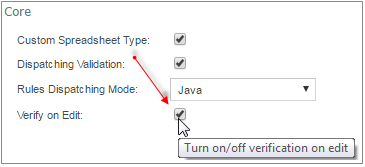
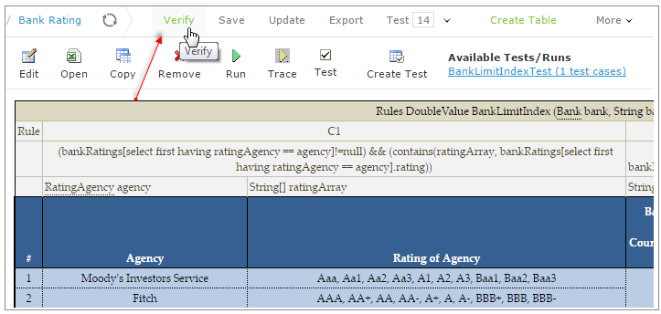

OpenL Tablets **5.18.1** is a feature release introducing on-demand rule verification, PostgreSQL repository support,
and improved WebStudio capabilities.

## Contents

* [New Features](#new-features)
* [Improvements](#improvements)
* [Bug Fixes](#bug-fixes)

## New Features

### On-Demand Rule Verification in WebStudio

Users can now disable automatic rule consistency checks. A new "Verify" button appears when "Verify on Edit" is toggled
off, enabling manual verification instead of automatic checking on each save. This can improve efficiency for projects
with multiple edits.

### PostgreSQL Database Support

Added support for PostgreSQL as a storage backend for rules projects and deployments, with configuration aligned with
other database options.

## Improvements

**Core:**

* Default value support for array attributes in Datatypes.
* Overlaps validation for property values.
* Enhanced performance for versioning through property-based dispatching.
* Lazy loading functionality for project modules.

**WebStudio:**

* Active Directory login support.
* Enhanced Trace with a context tree displaying applied values.

* Empty value labels in Test tables.
* Separated display of Alias Datatype and Datatype tables.
* Validation for missing table bodies.
* Support for multiple rule service versions for backward compatibility.
* Modified filtering for "Other" tables type.

**Web Services:**

* Improved server startup performance.

**Demo Package:**

* Information console with guidance for missing environment scenarios.

**Other:**

* Removed Log4j library dependency from Core.
* Discontinued gap-overlap table generation for overloaded rules.

## Bug Fixes

* Fixed: HTTP 500 error in Trace tree for ambiguous overloaded rule cases.
* Fixed: `NullPointerException` in Decision tables after condition reordering.
* Fixed: Array type casting issues.
* Fixed: Rule header parsing with `CustomSpreadsheetResult` type inputs.
* Fixed: Range condition bugs in SimpleRules.
