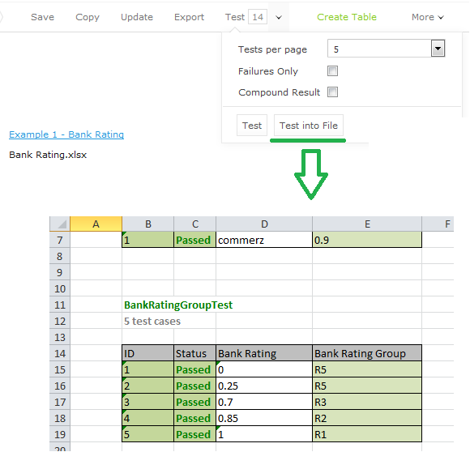

OpenL Tablets **5.21.0** is a feature release introducing Excel test result export, automatic platform configuration for
DEMO, and floating-point division results. This release includes a breaking change to division behavior that requires
regression testing of existing rules.

## Contents

* [New Features](#new-features)
* [Improvements](#improvements)
* [Bug Fixes](#bug-fixes)
* [Breaking Changes](#breaking-changes)
* [Library Updates](#library-updates)

## New Features

### Excel Export for Test Results

Test results can now be exported to Microsoft Excel format with a convenient layout and highlighting. Passed tests are
displayed in green, enabling quick regression identification, while failed test comments document expected outcomes.

### Automatic Java Configuration for DEMO

The OpenL DEMO package now automatically adjusts settings for platform specifics, eliminating manual environment
variable configuration in most scenarios. Users need only install a current Java version and run `start.cmd`.

## Improvements

**Core:**

* Array support added for Data and Test table inputs.
* Array element comparison capability implemented.
* New functions: `toInteger(String)`, `toDouble(String)`, `toString(Number)`.
* New functions: `isNaN(Number)`, `isInfinite(Number)`.
* New functions: `length(array)`, `isEmpty(array)`.
* New tokens: `not` (synonym for `!`) and `<>` (synonym for `!=`).
* Spreadsheet constant values default to `Double` or `String` when `autoType=true`.

**WebStudio:**

* Added revision restoration comments in projects.
* Redesigned "Revert changes" interface for improved usability.

**Rule Service:**

* Exception type identification capability added.
* Cassandra/Elasticsearch logging modules are now pluggable.

**Maven Plugin:**

* Improved failure comparison messaging in Spreadsheet.

## Bug Fixes

* Fixed: Disappearing of "Projects" and "Deploy Configurations" from the repository tree.
* Fixed: "The element is null" error message for array expressions.
* Fixed: `sum()` function for null values.
* Fixed: `flatten()` function when a varargs argument is used.
* Fixed: An empty error message displayed for an empty required cell.
* Fixed: Validation for Alias Datatypes between primitive and non-primitive types.
* Fixed: Fields in format `lUU` cannot be found.
* Fixed: NPE on opening a module with 2 duplicated Spreadsheets.
* Fixed: Wrong validation in OpenL tests.
* Fixed: Conversion from primitives to `Object`.
* Fixed: NPE on loading `OpenLWrapper`.
* Fixed: Merged conditions with one common vertical condition.
* Fixed: Lookup table with merged cells in the body.
* Fixed: NPE in `DependentParametersOptimizedAlgorithm`.
* Fixed: Method overloading when number types are used.
* Fixed: Varargs functionality for different types of input arguments.
* Fixed: Error "The width of the table is not a multiple of the RET width".
* Fixed: Validation for wrong table structure.
* Fixed: "Template" tab should be opened after the "Create Project from..." window is closed.
* Fixed: Exception when the user opens a project with errors.
* Fixed: Uploading ZIP files containing national symbols in file names.
* Fixed: Number validation in the "Create new table" wizard.
* Fixed: Date-picker input element.
* Fixed: Navigation from an error message to the table containing the error.
* Fixed: Table editor does not allow the user to change an incorrect value in a wrong cell.
* Fixed: Values in Date fields display incorrectly for tables with errors.

## Breaking Changes

### Floating-Point Division

All division operations now return floating-point results. For example, `7/4` now equals `1.75` instead of `1`. Existing
rules must be regression-tested and updated accordingly.

### Table Structure Validation

Stricter table structure validation has been introduced and may cause previously compiling rules to fail compilation.

### Cell Comments

Cell comments now require a `//` prefix (two slashes).

## Library Updates

| Library | Version |
|:--------|:--------|
| JavaCC  | 7.0.3   |
