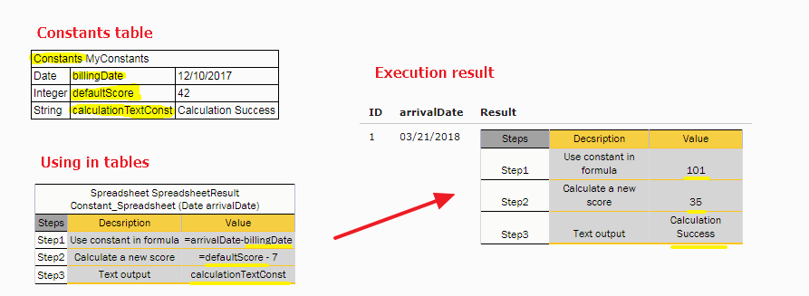

OpenL Tablets **5.21.7** introduces constants support and includes significant improvements and bug fixes.

## New Features

### Constants

Users can now create names for values and use them in rule cells without the `=` symbol.

## Improvements

**Core:**

* Array value definition across multiple rows in Test and Data tables.
* `List`/`Map` population in Data and Test tables.
* Null-safety for Date operations.
* SmartLookups: vertical condition matching is prioritized before horizontal.
* Array of LOBs storage in table properties.

**Rule Service:**

* Web service configuration simplified — the `ruleservice.datasource.type` property has been removed.
* Multiline and comment support in Cassandra schema scripts.

**WebStudio:**

* Runtime exception tracelog visibility.
* Ability to hide the Multi/Single module button.
* Test results limiting for high-volume scenarios.

## Bug Fixes

**WebStudio:**

* Fixed: Controls are not disabled during table editing.
* Fixed: Compilation is stopped if TBasic tables contain errors or problems.
* Fixed: Impossible to test elements inside a `List` object.
* Fixed: Complex formula cannot be opened in Trace if it was used in a previous step.
* Fixed: Cell with a tooltip is not selected in the Editor when clicked.
* Fixed: Value selected from a drop-down list is not accepted by validation.
* Fixed: No validation message for the file name processor when a non-existent property is used.
* Fixed: List of modules is not sorted in WebStudio.
* Fixed: Error is displayed on the UI when the user runs a test that checks if returned `List` data is correct.
* Fixed: Incorrect property name — "Cuncurrent" execution.
* Fixed: Error on opening a Test table if the method has a `List` collection.
* Fixed: Error is displayed when clicking the **(+)** button on entering an input array.
* Fixed: Error appears on the UI when the user updates a module by loading an Excel file from the "Results of running"
  page.
* Fixed: Memory leak on the Test Result page.
* Fixed: "Versioning" and "Compare" features work incorrectly on a Linux server.
* Fixed: `CRET` columns are not supported in Lookups (Rules tables).
* Fixed: `Collect` is not supported in SimpleLookup and SmartLookup tables.
* Fixed: Comma-separated values in conditions do not work for the `Integer` datatype.

**Core:**

* Fixed: Compilation parses Test tables at least twice.
* Fixed: Datatypes compilation fails if the user puts a space between a type and `[]`.
* Fixed: Unused `Custom1`, `Custom2`, and `Transactional` properties are removed.
* Fixed: OpenL method headers must end with EOF.
* Fixed: Generated methods do not follow the JavaBeans v1.01 specification.
* Fixed: Spreadsheet tables do not use alias datatypes as a field type.
* Fixed: Exception is displayed in Expected Result if the user runs a test for a map element and checks the index.
* Fixed: OpenL fails to compare array dimensional properties.
* Fixed: Method `plus` is interpreted as the keyword `+`.
* Fixed: Incorrect cast occurs when a ternary operator is used.
* Fixed: Memory leaks when `WeakHashMap` or `ReferenceMap` is used.
* Fixed: A large number of `MethodKey` instances are generated at runtime.
* Fixed: Test fails intermittently when there are 2 methods with the same name.
* Fixed: `OpenLConfiguration` has a memory leak in JUnit tests.
* Fixed: Syntax `array[v@]` changes the order of array elements.
* Fixed: Memory leaks when `ClassLoaderFactory.reset()` is not called.
* Fixed: Casting of objects is very slow in multithreaded execution.
* Fixed: `MethodSearch` returns an incorrect method between Generics and Objects.
* Fixed: SmartRules: `CharRange` is not supported in SmartRules.

**Demo:**

* Fixed: Date cannot be parsed if the user picks it from the calendar control.

**Rule Service:**

* Fixed: Swagger UI does not generate schema correctly when filtering is applied.
* Fixed: WADL is not generated when `SpreadsheetResult` exists in the schema.

**Maven Plugin:**

* Fixed: Build fails if an OpenL project is located at the root of the file system.

## Library Updates

| Library | Version |
|:--------|:--------|
| Jackson | 2.9.7   |
| CXF     | 3.1.17  |
