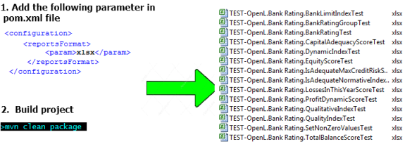

OpenL Tablets **5.21.9** introduces test result export to XLSX format and includes improvements and bug fixes.

## New Features

* Added the ability to export test results to `*.xlsx` format in the OpenL Maven Plugin.

## Improvements

**Core:**

* Implemented `min()` and `max()` functions for comparable types.
* Implemented a type validator for input arguments passed via web services.

**Web Services:**

* Added all possible values of the `production-repository.factory` property in `application.properties`.

## Bug Fixes

**Web Services:**

* Fixed: Endless Null Pointer exceptions appear intermittently.
* Fixed: PostgreSQL deployment fails because relation `openl_repository` does not exist.

**WebStudio:**

* Fixed: Incorrect information is displayed in the LOB field when copying a table.
* Fixed: LOB property is displayed in a table when it should not be.
* Fixed: Internal error is displayed for Spreadsheets called from a Spreadsheet in the Trace window.
* Fixed: "Test into file" and "Run into file" functionality does not work if the input variable for a rule is an array
  but the Data table contains non-array values.

**Core:**

* Fixed: Method search does not work properly for primitives.
