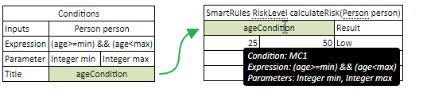

OpenL Tablets **5.22.0.1** is a major release introducing new features, improvements, bug fixes, and breaking changes.

## New Features

### Streaming Read for XLS and XLSX Files

OpenL switches to use an Event API to process XLS and XLSX files while in read-only mode. This approach reduces memory
consumption in WebStudio and Rule Services, while the DOM method is still used during editing operations.

### Object Binding in Logging Interceptors

Support for converting `SpreadsheetResult` objects prior to storage operations is now available in logging interceptors.

### Separate Tables for Conditions, Returns, and Actions

Conditions, Actions, and Returns can now be managed in separate tables and then used in SmartRules tables.



## Improvements

* Java 11 is now supported.
* Support for `StringRange` in Rules.
* Support for `DateRange` in Rules.
* Ability to use `$RuleId`/`$Rule` in Rules and SmartRules.
* Refactoring of `OpenLMessage` to eliminate `ThreadLocal` usage.
* The `RETURN` keyword is now optional for Spreadsheet tables that return a particular type.
* A new property `calculateAllCells` is created for Spreadsheet type tables that return a particular type.
* Ability to use SPI for loading implementations of `ResolvingStrategy` instead of Spring Framework.
* A new `dateDif` function that receives `startDate` and `endDate` and returns the fractional interval between them.
* A hint for the types of `SpreadsheetResult` fields is added.
* Ability to save input data of executed test cases in Excel.
* Metainfo handling is reworked to reduce memory consumption.
* Design Repository is split into Projects Repository and Deploy Config Repository.
* The deprecated `generateUnitTests` parameter is removed from the OpenL Maven Plugin.

## Bug Fixes

* Fixed: Out of Memory error in WebStudio on opening large rating rules.
* Fixed: Incorrect return type for a custom spreadsheet type in index operations.
* Fixed: Incorrect initialization of multidimensional arrays.
* Fixed: Date values are formatted incorrectly in a data table with a foreign key.
* Fixed: Array access using a user-defined index is not supported in conditions.
* Fixed: Impossible to cast multidimensional arrays of Alias types.
* Fixed: Isolation for a project between 2 users does not work.
* Fixed: Impossible to cast variable arrays.
* Fixed: The error `java.lang.IllegalArgumentException: array element type mismatch` is presented at runtime for the
  `flatten()` function.
* Fixed: An array of `double` cannot be cast to an array of objects.
* Fixed: The error "Datatype validation is failed" is displayed on updating a datatype in a project with a dependency.
* Fixed: The error "Method is not found" appears on module update if a rule calls another rule from another module and
  the input datatype is from a JAR file.
* Fixed: SimpleRules table incorrectly understands if a Range or Array is in the condition for Range datatypes.
* Fixed: Decision table parsing fails if two parameters are used in a Decision Table expression where one parameter
  declaration is empty.
* Fixed: Slow performance of the Trace functionality for TBasic tables.
* Fixed: Link to an empty cell in errors does not work.
* Fixed: Scheme for a non-standard URL is returned incorrectly.
* Fixed: Huge memory consumption if a project has a Lookup table that uses ranges.
* Fixed: Maven plugin generates JavaBeans with invalid arguments in the constructor.

## Breaking Changes

### Removed Deprecated Maven Plugin Parameters

Remove the following deprecated parameters from your Maven plugin configuration:

* `generateUnitTests`
* `unitTestTemplatePath`
* `overwriteUnitTests`

### Removed Deprecated Converter Packages

The following deprecated packages have been removed:

* `org.openl.rules.calculation.result.convertor.*`
* `org.openl.rules.calc.result.convertor.*`

### Spreadsheet Cell Calculation Order Changed

The cell calculation order for Spreadsheet tables returning a non-`SpreadsheetResult` type has changed. To restore
backward-compatible behavior, add the following property to your spreadsheet:

```
calculateAllCells = false
```

### Month Numbering Changed

Month numbers are now in the range `1–12` (January = 1). Previously, months were numbered `0–11` (January = 0).

## Library Updates

| Library | Version |
|:--------|:--------|
| POI     | 4.0.1   |
| ASM     | 7.1     |
| cglib   | 3.2.10  |
