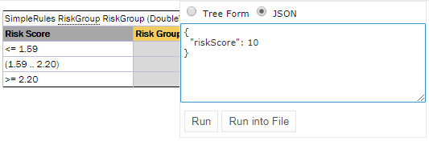
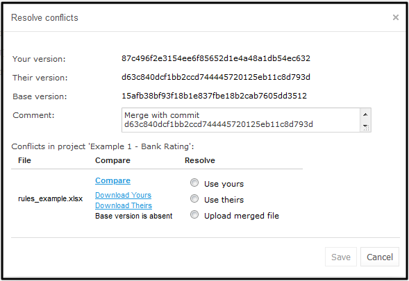

OpenL Tablets **5.23.0** is a major release introducing new features, significant improvements, and a large number of
bug fixes.

## Contents

* [New Features](#new-features)
* [Improvements](#improvements)
* [Bug Fixes](#bug-fixes)
* [Library Updates](#library-updates)

## New Features

### Kafka Integration in OpenL

Kafka Publisher support is added to OpenL Tablets for message handling, allowing rule results to be published to output
or dead letter topics.

### Customizing Output of SpreadsheetResult

A new syntax for `SpreadsheetResult` customization uses asterisks (`*`) to include and tildes (`~`) to exclude steps
from SOAP/REST responses.

### Run/Trace with JSON Input

A text area is added for the Run/Trace buttons in WebStudio, enabling users to execute rules using JSON data.

### Git Conflict Resolution UI

A new UI for resolving Git conflicts provides options to use the current user's changes, another user's changes, or
upload a merged file.

## Improvements

* Possibility to use simplified references to `SpreadsheetResult` cells of external spreadsheets.
* `length()` function added for `Map` objects.
* Extracted `openl-default.properties` from `PropertySourcesLoader`.
* Mark succeeded or failed test cases and show the number of failed results next to the test case ID.
* Single-file configuration for WebStudio (like in Rule Services).
* Externalize filter for login name in LDAP.
* Show the Install Wizard only if no settings are found in `${openl.home}`.
* The ordering of changes in "Changes" is updated: the latest changes appear at the top.
* Support for JBoss EAP 7.2.
* Support for the `TRUE` condition in SmartRules.
* Parsing of dates in Datatype tables for `LocalDate`, `LocalDateTime`, `LocalTime`, and `ZonedDateTime`.
* Validation added for external Conditions and Actions.
* Optimization in Condition expression calculation if a parameter does not participate in the condition.
* Support for the `Instant` date type.
* Support for the `contains(range, value)` syntax for the `contains` function.
* Casting of input numbers in rules conditions.
* The text of the error message in SmartRules is updated when the `Collect` feature requires an array as the return
  type.
* Removed JCR implementation of repositories.
* Preserving the order of properties in `openl-projects.properties`.
* Improved Resolve Conflict dialog.
* Removed old behavior for loading properties.
* Refactoring of `MultipleRuleServicePublisher` to act as a manager of publishers.
* Reduced payload for displaying the start page in Rule Services.
* Ability to compare conflicted text files.
* Support for `valueOf(String)` and `parse(CharSequence)` to instantiate types.
* Ability to remove empty values from REST responses.
* Ability to store Kafka messages to the logging system.
* Ability to log different parts of data to different entities.
* Ability to define several logging systems.
* `StoreLogData` annotations are reworked.
* Stable and predictable JSON response fields.
* Improved Tracer to reduce temporary array creation.

## Bug Fixes

**Core:**

* Fixed: 2-Level Condition is interpreted incorrectly in Smart Rules.
* Fixed: An incorrect user message with `NullPointerException` is displayed for function `flatten(null)`.
* Fixed: Return column is identified as Condition in case of a merged column in Smart Rules.
* Fixed: `java.lang.ClassCastException` appears if a user uses `$RulesId` in External Condition.
* Fixed: The "element is null" `NullPointerException` in Spreadsheet Table when a Datatype contains an error.
* Fixed: `java.lang.IllegalArgumentException: argument type mismatch` for transform index array.
* Fixed: The "element is null" `NullPointerException` for `addAll()` method.
* Fixed: An error is displayed in a Smart Rules table if a condition is specified incorrectly in External Condition.
* Fixed: `Double` values can be stored in a Date cell format.
* Fixed: `ClassCastException` on rules running because primitives cannot be correctly cast.
* Fixed: Condition is incorrectly matched on the Return column if simplified syntax is used in External Condition.
* Fixed: Incorrect count of errors is displayed in the Test table if it refers to a Data table.
* Fixed: Incorrect type of return object is identified in Smart Rules if the return column calls a rule returning
  `SpreadsheetResult` type.
* Fixed: It is allowed to specify the same parameter in several columns in a test table.
* Fixed: Return Column is identified as Condition in Smart Rules.
* Fixed: Method `allTrue()` does not work for a spreadsheet cell range if one of the cells is empty.
* Fixed: Method `contains(A[], B)` does not work if `A[]` is not the same type as `B`.
* Fixed: `NullPointerException` is thrown if methods of `Utils` classes are used with Generics.
* Fixed: SmartRules: Return column type is defined incorrectly if the column name and column type correspond to the
  return type.
* Fixed: Spreadsheet cells that are referenced to primitives are converted to non-primitives.
* Fixed: An error is displayed in the Test table if it refers to a Data table that contains non-unique indexes.
* Fixed: Negative precision does not work properly in test tables.
* Fixed: `NullPointerException` appears for `List` in index operations.
* Fixed: Comparison operators are not symmetrical for inheritable types (`Timestamp` vs `Date`).
* Fixed: `java.lang.reflect.InvocationTargetException: null` appears on comparison of `NaN` with `double`.
* Fixed: `NullPointerException` is presented to the user because cast does not work properly with `null`.
* Fixed: The compilation exception is not presented when referencing an element of a `Set` or a `Collection` by index.
* Fixed: Impossible to set a value to the bean referenced to a spreadsheet cell if the cell value is `null`.
* Fixed: `NullPointerException` is presented in the UI if a user calls a Custom Datatype element by index.
* Fixed: No error is presented to the user if a run table references another table with several business versions
  without runtime context and the number of table versions is even.
* Fixed: `NullPointerException` on execution of a Rules table if the RET column refers to a Condition column that
  contains a call to another rule.
* Fixed: An array of custom datatype elements that are not defined are returned from a data table if they have array
  elements referencing another data table.
* Fixed: An incorrect warning message is displayed in Smart Rules if input variables are matched perfectly with
  conditions.
* Fixed: The error "There is no index 0 in the sequence" is presented for a Data table if the data table references
  another data table.
* Fixed: No validation of the type of `Map` return result for Smart and Simple rules.
* Fixed: Return Column is matched on the particular field of the output compound object but should be matched on the
  whole object.
* Fixed: Incorrect matching of input data with a condition in Smart Rules if words differ by one letter.
* Fixed: An error is displayed in Smart Rules if the return column contains a Compound result with 1 column.
* Fixed: The error "Failed to compile decision table" is presented to the user if an External Condition matches the DT
  return column.
* Fixed: `NullPointerException` is presented to the user if `_PK_` is specified for a custom datatype field.
* Fixed: Validation on Alias is not working when an object is created via a `new Bean()` constructor.
* Fixed: A non-user-friendly message is presented to the user if an input parameter is matched on a field of a compound
  output parameter with a different type in SmartRules.
* Fixed: Input parameter does not match a condition if the variable name and conditions have different letter casing in
  SmartRules.
* Fixed: Horizontal conditions are interpreted as Vertical conditions if a Smart Lookup table contains errors.
* Fixed: Fields of a complex object are not ordered in the rule execution result.
* Fixed: One of the conditions is ignored if the technical title (C1) is merged, but columns with conditions are
  separate.
* Fixed: Support for transposed Simple Rules and Smart Rules.
* Fixed: Compilation does not find alias datatype casts in some cases.
* Fixed: Entered elements of a two-dimensional array are interpreted as `null`.
* Fixed: `NullPointerException` "The element is null" is presented to the user for array index operation where `null` is
  used.

**WebStudio:**

* Fixed: "Run into File" feature does not work on Docker.
* Fixed: "Run Into File" operation failure if the field of a complex object has `List` type.
* Fixed: The "Something went wrong" error appears on expanding a `SpreadsheetResult` input item.
* Fixed: "Run in File" feature does not work for the `Map` data type.
* Fixed: Project fails to load if some cells outside a table are merged.
* Fixed: `NullPointerException` appears in the log if a Spreadsheet table contains `null`.
* Fixed: Deleted project is available for selection in the Name drop-down list.
* Fixed: Time is displayed incorrectly in WebStudio if cell type is Custom `m/d/yyyy h:mm`.
* Fixed: SmartLookup: Conditions do not match properly if the condition has an array of Alias Datatypes.
* Fixed: Name field in the Deployment Repo section is populated with the user's name after entering an email in Chrome
  browser.
* Fixed: Project fails to open if a connected library is specified in the Environment table incorrectly.
* Fixed: `NullPointerException` appears in the log if there is a compilation error in a spreadsheet step.
* Fixed: No tooltip or link for a constructor of a Datatype.
* Fixed: Security Manager allows terminating an application server via a Rule table.
* Fixed: `NullPointerException` errors appear in the log if the user opens a test on the UI that references a
  non-existing datatype field.
* Fixed: Comment for the Copy Project action is not displayed on the revisions tab.
* Fixed: A date cannot be selected via the UI for Smart Rules if the max-min feature is used.
* Fixed: "Run in File" feature does not work for the `List` data type.
* Fixed: WebStudio cannot be configured under Jetty.
* Fixed: The value is displayed in different formats in Trace: tree and Trace: returned result.
* Fixed: JBoss: Error 500 appears on the UI after installation is completed via the installation wizard.
* Fixed: `NullPointerException` appears on the Copy Project action if the database connection is incorrect.

**Rule Services:**

* Fixed: Response type is missing in the Swagger schema.
* Fixed: Project deployment failure if there are several input parameters with the same name but different
  capitalization.
* Fixed: REST services use incorrect media type for simple data types.
* Fixed: `QueryParam` is ignored in the REST service interface.
* Fixed: WADL is stripped when an interface is used in beans.
* Fixed: Out of Memory appears on starting a webservice if rules contain errors.
* Fixed: Security Manager disables access for libs in the OpenL project.
* Fixed: Services fail with `ClassCastException` when constants are used in RETURN.
* Fixed: WebStudio overwrites system settings that affect Rule Services.
* Fixed: Elasticsearch does not work.

**Demo:**

* Fixed: WebStudio in Demo failed to log errors because of Security Manager.
* Fixed: Security Manager disables access for libs in the OpenL project.
* Fixed: `java.security.AccessControlException` appears in Demo under Java 9+.

**OpenL Maven Plugin:**

* Fixed: Projects with dependencies and multi-module projects cannot be built via the OpenL Maven Plugin if a Data table
  from one module is referenced in another module.
* Fixed: Simple Lookup table sometimes returns a wrong result.

**Repository:**

* Fixed: Incorrect error messages when incorrect Git authentication information is specified.
* Fixed: WebStudio in Demo cannot connect to a local Git repository using a relative path.
* Fixed: A user is blocked because of 3 authentication failures when the user's Git password was changed.
* Fixed: No validation for the Path field in the repository on Create Project and Copy Project screens.
* Fixed: WebStudio is broken by incorrect Git settings.
* Fixed: The "Something went wrong" error appears if the URL for the Git repository and the local path are equal.
* Fixed: An incorrect branch name is displayed for a project on the repository tab.
* Fixed: Repository becomes empty after deleting a project from a copied branch.
* Fixed: New branch pattern field is not allowed to be saved as empty.
* Fixed: The `master` branch is displayed for local projects.
* Fixed: The list of deployment configurations is not displayed in the UI if a non-folder structure is specified for the
  Design repository.
* Fixed: No error is displayed in the UI if the user switches to a removed branch in WebStudio.
* Fixed: New branch pattern feature does not work if the user entered a pattern containing braces with an unsupported
  placeholder.
* Fixed: A local demo-project cannot be deleted if the Design repository was changed from local to Git.
* Fixed: The Refresh button resets the project branch back to `master` for projects in Closed status.
* Fixed: No validation for the Path field in the repository on the Admin tab.
* Fixed: `JGitInternalException` is presented to the user when entering a folder name of an existing folder with
  different capitalization.
* Fixed: Issues with Git commit messages for Deploy Configuration.
* Fixed: Projects cannot be opened if the Design repository is broken.

**Repository, WebStudio:**

* Fixed: JGit does not work with Security Manager.

## Library Updates

| Library                | Version              |
|:-----------------------|:---------------------|
| Spring Framework       | 5.2.3.RELEASE        |
| Spring Security        | 5.2.1.RELEASE        |
| CXF                    | 3.3.5                |
| Log4j                  | 2.13.0               |
| Jackson                | 2.10.1               |
| JGit                   | 5.6.0.201912101111-r |
| Elasticsearch          | 7.x                  |
| DataStax Java Driver   | 4.2.2                |
| Ehcache                | 3.8                  |
| Commons BeanUtils      | 1.9.4                |
| Commons Compress       | 1.19                 |
| Commons Collections    | 4.4                  |
| Commons Codec          | 1.13                 |
| Commons Configuration  | **deleted**          |
| dom4j                  | **deleted**          |
| jettison               | **deleted**          |
| Apache Commons Logging | **deleted**          |
| JCR                    | **deleted**          |
