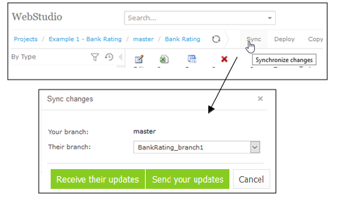

OpenL Tablets **5.23.1** includes a new feature, improvements, bug fixes, and library updates.

## New Features

### Sync Button in WebStudio

A new **Sync** button is added in WebStudio, navigating users to the "Sync changes" screen with "Import their changes"
and "Export your changes" options.

## Improvements

* Performance of SmartRules is improved.
* Check for duplicated classes in the classpath for the `ruleservice.ws.full` artifact.
* Projects that failed on deployment are shown on the Webservices page.
* A **Deploy** button is added on the Editor tab.
* Hints with the branch name are added on the Resolve Conflict screen.
* Ability to configure an external CA server or JKS for SAML in a Docker container.
* A drop-down list with branch selection is added to the Repository Diff screen.
* The "No changes — Locked" label is updated to "Viewing Revision — Locked".
* Username of the user who locked a project is shown on the WebStudio Repository screen.
* Minimal supported version of Maven is updated to v3.6.0.

## Bug Fixes

* Fixed: `rules.xml` and `rules-deploy.xml` are missing in Demo for Example 3.
* Fixed: An error on deployment appears if the Deployment Repository was renamed.
* Fixed: Deployment repository cannot be renamed as "Production" in Demo.
* Fixed: A user is not able to log in to OpenL if they have a role with a cyclic dependency.
* Fixed: Only 1 version of a table is displayed if the table has 2 versions with a business dimension.
* Fixed: An error appears in the log file for an empty spreadsheet.
* Fixed: `UnsupportedOperationException` appears in the log file.
* Fixed: Range values are shown with an incorrect range type in the drop-down list.
* Fixed: Not all commits are displayed in WebStudio when using a Git repository.
* Fixed: The "Something went wrong" error appears on expanding a `SpreadsheetResult` input item.
* Fixed: The "Use theirs" option does not work on the Resolve Conflicts screen.
* Fixed: Nightly build failed with an Out of Memory exception.
* Fixed: Date picker does not work if a Date is presented as an Integer value.
* Fixed: Project is not locked on clicking the "Create Table" button.
* Fixed: Internal server error on project creation if the project name contains `$`.
* Fixed: An error appears in the log file on opening a table containing a Date in format `1/2/03 12:00 AM`.
* Fixed: A table containing an error is not opened by clicking on the error text.
* Fixed: An error marker is not displayed for a table with an error in the table list.
* Fixed: Each Test result is displayed in two lines instead of one.
* Fixed: Impossible to configure the WebStudio Docker image using a properties file or environment variables.
* Fixed: Incorrect order of revisions in the Compare screen if the Design repository is connected to a DB.
* Fixed: The "Restore Defaults" button does not restore the "Dispatching Validation" value.
* Fixed: "Internal Server Error" is displayed for WebStudio on start.
* Fixed: Git repository and Maven plugin are not working under Linux due to file system specifics.
* Fixed: `NullPointerException` is presented to the user for `StringField.contains(String)`.
* Fixed: A step of a spreadsheet cannot be reached in a test table.
* Fixed: An empty cell in a test table is interpreted as non-empty.
* Fixed: `SpreadsheetResult` cell type is resolved incorrectly.
* Fixed: The step of `SpreadsheetResult` cannot be reached from another rule.
* Fixed: The type of an object is lost after applying operations.
* Fixed: No error is presented to the user if rule input arguments with the same Alias type have an incorrect order.
* Fixed: `java.lang.IllegalArgumentException: code size limit exceeded` error appears on deploy.
* Fixed: Application crashes with `NullPointerException` on deployment of a project.
* Fixed: A REST request fails if it has a missing field.
* Fixed: Custom `SpreadsheetResult` bean result does not work with variations.
* Fixed: REST service changes the URL after adding Kafka to the service.
* Fixed: `RulesFrontend` proxy is not working with `null` values.
* Fixed: An error in WADL generation appears because `WadlGenerator` does not work with interfaces.
* Fixed: `webservices-full` tries to connect to Cassandra even if Cassandra is disabled.
* Fixed: `True` conditions fail in Webservices but work in WebStudio.
* Fixed: Swagger response example has a different case than declared in the Spreadsheet.
* Fixed: Different number of errors in Webservices and WebStudio.

## Library Updates

| Library           | Version              |
|:------------------|:---------------------|
| Spring Framework  | 5.2.4.RELEASE        |
| Spring Security   | 5.2.2.RELEASE        |
| Jackson           | 2.10.3               |
| Kafka             | 2.4.0                |
| JGit              | 5.7.0.202003110725-r |
| AWS SDK           | 1.11.744             |
| POI               | 4.1.2                |
| Guava             | 27                   |
| SnakeYAML         | 1.26                 |
| Commons BeanUtils | **deleted**          |
