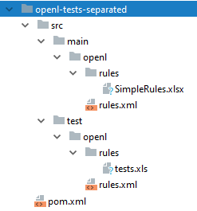

OpenL Tablets **5.23.4** includes new features, improvements, and bug fixes.

## New Features

### New Maven openl-project-archetype

A new `openl-project-archetype` Maven archetype generates the default OpenL Maven project structure, including
`rules.xml`, `rules-deploy.xml`, one module, and OpenL tests.

### Test Dependency Support in OpenL Maven Plugin

Support for dependency on rules from tests in the OpenL Maven Plugin enables running tests during the build while
excluding them from the target project.

## Improvements

**Core:**

* Support for the `Any` keyword in business enumeration properties within the file name processor.

**Rule Services:**

* `MANIFEST.MF` parsing and UI display for each deployment.
* REST API error codes are now visible in the Swagger schema.

**OpenL Maven Plugin:**

* `MANIFEST.MF` generation during the `package` goal.

## Bug Fixes

**WebStudio:**

* Fixed: An extra `module` section is added into `rules.xml` after uploading a file matching an existing template.
* Fixed: Compilation of Data tables has O(n²) complexity.

**Core:**

* Fixed: Spreadsheet compilation failure because the ternary operation does not have a space symbol before `null`.
* Fixed: The error "Failed to load a class for datatype" occurs if a Datatype has 255 fields and 128+ fields with the
  `long` type.
* Fixed: An incorrect hint is presented for the cell with a custom `SpreadsheetResult` constructor.
* Fixed: The first min/max condition in transposed SmartRules does not work.
* Fixed: The type of an Alias field is lost on an array index operation.
* Fixed: Compilation failure of a transposed Data table.

**Core, Rule Services:**

* Fixed: `SpreadsheetResult` field naming is inconsistent with Datatype and input arguments for non-ASCII symbols.
