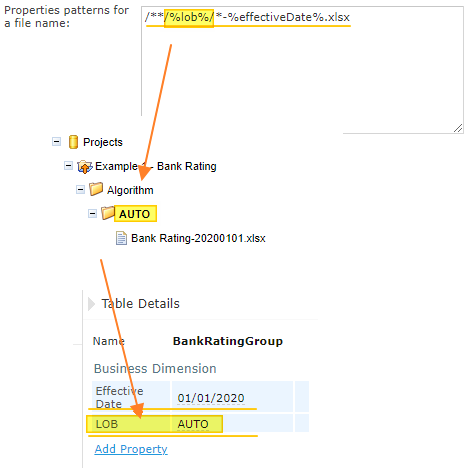

OpenL Tablets **5.23.8** includes new features, improvements, bug fixes, and library updates.

## New Features

### Versioning by Folder Names

Business dimensional properties can now be extracted from folder names, enabling project versioning based on directory
structure.

### Spring Boot Compatibility for Rule Services

Rule Services JAR artifacts can now function as Spring Boot components without additional setup.

## Improvements

**Rule Services:**

* Support for inheritance of beans in Swagger and OpenAPI.
* `@RulesType` annotation implementation for exposing extra methods accepting OpenL types.
* Random temporary folder configuration for deployment cache.
* File System (local) repository type support for Deploy Repository.

**Core:**

* Java 15 is now supported.
* Multiple properties under one pattern are supported for the file name processor.
* `toBoolean(a)` function implemented for `String`-to-`Boolean` conversion.
* Rule selection by the newest `effectiveDate` when `expirationDate` is undefined.
* `yyyyMMdd` is the default date pattern for `PropertiesFileNameProcessor`.

**WebStudio:**

* File System (local) repository type support for Deploy Repository.

## Bug Fixes

**Core:**

* Fixed: The "The element is null" message is presented to the user if an array parameter in a child datatype is the
  same as in the parent datatype.
* Fixed: Duplicated errors appear in the log.
* Fixed: No error message is presented to the user if a rule or spreadsheet overloaded by a dimensional property has
  different input parameter names per version.
* Fixed: A lot of "Skip duplicated message" errors appear in the log.
* Fixed: An error message is displayed for empty Decision Tables.
* Fixed: The "Ambiguous dispatch" error is not presented to the user when the number of business versions with different
  `effectiveDate` is even.
* Fixed: Cell type is identified incorrectly for a float literal.
* Fixed: An external return is not matched with SmartRules if an array is defined in merged columns.
* Fixed: An incorrect date is successfully parsed from the filename by pattern.

**WebStudio:**

* Fixed: The filename pattern functionality does not work properly with the symbols `$`, `^`, `+`, and `.`.
* Fixed: Module loading failure: `StackOverflowError` in case of cyclic inheritance.
* Fixed: The full list of patterns is not displayed on the Copy Module UI.
* Fixed: Non-alphabetical sorting of projects in the editor.
* Fixed: A duplicate of a table with a different input alias is not displayed in the UI.
* Fixed: Error on clicking `+` for input types `Collection` and `Set`.
* Fixed: The field "Current Revision" should be renamed to "Current Revision Id".

**Rule Repository:**

* Fixed: Slow performance on the repository tab if there are many projects.
* Fixed: Git merge messages are misleading the user.

**Rule Services:**

* Fixed: Date type serialization and deserialization are not consistent.
* Fixed: Swagger errors on the Demo server.

## Library Updates

| Library               | Version        |
|:----------------------|:---------------|
| Spring Framework      | 5.2.10.RELEASE |
| Spring Security       | 5.4.1          |
| Jackson               | 2.11.3         |
| Tomcat                | 9.0.39         |
| Jetty                 | 9.4.33         |
| Elasticsearch         | 6.8.13         |
| Kafka                 | 2.5.1          |
| JGit                  | 5.9.0          |
| ASM                   | 9.0            |
| Bouncy Castle         | 1.67           |
| XStream               | 1.4.13         |
| Joda-Time             | 2.10.7         |
| Microsoft JDBC Driver | 8.4.1          |
| Commons IO            | 2.8.0          |
| Commons Codec         | 1.15           |
| HttpClient            | 4.5.13         |
| cache2k               | 1.6.0.Final    |
| JUnit                 | 4.13.1         |
| Awaitility            | 4.0.3          |
| SnakeYAML             | 1.27           |
| stax-ex               | 1.8.3          |
