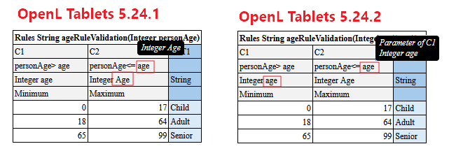

### Quick Role-Based Pointers

* **If you are a Rules Author** → pay special attention to section **1**
* **If you are a Developer** → pay special attention to section **1**

---

### 1. Condition Expression Parameter Matching Priority Change

The priority of parameter matching in condition expressions has changed when a parameter name's capitalization differs
between its declaration and its usage.

Review any rules tables where parameter names are referenced with different capitalization than their declared form, and
update them to ensure correct matching behavior after upgrade.

