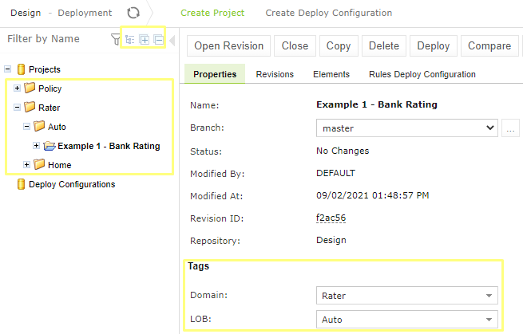
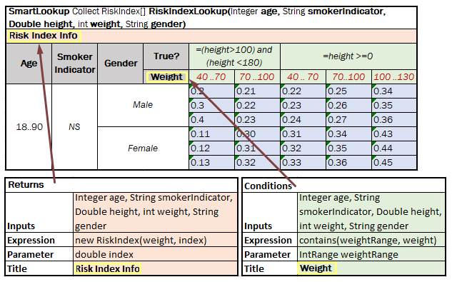

OpenL Tablets **5.25.0** is a feature release that introduces project tags and grouping, support for titles and external
conditions in smart lookup tables, a redesigned multi-module project loading experience, and several improvements to
WebStudio and Rule Services.

## New Features

### Project Tags and Grouping in WebStudio

A new Tags section has been added to the Administration tab for tag management. Tags can be assigned when creating,
copying, or editing project properties. Tag values can be automatically populated based on project name templates.

The repository tree now supports grouping by tag types or by design repository name, with **Expand All** and **Collapse
All** buttons for tree navigation.

---

### Title and External Condition Support for Horizontal Conditions

Titles and external conditions are now supported for horizontal conditions and external returns in smart lookup tables.

---

### Multi-Module Project Loading Redesign

The multi-module project loading experience has been redesigned:

* Multi-module viewing is enabled by default.
* Modules open immediately during background project loading.
* A loading progress bar is displayed in the Problems section.
* Errors and warnings are displayed dynamically as they are detected.
* Module reloading is supported during an ongoing project load operation.
* A **Within Current Module Only** checkbox has been added for Test, Run, Trace, and Benchmark actions to control
  whether an action applies to the current module or the entire project.

---

## Improvements

### WebStudio

* Removed the "Filter files by extension" and "Repository" filters.
* The "Compile This Module Only" checkbox display is now conditional on the `rules.xml` property.
* Added a new `PUT` method for project creation and updates via the repository API.
* Added new `GET` methods for repository and project retrieval via the repository API.
* Improved compilation of dependent projects.

### Rule Services

* Refactored the `StoreLogData` feature with the ability to disable it at runtime.
* Improved the custom `StoreLogData` `Converter` interface.
* Renamed `DefaultConverter` to `NoConverter`.

### Security

* Added an optional Entity ID parameter to SAML configuration.

## Bug Fixes

### Core

* Fixed incorrect downcast behavior at runtime.
* Fixed an `ArrayIndexOutOfBoundsException` error being logged for smart rules tables with unmatched titles.

### WebStudio

* Fixed `NullPointerException` occurring when opening a smart rules table with multiple merged conditions.

## Known Issues

* Tag values fail to save when pressing Enter in an extensible optional tag type field on the "Create project" dialog.
  **Workaround**: Click outside the dropdown field to confirm the value instead of pressing Enter.
