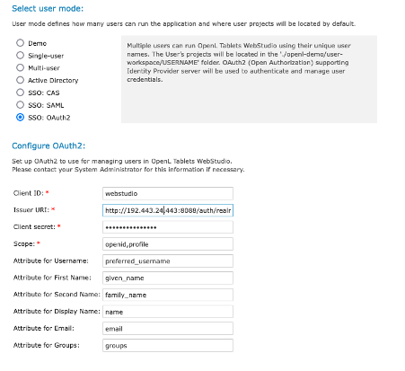
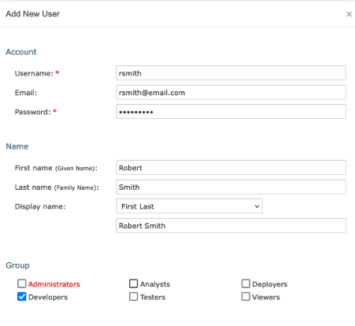
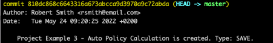
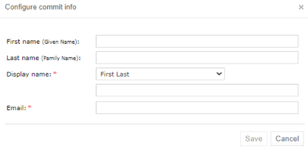
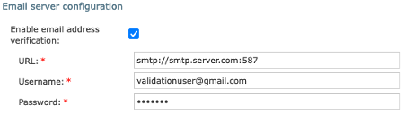
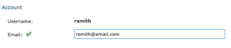
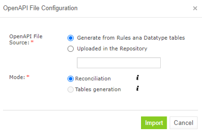

OpenL Tablets **5.26.0** introduces OAuth2 authorization support, Git Large File Storage integration, Azure BLOB storage, enhanced user management with email verification, rule dependency support, and Arm64 Docker images. The release also includes significant improvements to SpreadsheetResult handling and important bug fixes.

## Contents

* [New Features](#new-features)
* [Improvements](#improvements)
* [Bug Fixes](#bug-fixes)
* [Library Updates](#library-updates)
* [Known Issues](#known-issues)

## New Features

### OAuth2 Authorization Support in OpenL Tablets WebStudio

OAuth2 protocol authorization is now available in WebStudio, configurable via the installation wizard and properties.

---

### OAuth2 Token Support for OpenL Tablets Rule Services

A security filter validates signed JWT on every request to Rule Services, enabling secure token-based access.

---

### Storing and Editing User Email Address and Display Name

User display name and email have been removed from repository settings and are now configurable per user in the "Add New User," "Edit User," and "User Details" forms.

---

### Submitting Current User Display Name and Email Address when Committing to Git

The Git commit "Author" line now displays `display_name <email>`. A pop-up window prompts for missing display name or email when creating, saving, or deleting projects.

---

### User Information Synchronization with External User Management Service

User information is now synchronized with third-party services including Active Directory, SSO, SAML, and CAS. Synchronized fields include First name, Last name, Display name, and Email address.

---

### User Email Address Validation

An email verification feature is now available (disabled by default) and configurable in the Admin tab. Users receive a verification email with a link, and a "Resend" button is available for lost or expired links.

---

### Git Large File Storage Support

Git LFS is now supported. The Git repository must be pre-configured for LFS before cloning. If `git-lfs-migrate` was used, stop WebStudio, drop the local repository folder, and restart.

---

### Azure BLOB Storage Support

Azure BLOB storage is now supported, equivalent to Amazon AWS S3.

---

### Automatically Adding or Updating OpenAPI File in Reconciliation Mode

Generated OpenAPI files now trigger project validation in reconciliation mode.

---

### Support of Several Modules with the Same Name

Modules with identical names in different projects with dependencies are now supported.

---

### Rule Dependency Support

Tables from dependent projects are now accessible without included modules. Supported formats:

* `` `Project`.tableName() `` - References a table from a dependent project
* `` `Project/module`.tableName() `` - References a table from a specific module in a dependent project

---

### Arm64 Docker Images Usage

Multi-platform build for OpenL Docker images has been introduced, supporting Arm64 architecture.

## Improvements

### Core

* **New Combined SpreadsheetResult Type**: Prevents cell type loss when returning different SpreadsheetResults.
* OpenLClassLoader performance improved.
* Value types replaced with Java natives.
* `ROUND` function syntax modified: `round(number, int, String)`, `round(number, String)`.
* `equals()` operation now usable for SpreadsheetResults.
* Combined SpreadsheetResult type supported in method signatures and expressions.

---

### WebStudio

* Compare functionality includes an option to display only modified rows.
* User groups pulled from external authentication systems (LDAP, SAML) on each authentication.
* New Repository Projects tab actions: "open," "close," "deploy."
* Unified user experience for AD, SAML, CAS management.
* Experimental support for `security.saml.forceAuthN=true` property.

---

### Rule Services

* Swagger v2 schema generation removed.
* SOAP/WSDL web services support removed.
* Apache Tomcat replaced with Eclipse Jetty in Docker images.
* WADL schema generation removed.
* Project deployment as a web service can now be skipped.
* Git, AWS, and Azure repositories supported by the `ws-all` artifact.

---

### Security

* SSL in proxy server and load balancer supported for SSO SAML/CAS.

---

### Repository

* Third-party alternatives to AWS S3 repository now supported.

## Bug Fixes

### Core (6 bugs)

* Fixed "String index out of range" error when a two-dimensional array is defined in a data table.
* Fixed incorrect type displayed for datatypes with packages.
* Fixed issues with spreadsheet referencing cells from another spreadsheet in a different module.
* Fixed SpreadsheetResult type not identified for methods returning an array of custom SpreadsheetResult.
* Fixed "The element is null" error displayed if a datatype table contains an error.
* Fixed incorrect errors displayed if a rule table contains an error in a return expression.
* Fixed build occasionally failing due to `WorkspaceCompileServiceTest`.

### WebStudio (10 bugs)

* Fixed `ProjectVersionCacheMonitor` exception errors logged: `java.io.IOException: Unable to delete directory`.
* Fixed internal server error when SAML server metadata is not accessible by URL.
* Fixed `NullPointerException` error when opening a module if a formula is copied from another Excel file.
* Fixed old password still allowing login when security is configured as Active Directory.
* Fixed access denied on first SAML logon after settings modification in `webstudio.properties`.
* Fixed slow performance in Repository tab with many projects and deploy configurations in a non-flat Git repository.
* Fixed informational pop-up about dependent project not displayed with nested dependencies.
* Fixed user groups with administrative privileges not highlighted in "Add new user" window.
* Fixed user information from a third-party identity provider that cannot be restored after manual database deletion.
* Fixed incorrect comparison results in Compare window when two equal rows exist and the top row is edited.

### Rule Services (2 bugs)

* Fixed default REST service paths differing from paths defined in `rules-deploy.xml`.
* Fixed `NullPointerException` in OpenL Tablets Rule Services response when a custom or non-custom spreadsheet is created via a constructor.

### Docker Images (4 bugs)

* Fixed vulnerabilities detected in WebStudio Docker image.
* Fixed user ID (uid) not constant between releases.
* Fixed server error appearing in Docker log if a table contains non-Latin symbols.
* Fixed Docker container with Rule Services failing to start if `JAVA_OPTS` is passed as a parameter.

### Core, Rule Services (1 bug)

* Fixed project with dependencies having access to modules of dependent projects.

## Library Updates

| Library         | Version              |
|:----------------|:---------------------|
| OpenSAML        | 4.2.0                |
| POI             | 5.2.2                |
| JGit            | 6.1.0.202203080745-r |
| XMLSecurity     | 2.3.0                |
| Servlet API     | 3.1.0                |
| HikariCP        | 5.0.1                |
| Hibernate       | 5.6.9.Final          |
| MSSQL Driver    | 10.2.1.jre11         |
| Velocity Engine | 2.3                  |
| H2 Database     | 2.1.212              |
| Jaeger          | 1.8.0                |

## Known Issues

* Placeholder `{username}` does not work in commit messages.
