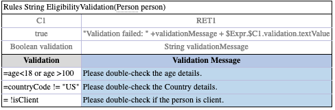
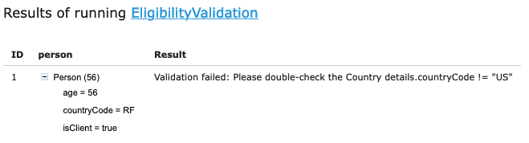

OpenL Tablets **5.27.0** introduces improved access control capabilities, enhanced merge conflict resolution for Excel
files, and new decision table expression referencing syntax. The release also includes OpenL Studio and Rule Services
enhancements alongside important bug fixes.

## New Features

### Access Control Lists (ACL)

OpenL Tablets now provides a more robust and granular way to control user access to assets through Access Control Lists.
ACL management is available through API documentation, enabling automated and programmatic control over user permissions
and resource access.

### Excel File Merge Conflict Resolution

When syncing branches creates conflicts in edited Excel files, the system now performs intelligent sheet-by-sheet
comparisons against base revisions. Non-conflicting sheets are seamlessly merged automatically, reducing manual conflict
resolution effort and improving branch synchronization workflows.

### Decision Table Expression Referencing

Users can now reference expressions within decision tables using dedicated syntax patterns:

* `$Expr.$C1` - References an expression in column C1
* `$Expr.$C1.param1` - References a parameter of an expression

This enhancement enables more flexible rule composition and expression reuse within decision tables.

## Improvements

### OpenL Studio Enhancements

* Added "Copy full path" link for easier ACL permission management
* New property for configurable default table ordering mode
* Technical revisions now visible on the Revisions tab
* Improved table list organization for 'by File' mode
* Reordered Deploy Configurations repository button placement

### Rule Services Updates

* RapiDoc integration replacing Swagger UI for improved API documentation
* OpenTelemetry migration completed for enhanced observability

## Bug Fixes

* Fixed revision section errors affecting local projects
* Fixed blank login screen issue

## Deprecations

The following deprecated items have been removed from the codebase:

* `org.openl.rules.helpers.InOrNotIn`
* `org.openl.rules.helpers.IDoubleHolder`
* `org.openl.rules.helpers.DoubleHolder`
* `org.openl.rules.helpers.DoubleRange#intersect`
* `org.openl.rules.helpers.DoubleRange#compareLowerBound`
* `org.openl.rules.helpers.DoubleRange#compareUpperBound`
* `org.openl.rules.helpers.DateRange#getUpperBoundType`
* `org.openl.rules.helpers.DateRange#getLowerBoundType`

## Library Updates

| Library      | Version |
|:-------------|:--------|
| prototype.js | 1.7.3   |

## Known Issues

* Users with multiple group memberships experience approximately 40% performance degradation
* Members of the ADMIN group automatically receive Administrate privileges, which may bypass intended permission
  constraints
