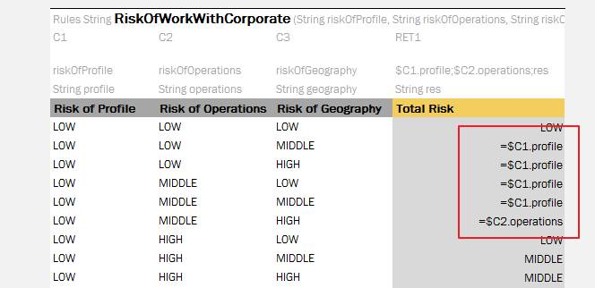
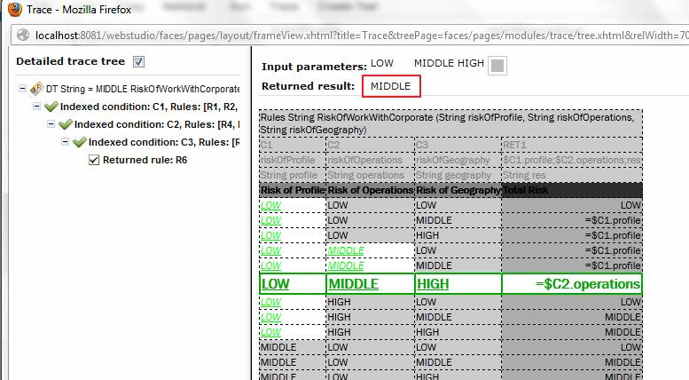
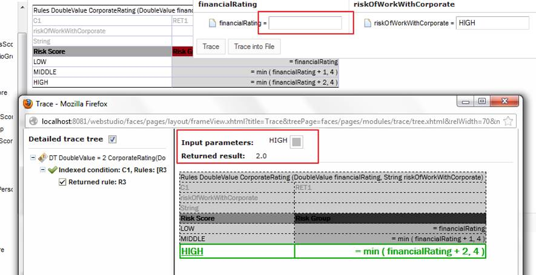
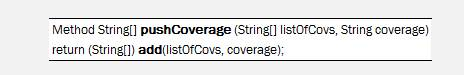
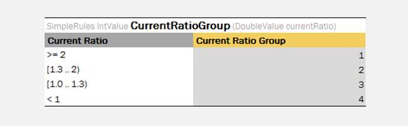
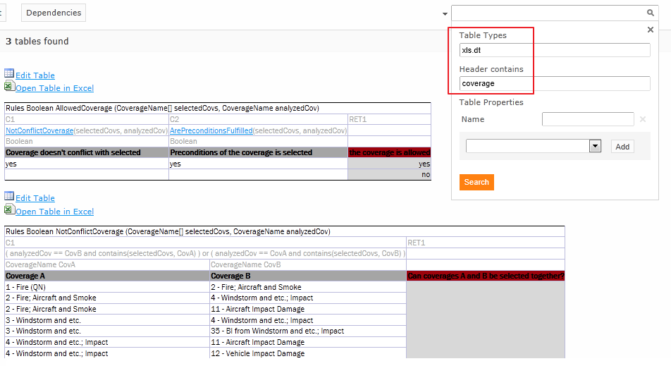
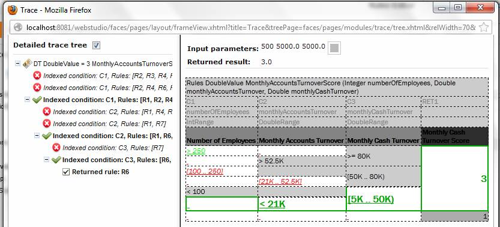

OpenL Tablets **5.9.3** is a feature release introducing condition cell references, improved array support, and
WebStudio usability enhancements. Source code migrated from Subversion to Mercurial.

## Contents

* [New Features](#new-features)
* [Improvements](#improvements)
* [Bug Fixes](#bug-fixes)
* [Library Updates](#library-updates)

## New Features

### References to Conditions from Return Cells

Users can now reference condition values from Return column cells using the syntax `$C<n><variable name>`.

## Improvements

**Core:**

* Enhanced math helper functions to handle `null` values in arithmetic operations (`null` treated as `0` for sum and `1`
  for multiply).
* Transitioned from Static Wrappers to Rules Interfaces — wrappers are now deprecated.
* Added array manipulation methods: `add`, `addAll`, `remove`, `removeElement`.
* Enabled array and range support in SimpleRules and SimpleLookup tables.

**WebStudio:**

* Added Java x64 support.
* Wizard for creating Data tables via the UI.
* Redesigned search functionality.
* Added Custom Spreadsheet Type and Dispatching mode visibility in System Properties.
* Enhanced Decision table trace with row execution highlighting.
* Restored and redesigned recently visited tables feature.
* Separated table properties from categories.
* Implemented new error output engine.
* Resolved encoding issues.

**Web Services:**

* Added comprehensive request/response logging.

**Infrastructure:**

* Migrated source code repository from Subversion to Mercurial.

## Bug Fixes

**Core:**

* Fixed: `big` function incompatibility with initialized arrays.
* Fixed: Default values not applied to complex datatypes.
* Fixed: Unable to call wrapper datatype arrays (`Integer`, `Double`) and numeric value types.
* Fixed: `contains(null, <String>)` returning errors.
* Fixed: Type casting issues from `int` to `double`.
* Fixed: Array initialization syntax misinterpreting dimensions.
* Fixed: Null handling in comparison operations.

**WebStudio:**

* Fixed: Browser tab support.
* Fixed: False modification alerts for Excel files.
* Fixed: Administration page access restricted to authorized users.
* Fixed: Project visibility following workspace uploads.
* Fixed: Script errors in IE 9.0 for Rules Dependencies.
* Fixed: Excel file opening with special characters (`%`).
* Fixed: No validation for duplicate technical names in wizards.
* Fixed: Test table foreign key error persistence.
* Fixed: Excel 2007–2010 cell style rendering.
* Fixed: Java beans visibility in datatype drop-downs.
* Fixed: Startup performance.
* Fixed: IE 9.0 comparison script errors.
* Fixed: Exceptions with `Infinity`/`NaN` return values.
* Fixed: Special character search (`@`, `%`, `$`, `^`, `#`, `&`).
* Fixed: Input parameter popup scrolling for large parameter sets.

**Web Services:**

* Fixed: WSDL address input handling in SoapUI.
* Fixed: `ClassCast` exceptions with interface methods using converters.

## Library Updates

| Library | Version |
|:--------|:--------|
| POI     | 3.8     |
