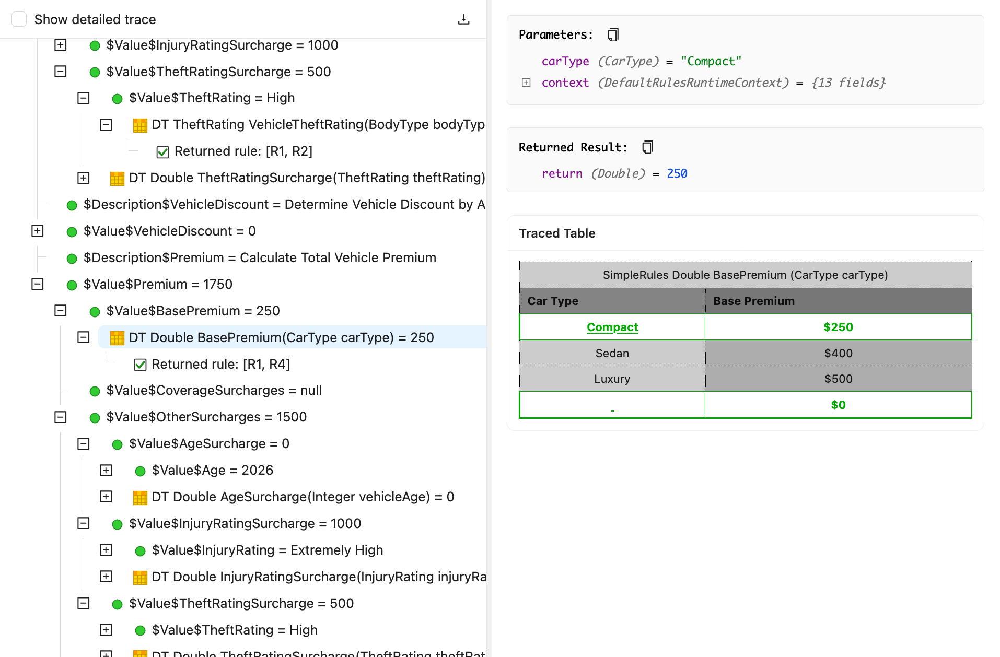

OpenL Tablets **6.1.0** expands the OpenL Studio REST API for automation and AI-agent tooling, adds rule tracing and
execution over REST, simplifies OpenL Maven projects, and refines access control and OpenL Rule Services.

This release also includes breaking changes that require review before upgrading.

## New Features

### Rule Tracing API and UI in OpenL Studio

OpenL Studio gains a REST-first tracing capability for debugging and analyzing rule execution, replacing the legacy
trace view. A trace starts asynchronously and reports progress over a STOMP WebSocket channel, so the UI stays
responsive even for large decision tables and spreadsheets.

The hierarchical execution tree loads lazily — root nodes first, children on demand — and complex parameter values are
fetched only when expanded. For any node you can inspect its parameters, context, result, and errors, view the executed
table as an HTML fragment with execution-flow highlighting, and stream the full trace to a downloadable text file.

The REST-first design serves both the Studio UI and external automation, including AI-agent (MCP) tooling.

* `POST /rest/projects/{projectId}/trace` — start a trace for `tableId`, with optional `testRanges` and a JSON body of
  `runtimeContext` and `params`; returns `202 Accepted`
* `DELETE /rest/projects/{projectId}/trace` — cancel the running trace
* `GET /rest/projects/{projectId}/trace/nodes` — root nodes, or the children of a node via the `id` parameter
* `GET /rest/projects/{projectId}/trace/nodes/{nodeId}` — full node details
* `GET /rest/projects/{projectId}/trace/parameters/{parameterId}` — the value of a lazily loaded parameter
* `GET /rest/projects/{projectId}/trace/nodes/{nodeId}/table` — the executed table as an HTML fragment (`showFormulas`
  toggles formulas)
* `GET /rest/projects/{projectId}/trace/export` — the full trace as a plain-text file



### Execute Rules with Test Data over REST

A new endpoint runs a specified rule table with supplied input data and returns the execution result together with any
errors, enabling automated testing and AI-agent (MCP) scenarios. Execution follows an asynchronous start-then-poll
pattern, and the completed result can be retrieved as JSON or downloaded as an XLSX workbook through content
negotiation.

* `POST /rest/projects/{projectId}/run?tableId=...` — start execution with a JSON input body; returns `202 Accepted`
* `GET /rest/projects/{projectId}/run/result` — fetch the completed result; returns `200 OK` as JSON, or as XLSX when
  requested with `Accept: application/vnd.openxmlformats-officedocument.spreadsheetml.sheet`
* `DELETE /rest/projects/{projectId}/run` — clear the run; returns `204 No Content`

### pom.xml-less OpenL Maven Projects

A folder containing only `rules.xml` and the standard OpenL layout can now act as a Maven module, removing the
per-project `pom.xml` duplication in repositories that host many OpenL projects sharing the same group, version, and
build configuration.

A single anchor `pom.xml` at the repository root declares `openl-maven-plugin` with `<extensions>true</extensions>`. The
plugin then discovers every `rules.xml` folder beneath the anchor, derives each project's coordinates from its path, and
builds a `.zip` artifact per project — with no per-project `pom.xml`. The anchor is wired as the parent so projects
inherit build configuration, plugin and dependency management, properties, distribution management, and repositories.
Cross-project dependencies are resolved through the reactor, and classic `pom.xml`-based OpenL projects continue to work
unchanged in the same build.

```xml

<project>
    <modelVersion>4.0.0</modelVersion>
    <groupId>com.example</groupId>
    <artifactId>my-rules</artifactId>
    <version>1.0.0-SNAPSHOT</version>
    <packaging>pom</packaging>

    <build>
        <plugins>
            <plugin>
                <groupId>org.openl.rules</groupId>
                <artifactId>openl-maven-plugin</artifactId>
                <version>${openl.version}</version>
                <extensions>true</extensions>
            </plugin>
        </plugins>
    </build>
</project>
```

The feature adds goals bound to the `openl` lifecycle — `openl:sync-versions` and `openl:prepare-pom` (`validate`),
`openl:prepare-bom` (`package`), and `openl:verify` (`verify`) — and an aggregator goal `openl:pomless` that converts
existing `pom.xml`-based projects to the pom-less form. Conversion runs as a dry run by default and applies only with
`-Dopenl.pomless.dryRun=false`.

### New `migrate` Goal for the OpenL Maven Plugin

The OpenL Maven Plugin adds a `migrate` goal that updates a project's configuration and scripts to the conventions of
the current OpenL Tablets version.

```bash
mvn openl:migrate
```

The goal removes obsolete and default entries from `rules.xml` and `rules-deploy.xml`, renames the `<method-filter>`
element to `<exposed-methods>`, replaces the deprecated `interceptingTemplateClassName` with
`annotationTemplateClassName`, and rewrites `javax.*` imports to `jakarta.*` in Groovy scripts. Each migration step is
recorded as a separate commit, and `-Dopenl.migrate.dryRun=true` previews the changes without writing them.

## Improvements

### OpenL Studio REST API

* Added a files REST API to read, upload, download, copy, move, and search files inside projects (
  `/rest/projects/{projectId}/files/{*path}`) and repository roots (`/rest/repos/{repo-name}/files/{*path}`), with
  branch- and version-aware reads, multi-file commits, and ZIP folder upload and download.
* Added a project status REST API, `GET /rest/projects/{projectId}/status`, and a STOMP WebSocket channel,
  `/topic/projects/{projectId}/branches/{branch}/status`, that push compilation status so the editor tracks compile
  progress without polling.
* Added response field projection through the `fields` query parameter — for example `fields=id,name,modules(id,name)` —
  to return only the requested fields, including nested objects and collection elements.
* Improved project identity so `/rest/projects/{identity}` endpoints accept either a project ID or a project name,
  returning a `409 Conflict` with the candidate IDs when a name is ambiguous.

### OpenL Studio

* Enhanced the test Run menu with **All**, **Select**, and **Use the Range** modes; **Select** lets you choose
  individual test cases and is available for tables with at most 20 test cases.
* Replaced the regular-expression method-filter syntax with simple glob patterns (`*` for any sequence of characters,
  `?` for one), renamed **Interface Methods** to **Exposed Methods**, and added a **Migrate Method Filters** action that
  converts existing filters.
* Added a Manager-only option to bypass protected-branch restrictions when merging in Studio, controlled by
  `security.allow-bypass-protected-branches` (default `false`) together with a per-request `force` flag; the bypass
  honors the Manager role's project- or repository-level scope.
* Removed automatic group assignment in Multi-User mode so access is governed entirely by ACL roles.
* Made ACL permission grants concurrency-safe, eliminating intermittent `500` errors when permissions for the same
  principal were granted on several projects at once.

### OpenL Rule Services

* Sanitized API error responses so validation errors return clear messages such as `Invalid date format` and
  `Unknown field '<field>'` while no longer exposing Java class names, package paths, or framework internals; unexpected
  errors return a generic message.
* Added support for loading multiple OpenAPI configuration files: `openapi-configuration.json` is applied first, then
  any `openapi-configuration-*.json` files in filename order, each overriding the previous one.

### OpenL Maven Plugin

* Generate the deployment artifact automatically when a project has dependent OpenL projects, replacing each
  dependency's `rules-deploy.xml` with an empty-publishers stub so the dependency is not published twice; the
  `deploymentPackage` parameter is deprecated and has no effect.
* Split the `tests/` folder into a separate artifact with the `tests` classifier so test workbooks are not shipped to
  OpenL Rule Services deployments, reducing deploy-time parsing, memory, and archive size.

### OpenL Core

* Added defaults for `rules.xml` tags so a minimal configuration can be used: `<name>` defaults to the project folder
  name, `<modules>` to workbooks under `rules/**/*.xlsx` and `tests/**/*.xlsx`, and `<classpath>` to `groovy/` and
  `lib/*.jar`.
* Added support for building and running on Java 25 and Java 26; Java 21 remains the minimum supported version.

## Bug Fixes

* Fixed missing compile-time validation of vocabulary (domain) values: literals outside a vocabulary passed to rule,
  datatype-constructor, and spreadsheet-step parameters now report a compile error instead of failing at runtime.
* Fixed smart lookup tables losing their structure when column descriptions contained merged cells; empty subheaders are
  now preserved through the REST read-and-write round trip.
* Fixed silent save failures when two users edited the same branch: saving an outdated revision now opens the
  merge-conflict resolution dialog instead of doing nothing.
* Fixed garbled, overflowing characters shown in the **Sync updates** popup for closed projects.
* Fixed the rules-tree **Default Order** not refreshing when the user setting changed; the chosen order now takes effect
  immediately.
* Fixed the tables REST API corrupting smart rules that use the `Collect` keyword, and added per-table compilation
  messages to the response.
* Fixed the non-functional **Save Templates** and **Fill Tags for Project** buttons on the administration **Tags** page.
* Fixed merges into protected branches being allowed during **Sync**; the action is now blocked with a warning.
* Fixed inconsistent and incorrect results from the `mod`, `quotient`, `remainder`, and `floorDiv` functions across
  numeric types and for large values.
* Removed a redundant second initialization of the OpenL engine that ran on every rules instantiation because of the
  TBasic (Algorithm table) bootstrap.
* Fixed `GET /rest/projects/{projectId}/tables?unpaged=true` returning only one module's tables for local multi-module
  projects instead of all of them.
* Fixed `GET /rest/projects/{projectId}/tables/{tableId}` returning `"args": [ {} ]` for argument-less tables instead of
  an empty array.
* Fixed an HTTP `500` from `GET /rest/projects/{projectId}/tests/summary` when a test produced comparison results but
  defined no result columns.
* Fixed the date parser dropping an explicit timezone offset when the request date included milliseconds, so a value
  such as `2026-06-03T10:00:00.000+09:00` is no longer interpreted in the server's local time.

## Deprecations

* The `deploymentPackage` parameter of the OpenL Maven Plugin is deprecated for removal and now has no effect; a warning
  is logged when it is set. Deployment artifacts are generated automatically.
* The `<method-filter>` element in `rules.xml` is superseded by the project-level `<exposed-methods>` element.

## Breaking Changes

This section summarizes changes that may require action before or after upgrading.

* **Method filter syntax** — Include and exclude method filters now use glob patterns instead of regular expressions and
  move from module level to a project-level **Exposed Methods** list. Existing regular-expression filters work as before.
* **Vocabulary value validation** — Calls that pass literals outside a vocabulary (domain) now fail to compile rather
  than at runtime, so projects that previously compiled with such values report errors. The `Datatype Name<Type[]>`
  form — arrays as a vocabulary target type — is no longer valid.
* **OpenL Rule Services error responses** — Error responses no longer include Java types, package names, or framework
  internals. Clients that parsed those details must adapt to the new generic, field-level messages.
* **OpenL Maven Plugin deployment** — The `deploymentPackage` parameter no longer has any effect and deployment
  artifacts are generated automatically.
* **OpenL Maven Plugin tests folder** — `mvn package` now excludes `tests/` from the main artifact and produces a
  separate `-tests` artifact by default.
* **Groups in Multi-User mode** — Multi-User mode no longer assigns groups; access is configured through ACL roles
  instead.

## Library Updates

### Runtime Dependencies

| Library                | Version                          |
|:-----------------------|:---------------------------------|
| Spring Framework       | 6.2.18 (from 6.2.16)             |
| Spring Boot            | 3.5.14 (from 3.5.11)             |
| Spring Integration     | 6.5.8 (from 6.5.7)               |
| Spring Security        | 6.5.10 (from 6.5.8)              |
| Hibernate ORM          | 6.6.52.Final (from 6.6.43.Final) |
| OpenSAML               | 5.2.2 (from 5.2.0)               |
| Nimbus JOSE + JWT      | 10.9.1 (from 10.8)               |
| ASM                    | 9.10.1 (from 9.9.1)              |
| Byte Buddy             | 1.18.10 (from 1.18.5)            |
| Kafka Clients          | 4.3.0 (from 4.2.0)               |
| OpenTelemetry          | 2.28.1 (from 2.25.0)             |
| Jackson                | 2.22.0 (from 2.21.1)             |
| CXF                    | 4.1.6 (from 4.1.5)               |
| gRPC                   | 1.81.0 (from 1.79.0)             |
| Swagger Core           | 2.2.50 (from 2.2.43)             |
| Swagger Parser         | 2.1.43 (from 2.1.38)             |
| Log4j                  | 2.26.0 (from 2.25.3)             |
| SLF4J                  | 2.0.18 (from 2.0.17)             |
| Jetty                  | 12.1.10 (from 12.1.6)            |
| Maven API              | 3.9.16 (from 3.9.12)             |
| Maven SCM              | 2.2.1 (*New*)                    |
| Plexus Utils           | 4.0.3 (from 4.0.2)               |
| Amazon AwsSDK          | 2.45.0 (from 2.41.34)            |
| Azure Blob Storage SDK | 12.34.0 (from 12.33.2)           |
| Netty                  | 4.2.15.Final (from 4.2.10.Final) |
| Jaxb Runtime           | 4.0.9 (from 4.0.6)               |
| Commons Codec          | 1.22.0 (from 1.21.0)             |
| Commons IO             | 2.22.0 (from 2.21.0)             |
| Gson                   | 2.14.0 (from 2.13.2)             |
| BouncyCastle           | 1.84 (from 1.83)                 |
| Groovy                 | 4.0.32 (from 4.0.30)             |
| Guava                  | 33.6.0-jre (from 33.5.0-jre)     |
| Spring AI              | **deleted**                      |
| MCP SDK                | **deleted**                      |

### Test Dependencies

| Library                 | Version                          |
|:------------------------|:---------------------------------|
| JUnit                   | 6.1.0 (from 6.0.3)               |
| Mockito                 | 5.23.0 (from 5.21.0)             |
| XMLUnit                 | 2.12.0 (from 2.11.0)             |
| Testcontainers          | 2.0.5 (from 2.0.3)               |
| Testcontainers Keycloak | 4.2.1 (from 4.1.1)               |
| S3Mock                  | 5.0.0 (*New*)                    |
| Oracle OJDBC11          | 23.26.2.0.0 (from 23.26.1.0.0)   |
| PostgreSQL Driver       | 42.7.11 (from 42.7.10)           |
| MSSQL Driver            | 13.4.0.jre11 (from 13.2.1.jre11) |
| MinIO                   | **deleted**                      |
