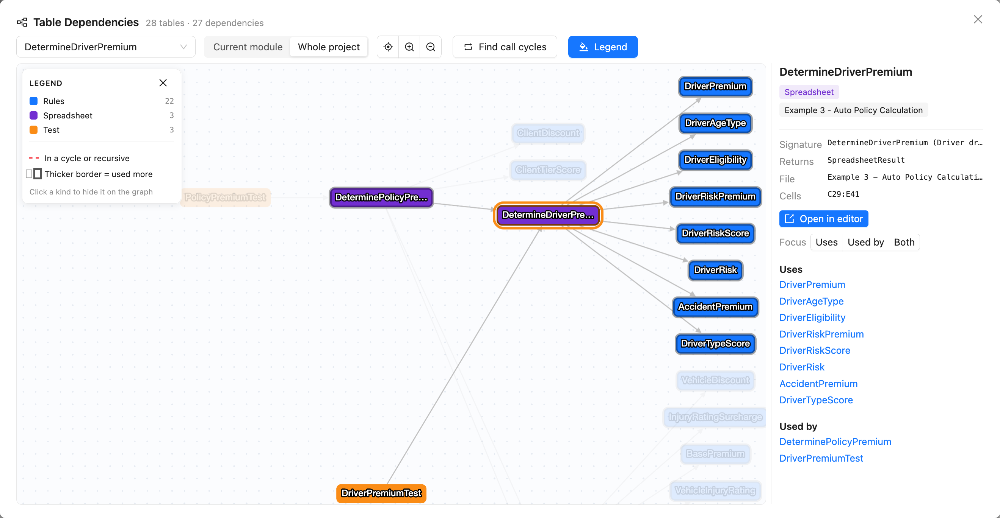

OpenL Tablets **6.2.0** introduces cloud-friendly structured logging for the Docker images and a rebuilt, interactive
table dependency graph in OpenL Studio. It also extends the REST API, improves the OpenL Maven Plugin, and resolves
several critical memory leaks and a multi-module deployment regression.

This release includes breaking changes that require review before upgrading, most notably the default Docker log output
format.

## New Features

### Structured JSON Logging for Docker Images

The Docker images now route all logging — the Jetty server, the web application, and `java.util.logging`-based
libraries — through a single Log4j2 logging system whose output format is selected with the `LOGGING_FORMAT` environment
variable. The default is **ECS** (Elastic Common Schema) JSON on stdout, which log aggregation tools such as Elastic,
Splunk, and Datadog can parse, index, and query by field.

* `ecs` *(default)* — cloud-friendly logs in Elastic Common Schema JSON format on stdout.
* `plain` — human-readable text, the same layout bundled in the `.war`.
* `none` — discard all log events; nothing is written to the console.
* `otel` — mute the Log4j2 console and let the OpenTelemetry agent capture log events and write them to stdout as OTLP
  JSON.

The root log level is set with `LOGGING_LEVEL_ROOT` (default `INFO`). The ECS layout enriches each event with service
metadata derived from the environment:

```properties
appender.console.layout.eventTemplateUri = classpath:EcsLayout.json
appender.console.layout.svc.value = ${env:OTEL_SERVICE_NAME:-OpenL}
appender.console.layout.host.value = ${env:HOSTNAME:-unknown}
appender.console.layout.ver.value = ${env:SERVICE_VERSION:-0}
appender.console.layout.env.value = ${env:ENVIRONMENT:-production}
rootLogger.level = ${env:LOGGING_LEVEL_ROOT:-INFO}
```

This applies only inside the Docker image; non-Docker `.war` deployments keep their bundled plain-text configuration.

### Interactive Table Dependency Graph in OpenL Studio

OpenL Studio replaces the legacy applet-style dependency view with a supported, interactive table dependency graph,
opened from the editor's **More → Table Dependencies**. The graph is backed by a documented REST API and renders a
module's tables and the dependencies between them.

* An in-window scope selector switches between **Current module** and **Whole project** and rebuilds the graph.
* Call cycles (`A → B → C → A`) are detected and highlighted, and recursive tables are drawn as self-loops.
* Dispatcher nodes for overloaded or versioned methods list the business dimensions (state, dates, LOB, and so on) that
  select each version.
* Table-name search, a legend that decodes and filters node kinds, a summary panel (signature, file, cells,
  properties), and **Open in editor** for tables in the active project round out the view.

The graph is served by two endpoints under the experimental `Projects (BETA)` API:

```text
GET /rest/projects/{projectId}/tables/graph
GET /rest/projects/{projectId}/tables/{tableId}/graph
```

The single-table endpoint accepts a `direction` (`DEPENDENCIES`, `DEPENDENTS`, or `BOTH`) and an optional `depth` to
bound traversal.



## Improvements

### OpenL Studio

* Added a REST API to delete a project branch, `DELETE /rest/projects/{projectId}/branches/{branch}`, returning
  `204 No Content`. The repository's main branch cannot be deleted, a project currently open on the branch is closed
  first, and deleting a protected branch requires `force=true` for eligible users. The branch-delete dialog was
  reimplemented in React.
* Removed the redundant **Open** button from the rules editor. Its earlier behavior of launching Microsoft Excel was
  discontinued in a previous release, and the **Export** module button already provides the equivalent action.
* Stabilized the generated OpenAPI document so it serializes deterministically: tags, schemas, paths, and map entries
  are ordered, `@Size` on collections and maps is emitted as `minItems`/`maxItems` and `minProperties`/`maxProperties`,
  and the implicit `Accept`, `Content-Type`, and `Authorization` header parameters are omitted.

### OpenL Maven Plugin

* Attached the jar built from the project `classes` folder as a supplementary artifact with the `classes` classifier
  (the same convention as `maven-war-plugin`), built with the deterministic name `${finalName}-classes.jar`. Other
  Maven modules can now depend on the compiled classes through standard coordinates, and `install`/`deploy` publish the
  artifact automatically.
* Enhanced the `openl:migrate` method-filter migrator to derive `<exposed-methods>` include patterns from legacy
  `<method-filter>` regular expressions instead of enumerating every method. A name-prefix regexp such as
  `.+ _api_.+\(.+\)` becomes the glob `_api_*`, patterns fully covered by a broader glob are dropped, and only patterns
  that actually match the built project's methods are kept.

## Bug Fixes

* Fixed web-application class-loader and worker-thread leaks reported by the servlet container on undeploy and shutdown
  when a Git or Azure repository is in use. Parallel rule evaluation now runs on an unbounded virtual-thread-per-task
  executor that is shut down with the application context, and the JGit background worker thread and message-bundle
  cache are released on context close.
* Fixed a memory and file-descriptor leak where input streams opened over deployment archives stayed open for the data
  source's lifetime. Deployment resources are now read lazily and closed by the caller, and temporary jars extracted
  from nested classpath archives are deleted when the class loader is released rather than at JVM exit.
* Fixed multi-module OpenL Maven builds failing at runtime with `There is no implementation in rules for interface
  method ...` when an API project depends on another OpenL project and pre-generates its datatype classes. The project's
  generated-classes jar is no longer embedded in the archive for that project shape, so a datatype resolves to a single
  class instead of two conflicting copies.
* Fixed OpenL Studio freezing and projects disappearing from the **Editor** tab when switching between modules quickly.
  A deadlock between compilation-status notification and module loading left the loading indicator spinning; status
  updates are now delivered off the compilation lock, and rapid navigation is ignored until the current module finishes
  loading.
* Fixed appending rows to **Spreadsheet** tables through the tables REST API and the MCP `openl_append_table` tool. The
  `POST /rest/projects/{projectId}/tables/{tableId}/lines` endpoint now accepts the `Spreadsheet` table type and rejects
  malformed appends — rows wider than the table, or mismatched or empty spreadsheet rows and cells — with `400 Bad
  Request`.
* Fixed the JVM not exiting after Tomcat stop. The STOMP WebSocket heartbeat scheduler was an unmanaged, non-daemon
  thread that outlived the Spring context; it is now a Spring-managed daemon bean shut down on context close.
* Fixed an `AccessDeniedException: /proc/tty/driver` when opening a project whose `rules.xml` has a blank or missing
  `<name>`. Such projects now fall back to their folder name, and repository path resolution rejects any path that
  escapes the repository root.

## Breaking Changes

This section summarizes changes that may require action before or after upgrading.

* **Docker log output format** — The default log output of the Docker images changed from plain text to ECS JSON on
  stdout. Set `LOGGING_FORMAT=plain` to restore the previous human-readable format. The new `LOGGING_LEVEL_ROOT`
  controls the root level (default `INFO`). Non-Docker `.war` deployments are unaffected.
* **OpenL Maven Plugin generated-classes jar** — For a project that both depends on other OpenL projects and runs the
  `generate` goal, `openl:package` no longer embeds the project's generated-classes jar in the archive by default. Use
  the new `includeGeneratedClasspathJar` parameter to force the previous behavior. All other projects are unaffected.
* **Rules editor Open button** — The **Open** (open-in-Excel) button and its `/action/launch` servlet were removed from
  OpenL Studio. Use the **Export** module button instead.
* **OpenAPI document** — The generated OpenAPI specification changed shape: deterministic ordering, omitted implicit
  header parameters, and `minItems`/`maxItems` for sized collections. Regenerate clients pinned to the previous output.

## Library Updates

### Runtime Dependencies

| Library                    | Version                          |
|:---------------------------|:---------------------------------|
| Spring Framework           | 6.2.19 (from 6.2.18)             |
| Spring Boot                | 3.5.15 (from 3.5.14)             |
| Spring Integration         | 6.5.9 (from 6.5.8)               |
| Spring Security            | 6.5.11 (from 6.5.10)             |
| Hibernate ORM              | 6.6.53.Final (from 6.6.52.Final) |
| Hibernate Validator        | 8.0.4.Final (from 8.0.3.Final)   |
| HikariCP                   | 7.1.0 (from 7.0.2)               |
| OpenTelemetry              | 2.29.0 (from 2.28.1)             |
| CXF                        | 4.1.7 (from 4.1.6)               |
| gRPC                       | 1.82.0 (from 1.81.0)             |
| Swagger Core               | 2.2.52 (from 2.2.50)             |
| Swagger Parser             | 2.1.44 (from 2.1.43)             |
| Azure Blob Storage SDK     | 12.35.0 (from 12.34.0)           |
| Log4j JSON Template Layout | 2.26.0 (*New*)                   |

### Test Dependencies

| Library        | Version              |
|:---------------|:---------------------|
| S3Mock         | 5.1.0 (from 5.0.0)   |
| MariaDB Driver | 2.7.14 (from 2.7.13) |
| GreenMail      | 2.1.9 (from 2.1.8)   |
