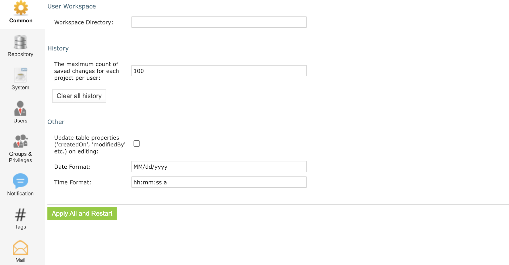
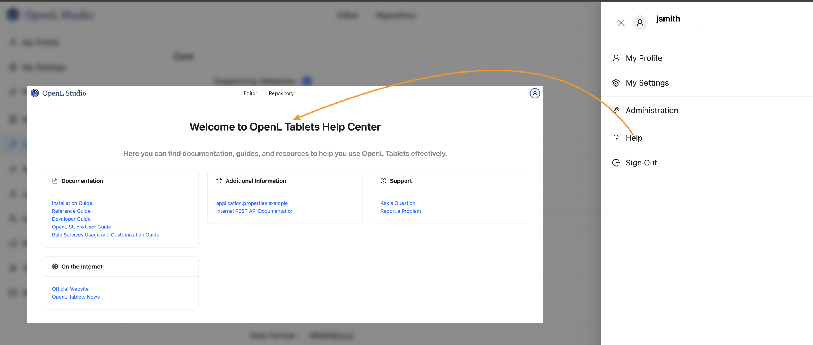

# **OpenL Tablets 6.0.0 Release Notes**

OpenL Tablets **6.0.0** is a major release introducing a modernized security model, redesigned administration experience, enhanced documentation capabilities, and significant platform upgrades.

This release also includes **breaking changes** that require careful review before upgrading.

## **1. New Features**

### **1.1 Simplified User Access & Permissions Management in OpenL Studio**

OpenL Studio introduces a **completely redesigned access control system** with a simplified, role-based permission model. The new approach significantly reduces configuration complexity while maintaining enterprise-grade security.

The new system supports **granular, resource-level access control** through role assignments, with a reduced and streamlined set of permissions for improved clarity and maintainability.

#### **Role-Based Access Control**

Access is now managed through three predefined roles:

* **Manager**: Full control with ability to assign roles  
* **Contributor**: Content modification without system administration  
* **Viewer**: Read-only access with test execution capabilities

The legacy permission model has been consolidated into **five core permissions**—**Manage, View, Create, Edit, and Delete**—which are embedded directly into roles.

All existing permissions are **automatically migrated** to the new role structure during upgrade.

The following legacy permissions have been deprecated and their functionality is now included by default in the predefined roles and features:

* View Projects  
* Run and Trace Tables  
* Edit Projects  
* Create/Delete Projects  
* Erase Projects  
* Lock/Unlock Projects  
* Deploy Configuration permissions

#### **Improved Groups & Users Management**

The Groups and Users UI has been redesigned to improve usability and visibility:

* Role-based access control at repository and project levels  
* Redesigned **Edit Group** and **Edit User** pages with separate *Details* and *Access Rights* sections  
* Streamlined group invitation workflow  
* Repository root access management for bulk permission assignment

##### **Project Creation & Deletion Control**

Previously, users with the **Create Projects** permission could always create projects through the UI. Starting with v6.0.0, project creation is controlled by a new system-level property configured by administrators:

```properties
security.allow-project-create-delete=true   # default
security.allow-project-create-delete=false  # hides Create/Delete actions
```

Although the **Contributor** and **Manager** roles still include Create and Delete permissions, this property can globally enable or disable the project creation functionality in OpenL Studio.

#### **Batch ACL Operations (Administrators Only)**

A new batch API enables automated access control configuration at scale:

* ACL batch import via JSON  
* Conflict handling strategies (overwrite, merge, skip)  
* Schema validation and detailed logging  
* Bash script support for automation  
* Role-based authorization

#### **Migration Notes**

1. ACL structures are migrated automatically during upgrade  
2. Legacy permissions automatically migrated:  
   * Legacy "View Projects" → Viewer role at repository level  
   * Legacy "Edit Projects" → Contributor role at repository level  
   * Legacy "Create/Delete Projects" → Manager role at repository level  
   * Repository root access → Contributor role for all repositories within root

Manual migration:

1. Configure default group permissions. The `security.default-group` property no longer automatically grants READ permissions to all repositories. Administrators must explicitly configure permissions for the default group after upgrade.  
2. Set `security.allow-project-create-delete` as needed:

```properties
security.allow-project-create-delete=true  # Default (allows creation)
security.allow-project-create-delete=false # Hides create/delete buttons
```

### **1.2 Administration Panel Redesign in OpenL Studio**

The Administration Panel has been fully redesigned and migrated from JSF/RichFaces to a modern **React-based UI**, improving performance, usability, and browser compatibility.

Previous version
 

New version


#### **Repository Management**

* Redesigned interface for Design and Production repositories  
* Support for multiple repository types (Git, JDBC, cloud storage)  
* Repository configuration validation and connection testing

#### **System & Security Configuration**

* Redesigned System, Email, and Security settings pages  
* Support for multiple authentication modes (single-user, multi-user, AD, SAML, OAuth2)  
* Read-only indication for settings defined via system properties or environment variables

#### **API & UI Enhancements**

* New settings validation endpoints  
* Legacy administration APIs deprecated and replaced  
* Redesigned login and error pages (403, 404, 500)  
* Integrated Help page with links to documentation  
* Support for external UI plugins and embedded editors



### **1.3 Simplified Deploy Workflow in OpenL Studio**

Project deployment in OpenL Studio is now available as a **single-click action**, reducing configuration complexity and deployment errors.


### **1.4 Project Tags in OpenL Studio**

Project tags are now stored inside the OpenL project, improving portability and version control integration.

* Tags stored within OpenL project structure  
* Tags are versioned in Git together with project content  
* Tags travel with project when copied or deployed  
* Tag changes tracked in Git commit history

**Migration:** Existing tags are automatically migrated and preserved in backups.


### **1.5 OpenAPI Documentation Integration In OpenL Rules**

OpenL Rules now provides enhanced OpenAPI (Swagger) documentation generation with automatic extraction of rule and datatype descriptions.

#### **Datatype Field Documentation**

Datatype tables support optional columns such as *Description, Default, Example, Format,* and *Mandatory*. These descriptions automatically appear in generated OpenAPI schemas.

Full backward compatibility with existing 2-3 column format.


#### **Method & Spreadsheet Documentation**

* Parameter descriptions appear in API definitions  
* Spreadsheet-level purpose descriptions supported  
* Step-level descriptions improve calculation transparency  
* Alias datatype descriptions supported


### **1.6 New Statistical Functions in OpenL Rules**

OpenL Rules introduces a comprehensive set of built-in statistical functions for advanced analytics, all supporting multiple numeric types and null-safe execution:

* **Standard Deviation**: stdevP(), stdevS()  
* **Variance**: varP(), varS()  
* **Correlation**: correl(), rsq()  
* **Covariance**: covarP(), covarS()  
* **Linear Regression**: slope(), intercept(), forecast()

These functions enable advanced calculations for risk assessment, forecasting, and financial modeling.

### **1.7 Additional Features**

#### **Customizable User Data in Single User Mode**

* Configure username, email, first name, last name, and display name  
* Customized user information appears in Git commit history

**Configuration properties:**

```properties
security.single.username=john.smith
security.single.email=john.smith@company.com
security.single.first-name=John
security.single.last-name=Smith
security.single.display-name=John Smith
```

#### **Automatic OpenL Project Recognition**

Projects are automatically detected in Git repositories and added to OpenL Studio.

#### **Personal Access Tokens for OpenL API Authentication**

Introduced support for **Personal Access Tokens (PATs)** for **API and service integrations.**

##### **Key characteristics:**

* Available only when `user.mode=oauth2` or `user.mode=saml`  
* Tokens authenticate requests to OpenL REST APIs using a dedicated authorization header  
* Tokens act on behalf of the user who created them and follow that user’s permissions  
* Token secrets are shown only once at creation and cannot be recovered later  
* Existing authentication mechanisms and Studio workflows remain unchanged  
* No migration or configuration changes are required

##### **API Scope**

* New endpoints under `/rest/users/personal-access-tokens`  
* Token-based access uses `Authorization: Token <PAT>` (not `Bearer`)

#### **ProjectDescriptor Injection**

* Ability to inject current ProjectDescriptor into service method handlers  
* Enhanced customization capabilities for developers

## **2. Improvements**

### **2.1 Demo Enhancements**

* Replaced DEMO docker image with compose.yaml file  
* Reduced the download size of the zip file  
* Removed manual Java installation step

### **2.2 Security Hardening**

* Removed VBScript execution under Windows  
* Removed Userworkspace UI setting  
* Improved Jackson serialization security (NAME vs CLASS)  
* Password fields no longer returned by any API  
* Sensitive configuration values protected in API responses

## **3. Breaking Changes**

This section outlines critical changes that may break existing implementations and require migration action.

### **3.1 Jakarta EE 10 Migration (CRITICAL)**

OpenL Tablets 6.0.0 migrates from **Java EE (`javax.*`) to Jakarta EE 10 (`jakarta.*`)**.

All custom Java code and integrations must be updated accordingly.

#### **What Changed**

* All `javax.*` package names changed to `jakarta.*`  
* Major framework upgrades:  
  * Spring Framework 6.2  
  * Spring Boot 3.4  
  * Spring Security 6.4  
  * Hibernate ORM 6.6  
  * Jetty 12  
  * OpenSAML 5.1

#### **Impact**

* All custom code using `javax.*` packages will break  
* Custom servlets, filters, and web components require code changes  
* Custom integrations with Spring, Hibernate, or JPA need updates  
* Third-party libraries may need updates to Jakarta EE compatible versions

#### **Who Is Affected**

You are affected only if your OpenL projects include custom Java code, such as:

* Java code embedded or referenced in rules  
* Custom servlets, filters, or web components  
* Custom integrations using Spring, Hibernate, JPA, or similar frameworks  
* Third-party Java libraries included in the OpenL projects

#### **Migration Steps**

If you are using **OpenL Studio**, **Rule Services**, or the **demo version** **without any custom Java code**, **no action is required**.  
Simply installing or upgrading to **OpenL Tablets 6.0.0** does **not** require any Java installation, configuration, or environment changes.

The steps below apply **only if your projects contain custom Java code or integrations**.

##### **Required changes for custom Java code**

Update all Java imports by replacing `javax.*` packages with `jakarta.*`, for example:

* `javax.servlet` → `jakarta.servlet`  
* `javax.persistence` → `jakarta.persistence`  
* `javax.validation` → `jakarta.validation`  
* `javax.xml.bind` → `jakarta.xml.bind`

Also ensure that all third-party libraries used by your custom code are updated to versions compatible with **Jakarta EE 10**.

### **3.2 Java 21 Required**

OpenL Tablets 6.0.0 requires Java 21. Java 8, 11, and 17 are no longer supported.

#### **Requirements**

* **Minimum version**: Java 21  
* **Recommended**: Java 21 (Eclipse Temurin)  
* **Demo package**: The system automatically detects the installed Java. If Java is not present or does not meet the minimum required version, OpenL Tablets downloads and uses its own Java for OpenL Tablets only. It does not replace or modify any existing Java installation.

### **3.3 Removed Embedded JDBC Drivers**

OpenL Studio 6.0.0 no longer ships with embedded JDBC drivers for Oracle, SQL Server. Users must provide their own JDBC drivers.

#### **Migration Steps**

1. Download the appropriate JDBC driver for your database  
2. Mount drivers to `/opt/openl/lib` folder

### **3.4 Variations Functionality Removed**

The variations functionality has been completely removed. Applications using variations must be refactored to use array-based rules.

#### **What Changed**

* `<isProvideVariations>` configuration option removed  
* Automatic variation generation no longer available  
* Variation endpoints no longer automatically created  
* **cacheable property** removed  
* **recalculate property** removed  
  * **Migration**: Remove from rules

#### **Impact**

* **All services using variations will stop working**  
* Client applications calling variation endpoints will receive errors  
* Manual rule creation required

#### **Migration Steps**

1. (Optional) Remove `<isProvideVariations>true</isProvideVariations>` from rules-deploy.xml  
2. (Optional) Remove **cacheable property and recalculate property** from rules  
3. Create variations with the help of OpenL rules manually in your Excel/rules files

### **3.5 isProvideRuntimeContext Default Changed**

The default value for isProvideRuntimeContext has changed from true to false.

#### **What Changed**

* Runtime context is no longer automatically provided to rules by default  
* Rules expecting runtime context will receive null unless explicitly enabled

#### **Impact**

* Rules accessing runtime context properties (currentDate, requestId, etc.) will fail  
* Services may return null pointer exceptions if rules expect context

#### **Migration Steps**

* If your rules rely on runtime context and it is not explicitly defined in the datatype model or enabled via the “Provide runtime context” checkbox on the Rules Deploy Configuration tab, set

  `isProvideRuntimeContext=true` in `rules-deploy.xml`.

### **3.6 Jackson Serialization Security Change**

Jackson deserialization default changed from CLASS-based to NAME-based type identification to fix security vulnerability.

#### **What Changed**

* ruleservice.jackson.jsonTypeInfoId changed from CLASS to NAME  
* JSON type information format changed  
* Fixes deserialization security vulnerability

#### **Impact**

* JSON responses will have different type information format  
* Clients expecting CLASS-based types must be updated  
* Stored JSON data with CLASS types may need migration

#### **Migration Steps**

* Update client applications to handle NAME-based type information  
* Test JSON serialization/deserialization thoroughly  
* If you must use CLASS format (not recommended), set

  `ruleservice.jackson.jsonTypeInfoId=CLASS`

### **3.7 OAuth2 Configuration Changes**

OAuth2 username mapping has changed from preferred_name claim to sub claim by default in OpenL Studio 6.0.0.

#### **What Changed**

* User identifier now uses sub claim instead of preferred_name  
* Display name still used as hint for logged-in user  
* **Reason**: preferred_name cannot be part of access token by specification

#### **Impact**

* OAuth2 login may fail with default configuration  
* User IDs may change after upgrade. It may impact user access to the resources.

#### **Migration Steps**

* Verify OAuth2 configuration uses sub claim  
* Test OAuth2 login flow  
* Update user mappings if user IDs have changed  
* If you must use old previous behavior, set `security.oauth2.attribute.username=preferred_name`

### **3.8 Removed Features Summary**

The following features, protocols, and APIs have been completely removed from OpenL Tablets 6.0.0:

#### **Removed Protocols & Integration Methods**

* **RMI Protocol Support**  
  * **Migration**: Use REST protocol  
* **CAS SSO Support**  
  * **Migration**: Use OAuth2 or SAML authentication

#### **Removed Database Support**

* **Apache Hive**  
  * **Migration**: Use `org.openl.rules.ruleservice.ws.storelogdata.db`  
* **Apache Cassandra**  
  * **Migration**: Use PostgreSQL, MySQL, or other supported databases

#### **Removed Libraries & Extensions**

* **Activity Extension**  
  * **Migration**: Implement custom solution if needed  
* **Spreadsheet Result Calculation Step Library**  
  * **Migration**: Use SpreadsheetResult directly without meta-structure conversion

#### **Removed APIs**

* **/rest/repo/* REST API endpoints**  
  * **Migration**: Use new repository management APIs  
* **DoubleRange deprecated methods:**  
  * BoundType enum  
  * setLowerBound(), setUpperBound()  
  * setLowerBoundType(), getLowerBoundType()  
  * setUpperBoundType(), getUpperBoundType()  
  * StringRange.getLowerBoundType(), getUpperBoundType()  
  * **Migration**: Update code to use alternative APIs

#### **Removed UI Features**

* **Install Wizard**  
  * **Migration**: Use configuration files directly  
* **Java Preference Configuration**  
  * **Migration**: Use system properties or environment variables  
* **Userworkspace Setting from UI**  
  * **Migration**: Configure via environment variables only

## **4. Security & Library Updates**

### **4.1 Security Vulnerability Fixes**

* **CVE-2025-41249**: Spring Framework vulnerability fixed  
* **CVE-2025-41248**: Spring Security vulnerability fixed

### **4.2 Major Library Upgrades**

#### **Runtime Dependencies**

* Spring Framework 6.2.11 (from 5.x)  
* Spring Boot 3.5.6 (from 2.x)  
* Spring Security 6.5.5 (from 5.x)  
* Spring Integration 6.5.2  
* Hibernate ORM 6.6.29.Final (from 5.x)  
* Jetty 12.0.27 (from 9.x/10.x)  
* OpenSAML 5.1.6 (from 4.x)  
* Log4j 2.25.2  
* Swagger Core 2.2.37  
* OpenTelemetry 2.20.1  
* Amazon AwsSDK 2.34.2  
* Guava 33.5.0-jre  
* BouncyCastle 1.82  
* Jakarta XML Bind 4.0.4  
* Jakarta Mail 2.1.5

#### **Test Dependencies**

* Mockito 5.20.0  
* XMLUnit 2.10.4  
* PostgreSQL Driver 42.7.8

#### **Removed Dependencies**

* commons-jxpath

## **5. Bug Fixes**

* Fixed GitLFS issues with BitBucket repositories  
* Fixed tracing and dependency graph issues  
* Fixed flat folder structure display issue  
* Fixed deployment repository errors when base.path not specified

## **6. Migration Notes**

### **Quick Role-Based Pointers**

* **If you are a Rules Author** → pay special attention to sections **3, 4**  
* **If you are a Developer** → pay special attention to sections **2, 3, 5**  
* **If you are an Administrator / Platform Owner** → pay special attention to sections **1, 2, 6**

### **1. Access Control & Permissions**

* The legacy permission model has been replaced with role-based access control (RBAC).  
  Permissions are migrated automatically, but effective access may differ after upgrade.  
* `security.default-group` no longer grants implicit READ access to repositories.  
* Project creation and deletion are additionally controlled by the system property:

```properties
security.allow-project-create-delete
```

* Role assignments and default group permissions should be reviewed after upgrade.

#### **User Access & Permission Mapping**

| Legacy Permission | New Behavior | Notes / Action |
| :---- | :---- | :---- |
| **View Projects** | Included in all roles | Deprecated as a standalone permission; project viewing is now available to all roles by default |
| **Run and Trace Tables** | System action | No longer permission-restricted; available to all users regardless of role |
| **Edit Projects** | Included in Contributor role | Covered by the Edit permission |
| **Create Projects** | Separate Create permission | Included in Contributor and Manager roles; can be globally restricted |
| **Delete Projects** | Separate Delete permission | Included in Contributor and Manager roles |
| **Erase Projects** | Merged into Delete | Delete and erase are now the same action |
| **Lock / Unlock Projects** | Removed | Project locking functionality was deprecated |
| **Deploy Configuration (Create/Edit/Delete/Erase)** | System action | Available to users with Viewer access to Design repo and Edit access to Deploy repo |

### **2. Runtime Environment**

* Java **21** is required. Earlier Java versions are no longer supported.  
* All `javax.*` packages have been replaced with `jakarta.*`.  
  Custom Java code must be updated accordingly and all dependencies must be Jakarta EE 10 compatible.

### **3. Rules & Rule Execution**

* The **variations** feature has been completely removed.  
  * Variation-based endpoints are no longer created.  
  * Rules and services relying on variations must be rewritten using array-based or explicit rule logic.  
* The default value of `isProvideRuntimeContext` is now **false**.  
  * Rules that relied on implicit runtime context (for example, `currentDate`, `requestId`) may receive `null` unless enabled explicitly.

### **4. Metadata & OpenAPI**

* Project tags are now stored inside the project structure.  
  * Tags are migrated automatically.  
  * Tag changes are version-controlled and visible in Git history.  
* Rule and datatype descriptions are automatically exposed in generated OpenAPI documentation.

### **5. Integration & Serialization**

* JSON polymorphic serialization now uses **NAME-based** type identification instead of **CLASS-based**.  
  * Client applications relying on CLASS-based typing may require updates.  
* OAuth2 authentication now uses the `sub` claim as the default username attribute.  
  * Existing OAuth2 integrations should be verified after upgrade.  
* Embedded JDBC drivers are no longer included.  
  * Required database drivers must be provided explicitly.

### **6. Administration, Deployment & Removed Features**

* The following components and protocols are no longer supported:  
  * RMI  
  * CAS SSO  
  * Legacy APIs  
  * Install Wizard  
* The Administration UI has been fully redesigned.  
  * No functional loss; administrators should familiarize themselves with the new layout.  
* Demo distribution and deployment packaging have changed.  
  * No breaking impact for production systems; primarily affects evaluation and onboarding scenarios.
