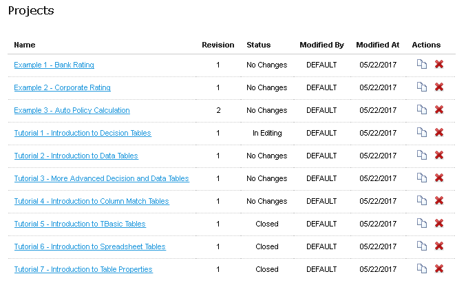

# OpenL Tablets BRMS Demo Package Guide

## Preface

This preface is an introduction to the *OpenL Tablets Demo Package Guide*.

This guide describes a complete OpenL Tablets Demo package which contains configured and ready to demonstrate infrastructure for the OpenL Tablets product. The Demo package enables a user to develop business rules and manage business rule sets in OpenL Studio, and then execute these rules as web services ready to be used by solution applications.

# Getting Started with the OpenL Tablets Demo

Welcome\! The OpenL Tablets Demo is the quickest way to explore the features of OpenL Tablets. It comes with pre-loaded example projects, so you can start working immediately without any complex setup.

You can use the included examples as a template, learn from them, or create your own projects from scratch. The Demo also includes a **Rule Services Demo Client**, allowing you to see how your business rules can be executed by other applications.

-----

## 1. Download and Install

First, download the **Demo (ZIP)** file from the official site:

➡️ [https://openl-tablets.org/downloads](https://openl-tablets.org/downloads)

Once downloaded, **unzip the package** into a folder on your computer.

### What's Inside the Package? 📦

The unzipped folder contains everything you need to run the OpenL Tablets Demo:

* **Startup Files**: The scripts you will use to launch the application.
    * `start.cmd` for Windows
    * `start` for MacOS and Linux
* **Settings Files**: Default configurations for the Demo applications. You generally won't need to change these.
* **Application Folder (`webapps/`)**: This folder holds the core files that make the application run. It is best not to modify its contents.
* **Version File (`openl.version`)**: A text file that shows the version number of the Demo.

-----

## 2. The First Launch: Automatic Setup

The first time you run the startup script, it will automatically download and configure all the necessary components for the Demo to run. This is a one-time setup process.

The script will create several new folders inside your Demo directory and download the following assets:

* `jre/` → The specific **Java Runtime Environment (JRE)** required by the application.
* `jetty-home/` → The **Jetty Web Server**, a lightweight server that hosts the OpenL web applications.
* `webapps/` → The **OpenL Studio** and **Rule Services** applications themselves.
* `jetty-home/lib/ext/` → **JDBC drivers** to enable connectivity with popular databases like MSSQL Server, Oracle, MariaDB, and PostgreSQL.

-----

## 3. What's Pre-configured for You? ✨

The Demo is designed to work out-of-the-box with a smart default configuration.

### OpenL Studio

* Runs in a simple, single-user mode.
* Uses its own internal **H2 database** to store user settings, so no external database is needed.
* All your work (projects, settings) is stored locally in the `openl-demo/` subfolder.
* Comes with a pre-initialized local 'design' **Git repository** containing examples and tutorials, located at `openl-demo/repositories/design/`.
* Comes with a pre-initialized local 'deployment' repository for connecting with the Rule Services, located at `openl-demo/repositories/deployment/`.

### Rule Services

* Is already connected to OpenL Studio.
* Allows all **CORS requests**, which makes it easier for developers to integrate and test rules from other web applications.

-----

## 4. Launching the Demo Application 🚀

To start the application, navigate into the unzipped Demo folder and run the startup file for your operating system.

### On Windows 🪟

Find the **`start.cmd`** file and double-click it.

### On MacOS & Linux 🍏🐧

Find the **`start`** file and double-click it.

Or open your terminal, navigate into the unzipped Demo folder, and run the following command:

```bash
bash start
```

*(Note: On some systems, you may need to grant execute permissions to the file first with the command `chmod +x start`)*

-----

## 5. Optional: Use a Shared Folder for Your Projects 📂

By default, all your projects and settings are saved inside the `openl-demo/` folder within the main Demo package. To preserve your work when you upgrade to a new version of the Demo, you can configure it to use a permanent, external folder.

ℹ️ **Note:** When using this external folder mode, the initial set of **Examples and Tutorials** will not be created automatically. This mode is best for users who want to manage their own projects.

-----

### Simple Method: The `OpenL_Home` Folder

The easiest way to enable this feature is to create a specific folder on your Desktop. The Demo will automatically detect and use it.

1.  Navigate to your system's Desktop.
2.  Create a new folder named exactly **`OpenL_Home`**.

*For terminal users on MacOS, Linux or Windows, you can run this command:*

```bash
mkdir "$HOME/Desktop/OpenL_Home"
```

The next time you launch the Demo, it will use this new folder to store all your data.

-----

### Advanced Method: Using an Environment Variable

For advanced users who want to specify a custom folder location (e.g., on a different drive), you can define an `OPENL_HOME` environment variable.

1.  Choose or create a folder at any location on your computer.
2.  Create a system environment variable named **`OPENL_HOME`**.
3.  Set the value of this variable to the full path of your chosen folder.

⚠️ **Important:** The folder you specify **must exist** before you launch the Demo, and the application must have permission to write files into it.

-----

### Learn More 📚

For more advanced topics, such as deploying OpenL Tablets to your own application server, please see the official documentation:

* [OpenL Tablets Installation Guide > Deploying OpenL Studio](https://openldocs.readthedocs.io/en/latest/documentation/guides/installation_guide/#deploying-openl-tablets-webstudio)

## 6. Accessing the Welcome Page

After launching, your default web browser should automatically open the welcome page. If it doesn't, you can manually navigate to this address:

`http://localhost:8080/`

From the welcome page, you can access the **OpenL Studio**, the **Rule Services** and the **Rule Services Demo Client**.


*OpenL Tablets Demo welcome page*

The following sections provide more details on Demo package work:

-   [OpenL Studio in a Demo Package](#openl-studio-in-a-demo-package)
-   [OpenL Rule Services in a Demo Project](#openl-rule-services-in-a-demo-project)
-   [OpenL Rule Services Demo Client in a Demo Package](#openl-rule-services-demo-client-in-a-demo-package)

### OpenL Studio in a Demo Package

OpenL Studio is preconfigured in a single user mode. A user is automatically signed in and sees the welcome start page.

The following topics are included:

-   [Rules Editor](#rules-editor)
-   [Repository Editor](#repository-editor)
-   [Administration](#administration)

#### Rules Editor

Several examples and tutorials are already in the **No Changes** status, therefore available in **Rules Editor** by default. For more information on how to manage rules in Rules Editor, see [OpenL Studio Guide > Using Rules Editor](https://openldocs.readthedocs.io/en/latest/documentation/guides/webstudio_user_guide/#using-rules-editor).


*Projects in Rules Editor available for editing*

#### Repository Editor

Users can work with projects loaded in Repository in the Demo package and create their own new projects. For more information on how to manage projects in Repository, see [OpenL Studio Guide > Using Repository Editor](https://openldocs.readthedocs.io/en/latest/documentation/guides/webstudio_user_guide/#using-repository-editor).

The “Example 3 – Auto Policy Calculation” project is already deployed using the deploy configuration “Example 3 – Auto Policy Calculation” and can be used via OpenL Tablets Rule Services as described in [OpenL Tablets Rule Services in a Demo Project](#openl-rule-services-in-a-demo-project) in OpenL Tablets Web Services Demo Client as described in [OpenL Tablets Rule Services Demo Client in a Demo Package](#openl-rule-services-demo-client-in-a-demo-package).

As OpenL Studio is preconfigured in a single user mode, and all projects in Repository are created and modified by the “DEFAULT” user.



*The whole list of rules projects in Repository of the Demo package*

### OpenL Rule Services in a Demo Project

By default, a project from the “Example 3 – Auto Policy Calculation” template is deployed to Deployment Repository from OpenL Studio by a startup script.

To use this project as an example of project deployments as described in [OpenL Rule Services Demo Client in a Demo Package](#openl-rule-services-demo-client-in-a-demo-package), several settings are defined in Rules Configuration of the project. It is set up that only \*DriverRisk\*, \*DriverAgeType\*, \*AccidentPremium\* are wildcards, and rules are included and can be used from the OpenL Tablets Rule Services Demo Client application.


*OpenL Rule Services main page and the project deployed on it*

The demo does not restrict any deployments of other projects nor has any other limitations so the users can deploy their own projects in Demo setup. If a user deploys anything else, a full list of deployed projects appears on this page including user’s projects.

**Swagger UI** is a third party tool used for testing services. For more information on Swagger UI and its usage in OpenL, see [OpenL Tablets Rule Services Usage and Customization Guide > Appendix D: OpenAPI Support](https://openldocs.readthedocs.io/en/latest/documentation/guides/rule_services_usage_and_customization_guide/#appendix-d-openapi-support).

### OpenL Rule Services Demo Client in a Demo Package

OpenL Rule Services Demo Client application is an application specially created to demonstrate usage of OpenL Tablets rules via OpenL Tablets Rule Services. OpenL Tablets Rule Services Demo Client is a simple web page that must be used to check that rules are easily accessible from other applications via web services.

**Note:**  OpenL Rule Services Demo Client invokes only several methods of a particular predeployed “Example 3 – Auto Policy Calculation” project. It means that other projects deployed by a user cannot be used from within the OpenL Tablets Rule Services Demo Client application.

OpenL Rule Services Demo Client application allows to define a driver type by age and gender, get premium per accident, or determine how risky a driver is according to business rules specified in the “Example 3 – Auto Policy Calculation” project.


*Executing DriverAgeType rule and getting results via OpenL Rule Services Demo Client*

A user can change the values of input parameters in the fields and click the **Execute** button. The corresponding result is displayed below the list of rules to call.

In OpenL Rule Services Demo Client application, a simple HTTP client is used. It is an example of how to create a simple client with zero dependencies.

## Using the Demo as a Deployment Blueprint 🗺️

The **OpenL Demo** package is more than just a trial version; it’s a practical template for a common real-world setup. You can use its configuration as a guide for deploying OpenL Tablets in your own environment.

***

### A Typical Deployment Pattern

A standard setup for using OpenL Tablets involves two main steps:

1.  **Deploy Components**: Install **OpenL Studio**, **OpenL Rule Services**, and **Database** on a server.
2.  **Configure the Connection**: Set up both **OpenL Studio** and **OpenL Rule Services** to use the same **`deployment`** repository.

The most critical step is ensuring the **`deployment` repository** is configured identically in both applications. You can inspect the configuration files inside the Demo package as a working example of how to do this correctly.


```
Release 6.0
OpenL Tablets Documentation is licensed under a Creative Commons Attribution 3.0 United States License.
```
