# Getting Started with OpenL Tablets

## Introduction

The purpose of this tutorial is to help you get started with OpenL Tablets. This page describes how to start using OpenL
Tablets with a simple example.

In the course of this tutorial, we will create a simple rule based on existing requirements in an Excel file and show
how to verify that it works.

**OpenL Tablets** is a business rules management system based on tables presented in Excel documents. Providing a
business-oriented approach, OpenL Tablets treats business documents containing business logic specifications as
executable rules. In a very simplified view, OpenL Tablets extracts rule tables from Excel documents and executes them.
The rules can be accessible from different applications. OpenL Tablets tools check all data, syntax, and type errors in
order to avoid any user mistakes.

**OpenL Studio** is a web interface application employed by business users and rules experts to view, edit, and manage
business rules and rule projects created using OpenL Tablets technology.

OpenL Studio and Excel are used for comfortable work of business analysts and subject matter experts with OpenL Tablets
rules, allowing them to represent, test, and maintain business logic.

Before we dive in, here are the **OpenL Tablets** basic concepts:

| Concept      | Description                                                                                                                                                                                                                                                                                                                                                                                          |
|--------------|------------------------------------------------------------------------------------------------------------------------------------------------------------------------------------------------------------------------------------------------------------------------------------------------------------------------------------------------------------------------------------------------------|
| **Rules**    | In OpenL Tablets, a basic rule is a logical statement consisting of conditions, actions, and returned values. If a rule is evaluated and all its conditions are true, then the corresponding actions are executed and/or the result value is returned to the calling program. Basically, a rule is an IF-THEN statement. There are calculator and workflow (algorithm) rule representations as well. |
| **Tables**   | Basic information that OpenL Tablets deals with, such as rules and data, is presented in tables. OpenL Tablets offers different types of tables for different types of processing. OpenL includes rule table types such as decision tables, lookup tables, decision trees, and spreadsheet-like calculators.                                                                                         |
| **Projects** | An OpenL Tablets project is a container of all resources required for processing rule-related information. Usually, a simple project contains just Excel files with rules.                                                                                                                                                                                                                           |

More details can be found
in [OpenL Tablets Reference Guide, Chapter 1: Introducing OpenL Tablets](https://openldocs.readthedocs.io/en/latest/documentation/guides/reference_guide/#introducing-openl-tablets).

---

## Quick Start

To start working with OpenL Studio, you can use our online demo. Please note that it is for demonstration purposes only
and all the content is deleted from it once a day.

Use the following links to the applications of our Live Demo:

| Demo Application             | URL                                                                                                          |
|------------------------------|--------------------------------------------------------------------------------------------------------------|
| OpenL Studio                 | [http://demo.openl-tablets.org/webstudio](http://demo.openl-tablets.org/webstudio)                           |
| Rule Services                | [http://demo.openl-tablets.org/webservice](http://demo.openl-tablets.org/webservice)                         |
| Rule Services client example | [http://demo.openl-tablets.org/webservice-client.html](http://demo.openl-tablets.org/webservice-client.html) |

For more details on OpenL Tablets Demo, you can refer to [OpenL Tablets Demo Package Guide](../demo-package). You can
always download and install OpenL Tablets Demo for yourself by following this guide.

When you open OpenL Studio, you will see the OpenL Studio start page in your browser:

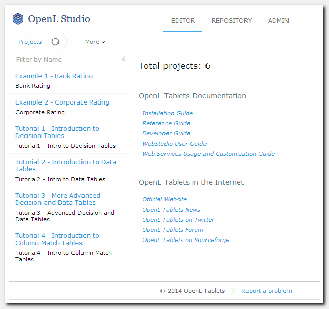

*Figure 1: OpenL Studio Home page*

---

## Rule Creation

**OpenL Tablets** utilizes Excel concepts of workbooks and worksheets containing rules. A rule **project** where rules
are maintained consists of Excel files that are called **modules**. Each workbook is comprised of one or more worksheets
used to separate information by logical **categories** (so you will understand your rules better). Each worksheet, in
turn, is comprised of one or more OpenL tables that represent **rules**. Workbooks can include rule tables of different
types and different underlying logic.

Rules can be created with the following tools:

1. OpenL Studio Table Wizards.
2. Microsoft Excel. In this case, the rule file should be uploaded in OpenL Studio where it will be validated and
   properly tested.

In this tutorial, we are going to see the creation of a rule and its test in Microsoft Excel, and then their updating
and testing in OpenL Studio. You can also create the same rule directly in OpenL Studio using the Simple Rules Table
Wizard on your own.

Details about creating rules and different rule table types can be found
in [OpenL Tablets Reference Guide, Creating Tables for OpenL Tablets](https://openldocs.readthedocs.io/en/latest/documentation/guides/reference_guide/#creating-tables-for-openl-tablets).

Here we are going to create a business rule according to an Excel file that contains requirements. The idea is that by
slightly modifying the original requirements, we can create ready-to-execute OpenL rules without any special effort and
with little special knowledge.

### 'Air Ticket Price' Rule Creation in Excel

The following example demonstrates how to create a simple rule that determines the air ticket price value depending on a
city of departure and a city of destination. For example, if the departure city is Chicago and the destination city is
Madrid, we want our rules to return $900 as an air ticket price.

The business requirements are represented as the following Excel table in the [**TicketsPrice.xls**](TicketsPrice.xlsx)
file:

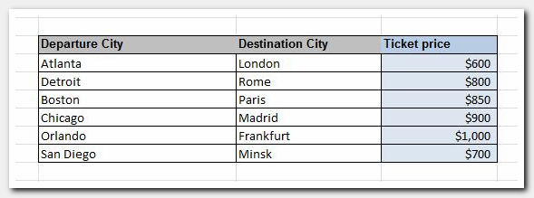

*Figure 2: A spreadsheet requirements for Air Tickets Price rule*

To enable this table as an executable rule table, all you need to do is add several OpenL Tablets instructions.

This table matches the Simple Decision Table structure. To instruct OpenL how to treat your rules and to specify that
the table is a Simple Decision Table, add a new row just above the requirements table, merge its cells across the table
width, and enter the corresponding OpenL Tablets instruction with the following content:

```
SimpleRules Double AirTicketsPrice (String departureCity, String destinationCity)
```

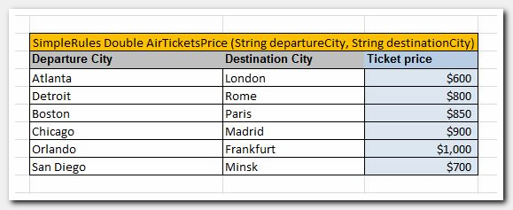

*Figure 3: Adding a table header with OpenL Tablets instructions*

Here:

- `SimpleRules` is the keyword identifying a decision table. It instructs OpenL how to process your table.
- `Double` and `String` are type names specifying the value types returned by the rule and input value types
  respectively. `Double` stands for a number with a floating point; `String` stands for any text input.
- `AirTicketsPrice` is the name of the rule used to reference this table from other rules or your rules-consumer
  application.
- `departureCity` and `destinationCity` are the names of input parameters for the rule. You can use these names anywhere
  in your rule. Depending on the input values that the user enters, OpenL Tablets selects the result value.

Details on data types can be found
in [OpenL Tablets Reference Guide, OpenL Tablets Functions and Supported Data Types](../reference_guide/index.md#openl-tablets-functions-and-supported-data-types).

---

## Rule Project Creation

Now that we have the rule created and ready to use, let's create a project with the just-created rules in OpenL Studio.
We will create a project from the Excel file **TicketsPrice.xls** containing our `AirTicketsPrice` rule that we prepared
in the previous step.

To do it:

1. Switch to the Repository Editor by clicking the **Repository** link.

   

   *Figure 4: Repository Editor*

   **Repository** provides the following main features:

    - Organizing collaborative work within the company
    - Modifying project structure and properties
    - Managing project deployments and project revisions

2. Click the **Create Project** button. The **Create Project from** window will appear. Select the **Excel Files** tab.

   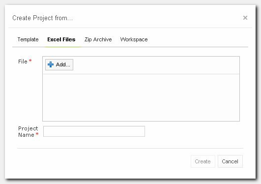

   *Figure 5: Create Project from.. window*

3. **Add** and **Upload** the **TicketsPrice.xls** file.

   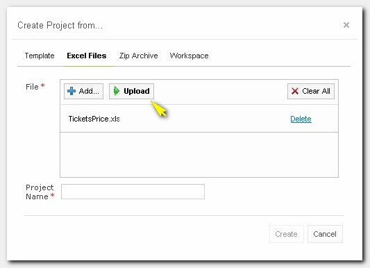

   *Figure 6: Upload Excel file*

4. In the **Project Name** field, enter `Air Ticket Price` and click **Create**.

   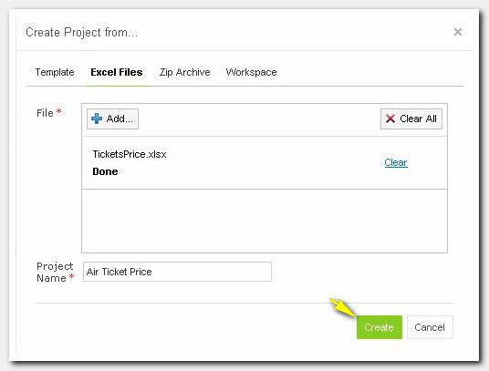

   *Figure 7: Creating project from Excel file*

5. Your new project **Air Ticket Price** appears in the Projects tree with the `Editing` status. This means that you can
   change your project and rules in it in the Rules Editor.

   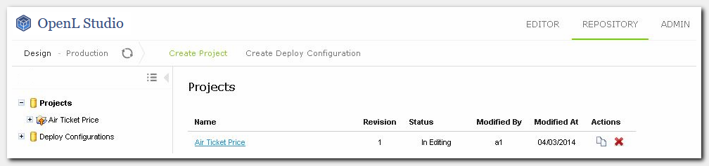

   *Figure 8: Created Air Ticket Price project*

> **Note**: OpenL Studio also allows creating projects with Tutorials and Examples quickly from the **Create Project**
> dialog.

---

## Editing a Rule

1. Switch to the **Rules Editor** using the top-level menu and select the created Decision rule from the tree on the
   left.

   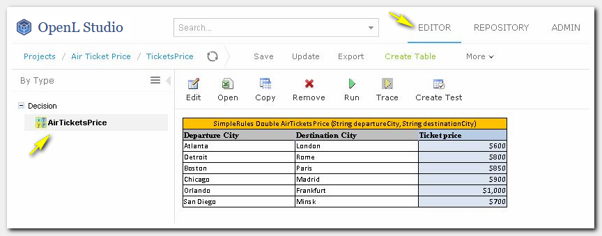

   *Figure 9: Air Tickets Price Decision table in Rules Editor*

   **Rules Editor** allows you to browse rule modules (in other words — Excel files in the project), create and modify
   rules and other rule tables, ad-hoc test rules, and create test tables for them. OpenL Tablets verifies syntax and
   type errors in all tables. Moreover, Rules Editor provides calculation explanation capabilities, enabling expansion
   of any calculation result and viewing the source rule table for that result, so that the user gets full information
   on how the rule result was calculated.

2. Now you can edit the `AirTicketsPrice` rule directly in OpenL Studio.

3. Click the **Edit**  button to edit the Decision Table and update the ticket price for
   Atlanta/London.

   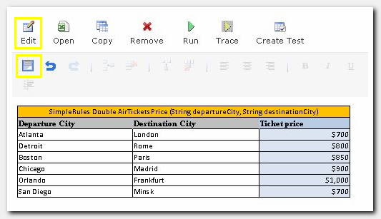

   *Figure 10: Air Tickets Price Decision table update*

4. Save the updated Decision Table.

Alternatively, you can click the **Open** button — the rule file opens in Excel — and apply all required changes there.
Your changes become available in OpenL Studio right upon saving the Excel file.

> **Note**: This is valid only when OpenL Studio runs on your machine. If it does not — use the **Export** and **Update
** buttons to download the file to your machine, edit it in Excel, and then import the updated file back into the
> project.

---

## Testing a Rule

OpenL Studio does not highlight the rule we created in red and the problem pane at the bottom of the page is empty. This
means we have created the rule correctly.

Now let's ensure that the rule logic is correct.

OpenL Studio has an ad hoc rule testing feature. To use it, click the **Run** button on the menu, input values for the
test, and click the **Run** button in the popup.

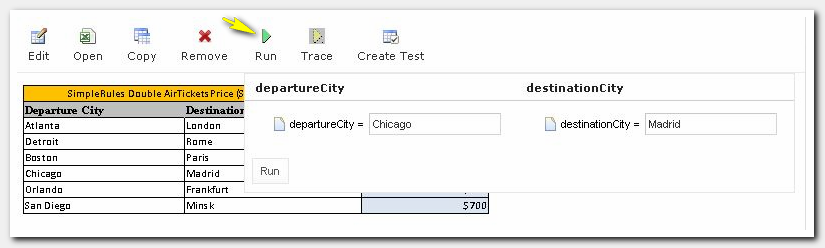

*Figure 11: Running ad hoc test*

The following result will appear:

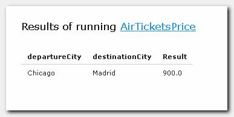

*Figure 12: Results of test run*

The second way to test the rule is to create a test table where you define test cases — their input and expected result
values. A test table calls the rule for each test case and checks whether the actual returned value matches the expected
value or not. Test tables can be created and modified in OpenL Studio or Excel; it is up to you which option to choose.

Let's create a test table for our rule in OpenL Studio.

### 'Air Ticket Price' Test Creation in OpenL Studio

To create a table for testing the `AirTicketsPrice` rule, proceed as follows:

1. Click the **Create Test** button to create a new test while viewing the rule table.

   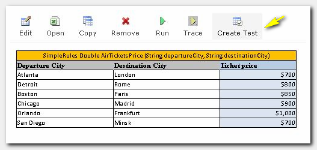

   *Figure 13: Create Test*

2. The Test Name is prefilled automatically with the decision table name and the word `Test` appended at the end. Click
   **Next**.

   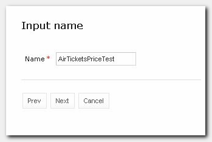

   *Figure 14: Create test window*

3. Click **Save**, accepting the default values for the destination where the test table will be placed.

   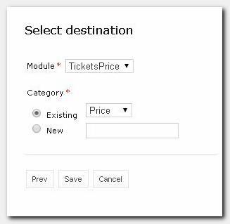

   *Figure 15: Select destination window*

4. The Test Table is created. Now you can edit the table by updating column titles (if needed) and adding test data (as
   with rule tables, this can be done in OpenL Studio or in the Excel file).

   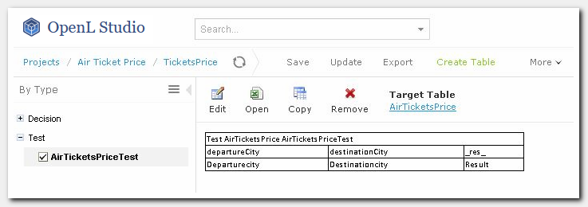

   *Figure 16: Initial Test Table*

### Editing a Test in Excel

1. To edit the test in Excel, click  and update the table in the opened
   Excel file.

   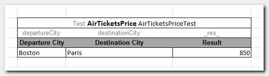

   *Figure 17: Test Table being updated in Excel file*

2. Save the changes made in Excel. Your changes become available in OpenL Studio right upon saving the Excel file.

   > **Note**: If OpenL Studio does not run on your machine, you need to update the file in OpenL Studio — click the *
   *Update** button and upload the updated version of the file.

3. The Test Table is refreshed and the updated data is displayed in OpenL Studio.

   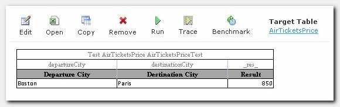

   *Figure 18: Updated Test Table in OpenL Studio*

### Editing a Test in OpenL Studio

1. Click the **Edit**  button to edit the test table in OpenL Studio.

2. Add test data:

   a. Click on any table cell. The table editor menu becomes enabled.

   b. In the table editor menu, select the  button to insert a row before the
   selected one. Insert two rows.

   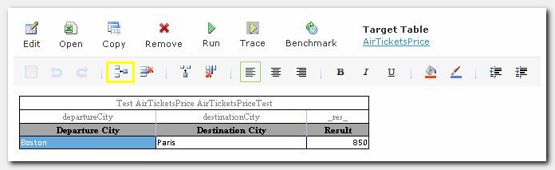

   *Figure 19: Table editor menu*

   c. Add test data and **Save** your changes.

   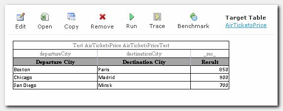

   *Figure 20: Add test data*

### Test Execution

1. Run the test table. To execute all test cases, click the **Run** button.

   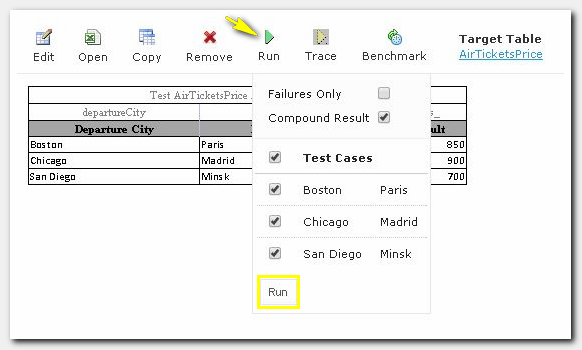

   *Figure 21: Run Test*

2. OpenL Studio will display the test results.

   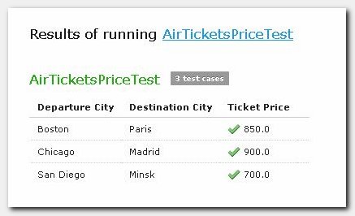

   *Figure 22: Test results window*

Failed test cases are marked by the  icon.

Passed test cases are marked by the  icon.

All test cases passed. Hence, our rule `AirTicketsPrice` works correctly.

---

## Conclusion

Congratulations — your first rule is created, tested, and ready to be used by the consumer application!

You have created the rule that defines the air ticket price value depending on the city of departure and the city of
destination. You have also created a test for your rule to verify the correctness of the rule logic.

We hope that working with OpenL Tablets was interesting and easy for you.
