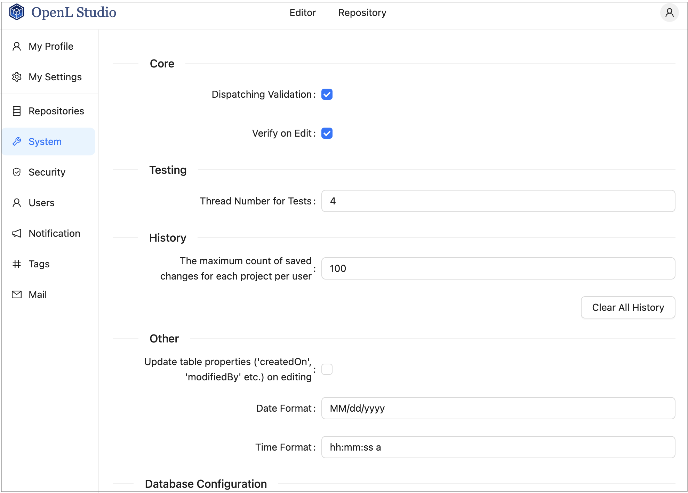
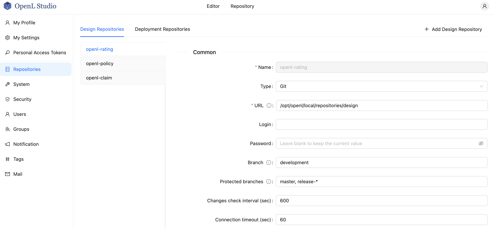
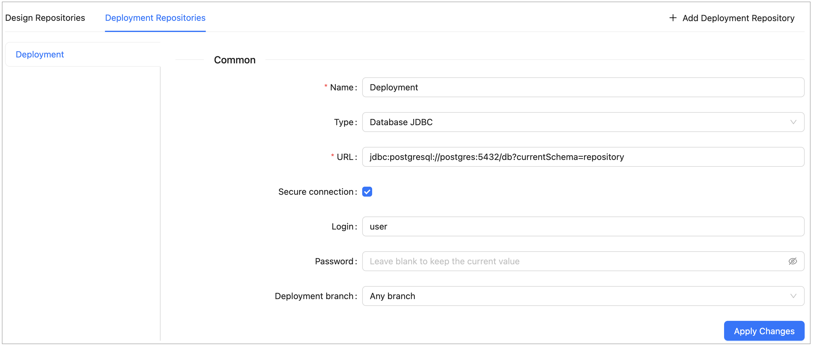
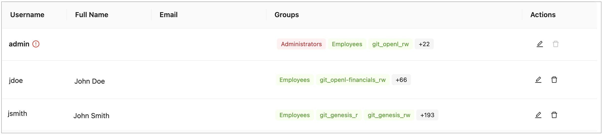

## Using Administration Tools

This section explains how to view and control OpenL Studio system settings and manage user information in the system.

To access administration tools, click the user icon in the top-right corner and select **Administration** from the menu.

The administration area is organized as a left-side navigation menu. The available items depend on the user's permissions: all users can access their personal settings, while administration sections are visible only to users with administration privileges.

*OpenL Studio administration*

Normally, the default settings are recommended, but users with appropriate permissions can change them as required. After making changes in a section, click **Apply** to save and reload the page. To restore all settings to their original values, in the **System** section, click the **Restore Defaults and Restart** button.

The following topics are included:

-   [Managing Repository Settings](#managing-repository-settings)
-   [Managing System Settings](#managing-system-settings)
-   [Managing Security Settings](#managing-security-settings)
-   [Managing User Information](#managing-user-information)
-   [Managing Notifications](#managing-notifications)
-   [Managing Tags](#managing-tags)
-   [Managing Email Server Configuration](#managing-email-server-configuration)
-   [Managing Personal Settings](#managing-personal-settings)

### Managing Repository Settings

The **Repositories** section manages connection settings for design and deployment repositories. In the navigation menu, click **Repositories** to open it.

The page has two tabs at the top:

-   **Design Repositories** — repositories used to store and version project source files.
-   **Deployment Repositories** — repositories used to publish compiled rule packages.

Within each tab, configured repositories are listed as vertical tabs on the left side. Selecting a repository name opens its settings form on the right.

*OpenL Studio repository settings*

This section describes repository settings management and includes the following topics:

- [Managing General Repository Settings](#managing-general-repository-settings)
- [Managing Git Repository Settings](#managing-git-repository-settings)

#### Managing General Repository Settings

To add a repository, proceed as follows:

1.  In the **Repositories** section, click the **Design Repositories** or **Deployment Repositories** tab as needed.
2.  Click the **Add Design Repository** or **Add Deployment Repository** button in the top-right corner.

    A new repository form opens with default Git settings pre-filled.

3.  In the **Name** field, enter the repository name to be displayed in the repository editor.
4.  In the **Type** field, select the connection type.

    | Type                   | Description                                                                                                                                                                                                                                                                                                                                                                                                                                                                                                                                                                                           |
    |------------------------|-------------------------------------------------------------------------------------------------------------------------------------------------------------------------------------------------------------------------------------------------------------------------------------------------------------------------------------------------------------------------------------------------------------------------------------------------------------------------------------------------------------------------------------------------------------------------------------------------------|
    | **Git**                | The repository is located on a local or remote machine. See [Managing Git Repository Settings](#managing-git-repository-settings) for Git-specific parameters.                                                                                                                                                                                                                                                                                                                                                                                                                                        |
    | **Database JDBC**      | The repository is located in a local or remote database accessed via a JDBC URL. Supported databases include MySQL, MariaDB, PostgreSQL, MS SQL, and Oracle.  For more information on supported versions, see <https://openl-tablets.org/supported-platforms>.                                                                                                                                                                                                                                                                                                                                     |
    | **Database JNDI**      | The repository is located in a database accessed via a JNDI data source.                                                                                                                                                                                                                                                                                                                                                                                                                                                                                                                              |
    | **AWS S3**             | The repository is located in Amazon Simple Storage Service (AWS S3).  A “bucket” is a logical unit of storage in AWS S3 and is globally unique.  Choose a region for storage to reduce latency and costs. An Access key and a Secret key are required to access storage.  If left empty, the system retrieves credentials from one of the known locations as described in [AWS Documentation. Best Practices for Managing AWS Access Keys](http://docs.aws.amazon.com/general/latest/gr/aws-access-keys-best-practices.html).  The Listener period is the interval in which to check for repository changes, in seconds. |
    | **Azure Blob Storage** | The repository is located in Microsoft Azure Blob Storage.                                                                                                                                                                                                                                                                                                                                                                                                                                                                                                                                            |

    For more information on repository settings, see [OpenL Tablets Rule Services Usage and Customization Guide > Configuring a Data Source](https://openldocs.readthedocs.io/en/latest/documentation/guides/rule_services_usage_and_customization_guide/#configuring-a-data-source).

5.  Provide the URL value.

    The following table provides examples of JDBC URL values for different databases.

    | Database           | URL value sample                                                                                               |
    |--------------------|----------------------------------------------------------------------------------------------------------------|
    | **MySQL, MariaDB** | jdbc:mysql://localhost:3306/prodRepository, jdbc:mariadb://localhost:3306/ prodRepository (for MariaDB driver) |
    | **PostgreSQL**     | jdbc:postgresql://localhost:5432/ prodRepository                                                               |
    | **MS SQL**         | jdbc:sqlserver://localhost:1433;databaseName=prodRepository;integratedSecurity=false                           |
    | **Oracle**         | jdbc:oracle:thin:@localhost:1521:prodRepository                                                                |

6.  For **Database JDBC** and **Database JNDI** types, to set up a secure connection, select the **Secure connection** check box and fill in the **Login** and **Password** fields.

    For more information on repository security, see [OpenL Tablets Installation Guide > Configuring Private Key for Repository Security](https://openldocs.readthedocs.io/en/latest/documentation/guides/installation_guide/#configuring-private-key-for-repository-security).

    

    *Configuring deployment repository settings*

    Connection to a local deployment repository is configured by default.

7.  For **Deployment Repositories**, select the **Deployment branch** option:

    | Option               | Description                                                       |
    |----------------------|-------------------------------------------------------------------|
    | **Any branch**       | Projects can be deployed to any branch.                           |
    | **Main branch only** | Projects can only be deployed to the repository's default branch. |

8.  When finished, click **Apply Changes** to save the settings.

To delete a repository, click the **×** button on the repository's tab and confirm the deletion.

To enable storing large files in a Git repository, Git Large File Support (LFS) can be used.

-   To enable the Git repository use LFS before it is cloned by OpenL Studio, perform the necessary configuration as described in <https://git-lfs.github.com/>.
-   If the Git repository is already cloned by OpenL Studio, to enable using Git LFS, proceed as follows:
    1.  Close all projects in the workspace.
    2.  Delete all deployment configuration settings.
    3.  Stop OpenL Studio.
    4.  Drop the local folder with the Git repository to the OpenL Studio home directory.
    5.  Start OpenL Studio.
    OpenL Studio will re-clone the directory.
    6.  Recreate the required deployment configuration settings that were deleted previously.

#### Managing Git Repository Settings

**Git** is a free and open source distributed version control system designed to handle everything from small to very
large projects with speed and efficiency. For more information on Git, see <https://git-scm.com/>.

A **Git repository** is the `.git/` folder inside a project. This repository tracks all changes made to files in the
project, building a history over time.

This section describes how to set up a connection to a Git repository, configure Git functionality, and resolve
conflicts when modifying the same version of the project.

##### Setting Up a Connection to a Git Repository

When **Git** is selected as the repository type, define values for the following connection properties:

| Parameter                          | Description                                                                                                                                                                                                  |
|------------------------------------|--------------------------------------------------------------------------------------------------------------------------------------------------------------------------------------------------------------|
| **URL**                            | URL for the remotely located Git repository or file path to the repository stored locally. If a valid Git URL is provided, the repository is treated as **remote**; if a local path is provided, it is treated as **local**. |
| **Login**                          | Username for accessing a remote Git repository. Ignored for local repositories.                                                                                                                              |
| **Password**                       | Password for accessing a remote Git repository. Ignored for local repositories.                                                                                                                              |
| **Branch**                         | Project branch that is used by default.                                                                                                                                                                      |
| **Protected branches**             | Branches that can be set as protected from any modifications. For more information on protected branches, see [Using Protected Branches](#using-protected-branches).                                          |
| **Changes check interval**         | Repository changes check interval in seconds. The value must be greater than 0. Ignored for local repositories.                                                                                              |
| **Connection timeout**             | Repository connection timeout in seconds. The value must be greater than 0. Ignored for local repositories.                                                                                                  |

The following additional parameters are available for **Design Repositories** only, in the **New Branch** section:

| Parameter                            | Description                                                                                               |
|--------------------------------------|-----------------------------------------------------------------------------------------------------------|
| **Default branch name**              | Pattern for a default branch name. The default value is `OpenL Studio/{project-name}/{username}/{current-date}`. |
| **Branch name pattern**              | Additional regular expression used to validate new branch names.                                          |
| **Invalid branch name message hint** | Error message displayed when a branch name does not match the additional regular expression.              |

The location where remote repositories are cloned is controlled by the following property:

| Property                           | Default value              | Description                                                   |
|------------------------------------|----------------------------|---------------------------------------------------------------|
| repo-git.local-repositories-folder | ${openl.home}/repositories | Directory where cloned remote repositories are stored locally |

If the password is changed on the server side, by default, OpenL Studio makes three attempts to log into the remote Git
server, and then the **Problem communicating with "Design" Git server, will retry automatically in 5 minutes.** error is
displayed. After that, OpenL Studio stops login attempts to prevent a user account from blocking, and the **Problem
communicating with 'Design' Git server, please contact admin.** error is displayed. Define the following properties in
the properties file to configure this behavior:

| Property                               | Description                                                                                                                                                                                                                                                                                                                   |
|----------------------------------------|-------------------------------------------------------------------------------------------------------------------------------------------------------------------------------------------------------------------------------------------------------------------------------------------------------------------------------|
| repo-git.failed-authentication-seconds | Time to wait after a failed authentication attempt before the next attempt.  It is used to prevent a user account from blocking. The default value is 300 seconds.                                                                                                                                                        |
| repo-git.max-authentication-attempts   | Maximum number of authentication attempts.  After that, a user can be authorized only after resetting the settings or restarting OpenL Studio.  No value means unlimited number of attempts.  If the value is set to 1, after the first unsuccessful authentication attempt, all subsequent attempts are blocked. |

##### Customizing Git Commit Comments

For **Design Repositories**, a **Comments** section allows configuring the format of Git commit messages.

To enable custom commit messages, select the **Customize comments** check box. The following fields become available:

| Field                         | Description                                                                                                                                                                                                                                                                                                                                                                                                           |
|-------------------------------|-----------------------------------------------------------------------------------------------------------------------------------------------------------------------------------------------------------------------------------------------------------------------------------------------------------------------------------------------------------------------------------------------------------------------|
| **Message template**          | Template for all Git commit messages. Supports the following placeholders:  **{user-message}** — the user-defined commit message, also shown in OpenL Studio history.  **{commit-type}** — identifies the type of operation.  **{project-name}** — replaced by the current project name.  **{revision}** — replaced by the project revision.  Default format: `{user-message} Type: {commit-type}` |
| **User message pattern**      | Optional regular expression for validating user-entered commit messages.                                                                                                                                                                                                                                                                                                                                              |
| **Invalid user message hint** | Error message displayed when the user message does not match the validation pattern.                                                                                                                                                                                                                                                                                                                                  |

The following user message templates can be customized for individual operations.

For the **Restore from old version** template, the following additional placeholders are available:

-   **{revision}** is replaced by the old revision number.
-   **{author}** is replaced by the author of the old project version.
-   **{datetime}** is replaced by the date of the old project version.

| Template                     | Operation                                       |
|------------------------------|-------------------------------------------------|
| **Save project**             | Committing changes to an existing project.      |
| **Create project**           | Creating a new project.                         |
| **Archive project**          | Archiving a project.                            |
| **Restore project**          | Restoring an archived project.                  |
| **Erase project**            | Permanently deleting a project.                 |
| **Copy project**             | Copying a project.                              |
| **Restore from old version** | Restoring a project to a previous revision.     |

### Managing System Settings

The **System** section enables modifying core, testing, history, and general OpenL Studio settings. In the navigation menu, click **System** to open it.

After making changes, click **Apply** to save.

| Section                    | Property                                                    | Description                                                                                                                                                                                                                                                                                                                                                                                                                                                                                        |
|----------------------------|-------------------------------------------------------------|----------------------------------------------------------------------------------------------------------------------------------------------------------------------------------------------------------------------------------------------------------------------------------------------------------------------------------------------------------------------------------------------------------------------------------------------------------------------------------------------------|
| **Core**                   | **Dispatching Validation**                                  | Turns on or off the dispatching mechanism for a rule table where only one version of the rule table exists.  By default, this option is enabled.  For more information on dispatching validation, see [OpenL Tablets Rule Services Usage and Customization Guide > Table Dispatching Validation Mode](https://openldocs.readthedocs.io/en/latest/documentation/guides/rule_services_usage_and_customization_guide/#table-dispatching-validation-mode). |
|                            | **Verify on Edit**                                          | Turns on or off automatic checking of rules consistency and validity on each edit in Rules Editor.  By default, this option is enabled. Automatic checks are executed after each edit.  If this option is cleared, the verification process does not launch automatically when the **Save** button is clicked.  Instead, a **Verify** button appears in Rules Editor, and the user must verify manually by clicking this button.                                                          |
| **Testing**                | **Thread Number for Tests**                                 | Indicates the number of test cases executed simultaneously. By default, four threads are set.  It means that after running a test table or all tests, up to four test cases will be in progress at the same time.  When they are calculated, the next four test cases will be executed.                                                                                                                                                                                                     |
| **History**                | **Maximum count of saved changes per user**                 | Maximum number of history records kept per project per user. By default, set to 100. If no value is provided, the number of records is unlimited.                                                                                                                                                                                                                                                                                                                                                  |
| **Other**                  | **Update table properties**                                 | Indicates whether table properties controlled by the system must be updated and can be viewed in OpenL Studio UI.  If this option is cleared, information about the time of table creation and modification and changes authors, such as **Created By/On**, **Modified By/On**,  is not added to the table properties.                                                                                                                                                                      |
|                            | **Date Format**                                             | Enables changing the date format in the OpenL Studio UI.                                                                                                                                                                                                                                                                                                                                                                                                                                           |
|                            | **Time Format**                                             | Enables changing the time format in the OpenL Studio UI.                                                                                                                                                                                                                                                                                                                                                                                                                                           |
| **Database Configuration** | **Database URL**                                            | JDBC URL of the database used to store OpenL Studio user data. Contact your System Administrator for this information if necessary.                                                                                                                                                                                                                                                                                                                                                                |
|                            | **Login**                                                   | Database user login.                                                                                                                                                                                                                                                                                                                                                                                                                                                                               |
|                            | **Password**                                                | Database user password. Leave blank to keep the current value.                                                                                                                                                                                                                                                                                                                                                                                                                                     |
|                            | **Maximum Pool Size**                                       | Maximum number of database connections in the connection pool.                                                                                                                                                                                                                                                                                                                                                                                                                                     |

To clear all history files for all projects, click the **Clear All History** button and confirm deletion.

> **WARNING!** To restore all settings to their default values, in the **Reset Settings** group, click **Restore Defaults and Restart**. All user defined values, such as repository settings, will be lost. Use this button only if you understand the consequences.

### Managing Security Settings

The **Security** section contains settings for user authentication and access control. In the navigation menu, click **Security** to open it.

To configure security, select the authentication mode, fill in the required settings, and click **Apply**.

This section includes the following topics:

-   [Selecting an Authentication Mode](#selecting-an-authentication-mode)
-   [Configuring Single-User Mode](#configuring-single-user-mode)
-   [Configuring Multi-User Mode](#configuring-multi-user-mode)
-   [Configuring Active Directory / LDAP Mode](#configuring-active-directory--ldap-mode)
-   [Configuring SSO: SAML Mode](#configuring-sso-saml-mode)
-   [Configuring SSO: OAuth2 Mode](#configuring-sso-oauth2-mode)
-   [Configuring Initial Users](#configuring-initial-users)

#### Selecting an Authentication Mode

OpenL Studio supports the following authentication modes:

| Mode                        | Description                                                                                                                                     |
|-----------------------------|-------------------------------------------------------------------------------------------------------------------------------------------------|
| **Single-User**             | Only one user can run OpenL Studio. No login is required. Suitable for development and local evaluation only.                                   |
| **Multi-User**              | Multiple users can run OpenL Studio using unique usernames. User credentials are managed directly in OpenL Studio. Suitable for teams without an external identity provider. |
| **Active Directory / LDAP** | Multiple users authenticate against a corporate Active Directory or LDAP server. User credentials are managed by the directory service. External users are created and synchronized from the directory at login. |
| **SSO: SAML**               | Single Sign-On using the SAML 2.0 protocol. Works with identity providers such as Okta, Azure AD, and similar services.                         |
| **SSO: OAuth2**             | Single Sign-On using the OAuth2 / OpenID Connect protocol. Supports providers such as Google, GitHub, and others.                               |

**Note:** CAS authentication is no longer supported starting with OpenL Tablets 6.0.

#### Configuring Single-User Mode

When **Single-User** is selected, configure the single user account that will be used to run OpenL Studio:

| Field            | Description                                           |
|------------------|-------------------------------------------------------|
| **Username**     | Login name used to identify the single user in OpenL Studio. |
| **Email**        | Email address of the user. Used for Git commits and email verification. |
| **First Name**   | User's first name. Used to form the display name and included in Git commit metadata. |
| **Last Name**    | User's last name. Used to form the display name and included in Git commit metadata. |
| **Display Name** | Full name shown in the OpenL Studio UI and recorded in Git commits. |

#### Configuring Multi-User Mode

When **Multi-User** is selected, no additional configuration parameters are required in this section. User accounts are created and managed in the **Users** tab of the administration panel as described in [Managing Users](#managing-users).

Proceed to [Configuring Initial Users](#configuring-initial-users) to set up the administrator account and the default group.

#### Configuring Active Directory / LDAP Mode

When **Active Directory / LDAP** is selected, configure the connection to the directory service:

| Field           | Description                                                                                                                                                                                                     |
|-----------------|-----------------------------------------------------------------------------------------------------------------------------------------------------------------------------------------------------------------|
| **Domain**      | The Active Directory domain name used for user authentication, for example, `example.com`. Appended to the username to form the `login@domain` format passed to the directory service.               |
| **Server URL**  | URL of the Active Directory or LDAP server, for example, `ldap://ad.example.com:389`.                                                                                                                |
| **User Filter** | LDAP filter string used to search for the authenticating user.  `{0}` is replaced with `login@domain`.  `{1}` is replaced with `login` only.                                                  |
| **Group Filter** | LDAP filter string used to search for the groups the user belongs to.  `{0}` is replaced with `login@domain`.  `{1}` is replaced with `login` only.  `{2}` is replaced with the DN of the found user. |

Proceed to [Configuring Initial Users](#configuring-initial-users) to set up the administrator account and the default group.

#### Configuring SSO: SAML Mode

When **SSO: SAML** is selected, configure the connection to the SAML identity provider:

| Field                          | Description                                                                                          |
|--------------------------------|------------------------------------------------------------------------------------------------------|
| **Entity ID**                  | A globally unique identifier that represents OpenL Studio as a SAML service provider. This value must be registered with the identity provider.  |
| **Server Metadata URL**        | URL to the identity provider's SAML metadata document, used to automatically configure the trust relationship between OpenL Studio and the identity provider. |
| **Remote Server Certificate**  | The identity provider's public X.509 certificate, used to verify the signature of SAML responses. Required when the metadata URL is not publicly accessible or does not include the certificate. |
| **Attribute for Username**     | Name of the SAML attribute that contains the username.                                     |
| **Attribute for First Name**   | Name of the SAML attribute that contains the user's first name.                            |
| **Attribute for Last Name**    | Name of the SAML attribute that contains the user's last name.                             |
| **Attribute for Display Name** | Name of the SAML attribute that contains the display name.                                 |
| **Attribute for Email**        | Name of the SAML attribute that contains the user's email address.                         |
| **Attribute for Groups**       | Name of the SAML attribute that contains the user's group memberships.                     |

Proceed to [Configuring Initial Users](#configuring-initial-users) to set up the administrator account and the default group.

#### Configuring SSO: OAuth2 Mode

When **SSO: OAuth2** is selected, configure the connection to the OAuth2 / OpenID Connect identity provider:

| Field                          | Description                                                                                          |
|--------------------------------|------------------------------------------------------------------------------------------------------|
| **Client ID**                  | A public identifier for OpenL Studio as a registered application in the identity provider. Obtained when registering the application with the identity provider. |
| **Issuer URI**                 | The base URL of the identity provider's OpenID Connect discovery endpoint, for example, `https://accounts.google.com`. Used to automatically retrieve provider configuration. |
| **Client Secret**              | A confidential credential issued by the identity provider to authenticate OpenL Studio as a registered application. Must be kept secure and never shared publicly. |
| **Scope**                      | Space-separated list of OAuth2 scopes that define what user information OpenL Studio requests from the identity provider, for example, `openid profile email`. |
| **Attribute for Username**     | Name of the token claim that contains the username.                                        |
| **Attribute for First Name**   | Name of the token claim that contains the user's first name.                               |
| **Attribute for Last Name**    | Name of the token claim that contains the user's last name.                                |
| **Attribute for Display Name** | Name of the token claim that contains the display name.                                    |
| **Attribute for Email**        | Name of the token claim that contains the user's email address.                            |
| **Attribute for Groups**       | Name of the token claim that contains the user's group memberships.                        |

Proceed to [Configuring Initial Users](#configuring-initial-users) to set up the administrator account and the default group.

#### Configuring Initial Users

The **Initial Users** section is displayed for all modes except **Single-User**. It defines the administrator account and the default group applied to all users.

| Field              | Description                                                                                                                                                                                             |
|--------------------|---------------------------------------------------------------------------------------------------------------------------------------------------------------------------------------------------------|
| **Administrators** | Comma-separated list of usernames that are granted administrator privileges in OpenL Studio. These users always have administrator access, which cannot be revoked from the administration UI. |
| **Default Group**  | Group automatically assigned to every user in the system, including users with no explicit group assignments. Select **None** to disable automatic default access.                                       |

The Default Group acts as a permission baseline automatically applied to every user, including users with no explicit group or role assignments. All users inherit its permissions regardless of their individual access configuration.

To configure the Default Group, proceed as follows:

1.  In the navigation menu, click **Security** and scroll down to the **Initial Users** section.
2.  In the **Default Group** field, select a group from the list, or select **None** to disable automatic default access for all users.
3.  Click **Apply** to apply the changes.

*Default Group configuration in the* **Security** *tab*

**Note:** The Default Group setting is not available in Single-User mode.

The **Permit creating and deleting projects** check box controls whether users are allowed to create and delete projects in OpenL Studio. When this option is disabled, users cannot create or delete projects regardless of their assigned role. For more information on roles, see [Understanding Roles](#understanding-roles).

### Managing User Information

This section describes how to control user access in the OpenL Studio application. Access is controlled using a
role-based Access Control List (ACL). Roles are assigned to users or groups on specific resources, such as repositories
or individual projects.

Users and groups are managed in the **Groups** and **Users** tabs of the **Administration** panel. Only members of the **Administrators** group have rights to manage users and groups in OpenL Studio.

**Note:** **Groups** and **Users** tabs are not shown in Single-User mode.

The following topics are included in this section:

- [Managing Groups](#managing-groups)
- [Managing Users](#managing-users)

#### Managing Groups

The **Groups** tab is available only in OpenL Studio environments integrated with an external user management system,
such as Active Directory, LDAP, or an SSO provider. In environments without external user management, the **Groups** tab
is hidden and user access is managed directly on each user in the **Users** tab.

Groups registered in OpenL Studio are matched to groups from the external directory. Each group can be granted access to
one or more resources with a specific role.

The following topics are included in this section:

- [Understanding Roles](#understanding-roles)
- [Understanding the Default Group](#understanding-the-default-group)
- [Viewing a List of Groups](#viewing-a-list-of-groups)
- [Inviting a Group](#inviting-a-group)
- [Editing a Group](#editing-a-group)
- [Deleting a Group](#deleting-a-group)

##### Understanding Roles

Instead of selecting individual privileges, access in OpenL Studio is controlled by assigning a **role** to a **resource
**. A resource is either a repository or an individual project within a repository.

The following roles are available:

| Role            | Description                                                                                                                                     | View | Create | Edit | Delete | Manage |
|-----------------|-------------------------------------------------------------------------------------------------------------------------------------------------|:----:|:------:|:----:|:------:|:------:|
| **Viewer**      | Read-only access to the resource. Users can view content, open projects, and run and trace test tables, but cannot make any changes.            |  ✓   |        |      |        |        |
| **Contributor** | Full read and write access to the resource. Users can create, edit, and delete content within the resource, but cannot manage user permissions. |  ✓   |   ✓    |  ✓   |   ✓    |        |
| **Manager**     | Full access including the ability to assign roles to other users and groups on the resources they manage.                                       |  ✓   |   ✓    |  ✓   |   ✓    |   ✓    |

Where the individual permissions that make up each role:

- **View** — Allows viewing and reading the content of the resource, and performing actions that do not alter it.
- **Edit** — Allows modifying and saving changes to the existing content of the resource. This includes updating,
  correcting, and formatting content, but does not permit creating new resources or deleting existing ones.
- **Create** — Allows adding a new **lower-level** resource within the resource. For example, when granted on a
  repository, this permission allows creating new projects in that repository, but does not affect the repository
  itself.
- **Delete** — Allows removing a **lower-level** resource from within the resource. The resource is completely removed
  from the system without archiving. For example, when granted on a repository, this permission allows deleting projects
  from that repository, but does not affect the repository itself.
- **Manage** — Allows assigning roles to users and groups on the resources the user manages.

**Note:** The **Create** and **Delete** permissions are only effective when the **Permit creating and deleting projects** option is enabled in the **Security** tab. When this option is disabled, users cannot create or delete projects
regardless of their assigned role.

**Note:** The **Administrator** designation is separate from the above ACL roles and grants system-wide administrative
access, including the ability to manage users, groups, and global configuration.

**Deploying a project** requires access to two repositories simultaneously: the user must have at least **Viewer**
access on the design repository where the source project resides, and at least **Contributor** access on the target
deployment repository. A Viewer role on the deployment repository alone is not sufficient to perform a deployment.

###### Role Inheritance and Conflict Resolution

Roles can be assigned at two levels: the **repository** level and the **project** level. When a role is assigned at the
repository level, it applies to all projects within that repository unless a more specific project-level role is also
configured.

The following rules apply when resolving a user's effective access:

- **Project-level role takes precedence over repository-level role.** When a role is explicitly assigned on a project,
  that role determines the user's access to that project, regardless of what role the user has on the parent repository.

- **Repository-level role is inherited when no project-level role is set.** If no explicit ACL entry exists for a
  project, the user's access falls back to the role assigned at the repository level.

- **When a user belongs to multiple groups, the most permissive role applies.** If a user is a member of two groups and
  one group has Viewer access and the other has Contributor access on the same resource, the user effectively has
  Contributor access.

**Examples:**

| Repository Role | Project Role | Effective Access on the Project                                           |
|-----------------|--------------|---------------------------------------------------------------------------|
| Viewer          | Contributor  | **Contributor** — the explicit project role overrides the repository role |
| Contributor     | Viewer       | **Viewer** — the explicit project role overrides the repository role      |
| Contributor     | *(none)*     | **Contributor** — the repository role is inherited                        |
| *(none)*        | Viewer       | **Viewer** — only the project-level role applies                          |

##### Understanding the Default Group

At the top of both the **Groups** and **Users** tabs, OpenL Studio displays the currently configured **Default Group**
along with an info tooltip.

The Default Group is automatically applied to every user in the system, including users who have not been assigned to
any other group. This means that if the Default Group has access to a resource, all users effectively inherit that
access regardless of their individual group assignments.

To change the Default Group, go to **Security → Default Group** in the administration settings as described
in [Configuring Default Group](#configuring-default-group).

##### Viewing a List of Groups

To view the list of groups, proceed as follows:

1. In the **Administration** panel, select the **Groups** tab.

   The system displays a list of invited groups, including their names, descriptions, and number of members:

   

   *Groups list in the* **Groups** *tab*

2. To invite a new group, proceed as described in [Inviting a Group](#inviting-a-group).
3. To edit a group, proceed as described in [Editing a Group](#editing-a-group).
4. To delete a group, proceed as described in [Deleting a Group](#deleting-a-group).

##### Inviting a Group

Inviting a group registers an external directory group in OpenL Studio and assigns it a role on one or more resources.

To invite a group, proceed as follows:

1. Click the **Invite Group** button.

   The **Invite Group** dialog appears.

   

   *Invite Group dialog*

2. In the **Name** field, type the group name. As you type, a list of matching groups from the connected directory
   service is displayed. Select an existing group from the list.

3. Optionally, provide a description in the **Description** field.

4. To designate this group as OpenL Studio Administrators, select the **Admin** check box.

   When this option is selected, the access management fields are disabled because administrator groups have system-wide
   access and do not require resource-level role assignments.

5. In the **Access Rights** section, configure the group's access to repositories and projects:

   | Field        | Description                                                                                                                                |
   |--------------|--------------------------------------------------------------------------------------------------------------------------------------------|
   | **Resource** | The repository or project to which access is granted. Select from the available repositories and projects listed in the system. |
   | **Role**     | The role to assign for the selected resource: **Viewer**, **Contributor**, or **Manager**.                                      |

   

   *Access Management section of the Invite Group dialog*

   To grant access to multiple resources, add a new row for each resource. The same resource cannot be assigned more
   than one role.

6. Click **Save** to complete.

##### Editing a Group

To modify a group, proceed as follows:

1. In the group list, locate the group to be changed and click the **Edit** icon.
2. In the edit form, change the group name, description, administrator designation, or resource access assignments as
   needed.
3. Click **Save** to complete.

##### Deleting a Group

To delete a group, proceed as follows:

1. In the group list, locate the group to be deleted and click the **Delete** icon.
2. Click **OK** in the confirmation dialog.

#### Managing Users

In OpenL Studio, access to repositories and projects is controlled through role-based ACL assignments. In environments
without external user management, access is managed directly per user in the **Users** tab. In environments integrated
with an external user management system, access can additionally be managed at the group level through the **Groups**
tab.

**Note:** Demo mode includes a set of pre-configured users with sample access rights for evaluation purposes. These
users are not intended for production use.

The initial administrator account is configured through the `security.administrators` property in the application
configuration. The administrator can then create and manage additional users through the **Administration** panel.

The following topics are included in this section:

- [Viewing a List of Users](#viewing-a-list-of-users)
- [Creating a User](#creating-a-user)
- [Editing a User](#editing-a-user)
- [Deleting a User](#deleting-a-user)
- [Managing Users in Case of Third Party Identity Provider](#managing-users-in-case-of-third-party-identity-provider)

##### Viewing a List of Users

To view a list of users, proceed as follows:

1. In the **Administration** panel, select the **Users** tab.

   The system displays a list of OpenL Studio users.

   

   *Users list in the* **Users** *tab*

   In environments integrated with an external user management system, the **Groups** column displays each user's group
   memberships as color-coded tags:

    - **Green** — an external identity provider group that matches a group registered in OpenL Studio. Permissions
      assigned to that group in OpenL Studio are applied to the user.
    - **Red** — an administrator group.
    - **Blue** — the configured Default Group.
    - **Gray** — an external identity provider group that does not match any group registered in OpenL Studio. Unmatched
      groups are shown individually or collapsed into a **+N** badge indicating the count of unmatched groups. Clicking
      the badge expands the full list.

   

   *Users list showing color-coded group membership*

2. In the **Users** tab, perform either of the following:

- To create a user, proceed as described in [Creating a User](#creating-a-user).
- To edit a user, proceed as described in [Editing a User](#editing-a-user).
- To delete a user from the system, proceed as described in [Deleting a User](#deleting-a-user).

##### Creating a User

To create a new user, proceed as follows:

1. On the **Users** tab, click **Add User**.

   The system displays the **Add User** form.

   

   *Creating a user*

2. In the **Username** field, specify the user login name.
3. Optionally, enter the user email.

   The email value is mandatory for committing to the Git repository.

4. In the **Password** field, enter a password.

   This field is unavailable for external users.

5. Optionally, enter the user’s first and last name.

   The display name is mandatory for committing to the Git repository.

6. To change the display name pattern, in the appropriate field, select either **First Last** or **Last First**.

   If the **Custom** option is selected, the field becomes editable and any display name can be entered.

7. In the **Access Rights** section, configure the user’s access to repositories and projects:

   | Field        | Description                                                                                                           |
   |--------------|-----------------------------------------------------------------------------------------------------------------------|
   | **Resource** | The repository or project to which access is granted. Select from the available repositories and projects. Mandatory. |
   | **Role**     | The role to assign for the selected resource: **Viewer**, **Contributor**, or **Manager**. Mandatory.                 |

   To grant access to multiple resources, add a new row for each resource. The same resource cannot be assigned more
   than one role.

   For a description of available roles and their permissions, see [Understanding Roles](#understanding-roles).

8. Click **Save** to complete.

The system displays the new user in the **Users** list. If the username and password values are the same, an exclamation
mark is displayed next to the username. A user can change the password to improve security.

*User list with a password security warning*

##### Editing a User

To edit a user, proceed as follows:

1. In the **Users** list, locate the user to be modified and click the username.
2. In the **Edit User** form, modify user data or access management settings as required.

   The username and the administrator accounts defined in the `security.administrators` property cannot be changed.
   For external users synchronized with Active Directory or an SSO provider, only fields not provided by the external
   system are editable.

3. Click **Save** to save the changes.

##### Deleting a User

The **Administrators** group in OpenL Studio must contain at least one administrator. The only remaining administrator
cannot be deleted.

Initial users created during OpenL Studio installation and the currently logged in user cannot be deleted.

To delete a user, proceed as follows:

1. In the **Users** list, locate the user for deletion and click the **Delete** icon.
2. Click **OK** in the confirmation dialog.

##### Managing Users in Case of Third Party Identity Provider

There are some differences in managing users when OpenL Studio is configured to authenticate against a third party
identity provider, such as an SSO provider or Active Directory.

A user is created in OpenL Studio automatically upon the user’s first login using credentials from the identity
provider. Users cannot be added manually. User information such as first name, last name, display name, and email
address is retrieved from the identity provider and saved to OpenL Studio with those fields locked for editing. If some
information is not available from the identity provider, the corresponding fields are editable in OpenL Studio. An
exception applies to SSO with external user management, where user data cannot be edited in **Admin \> Users** and only
partial data can be edited in the user profile section.

On each login, OpenL Studio synchronizes user information with the identity provider and updates any fields that have
changed.

When the first or last name has changed:

- If the display name was set to “first name + space + last name”, it is updated to reflect the new values.
- If the display name was set to “last name + space + first name”, it is updated to reflect the new values.
- If the display name is set to **Custom** and is non-empty in OpenL Studio but is empty in the identity provider, the
  local value is preserved upon synchronization.

In integrated environments, the **Edit User** form shows read-only account and personal information synchronized from
the identity provider. The form also displays the following:

- **Access Rights**: Administrators can add direct resource-level role assignments on top of the inherited group
  permissions.

Permissions can be managed at the group level by inviting a group with the same name as defined in the identity provider
and assigning it the required roles. Group membership is automatically resolved from the identity provider at login and
does not require manual maintenance in OpenL Studio. Additional resource-level role assignments can also be applied
directly on a user.

### Managing Notifications

In the **ADMIN \> Notification** section, users with the administrator privileges can send text messages to all OpenL
Studio instances and users that are currently online or remove previously sent notifications.

When a notification is sent by clicking **Post**, a red bar with notification text appears for all users and OpenL
Studio instances. To remove the message for all users and OpenL Studio instances, click **Remove**.

*Red bar identifying a notification sent to all active users and instances*

### Managing Tags

In OpenL Tablets, tags can be assigned to a project. A **tag type** is a category holding tag values of the same group.
An example is the **Product** tag that includes tags **Auto**, **Life**, and **Home**.

**Note:** Starting with OpenL Tablets 6.0, project tags are stored inside the project structure rather than in a
separate configuration. As a result, tag changes are version-controlled and visible in the project's Git history.

If a tag type is defined as optional, its value definition can be skipped when creating a project. Otherwise, tag
definition is mandatory.

For extensible tag types, any user can create new tag values. For other tag types, values are configured by an
administrator only.

To create project tags, proceed as follows:

1.  In the **ADMIN** tab, click **Tags** on the left.

    

    *Selecting tags*

2.  To add a tag type, in the **New Tag Type** field, enter the tag type name and press **Enter** or Tab.

    When at least one tag type is added, a field for adding tag values appears.

    

    *Adding tag values*

3.  To edit a tag type, click the tag type name field and make the necessary changes.
4.  To delete a tag type, click the red cross icon for the appropriate tag.
5.  To add a tag value, in the **New Tag** field, enter the tag name and press **Enter.**
6.  To edit a tag, click the menu icon , select **Edit,** modify the tag, and press **Enter
    ** or click outside the field.
7.  To delete a tag, click the menu icon  and select **Delete.**

    All created tag types and values are saved automatically. These values are now available for selection when assigning
    tags to projects as described in [Creating Projects in Design Repository](#creating-projects-in-design-repository).

    Tag values can be derived from project names. Proceed as follows:

8.  To define project name templates to be used for deriving tags, in the **Tags from a Project Name** section, enter the
    template value.
9.  To save project name templates, click **Save Templates** or simply click outside the field.
10. To assign tags according to these project name templates to the projects that do not have tags defined yet, click
    **Fill tags for projects.**

The **Projects without tags** window appears. It contains all projects that have **None** selected for one or multiple
tag types, or do not have tags defined at all, and which name matches the project name template.

Please note that only projects currently opened by the user can be modified. If a project exists in the repository but
is not opened for the current user, it will appear in the pop-up but will be grayed out and cannot be selected.

*Applying tags for projects matching project name templates.*

In this window, tags are marked with colors as follows:

- **White** — A tag exists in the list of tags and will be assigned to a project.
- **Green** — A tag does not exist in the list of tags, but the tag type is defined as extensible, so the tag will be
  created and assigned to the project.
- **Red** — A tag does not exist in the list of tags, and the tag type is not defined as extensible, so the tag will not
  be created, neither it will be assigned to the project. The tag for a project will remain **None.**
- **Grey** — A tag is already assigned to the project. The project still appears on the list because it has other tag
  types with the **None** values. If the tag is already assigned, but a different tag value is derived from the project
  name according to the template, the existing value will be replaced with the derived value. The replacement is
  identified with the arrow. The derived value can be created if the tag type is extensible. In this case, a new value
  will be marked green. If the derived tag value does not exist and the tag type is not extensible, no replacement
  happens, and the old value appears in grey with no arrow.

This logic is explained in the tooltips for each tag color type.

Note that if project tags are successfully modified, the project status changes to **In Editing**, unless it is already
in this status. Because tags are stored within the project, they must be saved (committed) before the changes become
visible to other users. The tag changes are then included in the project's version history.

### Managing Email Server Configuration

OpenL Studio supports sending emails for mailbox verification.

To manage email server configuration, proceed as follows:

1. In the **ADMIN** tab, click **Mail** on the left.
2. Ensure that the **Enable email address verification** check box is selected.
3. Specify the sender’s URL, username, and password for dispatching verification emails through this email server.
4. Click **Apply All and Restart.**

   When a sender is defined for the specific server, it can be used to send emails for verification of the non-verified
   mailboxes manually defined by a user.

   

   *Defining verification emails sender*

   If the user email is not verified, a red exclamation mark is displayed next to this user email in the user list.

   

   *A user with unverified email*

5. If the verification email is not received for some reason, to resend it, in the **Users** tab, open the user record
   and click **Resend**.

*Resending a verification email*

A user can resend the verification email on his or her own by clicking the username in the top right corner, selecting
**User Details**, and clicking **Resend**.

*A user initiating verification email resending*

The verification email resembles the following:

*Verification email example*

### Managing Personal Settings

