## Using Administration Tools

This section explains how to view and control OpenL Studio system settings and manage user information in the system.

To perform administration tasks, in the top line menu, click **ADMIN**.

By default, the **Common** tab is displayed. The system settings are organized into the **Common**, **Repository**, **System**, **Security**, **Groups & Users**, and **Notification** groups. To open the group, click the corresponding tab on the left.

*OpenL Studio administration*

Normally, the default settings are recommended, but users with appropriate permissions can change them as required. After making changes, click **Apply All and Restart** and refresh the page. To restore the original settings, in the **System** tab, click the **Restore Defaults and Restart** button.

The following topics are included:

-   [Managing Common Settings](#managing-common-settings)
-   [Managing Repository Settings](#managing-repository-settings)
-   [Managing System Settings](#managing-system-settings)
-   [Managing Security Settings](#managing-security-settings)
-   [Managing User Information](#managing-user-information)
-   [Managing Notifications](#managing-notifications)
-   [Managing Tags](#managing-tags)
-   [Managing Email Server Configuration](#managing-email-server-configuration)

### Managing Common Settings

The **Common** tab defines the following general OpenL Studio settings:

-   [Managing User Workspace Settings](#managing-user-workspace-settings)
-   [Managing History Settings](#managing-history-settings)
-   [Managing Other OpenL Studio Settings](#managing-other-openl-studio-settings)

#### Managing User Workspace Settings

The **User Workspace** section is used to define the workspaces directory where user projects are located.

#### Managing History Settings

To manage history settings, proceed as follows:

1.  In **The maximum count of saved changes for each project per user** field, enter the required number.
    
    By default, this field value is set to 100. If no value is provided, the number of records in history is unlimited.
    
1.  To clean all history files for the project, click the **Clear all history** button and confirm deletion.

#### Managing Other OpenL Studio Settings

The following table describes other general OpenL Studio settings:

| Option                      | Description                                                                                                                                                                                                                                                                                                                     |
|-----------------------------|---------------------------------------------------------------------------------------------------------------------------------------------------------------------------------------------------------------------------------------------------------------------------------------------------------------------------------|
| **Update table properties** | Indicates whether table properties controlled by the system must be updated and can be viewed in OpenL Studio UI.  If this option is cleared, information about the time of table creation and modification and changes authors, such as **Created By/On**, **Modified By/On**,  is not added to the table properties. |
| **Date Format**             | Enables changing the date format in the OpenL Studio UI.                                                                                                                                                                                                                                                             |
| **Time Format**             | Enables changing the time format in the OpenL Studio UI.                                                                                                                                                                                                                                                             |

### Managing Repository Settings

This section describes repository settings management and includes the following topics:

-   [Managing General Repository Settings](#managing-general-repository-settings)
-   [Managing Git Repository Settings](#managing-git-repository-settings)

#### Managing General Repository Settings

The **Repository** section contains connection settings of design and deployment repositories. To modify the repository settings, proceed as follows:

1.  In the **Name** field, enter the repository name to be displayed in repository editor.
2.  Select the connection type and enter corresponding location of the repository to be used as a data source as described in the following table.
    
    | Type         | Description                                                                                                                                                                                                                                                                                                                                                                                                                                                                                                                                                                                           |
    |--------------|-------------------------------------------------------------------------------------------------------------------------------------------------------------------------------------------------------------------------------------------------------------------------------------------------------------------------------------------------------------------------------------------------------------------------------------------------------------------------------------------------------------------------------------------------------------------------------------------------------|
    | **Git**      | The repository can be configured on the local or remote machine.                                                                                                                                                                                                                                                                                                                                                                                                                                                                                                                                      |
    | **Database** | The repository is located in a local or remote database. **Repository URL** field displays URL for access to the database.  A user can create connection to different databases, such as MySQL, MS SQL, Oracle etc.  For more information on supported versions, see <https://openl-tablets.org/supported-platforms>.                                                                                                                                                                                                                                                                                   |
    | **AWS S3**   | The repository is located in Amazon Simple Storage Service (AWS S3).  A “bucket” is a logical unit of storage in AWS S3 and it is globally unique.  Choose a region for storage to reduce latency, costs, and so on. An Access key and a Secret key are needed to access storage.  If empty, the system retrieves it from one of the known locations as described in [AWS Documentation. Best Practices for Managing AWS Access Keys](http://docs.aws.amazon.com/general/latest/gr/aws-access-keys-best-practices.html).  The Listener period is the interval in which to check repository changes, in seconds. |
    
    For more information on repository settings, see [OpenL Tablets Rule Services Usage and Customization Guide > Configuring a Data Source](https://openldocs.readthedocs.io/en/latest/documentation/guides/rule_services_usage_and_customization_guide/#configuring-a-data-source).
    
1.  Provide the URL value.
    
    The following table provides examples of deployment repository URL values for different databases.
    
    | Database           | URL value sample                                                                                               |
    |--------------------|----------------------------------------------------------------------------------------------------------------|
    | **MySQL, MariaDB** | jdbc:mysql://localhost:3306/prodRepository, jdbc:mariadb://localhost:3306/ prodRepository (for MariaDB driver) |
    | **PostgreSQL**     | jdbc:postgresql://localhost:5432/ prodRepository                                                               |
    | **MS SQL**         | jdbc:sqlserver://localhost:1433;databaseName=prodRepository;integratedSecurity=false                           |
    | **Oracle**         | jdbc:oracle:thin:@localhost:1521:prodRepository                                                                |
    
1.  To set up a secure connection for connecting to remote or database-located repositories, select the **Secure connection** check box and fill in the login and password fields.
    
    For more information on repository security, see [OpenL Tablets Installation Guide > Configuring Private Key for Repository Security](https://openldocs.readthedocs.io/en/latest/documentation/guides/installation_guide/#configuring-private-key-for-repository-security).
    
    
    
    *Configuring deployment repository settings*
    
    Connection to a local deployment repository is configured by default.
    
1.  To add design or deployment repositories, click **Add** **Repository** and enter required information.

    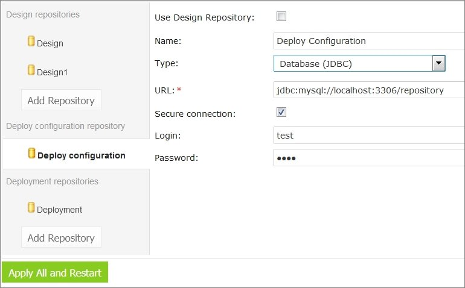

    *Adding a repository*
    
1.  When finished, click **Apply All and Restart** to save the changes and refresh the page.
    
To enable storing large files in a Git repository, Git Large File Support (LFS) can be used.
    
-   To enable the Git repository use LFS before it is cloned by OpenL Studio, perform the necessary configuration as described in <https://git-lfs.github.com/>.
-   If the Git repository is already cloned by OpenL Studio, to enable using Git LFS, proceed as follows:
    1.  Close all projects in the workspace.
    2.  Delete all deployment configuration settings.
    3.  Stop OpenL Studio.
    4.  Drop the local folder with the Git repository to the OpenL Studio home directory.
    5.  Start OpenL Studio.
    OpenL Studio will re-clone the directory.
    6.  Recreate the required deployment configuration settings that were deleted previously.

#### Managing Git Repository Settings

**Git** is a free and open source distributed version control system designed to handle everything from small to very large projects with speed and efficiency. For more information on Git, see <https://git-scm.com/>.

A **Git repository** is the `.git/` folder inside a project. This repository tracks all changes made to files in the project, building a history over time.

This section describes how to set up a connection to a Git repository, configure Git functionality, and resolve conflicts when modifying the same version of the project.

##### Setting Up a Connection to a Git Repository

In the **ADMIN** tab, in the **Repository** section, define values for the following connection properties:

| Parameter                             | Description                                                                                                                                                                                                                                                                                                                                                                                                                                                                                                                                                                                                                                                                                                                                                                                                                                                                                                                                                                                                                                                                                                                                                                                                                                                                                                                                                                                                                    |
|---------------------------------------|--------------------------------------------------------------------------------------------------------------------------------------------------------------------------------------------------------------------------------------------------------------------------------------------------------------------------------------------------------------------------------------------------------------------------------------------------------------------------------------------------------------------------------------------------------------------------------------------------------------------------------------------------------------------------------------------------------------------------------------------------------------------------------------------------------------------------------------------------------------------------------------------------------------------------------------------------------------------------------------------------------------------------------------------------------------------------------------------------------------------------------------------------------------------------------------------------------------------------------------------------------------------------------------------------------------------------------------------------------------------------------------------------------------------------------|
| Name                                  | Repository name. This value cannot be modified.                                                                                                                                                                                                                                                                                                                                                                                                                                                                                                                                                                                                                                                                                                                                                                                                                                                                                                                                                                                                                                                                                                                                                                                                                                                                                                                                                                                |
| Type                                  | Type of the repository. The value must be set to **Git.**                                                                                                                                                                                                                                                                                                                                                                                                                                                                                                                                                                                                                                                                                                                                                                                                                                                                                                                                                                                                                                                                                                                                                                                                                                                                                                                                                                      |
| URL                                   | URL for the remotely located Git repository or file path to the repository stored locally.                                                                                                                                                                                                                                                                                                                                                                                                                                                                                                                                                                                                                                                                                                                                                                                                                                                                                                                                                                                                                                                                                                                                                                                                                                                                                                                                     |
| Login                                 | Username for accessing a remote Git repository. Ignored for local repositories.                                                                                                                                                                                                                                                                                                                                                                                                                                                                                                                                                                                                                                                                                                                                                                                                                                                                                                                                                                                                                                                                                                                                                                                                                                                                                                                                                |
| Password                              | Password for accessing a remote Git repository. Ignored for local repositories.                                                                                                                                                                                                                                                                                                                                                                                                                                                                                                                                                                                                                                                                                                                                                                                                                                                                                                                                                                                                                                                                                                                                                                                                                                                                                                                                                |
| Branch                                | Project branch that is used by default.                                                                                                                                                                                                                                                                                                                                                                                                                                                                                                                                                                                                                                                                                                                                                                                                                                                                                                                                                                                                                                                                                                                                                                                                                                                                                                                                                                                        |
| Protected branches                    | Branches that can be set as protected from any modifications.  For more information on protected branches, see [Using Protected Branches](#using-protected-branches).                                                                                                                                                                                                                                                                                                                                                                                                                                                                                                                                                                                                                                                                                                                                                                                                                                                                                                                                                                                                                                                                                                                                                                                                                                                      |
| Changes check interval                | Repository changes check interval in seconds. The value must be greater than 0. Ignored for local repositories.                                                                                                                                                                                                                                                                                                                                                                                                                                                                                                                                                                                                                                                                                                                                                                                                                                                                                                                                                                                                                                                                                                                                                                                                                                                                                                                |
| Connection timeout                    | Repository connection timeout in seconds. The value must be greater than 0. Ignored for local repositories.                                                                                                                                                                                                                                                                                                                                                                                                                                                                                                                                                                                                                                                                                                                                                                                                                                                                                                                                                                                                                                                                                                                                                                                                                                                                                                                    |
| Default branch name                   | Pattern for a default branch name. The default value is OpenL Studio/{project-name}/{username}/{current-date}.                                                                                                                                                                                                                                                                                                                                                                                                                                                                                                                                                                                                                                                                                                                                                                                                                                                                                                                                                                                                                                                                                                                                                                                                                                                                                                                    |
| Branch name pattern                   | Additional regular expression to be used for validation of the new branch name.                                                                                                                                                                                                                                                                                                                                                                                                                                                                                                                                                                                                                                                                                                                                                                                                                                                                                                                                                                                                                                                                                                                                                                                                                                                                                                                                                |
| Invalid branch name  message hint | Error message displayed when trying to create a branch with a name that does not match the additional regular expression.                                                                                                                                                                                                                                                                                                                                                                                                                                                                                                                                                                                                                                                                                                                                                                                                                                                                                                                                                                                                                                                                                                                                                                                                                                                                                                      |
| Customize comments                    | Custom comment message template for Git commits.  Comments can be customized using the following placeholders:  **- {user-message}** represents a user defined commit message. It is also used as a commit message in OpenL Studio.  **- {commit-type}** is used by commits to recognize the commit type of the message.  **- {project-name}** is replaced by the current project in the message and used for user message templates for **Create project**, **Save project**,  **Archive project**, **Restore project**, **Erase project**, and **Copy project**.  **- {revision}** represents a project revision used for commit.  By default, all commits are submitted to Git with a message in the following format:  `{user-message} Type: {commit-type}`  The following placeholders can be used for the **Restore from old version** user message templates:  **- {revision}** is replaced by the old revision number.  **- {author}** is replaced by the author of the old project version.  **- {datetime}** is replaced by the date of the old project version.  An additional validation rule can be set up for user message templates in the **User message pattern** field, in the form of a regular expression.  If the validation according to the pattern fails, an error text set in the **Invalid user message hint** field is displayed to a user. |
| Flat folder structure                 | Flag that denotes repository structure.  For a flat structure, all projects are stored in the directory specified in the **Path in repository** property, each project in its own folder.  Otherwise, if the parameter is set to false, the repository is considered as a Git repository with non-flat structure, and projects can reside  in folders and subfolders defined by a user upon project creation or copying, with each project having its own level of nesting.  Project index is stored in \<openl-home\>/repositories/settings/\<repo-id\>/openl-projects.yaml and is updated automatically.  Branches information is stored in \<openl-home\>/repositories/settings/\<repo-id\>/branches.yaml.  Folder name limitations are the same as those applied to folder names by the used OS.                                                                                                                                                                                                                                                                                                                                                                                                                                                                                                                                                                                                   |
| Path                                  | Directory where all flat repository structure projects are stored.                                                                                                                                                                                                                                                                                                                                                                                                                                                                                                                                                                                                                                                                                                                                                                                                                                                                                                                                                                                                                                                                                                                                                                                                                                                                                                                                                             |

The URL field determines whether a repository is local or remote.
- If the URL is a valid Git URL, the repository is treated as **remote**.
- If the URL points to a local path, the repository is considered **local**.

The location where remote repositories are cloned is controlled by the following property:

| Property                           | Default value              | Description                                                   |
|------------------------------------|----------------------------|---------------------------------------------------------------|
| repo-git.local-repositories-folder | ${openl.home}/repositories | Directory where cloned remote repositories are stored locally |

If the password is changed on the server side, by default, OpenL Studio makes three attempts to log into the remote Git server, and then the **Problem communicating with "Design" Git server, will retry automatically in 5 minutes.** error is displayed. After that, OpenL Studio stops login attempts to prevent a user account from blocking, and the **Problem communicating with 'Design' Git server, please contact admin.** error is displayed. Define the following properties in the properties file to configure this behavior:

| Property                               | Description                                                                                                                                                                                                                                                                                                                   |
|----------------------------------------|-------------------------------------------------------------------------------------------------------------------------------------------------------------------------------------------------------------------------------------------------------------------------------------------------------------------------------|
| repo-git.failed-authentication-seconds | Time to wait after a failed authentication attempt before the next attempt.  It is used to prevent a user account from blocking. The default value is 300 seconds.                                                                                                                                                        |
| repo-git.max-authentication-attempts   | Maximum number of authentication attempts.  After that, a user can be authorized only after resetting the settings or restarting OpenL Studio.  No value means unlimited number of attempts.  If the value is set to 1, after the first unsuccessful authentication attempt, all subsequent attempts are blocked. |

### Managing System Settings

The System tab enables modifying core, project, and testing options and includes the following topics:

| Section | Property                         | Description                                                                                                                                                                                                                                                                                                                                                                                                                                                                                                                                   |
|---------|----------------------------------|-----------------------------------------------------------------------------------------------------------------------------------------------------------------------------------------------------------------------------------------------------------------------------------------------------------------------------------------------------------------------------------------------------------------------------------------------------------------------------------------------------------------------------------------------|
| Core    | **Dispatching  Validation**       | Setting turns on/off the mechanism of dispatching for a rule table where the only one version of this rule table exists.  By default, the **dispatching.validation** value is set to **true** in OpenL Studio.  For more information on dispatching validation, see  [OpenL Tablets Rule Services Usage and Customization Guide>Table Dispatching Validation Mode](https://openldocs.readthedocs.io/en/latest/documentation/guides/rule_services_usage_and_customization_guide/#table-dispatching-validation-mode). |
|         | **Verify on Edit**               | Allows turning on/off checking of rules consistency and validity on each edit in Rules Editor.  By default, the check box is selected. Automatic checks are executed after each edit.  If this option is cleared, the verification process does not launch automatically when the **Save** button is clicked.  Instead, a **Verify** button appears in Rules Editor, and the user must verify manually by clicking this button.                                                                                                                  |
| Testing | **Thread number  for tests**      | Indicates the number of test cases executed simultaneously.By default, four threads are set.  It means that after running a test table or all tests, up to four test cases will be in progress at the same time.  When they are calculated, the next four test cases will be executed.                                                                                                                                                                                                                                                 |
|         | **Restore Defaults  and Restart** | Restores all settings to default values. All user defined values, such as repository settings, will be lost.                                                                                                                                                                                                                                                                                                                                                                                                                              |

### Managing Security Settings

The **Security** tab contains settings for user authentication and access control. It includes the following topics:

-   [Configuring Authentication Mode](#configuring-authentication-mode)
-   [Configuring Default Group](#configuring-default-group)

#### Configuring Authentication Mode

OpenL Studio supports multiple user authentication modes. The active mode can be changed in the **Security** tab of the **Administration** panel.

The following authentication modes are available:

| Mode | Description |
|------|-------------|
| **Single-user** | No login required. All users share a single session. Suitable for development and local evaluation only. |
| **Multi-user** | Built-in user management with local credentials stored in OpenL Studio. Suitable for teams without an external identity provider. |
| **Active Directory / LDAP** | Authentication against a corporate Active Directory or LDAP server. External users are created and synchronized from the directory at login. |
| **SSO: SAML** | Single Sign-On using the SAML 2.0 protocol. Works with identity providers such as Okta, Azure AD, and similar services. |
| **SSO: OAuth2** | Single Sign-On using the OAuth2 / OpenID Connect protocol. Supports providers such as Google, GitHub, and others. |

**Note:** CAS authentication is no longer supported starting with OpenL Tablets 6.0.

To change the authentication mode, in the **Security** tab, select the desired mode, configure the required settings, and click **Apply**.

#### Configuring Default Group

The Default Group is automatically applied to every user in the system, including users with no explicit group or role assignments. Its permissions act as a baseline that all users inherit regardless of their individual access configuration.

To configure the Default Group, proceed as follows:

1.  In the **Administration** panel, click the **Security** tab, then scroll down to **Configure Initial Users** section.
2.  In the **Default Group** field, select a group from the list, or select **None** to disable automatic default access for all users.
3.  Click **Save** to apply the changes.

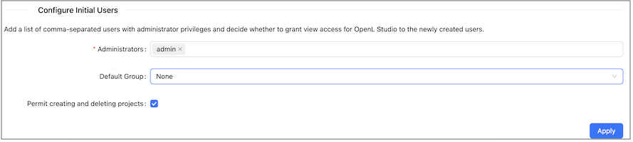

*Default Group configuration in the* **Security** *tab*

**Note:** The Default Group setting is not available in Single-User mode.

### Managing User Information

This section describes how to control user access in the OpenL Studio application. Access is controlled using a role-based Access Control List (ACL). Roles are assigned to users or groups on specific resources, such as repositories or individual projects.

Users and groups are managed in the **Groups** and **Users** tabs of the **Administration** panel. Only members of the **Administrators** group have rights to manage users and groups in OpenL Studio.

**Note:** **Groups** and **Users** tabs are not not shown in Single-User mode.

The following topics are included in this section:

-   [Managing Groups](#managing-groups)
-   [Managing Users](#managing-users)

#### Managing Groups

The **Groups** tab is available only in OpenL Studio environments integrated with an external user management system, such as Active Directory, LDAP, or an SSO provider. In environments without external user management, the **Groups** tab is hidden and user access is managed directly on each user in the **Users** tab.

Groups registered in OpenL Studio are matched to groups from the external directory. Each group can be granted access to one or more resources with a specific role.

The following topics are included in this section:

-   [Understanding Roles](#understanding-roles)
-   [Understanding the Default Group](#understanding-the-default-group)
-   [Viewing a List of Groups](#viewing-a-list-of-groups)
-   [Inviting a Group](#inviting-a-group)
-   [Editing a Group](#editing-a-group)
-   [Deleting a Group](#deleting-a-group)

##### Understanding Roles

Instead of selecting individual privileges, access in OpenL Studio is controlled by assigning a **role** to a **resource**. A resource is either a repository or an individual project within a repository.

The following roles are available:

| Role | Description | View | Create | Edit | Delete | Manage |
|------|-------------|:----:|:------:|:----:|:------:|:------:|
| **Viewer** | Read-only access to the resource. Users can view content, open projects, and run and trace test tables, but cannot make any changes. | ✓ | | | | |
| **Contributor** | Full read and write access to the resource. Users can create, edit, and delete content within the resource, but cannot manage user permissions. | ✓ | ✓ | ✓ | ✓ | |
| **Manager** | Full access including the ability to assign roles to other users and groups on the resources they manage. | ✓ | ✓ | ✓ | ✓ | ✓ |

**Note:** The **Administrator** designation is separate from the above ACL roles and grants system-wide administrative access, including the ability to manage users, groups, and global configuration.

**Deploying a project** requires access to two repositories simultaneously: the user must have at least **Viewer** access on the design repository where the source project resides, and at least **Contributor** access on the target deployment repository. A Viewer role on the deployment repository alone is not sufficient to perform a deployment.

###### Role Inheritance and Conflict Resolution

Roles can be assigned at two levels: the **repository** level and the **project** level. When a role is assigned at the repository level, it applies to all projects within that repository unless a more specific project-level role is also configured.

The following rules apply when resolving a user's effective access:

-   **Project-level role takes precedence over repository-level role.** When a role is explicitly assigned on a project, that role determines the user's access to that project, regardless of what role the user has on the parent repository.

-   **Repository-level role is inherited when no project-level role is set.** If no explicit ACL entry exists for a project, the user's access falls back to the role assigned at the repository level.

-   **When a user belongs to multiple groups, the most permissive role applies.** If a user is a member of two groups and one group has Viewer access and the other has Contributor access on the same resource, the user effectively has Contributor access.

**Examples:**

| Repository Role | Project Role | Effective Access on the Project |
|-----------------|--------------|----------------------------------|
| Viewer | Contributor | **Contributor** — the explicit project role overrides the repository role |
| Contributor | Viewer | **Viewer** — the explicit project role overrides the repository role |
| Contributor | *(none)* | **Contributor** — the repository role is inherited |
| *(none)* | Viewer | **Viewer** — only the project-level role applies |

##### Understanding the Default Group

At the top of both the **Groups** and **Users** tabs, OpenL Studio displays the currently configured **Default Group** along with an info tooltip.

The Default Group is automatically applied to every user in the system, including users who have not been assigned to any other group. This means that if the Default Group has access to a resource, all users effectively inherit that access regardless of their individual group assignments.

To change the Default Group, go to **Security → Default Group** in the administration settings as described in [Configuring Default Group](#configuring-default-group).

##### Viewing a List of Groups

To view the list of groups, proceed as follows:

1.  In the **Administration** panel, select the **Groups** tab.

    The system displays a list of invited groups, including their names, descriptions, and number of members:

    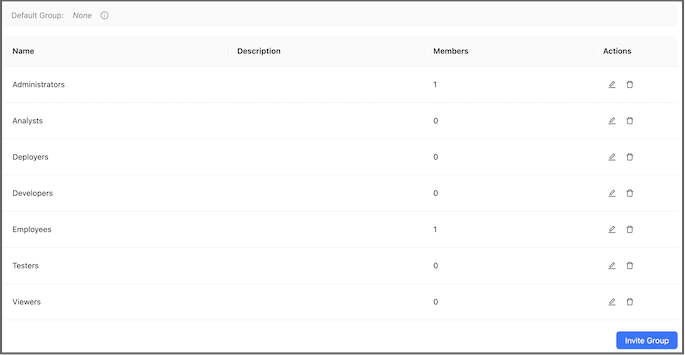

    *Groups list in the* **Groups** *tab*

1.  To invite a new group, proceed as described in [Inviting a Group](#inviting-a-group).
2.  To edit a group, proceed as described in [Editing a Group](#editing-a-group).
3.  To delete a group, proceed as described in [Deleting a Group](#deleting-a-group).

##### Inviting a Group

Inviting a group registers an external directory group in OpenL Studio and assigns it a role on one or more resources.

To invite a group, proceed as follows:

1.  Click the **Invite Group** button.

    The **Invite Group** dialog appears.

    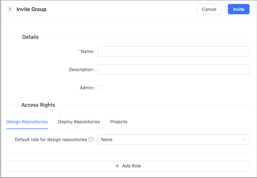

    *Invite Group dialog*

1.  In the **Name** field, type the group name. As you type, a list of matching groups from the connected directory service is displayed. You can select an existing group from the list or enter a custom name.

1.  Optionally, provide a description in the **Description** field.

2.  To designate this group as OpenL Studio Administrators, select the **Admin** check box.

    When this option is selected, the access management fields are disabled because administrator groups have system-wide access and do not require resource-level role assignments.

2.  In the **Access Rights** section, configure the group's access to repositories and projects:

    | Field | Description |
    |-------|-------------|
    | **Resource** | The repository or project to which access is granted. Select from the available repositories and projects listed in the system. Mandatory. |
    | **Role** | The role to assign for the selected resource: **Viewer**, **Contributor**, or **Manager**. Mandatory. |

    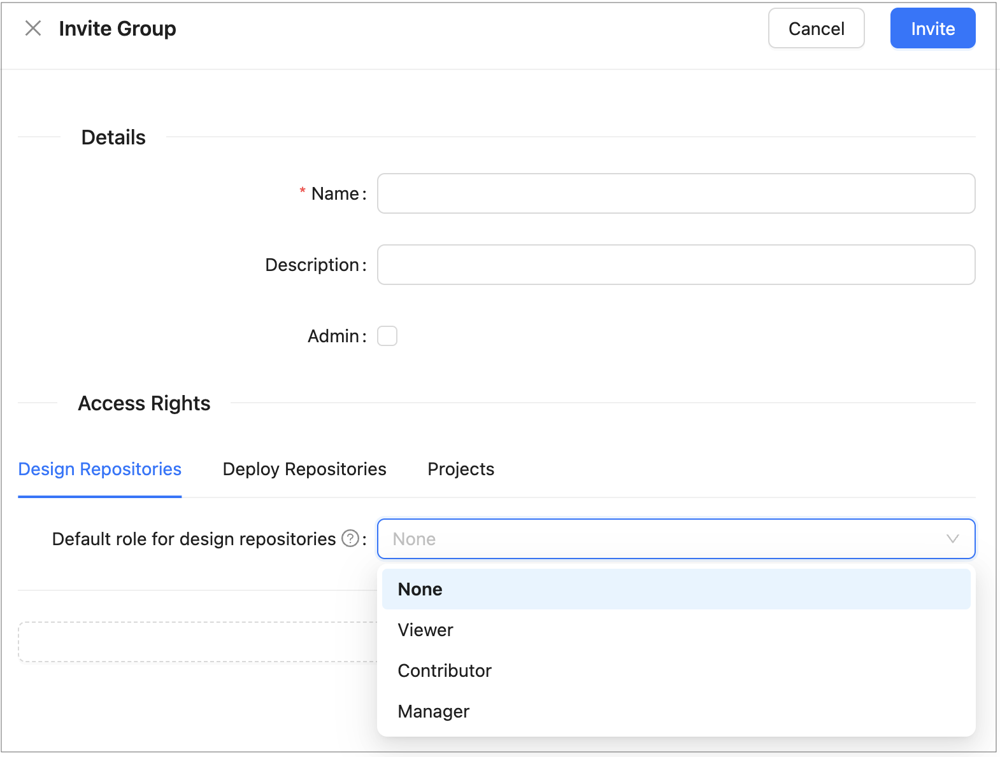

    *Access Management section of the Invite Group dialog*

    To grant access to multiple resources, add a new row for each resource. The same resource cannot be assigned more than one role.

1.  Click **Save** to complete.

##### Editing a Group

To modify a group, proceed as follows:

1.  In the group list, locate the group to be changed and click the **Edit** icon.
2.  In the edit form, change the group name, description, administrator designation, or resource access assignments as needed.
3.  Click **Save** to complete.

##### Deleting a Group

To delete a group, proceed as follows:

1.  In the group list, locate the group to be deleted and click the **Delete** icon.
2.  Click **OK** in the confirmation dialog.

#### Managing Users

In OpenL Studio, access to repositories and projects is controlled through role-based ACL assignments. In environments without external user management, access is managed directly per user in the **Users** tab. In environments integrated with an external user management system, access can additionally be managed at the group level through the **Groups** tab.

**Note:** Demo mode includes a set of pre-configured users with sample access rights for evaluation purposes. These users are not intended for production use.

The initial administrator account is configured through the `security.administrators` property in the application configuration. The administrator can then create and manage additional users through the **Administration** panel.

The following topics are included in this section:

-   [Viewing a List of Users](#viewing-a-list-of-users)
-   [Creating a User](#creating-a-user)
-   [Editing a User](#editing-a-user)
-   [Deleting a User](#deleting-a-user)
-   [Managing Users in Case of Third Party Identity Provider](#managing-users-in-case-of-third-party-identity-provider)

##### Viewing a List of Users

To view a list of users, proceed as follows:

1.  In the **Administration** panel, select the **Users** tab.

    The system displays a list of OpenL Studio users.
    
     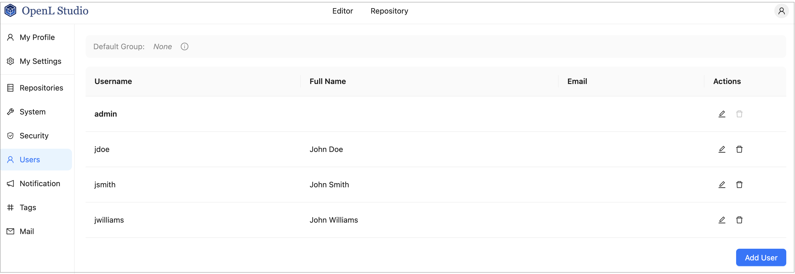

    *Users list in the* **Users** *tab*

1.  In the **Users** tab, perform either of the following:
-   To create a user, proceed as described in [Creating a User](#creating-a-user).
-   To edit a user, proceed as described in [Editing a User](#editing-a-user).
-   To delete a user from the system, proceed as described in [Deleting a User](#deleting-a-user).

##### Creating a User

To create a new user, proceed as follows:

1.  On the **Users** tab, click **Add User**.

    The system displays the **Add User** form.

    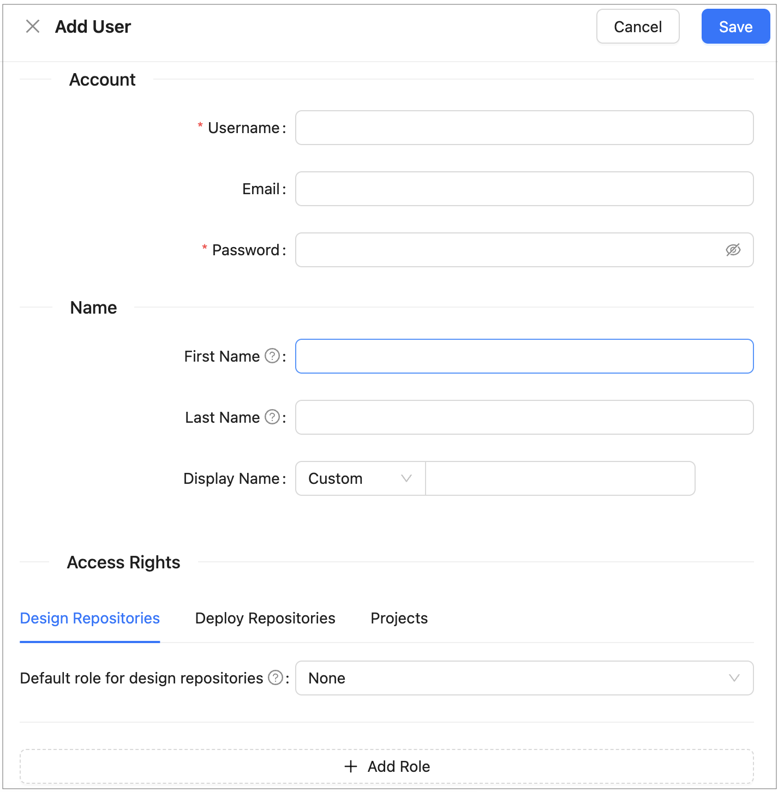

    *Creating a user*

1.  In the **Username** field, specify the user login name.
2.  Optionally, enter the user email.

    The email value is mandatory for committing to the Git repository.

1.  In the **Password** field, enter a password.

    This field is unavailable for external users.

1.  Optionally, enter the user’s first and last name.

    The display name is mandatory for committing to the Git repository.

1.  To change the display name pattern, in the appropriate field, select either **First Last** or **Last First**.

    If the **Custom** option is selected, the field becomes editable and any display name can be entered.

1.  In the **Access Rights** section, configure the user’s access to repositories and projects:

    | Field | Description |
    |-------|-------------|
    | **Resource** | The repository or project to which access is granted. Select from the available repositories and projects. Mandatory. |
    | **Role** | The role to assign for the selected resource: **Viewer**, **Contributor**, or **Manager**. Mandatory. |

    To grant access to multiple resources, add a new row for each resource. The same resource cannot be assigned more than one role.

    For a description of available roles and their permissions, see [Understanding Roles](#understanding-roles).

1.  Click **Save** to complete.

The system displays the new user in the **Users** list. If the username and password values are the same, an exclamation mark is displayed next to the username. A user can change the password to improve security.

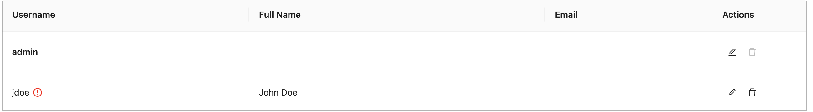

*User list with a password security warning*

##### Editing a User

To edit a user, proceed as follows:

1.  In the **Users** list, locate the user to be modified and click the username.
2.  In the **Edit User** form, modify user data or access management settings as required.

    The username and the administrator accounts defined in the `security.administrators` property cannot be changed.
    For external users synchronized with Active Directory or an SSO provider, only fields not provided by the external system are editable.

1.  Click **Save** to save the changes.

##### Deleting a User

The **Administrators** group in OpenL Studio must contain at least one administrator. The only remaining administrator cannot be deleted.

Initial users created during OpenL Studio installation and the currently logged in user cannot be deleted.

To delete a user, proceed as follows:

1.  In the **Users** list, locate the user for deletion and click the **Delete** icon.
2.  Click **OK** in the confirmation dialog.

##### Managing Users in Case of Third Party Identity Provider

There are some differences in managing users when OpenL Studio is configured to authenticate against a third party identity provider, such as an SSO provider or Active Directory.

A user is created in OpenL Studio automatically upon the user’s first login using credentials from the identity provider. Users cannot be added manually. User information such as first name, last name, display name, and email address is retrieved from the identity provider and saved to OpenL Studio with those fields locked for editing. If some information is not available from the identity provider, the corresponding fields are editable in OpenL Studio. An exception applies to SSO with external user management, where user data cannot be edited in **Admin \> Users** and only partial data can be edited in the user profile section.

On user's login, synchronization is performed: information in OpenL Studio is synchronized with identity provider data and the corresponding fields are updated if changed. 

When the first or last name has changed:

-   If the display name was set to “first name + space + last name”, it is updated to reflect the new values.
-   If the display name was set to “last name + space + first name”, it is updated to reflect the new values.
-   If the display name is set to **Custom** and is non-empty in OpenL Studio but is empty in the identity provider, the local value is preserved upon synchronization.

In integrated environments, the **Edit User** form shows read-only account and personal information synchronized from the identity provider. The form also displays the following:

-   **Access Rights**: Permissions inherited from the user's group memberships are shown in read-only mode. Administrators can add direct resource-level role assignments on top of the inherited group permissions.

Permissions can be managed at the group level by inviting a group with the same name as defined in the identity provider and assigning it the required roles. Group membership is automatically resolved from the identity provider at login and does not require manual maintenance in OpenL Studio. Additional resource-level role assignments can also be applied directly on a user.

### Managing Notifications

In the **ADMIN \> Notification** section, users with the administrator privileges can send text messages to all OpenL Studio instances and users that are currently online or remove previously sent notifications.

When a notification is sent by clicking **Post**, a red bar with notification text appears for all users and OpenL 
Studio instances. To remove the message for all users and OpenL Studio instances, click **Remove**.

*Red bar identifying a notification sent to all active users and instances*

### Managing Tags

In OpenL Tablets, tags can be assigned to a project. A **tag type** is a category holding tag values of the same group. An example is the **Product** tag that includes tags **Auto**, **Life**, and **Home**.

**Note:** Starting with OpenL Tablets 6.0, project tags are stored inside the project structure rather than in a separate configuration. As a result, tag changes are version-controlled and visible in the project's Git history.

If a tag type is defined as optional, its value definition can be skipped when creating a project. Otherwise, tag definition is mandatory.

For extensible tag types, any user can create new tag values. For other tag types, values are configured by an administrator only.

To create project tags, proceed as follows:

1.  In the **ADMIN** tab, click **Tags** on the left.
    
    
    
    *Selecting tags*
    
1.  To add a tag type, in the **New Tag Type** field, enter the tag type name and press **Enter** or Tab.
    
    When at least one tag type is added, a field for adding tag values appears.
    
    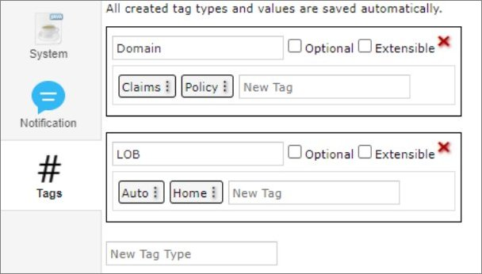
    
    *Adding tag values*
    
1.  To edit a tag type, click the tag type name field and make the necessary changes.
2.  To delete a tag type, click the red cross icon for the appropriate tag.
3.  To add a tag value, in the **New Tag** field, enter the tag name and press **Enter.**
4.  To edit a tag, click the menu icon , select **Edit,** modify the tag, and press **Enter** or click outside the field.
5.  To delete a tag, click the menu icon  and select **Delete.**
    
    All created tag types and values are saved automatically. These values are now available for selection when assigning tags to projects as described in [Creating Projects in Design Repository](#creating-projects-in-design-repository).
    
    Tag values can be derived from project names. Proceed as follows:
    
1.  To define project name templates to be used for deriving tags, in the **Tags from a Project Name** section, enter the template value.
2.  To save project name templates, click **Save Templates** or simply click outside the field.
3.  To assign tags according to these project name templates to the projects that do not have tags defined yet, click **Fill tags for projects.**

The **Projects without tags** window appears. It contains all projects that have **None** selected for one or multiple tag types, or do not have tags defined at all, and which name matches the project name template.

Please note that only projects currently opened by the user can be modified. If a project exists in the repository but is not opened for the current user, it will appear in the pop-up but will be grayed out and cannot be selected.

*Applying tags for projects matching project name templates.*

In this window, tags are marked with colors as follows:

| Tag color | Description                                                                                                                                                                                                                                                                                                                                                                                                                                                                                                                                                                                                                                   |
|-----------|-----------------------------------------------------------------------------------------------------------------------------------------------------------------------------------------------------------------------------------------------------------------------------------------------------------------------------------------------------------------------------------------------------------------------------------------------------------------------------------------------------------------------------------------------------------------------------------------------------------------------------------------------|
| White     | A tag exists in the list of tags and will be assigned to a project.                                                                                                                                                                                                                                                                                                                                                                                                                                                                                                                                                                           |
| Green     | A tag does not exist in the list of tags, but the tag type is defined as extensible, so the tag will be created and assigned to the project.                                                                                                                                                                                                                                                                                                                                                                                                                                                                                                  |
| Red       | A tag does not exist in the list of tags, and the tag type is not defined as extensible, so the tag will not be created,  neither it will be assigned to the project. The tag for a project will remain **None.**                                                                                                                                                                                                                                                                                                                                                                                                                              |
| Grey      | A tag is already assigned to the project. The project still appears on the list because it has other tag types with the **None** values.  If the tag is already assigned, but a different tag value is derived from the project name according to the template, the existing value will be replaced  with the derived value. The replacement is identified with the arrow. The derived value can be created if the tag type is extensible.  In this case, a new value will be marked green. If the derived tag value does not exist and the tag type is not extensible, no replacement happens,  and the old value appears in grey with no arrow. |

This logic is explained in the tooltips for each tag color type.

Note that if project tags are successfully modified, the project status changes to **In Editing**, unless it is already in this status. Because tags are stored within the project, they must be saved (committed) before the changes become visible to other users. The tag changes are then included in the project's version history.

### Managing Email Server Configuration

OpenL Studio supports sending emails for mailbox verification.

To manage email server configuration, proceed as follows:

1.  In the **ADMIN** tab, click **Mail** on the left.
2.  Ensure that the **Enable email address verification** check box is selected.
3.  Specify the sender’s URL, username, and password for dispatching verification emails through this email server.
4.  Click **Apply All and Restart.**
    
    When a sender is defined for the specific server, it can be used to send emails for verification of the non-verified mailboxes manually defined by a user.
    
    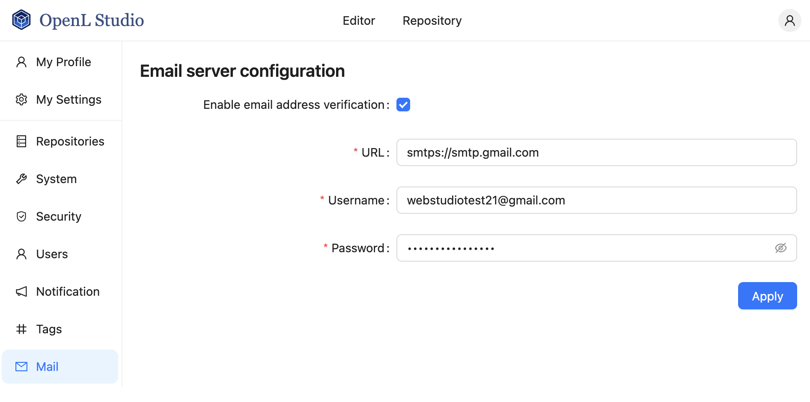
    
    *Defining verification emails sender*
    
    If the user email is not verified, a red exclamation mark is displayed next to this user email in the user list.
    
    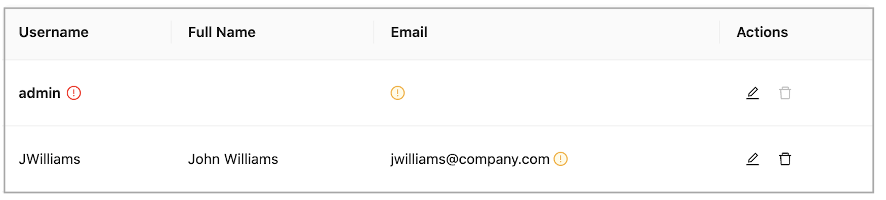
    
    *A user with unverified email*
    
1.  If the verification email is not received for some reason, to resend it, in the **Users** tab, open the user record and click **Resend**.

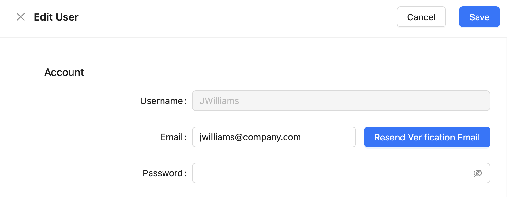

*Resending a verification email*

A user can resend the verification email on his or her own by clicking the username in the top right corner, selecting **User Details,** and clicking **Resend.**

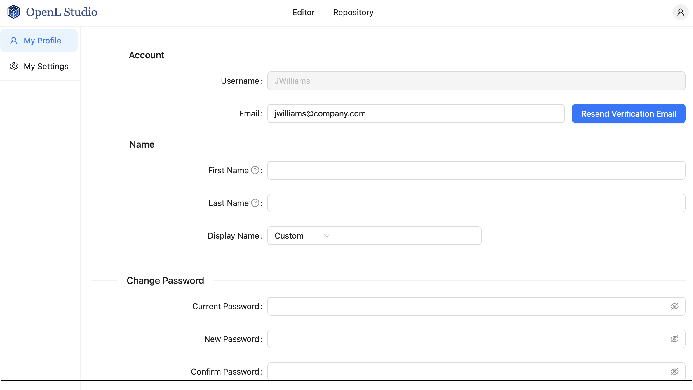

*A user initiating verification email resending*

The verification email resembles the following:

*Verification email example*

