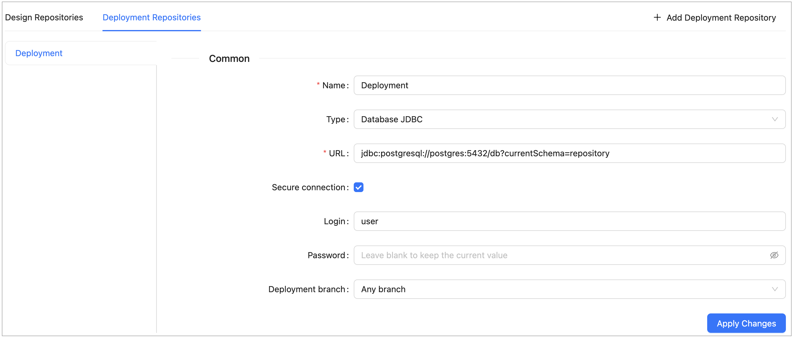

#### Managing General Repository Settings

To add a repository, proceed as follows:

1.  In the **Repositories** section, click the **Design Repositories** or **Deployment Repositories** tab as needed.
2.  Click the **Add Design Repository** or **Add Deployment Repository** button in the top-right corner.

    A new repository form opens with default Git settings pre-filled.

3.  In the **Name** field, enter the repository name to be displayed on the **Projects** page.
4.  In the **Type** field, select the connection type:

    -   **Git** — the repository is located on a local or remote machine.
    -   **Database JDBC** — the repository is located in a local or remote database accessed via a JDBC URL.
        Supported databases are MySQL, MariaDB, PostgreSQL, MS SQL, and Oracle.
    -   **Database JNDI** — the repository is located in a database accessed via a JNDI data source.
    -   **AWS S3** — the repository is located in Amazon Simple Storage Service (AWS S3).
    -   **Azure Blob Storage** — the repository is located in Microsoft Azure Blob Storage.

    For more information on supported database versions, see <https://openl-tablets.org/supported-platforms>.

5.  Define the connection parameters of the selected type.

    The parameters differ per type and are described in the following sections. For **Git** parameters, see
    [Managing Git Repository Settings](02-git-repository-settings.md#managing-git-repository-settings).

    Changing the **Type** value replaces the parameters below it with the default values of the newly selected type.

6.  For **Deployment Repositories**, select the **Deployment branch** option:

    | Option               | Description                                                       |
    |----------------------|-------------------------------------------------------------------|
    | **Any branch**       | Projects can be deployed to any branch.                           |
    | **Main branch only** | Projects can only be deployed to the repository's default branch. |

7.  When finished, click **Apply Changes** and confirm the action in the displayed dialog.

    Applying the configuration makes all users currently working with OpenL Studio lose their unsaved changes.

To delete a repository, click the **×** button on the repository's tab and confirm the deletion.

> [!Note]
> A new OpenL Studio installation has no deployment repository configured. The OpenL Tablets demo package is shipped
> with a local **Deployment** repository that keeps deployed projects in the OpenL Studio home directory.

For more information on connecting OpenL Rule Services to the same storage, see
[OpenL Tablets Rule Services Usage and Customization Guide > Configuring a Data Source](../../../rule-services/configuration.md#configuring-a-data-source).

##### Defining Database JDBC and Database JNDI Parameters

-   **URL** — JDBC URL of the database for **Database JDBC**, or the data source name for **Database JNDI**, such as
    `java:comp/env/jdbc/DB`. The field is required.
-   **Secure connection** — select this check box to access the database with a login and a password.
-   **Login** — user name for accessing the database. The field appears when **Secure connection** is selected.
-   **Password** — password for the specified user. The field appears when **Secure connection** is selected. For an
    already saved repository, leave the field blank to keep the current value.

The following table provides examples of JDBC URL values for different databases.

| Database           | URL value sample                                                                                    |
|--------------------|-----------------------------------------------------------------------------------------------------|
| **MySQL, MariaDB** | `jdbc:mysql://localhost:3306/prodRepository`, `jdbc:mariadb://localhost:3306/prodRepository` for the MariaDB driver |
| **PostgreSQL**     | `jdbc:postgresql://localhost:5432/prodRepository`                                                    |
| **MS SQL**         | `jdbc:sqlserver://localhost:1433;databaseName=prodRepository;integratedSecurity=false`               |
| **Oracle**         | `jdbc:oracle:thin:@localhost:1521:prodRepository`                                                    |

For more information on storing the password in an encrypted form, see
[OpenL Tablets Installation Guide > Encrypting Passwords](../../../installation-guide/configuration.md#encrypting-passwords).

*Configuring deployment repository settings*

##### Defining AWS S3 Parameters

-   **Service endpoint** — non-standard service endpoint. If the field is left empty, the Amazon AWS endpoint is used.
-   **Bucket name** — logical unit of storage in AWS S3. The value is globally unique. The field is required.
-   **Region name** — AWS region that stores the data. Select the region geographically closest to users to reduce
    latency and costs. The field is required.
-   **Access key** — alphanumeric text string that identifies the account owner.
-   **Secret key** — password for the specified access key.
-   **Listener timer period (sec)** — repository changes check interval in seconds. The value must be greater than 0.
-   **SSE algorithm** — server-side encryption algorithm for objects in the bucket. **None** stores objects
    unencrypted, **AES256** encrypts them at rest using AES-256, and the **aws:kms** options add a key managed by
    AWS Key Management Service.

If **Access key** and **Secret key** are left empty, OpenL Studio retrieves the credentials from one of the known
locations as described in
[AWS Documentation. Best Practices for Managing AWS Access Keys](https://docs.aws.amazon.com/general/latest/gr/aws-access-keys-best-practices.html).

##### Defining Azure Blob Storage Parameters

-   **URL** — URI of the Azure Blob Storage container. The field is required.
-   **Listener timer period (sec)** — repository changes check interval in seconds. The value must be greater than 0.

The URI can contain a Shared Access Signature (SAS). Authenticating with SAS is recommended over an account key,
especially in production, because SAS limits the delegated access by resource, permission, and time period.

To authenticate with a Storage Shared Key instead, define the storage account name and access key in the properties
file using the following properties.

| Property                      | Description                                            |
|-------------------------------|--------------------------------------------------------|
| repo-azure-blob.account-name  | Name of the Azure storage account that owns the blob container. |
| repo-azure-blob.account-key   | Access key of the specified storage account.           |
