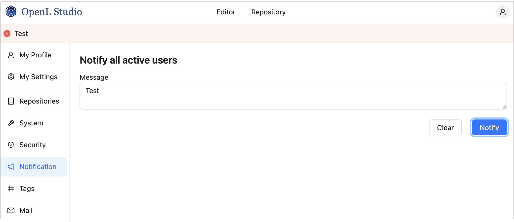

### Managing Notifications

In the navigation menu, click **Notification** to open the notification management page. Users with administrator privileges can send a text message to all currently active OpenL Studio users and instances, or clear a previously sent notification.

To send a notification, enter the message text in the **Message** field and click **Notify**. A red bar with the notification text appears for all active users and OpenL Studio instances.

To remove the notification for all users and instances, click **Clear**.

*Red bar identifying a notification sent to all active users and instances*
