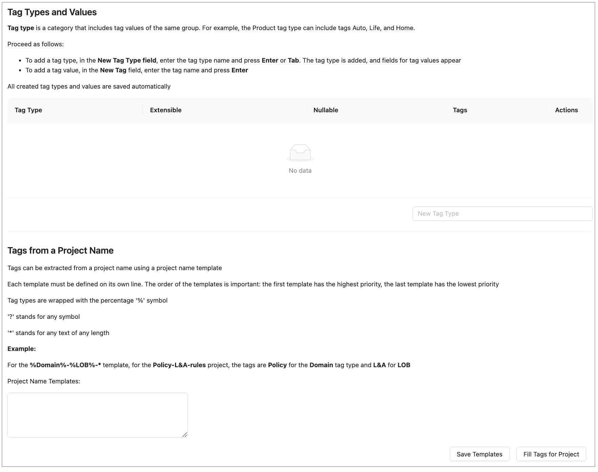
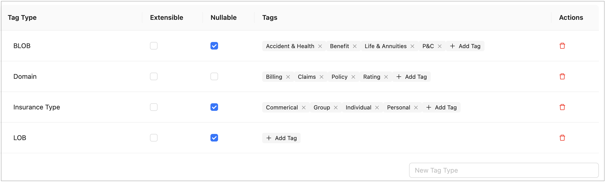

### Managing Tags

In OpenL Tablets, tags can be assigned to a project. A **tag type** is a category holding tag values of the same group. An example is the **Product** tag that includes tags **Auto**, **Life**, and **Home**.

**Note:** Starting with OpenL Tablets 6.0, project tags are stored inside the project structure rather than in a separate configuration. As a result, tag changes are version-controlled and visible in the project's Git history.

In the navigation menu, click **Tags** to open the tag management page.

The page consists of two sections:

-   **Tag Types and Values** — where tag types and their values are created and managed.
-   **Tags from a Project Name** — where templates for deriving tag values from project names are defined.

Tag types and values are saved automatically. No additional save action is required.

To create project tags, proceed as follows:

1.  To add a tag type, in the input field at the bottom of the tag table, enter the tag type name and press **Enter** or click outside the field.

    

    *Selecting tags*

2.  To edit a tag type name, click the tag type name cell in the table, modify the value, and press **Enter** or click outside the field.

3.  To configure a tag type, use the following checkboxes in the tag type row:

    | Column         | Description                                                                                                                            |
    |----------------|----------------------------------------------------------------------------------------------------------------------------------------|
    | **Extensible** | When selected, any user can create new tag values for this tag type. When cleared, only an administrator can add values.               |
    | **Nullable**   | When selected, assigning a value for this tag type is optional when creating a project. When cleared, a value must always be selected. |

4.  To delete a tag type, click the **Delete** icon in the **Actions** column of the tag type row and confirm the deletion.

5.  To add a tag value, in the **Tags** column of the tag type row, click **+ Add Tag**, enter the tag name, and press **Enter** or click outside the field.

    

    *Adding tag values*

6.  To edit a tag value, double-click the tag, modify the value, and press **Enter** or click outside the field.

7.  To delete a tag value, click the delete icon next to the tag name.

All created tag types and values are saved automatically. These values are now available for selection when assigning tags to projects as described in [Creating Projects in Design Repository](repository-editor.md#creating-projects-in-design-repository).

Tag values can be derived from project names. Proceed as follows:

8.  To define project name templates, in the **Tags from a Project Name** section, enter the templates in the **Project Name Templates** text area.

    Templates use the following syntax:

    -   Tag type names are wrapped with the `%` symbol, for example, `%Domain%`.
    -   `?` stands for any single symbol.
    -   `*` stands for any text of any length.
    -   Each template must be defined on its own line. Templates are evaluated in order: the first template has the highest priority, the last has the lowest.

    **Example:** For the `%Domain%-%LOB%-*` template, the project named `Policy-L&A-rules` receives the tag **Policy** for the **Domain** tag type and **L&A** for **LOB**.

9.  To save project name templates, click **Save Templates**.

10. To assign tags according to these project name templates to the projects that do not have tags defined yet, click **Fill Tags for Project**.

The **Projects without tags** window appears. It contains all projects that have **None** selected for one or multiple tag types, or do not have tags defined at all, and which name matches the project name template.

Please note that only projects currently opened by the user can be modified. If a project exists in the repository but is not opened for the current user, it will appear in the pop-up but will be grayed out and cannot be selected.

*Applying tags for projects matching project name templates.*

In this window, tags are marked with colors as follows:

- **White** — A tag exists in the list of tags and will be assigned to a project.
- **Green** — A tag does not exist in the list of tags, but the tag type is defined as extensible, so the tag will be created and assigned to the project.
- **Red** — A tag does not exist in the list of tags, and the tag type is not defined as extensible, so the tag will not be created, neither it will be assigned to the project. The tag for a project will remain **None.**
- **Grey** — A tag is already assigned to the project. The project still appears on the list because it has other tag types with the **None** values. If the tag is already assigned, but a different tag value is derived from the project name according to the template, the existing value will be replaced with the derived value. The replacement is identified with the arrow. The derived value can be created if the tag type is extensible. In this case, a new value will be marked green. If the derived tag value does not exist and the tag type is not extensible, no replacement happens, and the old value appears in grey with no arrow.

This logic is explained in the tooltips for each tag color type.

Note that if project tags are successfully modified, the project status changes to **In Editing**, unless it is already in this status. Because tags are stored within the project, they must be saved (committed) before the changes become visible to other users. The tag changes are then included in the project's version history.
