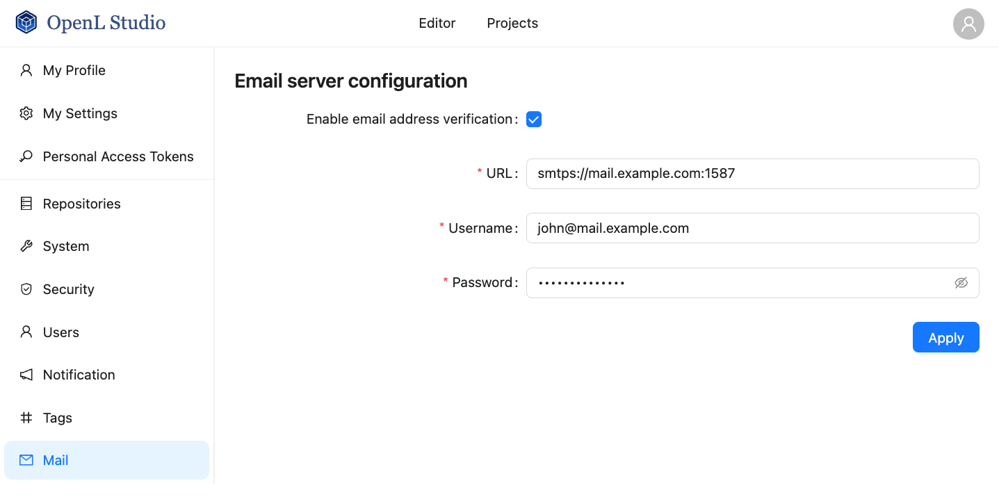
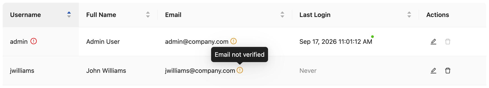
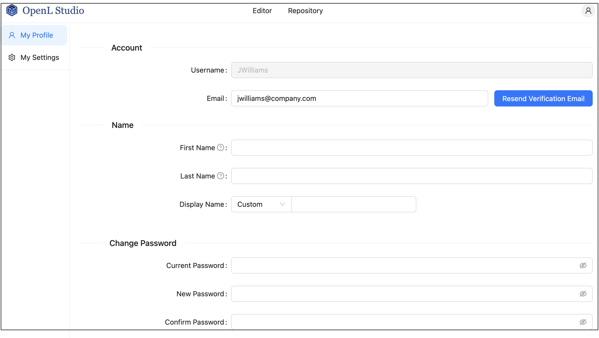
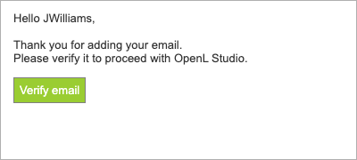

### Managing Email Server Configuration

OpenL Studio supports sending emails for mailbox verification. When an email server is configured, OpenL Studio sends
a verification message to the address defined by a user and marks the addresses that are not confirmed yet.

To configure the email server, proceed as follows:

1.  In the navigation menu, click **Mail**.

2.  Select the **Enable email address verification** check box.

3.  Define the following connection parameters of the server used to dispatch verification emails:

    -   **URL** — address of the mail server, such as `smtps://mail.example.com:1587`.
    -   **Username** — account used for authentication on the mail server, such as `jhon@mail.example.com` or `jhon`.
        Verification emails are sent on behalf of this account.
    -   **Password** — password of the specified account.

    All three parameters are mandatory.

4.  Click **Apply** and confirm the action in the displayed dialog.

    

    *Defining verification emails sender*

    Applying the settings makes all users currently working with OpenL Studio lose their unsaved changes.

    OpenL Studio connects to the mail server using the specified parameters and saves the configuration only if the
    connection succeeds. Otherwise, an error message with the connection failure reason is displayed, and the
    configuration remains unchanged.

To stop sending verification emails, clear the **Enable email address verification** check box and click **Apply**. The
stored email server configuration is deleted.

If a user email address is not verified, an orange exclamation mark is displayed next to this address in the user list.

*A user with unverified email*

> [!Note]
> A red exclamation mark next to a username is a different indicator. It means that the user still has the unsafe
> default password.

If the verification email is not received for some reason, a user can resend it as follows:

1.  Open **My Profile** using the navigation menu or the menu displayed upon clicking the user icon in the top right
    corner.

2.  Next to the **Email** field, click **Resend Verification Email**.

    

    *A user initiating verification email resending*

An administrator can also resend the verification email on behalf of a user as follows:

1.  In the **Administration** panel, select the **Users** tab.

2.  In the **Users** list, locate the user with the unverified address and click the username.

3.  In the **Edit User** form, next to the **Email** field, click **Resend Verification Email**.

In both cases, **Resend Verification Email** appears only while email address verification is enabled and the address
is not verified yet. The button is unavailable while the form contains unsaved changes and for 60 seconds after each
sent email.

The verification email resembles the following:

*Verification email example*
