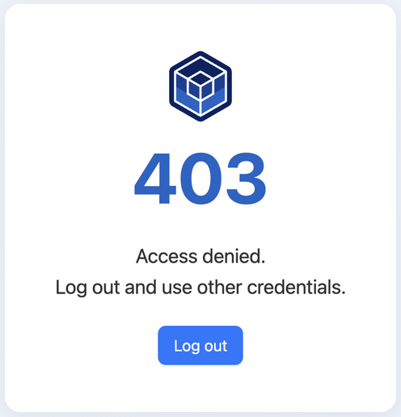
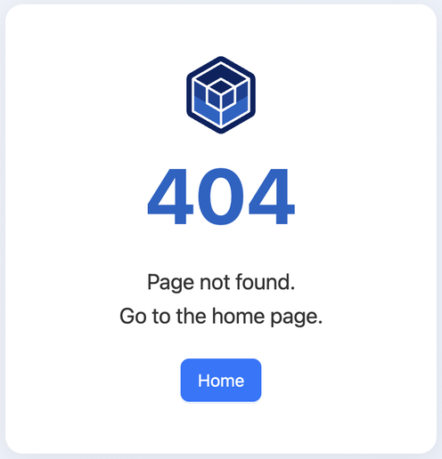
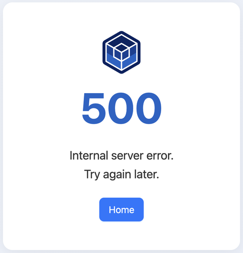

## Appendix D: Error Pages

OpenL Studio displays specific error pages when a user encounters access or system issues.

| Error | Description |
|-------|-------------|
|  | Appears when the user does not have permission to access a resource. Click **Log out** and sign in with credentials that have the required access level. |
|  | Appears when the requested page does not exist. Click **Home** to return to the main page. |
|  | Appears when an unexpected server error occurs. Click **Home** or try again later. |
