## Editing and Testing Functionality

This chapter describes advanced OpenL Studio functions, such as table editing, performing unit tests, rule tracing, and benchmarking. The following sections are included in this chapter:

-   [Editing Tables](#editing-tables)
-   [Using Table Versioning](#using-table-versioning)
-   [Performing Unit Tests](#performing-unit-tests)
-   [Tracing Rules](#tracing-rules)
-   [Using Benchmarking Tools](#using-benchmarking-tools)

### Editing Tables

This section describes table editing and includes the following topics:

-   [Editing a Comma Separated Array of Values](#editing-a-comma-separated-array-of-values)
-   [Editing Default Table Properties](#editing-default-table-properties)
-   [Editing Inherited Table Properties](#editing-inherited-table-properties)

#### Editing a Comma Separated Array of Values

OpenL Studio allows editing comma separated arrays of values. A multi selection window displaying all values appears enabling the user to select the required values.

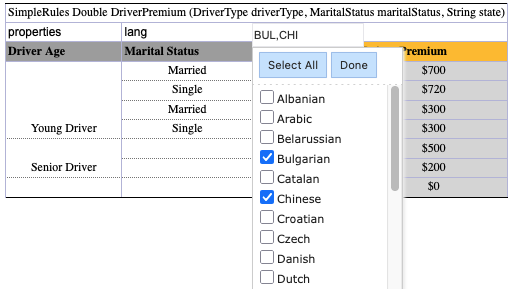

*Editing comma separated arrays*

#### Editing Default Table Properties

This section describes table properties available in OpenL Studio. For more information on table properties, see [OpenL Tablets Reference Guide > Table Properties](https://openldocs.readthedocs.io/en/latest/documentation/guides/reference_guide/table-properties).

If default property values are defined for a table, they appear only in the right hand **Properties** section, but not in the table. In the following example, there are **Active = true** and **Fail On Miss = false** default properties.

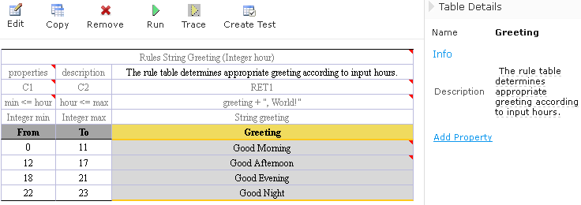

*Default table properties example*

Default properties can be overridden at the table level; in other words, they can be changed as follows:

1.  In the **Properties** section, click the default property to be changed.

    lnstead of the property value, a checkbox appears:

    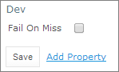

    *Updating a default property*

1.  Select or deselect the checkbox as needed and click the **Save** button.

    The property appears in the table with its new value.

    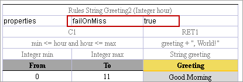

    *Default property was updated by a user*

#### Editing Inherited Table Properties

Module or category level properties are those inherited from a **Properties** table as described in [OpenL Tablets Reference Guide > Properties Table](https://openldocs.readthedocs.io/en/latest/documentation/guides/reference_guide/#properties-table). In the **Properties** section of the given table, inherited properties appear in a different color and are accompanied with a link to the **Properties** table where they are defined. The values of the inherited properties are not stored in the table, they are displayed in the **Properties** section, since they are inherited and applied to this table. Inherited properties can be overridden at a Table level, i.e. they can be changed.

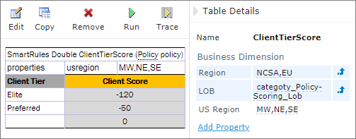

*An example of inherited category-level properties*

To change an inherited property, perform the following steps:

1.  In the **Properties** section, click the inherited property to be changed.
2.  Enter or select the required values from the drop-down list and click **Save**.

    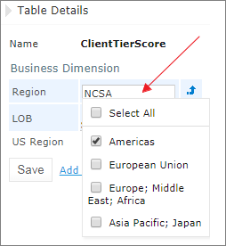

    *Updating an inherited property*

    The system displays the property in the table.

    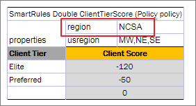

    *Inherited category-level property updated by a user*

The following topics are included in this section:

-   [Editing System Properties](#editing-system-properties)
-   [Editing Properties for a Particular Table Type](#editing-properties-for-a-particular-table-type)

##### Editing System Properties

By default, OpenL Studio applies system properties to each created or edited table. The values of the System properties are provided in the table and in the Properties section.

The **modifiedBy** property value is set using the name of the currently logged in user. The **modifiedOn** property is set according to the current date. These properties are applied upon each save.

The **createdBy** property value is set using the name of the currently logged in user. The **createdOn** property is set according to the current date. These properties are applied on the first save only while creating or copying a table in OpenL Studio.

The **createdBy** and **modifiedBy** properties are only applied in the multi-mode as described in [Security Overview](introduction.md#security-overview).

System properties cannot be edited in UI. The OpenL Studio users can delete those properties if required.

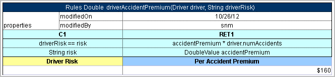

*An example of system properties*

##### Editing Properties for a Particular Table Type

Some properties are only applicable to particular types of tables. When opening a table in OpenL Studio, the properties section displays properties depending on the type of the table.

For example, such property as **Validate DT** is available for Decision Tables. That means it can be selected in the drop-down list after clicking the **Add** link at the bottom of the **Properties** section. The following figure shows properties applied to a Decision Table:

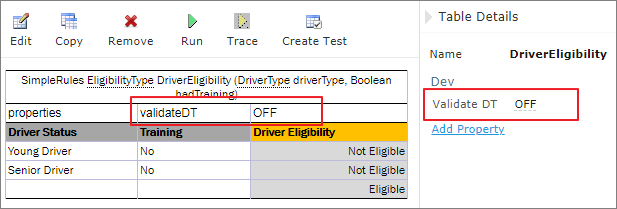

*Properties for the Decision table type*

When opening a Data Table in the same project, these properties are not available for selecting from the drop-down list in the **Properties** section.

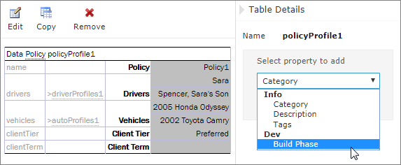

*The Decision table properties that are not available for a Data table*

When performing the “Copy” action, properties unsuitable for the current table type do not appear in the form.

To add a new property for the selected table, perform the following steps:

1.  In the **Properties** pane, click the **Add Property** link.

    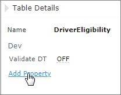

    *Add new property for the current table*

1.  Enter the required property or select it from the drop-down list and click the **Add** button.

    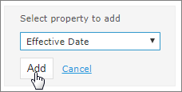

    *Selected table property to be added*

1.  Specify the property value and then click the **Save** button to complete.

    All steps are collected in the following figure:

    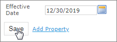

    *Saving a new property for the current table*

### Using Table Versioning

The table versioning mechanism is based on copying the existing table and is initiated in OpenL Studio by clicking the **Copy** button. Then select **New Version** in the **Copy as** list, enter the data as needed and click **Copy** to save.

A new table version has the same identity, that is, signature and dimensional properties of the previous version. When a new table version is created, the previous version becomes inactive since only one table version can be active at a time. By default, all tables are active. The following is an example of an inactive table version.

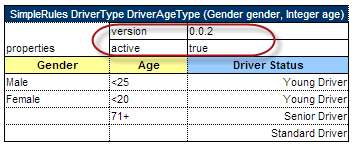

*An inactive table version*

Versions of the same table are grouped in the module tree under the table name. Clicking the table name displays the active version. If all tables are set to inactive, the latest created version is displayed.

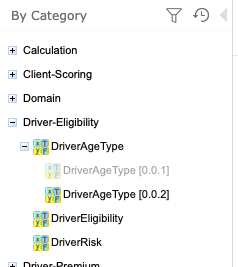

*Displaying table versions in the module tree*

The table version is defined in a three digit format, such as 4.0.1. Table versions must be set in an increasing order.

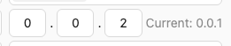

*Entering a new version number*

### Performing Unit Tests

Unit tests are used in OpenL Tablets to validate data accuracy. OpenL Tablets Test tables with predefined input data call appropriate rule tables and compare actual test results with predefined expected results.

For example, in the following diagram, the table on the left is a decision table but the table on the right is a unit test table that tests data of the decision table:

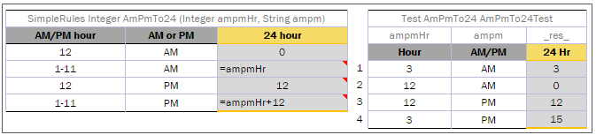

*Decision table and its test table*

OpenL Studio supports visual controls for creating and running project tests. Test tables can be modified like all other tables in OpenL Studio. For information on modifying a table, see [Modifying Tables](rules-editor.md#modifying-tables). Test results are displayed in a simple format directly in the user interface.

The following topics are included in this section:

-   [Adding Navigation to a Table](#adding-navigation-to-a-table)
-   [Running Unit Tests](#running-unit-tests)
-   [Creating a Test](#creating-a-test)

#### Adding Navigation to a Table

OpenL Studio adds a view navigation link to the appropriate test table and vice versa. See the following example:

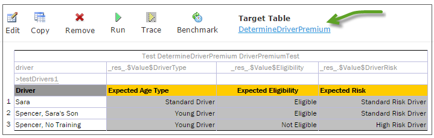

*Navigation link to target table*

#### Running Unit Tests

This section provides the methods used to run unit tests. The following topics are included in this section:

-   [Executing All Module Tests at Once](#executing-all-module-tests-at-once)
-   [Executing Tests for a Single Table](#executing-tests-for-a-single-table)
-   [Displaying Failures Only](#displaying-failures-only)
-   [Displaying Compound Result](#displaying-compound-result)

##### Executing All Module Tests at Once

The system automatically executes all test runs, test cases, in every unit test in a module, including tests in module dependencies, and displays a summary of results.

Test results display resembles the following sample:

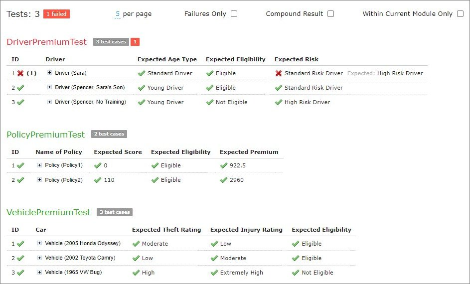

*Results of running all project tests*

1.  To run all module tests, click the **Run Tests**  icon in the top line menu of Rules Editor.

    Failed test cases are represented by  mark. Passed tests are represented by  mark.

    By default, all tests are run in multi-module mode, and the system executes all tests of the project, including project dependencies.

1.  To run the tests in the current module and its dependent modules only, select the **Within Current Module Only** check box in the button menu or test results page.

    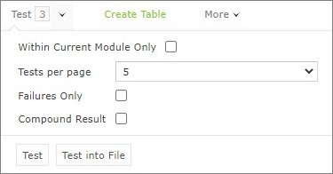

    *Defining test settings*

    In the example above, test results are displayed with five test tables, unit tests, per page. This setting is configured for each user individually in User Profile as **Tests per page** setting.

1.  To change the setting for a particular test run without updating user settings, click the arrow to the right of the **Run Tests**  and choose a required number of **Tests per page**. There is an alternative way: the same setting options are displayed on the top of the window after executing all tests. The following picture provides an illustration:

    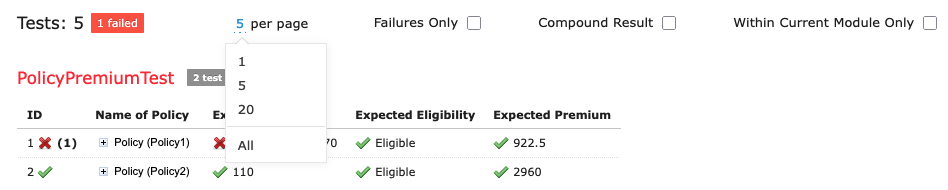

    *Number of tests per page setting*

1.  To export test results into an Excel file, in the **Run** or **Test** drop-down menu, select **Run into File** or **Test into File.** The generated file contains both results and input parameters.

##### Executing Tests for a Single Table

This section describes test execution. Proceed as follows:

1.  To execute all test runs for a particular rule table, select the rule table in the module tree and, in the upper part of the middle pane, click **Test** 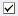.

    Test results resemble the following:

    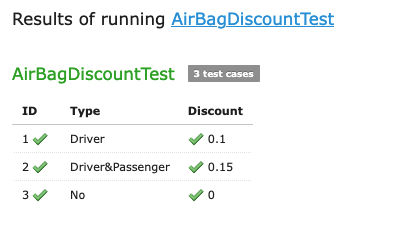

    *Results of executing all test runs for one rule table*

    If the table contains Value types, such as IntValue, the results are clickable and enable a user to view the calculation history.

1.  To test a rule table even if no tests have been created for the given table yet, proceed as follows:
2.  In the module tree, select the required rule table and click the green **Run** arrow  above the table.

    The form for entering required values to test rule table appears.

    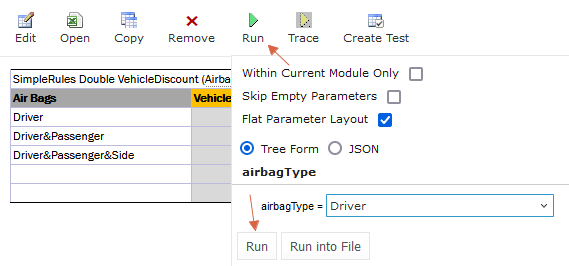

    *Testing a rule table without tests*
1.  To run a test for the currently opened module and its dependent modules only, ensure that the **Within Current Module Only** option is selected.
2.  In the pop-up window, click **Run**.

        The results of the testing are displayed.

    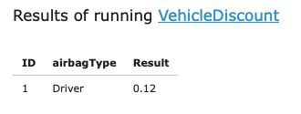

    *Result of running virtual test*
3. To export the results to an Excel file, click the "Run Into File" button. This action will generate an Excel file named "test-results.xlsx", which includes two sheets: 'Result' and 'Parameters'.   By default, the 'Parameters' sheet lists each attribute's name and value on separate rows. For a more compact table format, deselect the ***Flat Parameter Layout*** option.  To exclude any empty input values, select the ***Skip Empty Parameters*** checkbox.
    The following examples illustrate how ***Flat Parameter Layout*** and ***Skip Empty Parameters*** affect the "test-results.xlsx" file: 
   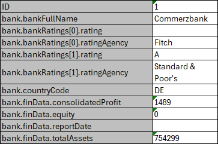 
   *"Flat Parameter Layout” = ***True***, “Skip Empty Parameters” = ***False*** (***default***)*
   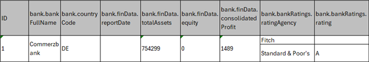 
   *"Flat Parameter Layout” = ***False***, “Skip Empty Parameters” = ***False****  
   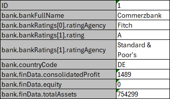 
   *"Flat Parameter Layout” = ***True***, “Skip Empty Parameters” = ***True****

A test table addresses its cases by the **ID** column. The column is not mandatory: define it and give each test
case a unique value, or leave it out and OpenL Studio numbers the cases itself.

1.  For test tables, to select test cases to be executed, proceed as follows:
2.  Navigate to the **Run** button above the Test table and click the small black arrow 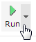.
3.  In the pop-up window that appears, select or clear the check boxes for the appropriate IDs, and to run several particular test cases, define them in the **Use the Range** field.

    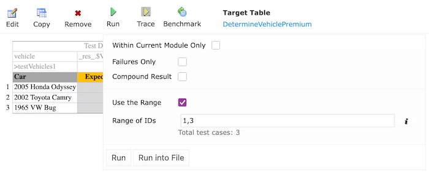

    *Select test cases via Range field to be executed*

1.  If necessary, specify whether the test must be run in the current module only.
2.  In the pop-up window, click **Run**.

    Only the selected test cases are executed.

    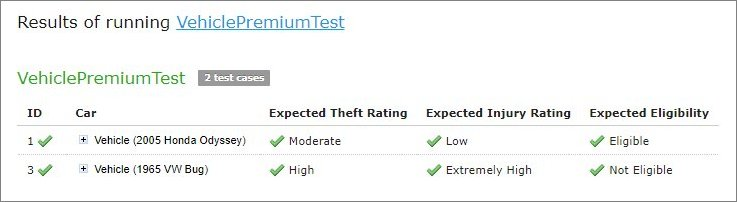

    *Result of selective testing*

1.  To export test results into an Excel file, click **Test** and select **Test into File.**

##### Displaying Failures Only

There are cases when a user wants to examine results of failed test cases only. For example, the project contains a test with more than 50 test cases and a user just needs to know whether project rules are operating correctly, that is, whether all test cases are passed. If a user runs the test, a huge table of results is returned, which is difficult to review and find failures to correct the rule or case. For such situations, OpenL Studio provides an option to display failed test cases only.

This option is configured for each user individually in User Profile as the **Failures Only** setting. There are multiple ways to change the setting for a particular test run without updating user settings:

-   Click the arrow to the right of the **Run Tests**  and in a pop-up window that appears, clear or select **Failures** **only**.
-   Select the Test table, navigate to the **Run** button above the table, click the **Run** arrow 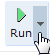, and in the pop-up window that appears, select or clear **Failures only**.
-   Select or clear the **Failures only** setting that appears on the top of the window upon executing all tests at once as displayed in Figure 107: Number of tests per page setting.

Additionally, the number of failed test cases displayed for one unit test can be limited. For example, a user is testing rules iteratively and is interested just in the first several failures in order to analyze and correct them, and re-execute tests, sequentially correcting errors. To do this, change **All** on an appropriate value next to **Failures per test** label or **first** label (for method 3). The setting is available only if **Failures only** is selected.

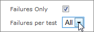

*Settings for displaying failed test cases only*

##### Displaying Compound Result

The result of a rule table execution can be a single value or compound value such as spreadsheet. A test table specifies what is tested, full result or particular parts of it, and their expected results of each test case. In the following example, *IncomeForecastTest* is intended to check Minimal and Maximal Total Salary values in the resulting spreadsheet:

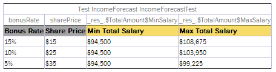

*Testing tables with compound result on*

After running the test, OpenL Studio displays each test case with input values and actual results marked as passed or failed.

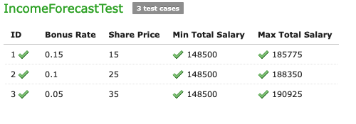

*Testing spreadsheet result*

In cases when test result is complex (compound), there is an option to display the full result of running test cases as well, not only values which are being tested. It is configured for each user individually in User Profile as “**Compound Result**” setting. If the option is switched on, the result of running *IncomeForecastTest* looks as follows:

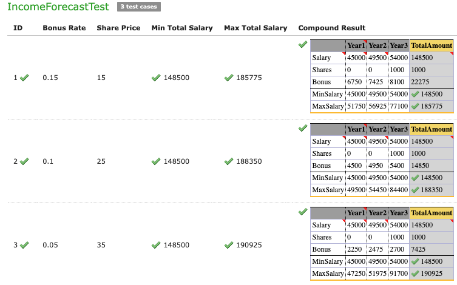

*Displaying compound result*

This setting for a particular test run (without updating user settings) can be changed in the same ways as it is described in [Displaying Failures Only](#displaying-failures-only).

#### Creating a Test

OpenL Studio provides a convenient way to create a new test table.

When an executable table, such as Decision, Method, Spreadsheet, ColumnMatch, or TBasic table, is created, the **Create Test** item becomes available.

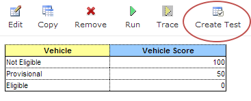

*Create new test table*

Proceed as follows:

1.  To create a Test table for the current table, click the **Create Test** button.

    OpenL Studio opens the **Create Table** window. The Test table skeleton is generated from the current table
    signature, including its input parameters and expected result column.

    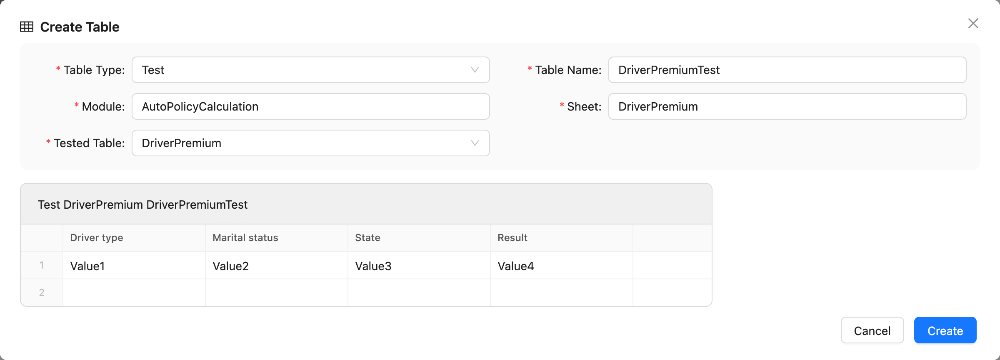

    *A Test table generated from the tested table*

1.  Select the destination module and sheet, edit the generated skeleton as required, and click **Create**.

1.  Enter test input values and expected result values in the created Test table.

### Tracing Rules

When a rule returns a result you did not expect, tracing lets you see **how** that result was produced. OpenL Studio re-runs the rule and lets you pause it and walk through the calculation step by step: the value each cell produced, which rows of a decision table fired, and how one rule passed its result to the next.

Tracing only *reads* the calculation. It does not change your data or your rules, so you can explore freely.

Tracing is available for everything that can be run:

-   All test tables
-   Rule tables, where you provide the input parameters
-   Method tables with preset parameters

> [!Note]
> The trace opens in a separate browser window. Make sure the browser does not block pop-up windows for OpenL Studio, otherwise the window does not appear. For details on allowing pop-ups, refer to the specific browser Help.

#### Starting a Trace

1.  In Rules editor, open the table to trace and click **Trace** in the toolbar above the table.

    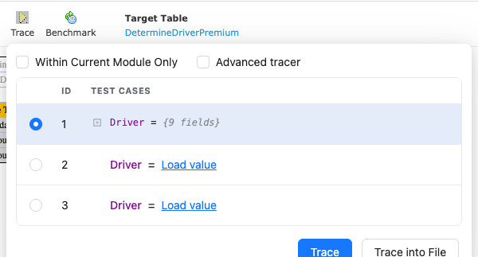

    *Starting a trace from the table toolbar*

1.  For a rule or method table, provide the input parameters in the pop-up:

    -   **Tree Form** — fill in the parameter fields.

        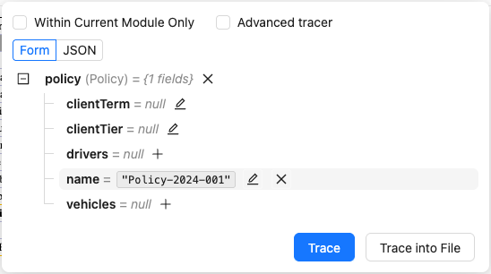

        *Entering parameters for a rule table*

    -   **JSON** — for advanced use. If a developer gave you the input as a JSON request, for example taken from a log, paste it here instead of filling in the fields. If the rule uses a runtime context (**Provide runtime context** is on in its deploy configuration), the JSON must include the `context` object. Most users can ignore this option and stay on **Tree Form**.

        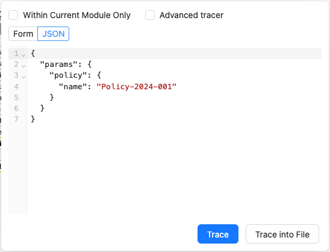

        *Providing input as JSON*

1.  For a test table, select the test cases to trace in the pop-up. The checkbox next to **Test Parameter(s)** selects or clears all cases at once.

    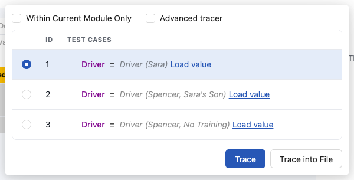

    *Selecting test cases to trace*

1.  To trace only the rules of the current module and skip the modules it depends on, select **Within Current Module Only**.
1.  Click **Trace**. The trace window opens and pauses at the very beginning, before anything has run, and waits for you.

To save the calculation as a text file instead of opening the trace window, click **Trace into File**. OpenL Studio runs the rule and downloads the result as `trace.txt`.

#### The Trace Window

The trace window has a control toolbar at the top, a left panel for navigating the calculation, and a right panel with the details of the selected step.

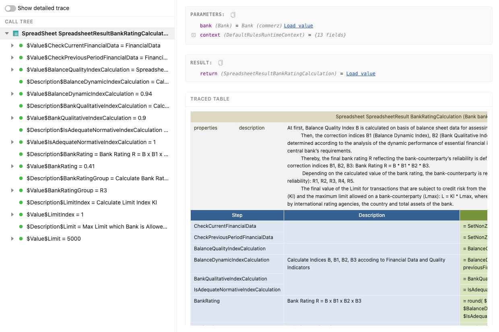

*The trace window*

-   **Toolbar** — the buttons that run and pause the calculation, and the current status.
-   **Left panel** — lists the rules as they run. It also holds the **Breakpoints** and **Watch** tools, and lets you switch between the **Tree**, **Call Stack**, and (while profiling) **Hot Spots** views.
-   **Right panel**, also called **Details** — while the calculation is paused, shows everything about the selected step: its inputs, its result, the table itself, and any errors.

The **status** next to the toolbar tells you where the calculation is:

-   **Starting** — the run is being prepared.
-   **Running** — the calculation is in progress.
-   **Suspended** — paused and waiting for you to act. This is your turn to look around or move forward.
-   **Completed** — the calculation finished.
-   **Error** — the calculation failed. A banner reports what went wrong; **Show technical details** reveals the underlying error for developers.
-   **Terminated** — you stopped the run before it finished.

> [!Note]
> You can read a rule's values — its inputs, result, and decision — only while the calculation is **paused** on it. Once it reaches **Completed** the values are no longer available, so inspect a rule while stopped on it, not after the run ends.

#### Following a Calculation

Here is a typical trace — for example, to understand why a premium came out higher than expected.

1.  Start a trace on the rule or test case that produces the value. The window opens paused at the beginning.
1.  Reach the rule you want to inspect and pause on it — either set a **breakpoint** on it and click **Resume** to run straight there, or click **Step over** to move through the calculation and **Step into** to go inside a rule it called.
1.  While the calculation is paused on the rule, the right **Details** panel shows the inputs it received (**Parameters**), the value it produced (**Result**), and the table with the relevant cells highlighted.
1.  For a decision table, step forward until a rule fires; the **Decision** panel then highlights the rule that fired and shows, for each condition, a green check if it matched or a red cross if it did not — so you can see exactly why that row was chosen. (Right after you stop at the table it shows *No rule has fired yet* until you step on.)
1.  To measure where the time goes rather than read values, turn on **Profiling** and run to the end; the **Tree** and **Hot Spots** then show how long each rule took (see [Measuring Performance](#measuring-performance-hot-spots)).

#### Running and Stepping

You control the calculation from the toolbar. The step buttons — **Resume**, **Step over**, **Step into**, and **Step out** — work only while the calculation is paused (**Suspended**); **Pause** works only while it is running. A button is greyed out when it does not apply, which is normal.

-   **Resume** (the ▶ button) — run the calculation forward: to the next breakpoint, or, if there is none, all the way to the end. This is the main "go" button. With no breakpoints set, it runs to **Completed** — and because the values are kept only while paused, set a breakpoint or step if you want to stop and inspect a rule.
-   **Pause** — stop a running calculation at the next step, so you can look at where it is.
-   **Step over** — run the next step and stop, without opening any rule it calls. Use this to move through a calculation quickly.
-   **Step into** — go inside the rule called by the next step, to see how it produces its value. This is how you look deeper into a called rule.
-   **Step out** — finish the current rule and go back up to the rule that called it. Use it once you have stepped into a rule and seen enough.
-   **Stop** — end the trace.
-   **Rerun** — start the whole trace over from the beginning.

In everyday use, **Resume** and **Step over** are enough. Reach for **Step into** only when you want to open a called rule and see how it computed its value.

#### Navigating the Calculation

As the calculation runs, each rule that is still being worked out is called a **frame**. When one rule uses another, the calculation moves into the second rule while the first one waits for its answer — so several rules can be in progress at once, stacked in the order they were called. The **current frame** is the one at the top: the rule running right now. Its details are shown by default, and, while paused, you can select any other frame to look at it instead.

The left panel lists the rules in two views:

-   **Tree** — the rules shown as an indented list that mirrors how one rule called another. While paused, click the step you want and read its values in the **Details** panel. Once a run has finished with **Profiling** on, the Tree keeps the shape of the whole calculation and each line's timing, but not its values — to see a finished rule's values again, use its **Replay** button, which restarts and runs back to that rule and pauses on it.
-   **Call Stack** — the list of rules currently in progress (the frames), with the current one at the top. Despite the technical name, it simply answers "which rules are being worked out right now, and how did we get here?" Each row shows the rule's name, its kind (for example, `decisionTable` or `spreadsheet`), and the line it is currently on. Click any row to inspect that rule.

    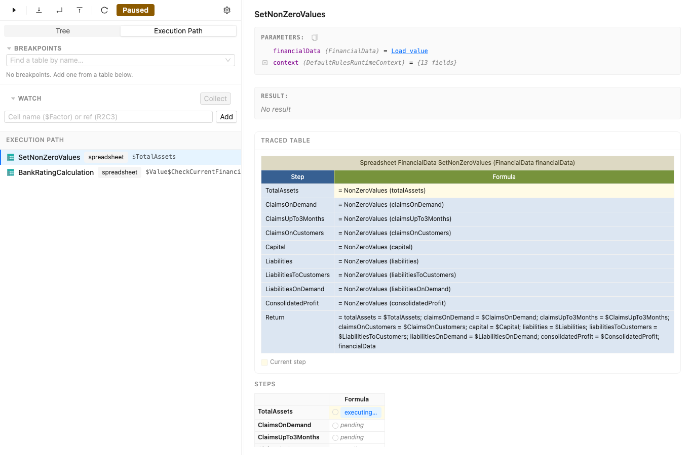

    *The Call Stack: the rules in progress, the current one at the top*

With **Profiling** on, each line in the Tree also shows how long its rule took to calculate. By default this is the **Total** time — the time for the rule including every rule it called. Switch to **Self** to see only the time spent in the rule itself, without the rules it called.

In a profiled run's Tree, a step marked **ref** points to a value that was already calculated elsewhere in the same table; click it to jump to where it was calculated. When a rule exists in several versions, the trace shows which version was used.

#### Breakpoints

A **breakpoint** tells the trace to pause when a chosen table is about to run, so you do not have to step through everything to get there. When you press **Resume**, the calculation runs until it reaches a breakpoint and then pauses, ready to inspect.

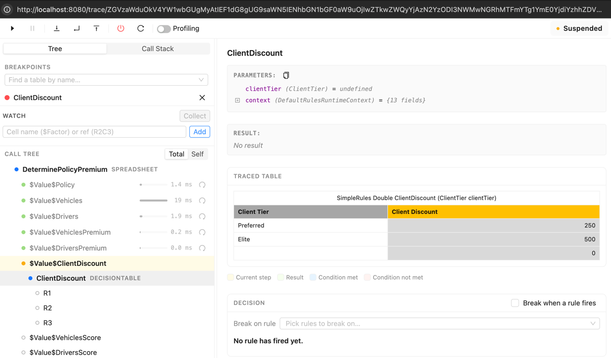

*Managing breakpoints*

-   To pause at a table, find it by name in the **Breakpoints** panel and add it. The calculation then pauses every time that table is about to run. This works even for a table deep inside the calculation — set the breakpoint, then press **Resume** to jump straight to it.
-   To pause at a single cell of a spreadsheet, first stop on that spreadsheet, then, in the **Steps** grid on the right, click the margin to the left of a cell that has not run yet.
-   To pause on a decision table's rules, stop on the table and use the **Decision** panel on the right: turn on **Break when a rule fires** to pause whenever the table fires a rule (when all of a rule's conditions match), or use **Break on rule** to pause only on the rules you select.
-   Remove a breakpoint from the **Breakpoints** panel when you no longer need it.

#### Reading a Step

While the calculation is paused, select a step in the left panel (or a frame in the **Call Stack**) to inspect it in the right **Details** panel. It shows the step name, the inputs it received (**Parameters**), the value it produced (**Result**), and any **Errors**. Next to the parameters and the result is a copy icon that copies them as JSON — handy for reusing them as a new test case. Large values are not loaded until you ask — click **Load value** to expand them.

The selected step's table is shown with the calculation highlighted.

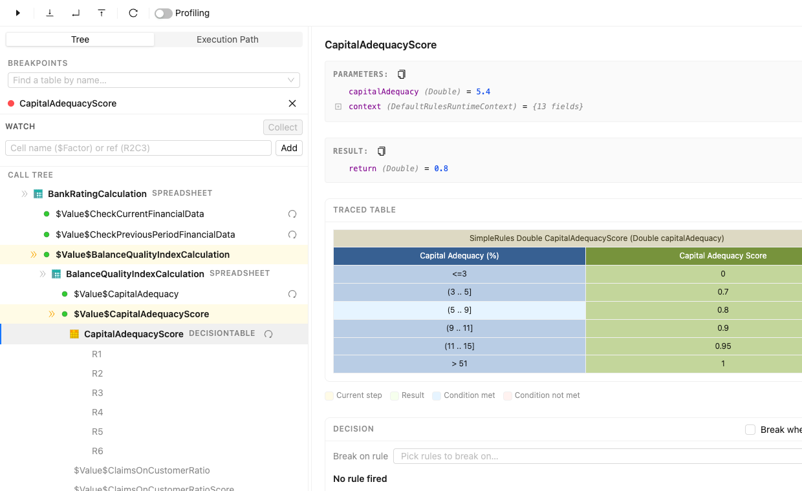

*A traced decision table, highlighted while paused on a step*

The colours have a fixed meaning, shown in the legend below the table:

-   **Current step** — the cell being calculated now.
-   **Result** — the cell that produced the step's result.
-   **Condition met** and **Condition not met** — for decision tables, which conditions passed and which did not.

What else the step shows depends on the kind of table:

-   A **spreadsheet table** shows a **Steps** grid with the value calculated in each cell. Cells that have not run yet appear as pending, and the cell running now as executing.
-   A **decision table** shows a **Decision** panel that lists every rule the table evaluated. The rule that fired is highlighted; for each rule, a green check marks a condition that matched and a red cross one that did not.

> [!Note]
> Very large tables are shortened in the trace window. To see all rows, open the table in Excel.

#### Watching Cell Values

The **Watch** panel captures the value of chosen cells every time their table runs. This helps you spot where a value goes wrong — for example, watch a rating factor to see that it is `1.0` for most drivers but `2.5` for one, which explains a high premium.

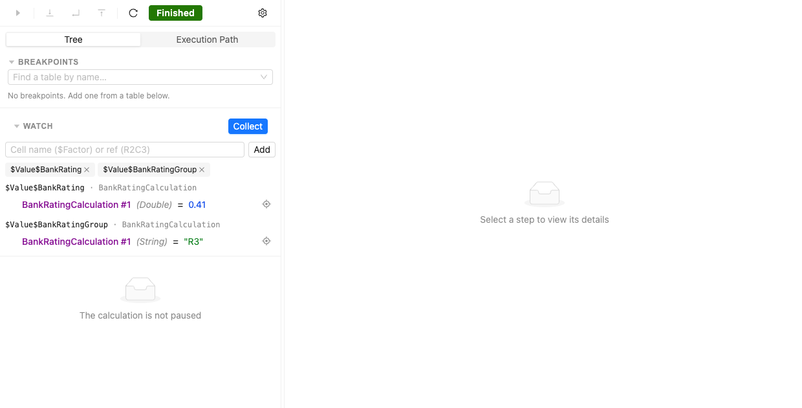

*Watching cell values*

1.  Type a cell name, such as `$Factor`, or a cell reference, such as `R2C3` (the reference shown for the cell in the **Steps** grid), into the box and click **Add** (or press Enter). Each watched cell appears as a tag; remove one with its ✕.
1.  Click **Collect**. OpenL Studio runs the calculation to the end and records the value of each watched cell every time its table runs.
1.  The panel lists the captured values, grouped by cell and table, in the order they were calculated. If a table runs very many times, the list is capped and shows the first values collected.

#### Measuring Performance (Hot Spots)

Turn on the **Profiling** switch to keep the whole calculation and measure how long each rule takes. Turning it on restarts the trace at the beginning; press **Resume** to run it. When it finishes, the Tree keeps the shape of the whole calculation with each rule's timing (its values are not kept — use **Replay** to return to a rule and read them).

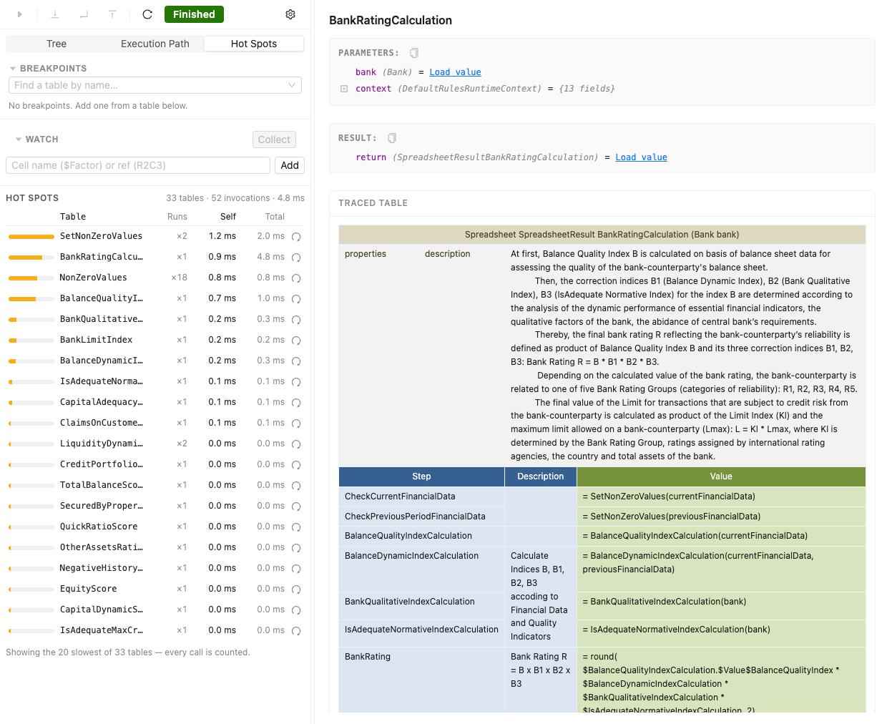

*Hot spots after a timed run*

-   In the **Tree**, each rule and step shows its time — **Total** (including the rules it called) by default, or **Self** (the rule itself only) if you switch.
-   The **Hot Spots** view ranks the tables that ran by time, showing how many times each ran (**Runs**), its **Self** time, and its **Total** time — a quick way to find the slowest rules.
-   From a hot spot or a step in the tree, use **Replay** to restart the trace and run back to that table, pausing at its start so you can step through it and read its values. This differs from **Rerun**, which restarts to the very beginning.

> [!Note]
> Profiling keeps the whole calculation in memory, so it uses more memory and runs slower. Turn it off when you do not need the timings.

### Using Benchmarking Tools

OpenL Studio provides benchmarking tools for measuring execution time for all appropriate OpenL Tablets elements. In OpenL Tablets, everything that can be run can be benchmarked too. Benchmarking is useful for optimizing the rule structure and identifying critical paths in rule calculation.

The benchmarking icon is displayed above the table to be traced.

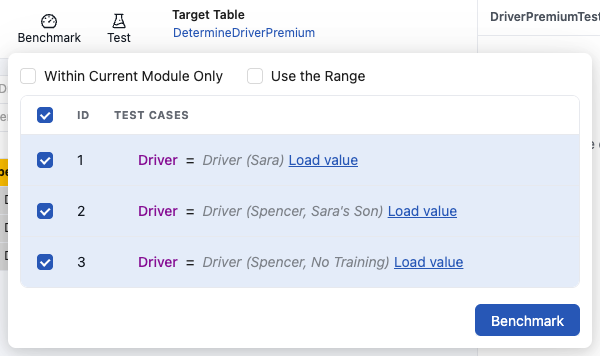

*Controls for measuring performance*

For a test table, select the test cases as follows:

1.  Open the required test table.
2.  Navigate to the **Benchmark** button above the test table and click the small right-hand black arrow to open a pop-up with test cases as needed.
3.  Select or deselect the test cases as needed.

    By default, all cases are selected. All test cases can be also checked or unchecked by using the checkbox on the left of **Test Parameter(s)**.

1.  Click the **Benchmark** button within the pop-up.

Clicking the benchmarking icon runs the corresponding method or set of methods and displays the results in a table.

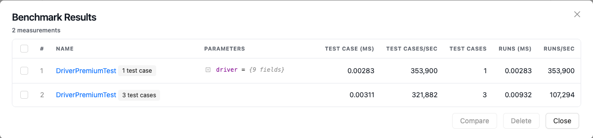

*Benchmarking results*

Benchmark is displayed using the following parameters:

| Parameter      | Description                                                                             |
|----------------|-----------------------------------------------------------------------------------------|
| Test Case (ms) | Time of one test case execution, in milliseconds.                                       |
| Test Cases/sec | Number of such test cases that can be executed per second.                              |
| Test Cases     | Number of test cases in a Test table.                                                   |
| Runs (ms)      | Time required for all test cases of the table, or rule set, execution, in milliseconds. |
| Runs/sec       | Number of such rule sets that can be executed per second.                               |

OpenL Studio remembers all benchmarking runs executed within one session. Every time a new benchmark is run, a new row is added to the results table.
Benchmarking results can be compared to identify the most time consuming methods. Select the required check boxes and click **Compare** to compare results in the results table.
Comparison results are displayed below the benchmarking table.

*Comparing benchmarking results*
