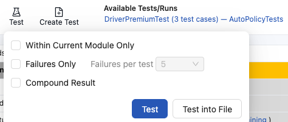
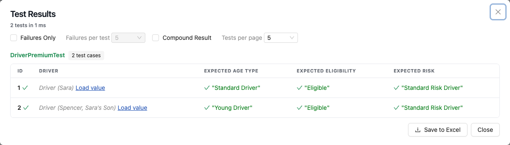
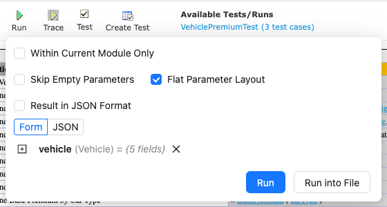
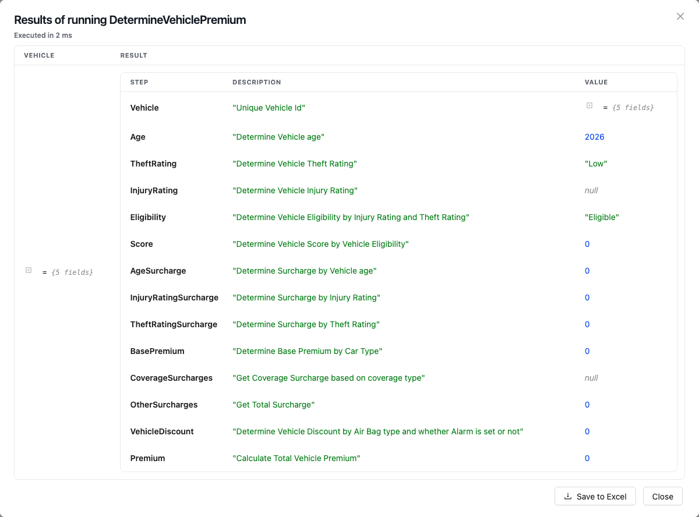

## Editing and Testing Functionality

This chapter describes advanced OpenL Studio functions, such as table editing, performing unit tests, rule tracing, and benchmarking. The following sections are included in this chapter:

-   [Editing Tables](#editing-tables)
-   [Using Table Versioning](#using-table-versioning)
-   [Performing Unit Tests](#performing-unit-tests)
-   [Tracing Rules](#tracing-rules)
-   [Using Benchmarking Tools](#using-benchmarking-tools)

### Editing Tables

This section describes table editing and includes the following topics:

-   [Editing a Comma Separated Array of Values](#editing-a-comma-separated-array-of-values)
-   [Editing Default Table Properties](#editing-default-table-properties)
-   [Editing Inherited Table Properties](#editing-inherited-table-properties)

#### Editing a Comma Separated Array of Values

OpenL Studio allows editing comma separated arrays of values. A multi selection window displaying all values appears enabling the user to select the required values.

*Editing comma separated arrays*

#### Editing Default Table Properties

This section describes table properties available in OpenL Studio. For more information on table properties, see [OpenL Tablets Reference Guide > Table Properties](https://openldocs.readthedocs.io/en/latest/documentation/guides/reference_guide/table-properties).

If default property values are defined for a table, they appear only in the right hand **Properties** section, but not in the table. In the following example, there are **Active = true** and **Fail On Miss = false** default properties.

*Default table properties example*

Default properties can be overridden at the table level; in other words, they can be changed as follows:

1.  In the **Properties** section, click the default property to be changed.

    lnstead of the property value, a checkbox appears:

    

    *Updating a default property*

1.  Select or deselect the checkbox as needed and click the **Save** button.

    The property appears in the table with its new value.

    

    *Default property was updated by a user*

#### Editing Inherited Table Properties

Module or category level properties are those inherited from a **Properties** table as described in [OpenL Tablets Reference Guide > Properties Table](https://openldocs.readthedocs.io/en/latest/documentation/guides/reference_guide/#properties-table). In the **Properties** section of the given table, inherited properties appear in a different color and are accompanied with a link to the **Properties** table where they are defined. The values of the inherited properties are not stored in the table, they are displayed in the **Properties** section, since they are inherited and applied to this table. Inherited properties can be overridden at a Table level, i.e. they can be changed.

*An example of inherited category-level properties*

To change an inherited property, perform the following steps:

1.  In the **Properties** section, click the inherited property to be changed.
2.  Enter or select the required values from the drop-down list and click **Save**.

    

    *Updating an inherited property*

    The system displays the property in the table.

    

    *Inherited category-level property updated by a user*

The following topics are included in this section:

-   [Editing System Properties](#editing-system-properties)
-   [Editing Properties for a Particular Table Type](#editing-properties-for-a-particular-table-type)

##### Editing System Properties

By default, OpenL Studio applies system properties to each created or edited table. The values of the System properties are provided in the table and in the Properties section.

The **modifiedBy** property value is set using the name of the currently logged in user. The **modifiedOn** property is set according to the current date. These properties are applied upon each save.

The **createdBy** property value is set using the name of the currently logged in user. The **createdOn** property is set according to the current date. These properties are applied on the first save only while creating or copying a table in OpenL Studio. A copy is a new table, so it records its own author and date rather than inheriting the ones of the table it was copied from.

The **createdBy** and **modifiedBy** properties are only applied in the multi-mode as described in [Security Overview](introduction.md#security-overview).

System properties cannot be edited in UI. The OpenL Studio users can delete those properties if required.

*An example of system properties*

##### Editing Properties for a Particular Table Type

Some properties are only applicable to particular types of tables. When opening a table in OpenL Studio, the properties section displays properties depending on the type of the table.

For example, such property as **Validate DT** is available for Decision Tables. That means it can be selected in the drop-down list after clicking the **Add** link at the bottom of the **Properties** section. The following figure shows properties applied to a Decision Table:

*Properties for the Decision table type*

When opening a Data Table in the same project, these properties are not available for selecting from the drop-down list in the **Properties** section.

*The Decision table properties that are not available for a Data table*

The **Copy table** window reads the properties explicitly defined on the source table. It displays them as editable
property name and value rows, offering the properties applicable to the table's type by their display names under the
**Info**, **Business Dimension**, **Version** and **Dev** groups — the same names and grouping the **Table Details**
editor uses. The copy keeps the source table's formatting — its cell styles, merged cells and comments.

To create a variant of a rule that OpenL selects at runtime from the request context, keep the source table's name and
give the copy a different value for a **Business Dimension** property, such as **US States** or **LOB**. The copy is
created with its properties already set, so the two same-named tables are told apart from the start.

To create a new version of a rule, keep the source table's name and give the copy a **Version** property. The version
is entered as its three numbers, and the version the source stands for is named beside them. The window opens on the
first version the table's versions leave free, and a version any of them already carries is refused — two versions
under one number leave the engine unable to order them. Only one version of a table is active at a time, so the
version the copy replaces stops being the active one; a table that declared no version until then keeps `0.0.1`, and
the copy becomes the version the rule runs.

To add a new property for the selected table, perform the following steps:

1.  In the **Properties** pane, click the **Add Property** link.

    

    *Add new property for the current table*

1.  Enter the required property or select it from the drop-down list and click the **Add** button.

    

    *Selected table property to be added*

1.  Specify the property value and then click the **Save** button to complete.

    All steps are collected in the following figure:

    

    *Saving a new property for the current table*

### Using Table Versioning

The table versioning mechanism groups tables with the same identity and dimensional properties by their Version
property.

A new table version has the same identity, that is, signature and dimensional properties of the previous version. When a new table version is created, the previous version becomes inactive since only one table version can be active at a time. By default, all tables are active. The following is an example of an inactive table version.

*An inactive table version*

Versions of the same table are grouped in the module tree under the table name. Clicking the table name displays the active version. If all tables are set to inactive, the latest created version is displayed.

*Displaying table versions in the module tree*

The table version is defined in a three digit format, such as 4.0.1. Table versions must be set in an increasing order.

*Entering a new version number*

### Performing Unit Tests

Unit tests are used in OpenL Tablets to validate data accuracy. OpenL Tablets Test tables with predefined input data call appropriate rule tables and compare actual test results with predefined expected results.

For example, in the following diagram, the table on the left is a decision table but the table on the right is a unit test table that tests data of the decision table:

*Decision table and its test table*

OpenL Studio supports visual controls for creating and running project tests. Test tables can be modified like all other tables in OpenL Studio. For information on modifying a table, see [Modifying Tables](rules-editor.md#modifying-tables). Test results are displayed in a simple format directly in the user interface.

The following topics are included in this section:

-   [Adding Navigation to a Table](#adding-navigation-to-a-table)
-   [Running Unit Tests](#running-unit-tests)
-   [Creating a Test](#creating-a-test)

#### Adding Navigation to a Table

OpenL Studio adds a view navigation link to the appropriate test table and vice versa. See the following example:

*Navigation link to target table*

#### Running Unit Tests

This section describes how a table and its tests are run, and how the results read. The following topics are
included in this section:

-   [Running the Tests of a Table](#running-the-tests-of-a-table)
-   [Running All Tests of a Module](#running-all-tests-of-a-module)
-   [Reading Test Results](#reading-test-results)
-   [Running a Table](#running-a-table)

##### Running the Tests of a Table

1.  In Rules editor, open the rule table to test and click **Test** in the toolbar above it. The button appears
    for a table that has test tables. A panel opens under the button; clicking elsewhere on the page closes it.

    

    *Running every test of a rule table*

1.  To run only the rules of the current module and skip the modules it depends on, select **Within Current
    Module Only**. While the project is still loading, or another module has errors, only the current module can
    be used: the option is selected and cannot be changed.
1.  **Failures Only** and **Compound Result** say what the results show; they can be changed there as well.
1.  Click **Test**. Every test table that tests this rule table runs, and the results open in a window over the
    table. Closing the window returns to the table, so a rule can be corrected and the tests run again.
    **Test into File** runs them and saves the results as a workbook without showing them.

To run a test table itself, open it and click **Run**: the panel lists its cases, every one of them runs unless
some are ticked, and the results open in the same window. Selecting the cases is described in
[Starting a Trace](#starting-a-trace), which lists them the same way.

##### Running All Tests of a Module

1.  Click **Test** in the module toolbar, above the module tree. The number next to it counts the tests of the
    project.
1.  In the panel that opens, leave **Within Current Module Only** clear to run every test of the project,
    including the modules it depends on, or select it to run the tests of the current module only. **Tests per
    page**, **Failures Only** and **Compound Result** say what the results show.
1.  Click **Test**. The results are shown the same way as the tests of a single table, so only one kind of
    results screen has to be read. **Test into File** saves them as a workbook without showing them.

##### Reading Test Results

The results window lists every test table that ran, with the number of cases it holds and, in red, how many of
them failed. The name of a table is green when every case of it passed and red when one did not, and it opens
that test table in the editor. Every case is a row of that table: its id, a column for each value it was given,
and a column for each value the test compares. A tick or a cross stands next to the case and next to every
value that was compared, and a case that failed says how many of its comparisons did not match and shows the
value that was expected under the value that came out.

A Run table states no expected values, so its results carry no ticks and no crosses: they only show what every
run returned.

*Results of a test run*

The options above the list decide what it shows. They apply at once, without running the tests again:

-   **Failures Only** — leaves out the cases that passed. **Failures per test** next to it limits how many
    failures of one test table are listed, so a long list stays readable while a rule is corrected step by step.
-   **Compound Result** — adds the whole value the rule returned to every case, and not only the values the test
    compares. It is what a spreadsheet result is read with: the test names a few of its steps, and this option
    shows all of them.
-   **Tests per page** — how many test tables one page holds; the pager under the list reaches the rest. **All**
    puts every test table on one page.

The screen opens with the options as they are saved in **My Settings**, and changing them here applies to this
run only.

To save the results, click **Save to Excel**. The workbook holds the same results and the input of every case.

##### Running a Table

A rule table can be run on its own, without a test table for it.

1.  Open the table and click **Run** in the toolbar above it. The panel asks for the input the table takes: the
    parameters as a tree, or the same input as JSON, exactly as
    [Starting a Trace](#starting-a-trace) describes. A table that takes no parameters runs at once, with no panel.

    

    *Running a table with the input it takes*

1.  Click **Run**. The result opens in a window over the table: one row of what the table was given and what it
    returned, a column each, with the runtime context first when the project provides one.

    

    *Result of running a table*

    A table that returns a spreadsheet shows it as the table its author wrote: a row per step, a column per
    spreadsheet column, and the calculated value in every cell.

1.  To save the result, click **Save to Excel**.

To save the result without reading it first, click **Run into File** instead of **Run**. The table runs and the
result is written straight to a file, which is what a result too large to read on screen is taken with. A test
table offers **Test into File** in the same place, and saves the results of its cases as a workbook.

Three options above the input decide what the file of a rule table holds:

-   **Skip Empty Parameters** — leaves the input values that are empty out of the workbook.
-   **Flat Parameter Layout** — writes every field of an input on a row of its own. Clear it for a compact table
    of the inputs.
-   **Result in JSON Format** — writes the returned value on its own as JSON, instead of the workbook of the run.

#### Creating a Test

OpenL Studio provides a convenient way to create a new test table.

When an executable table, such as Decision, Method, Spreadsheet, ColumnMatch, or TBasic table, is created, the **Create Test** item becomes available.

*Create new test table*

Proceed as follows:

1.  To create a Test table for the current table, click the **Create Test** button.

    OpenL Studio opens the **Create Table** window. The Test table skeleton is generated from the current table
    signature, including its input parameters and expected result column.

    

    *A Test table generated from the tested table*

1.  Select the destination module and sheet, edit the generated skeleton as required, and click **Create**.

1.  Enter test input values and expected result values in the created Test table.

### Tracing Rules

When a rule returns a result you did not expect, tracing lets you see **how** that result was produced. OpenL Studio runs the rule and shows every rule that executed as a tree; click any rule to see the values it received and the result it returned, which rows of a decision table fired, and how one rule passed its result to the next.

By default, tracing opens the **business view**, described first below. It runs the calculation for you and shows the whole tree at once — nothing to step through, nothing to configure. For deeper investigation, an **advanced mode** turns the trace into an interactive debugger; it is described separately in [The Advanced Mode](#the-advanced-mode).

Tracing only *reads* the calculation. It does not change your data or your rules, so you can explore freely.

Tracing is available for everything that can be run:

-   All test tables
-   Rule tables, where you provide the input parameters
-   Method tables with preset parameters

> [!Note]
> The trace opens in a separate browser window. Make sure the browser does not block pop-up windows for OpenL Studio, otherwise the window does not appear. For details on allowing pop-ups, refer to the specific browser Help.

#### Starting a Trace

1.  In Rules editor, open the table to trace and click **Trace** in the toolbar above the table. A panel opens under the button; clicking elsewhere on the page closes it.

    

    *Starting a trace from the table toolbar*

1.  For a test table, select the test case to trace. Every case is listed by ID with the values of its columns, shown the way the trace window shows them, and the first case is selected at first. A trace runs one case, so click the case to trace. A value with inner structure, such as a whole datatype, is not read until you ask for it. Click **Load value** next to it to see it.

    

    *Selecting a test case to trace*

    A table with more than 25 cases is shown a page at a time; a pager appears under the list to reach the rest, and the case you selected stays selected while you look through the other pages.

1.  For a rule or method table, provide the input parameters instead:

    -   **Form** — the parameters are shown as a tree, one folded line each, and clicking the arrow next to a parameter shows its fields with the value of every field next to its name; a field with a default value in its datatype starts with that value, the others start as `null`. Click the pencil next to a field to enter or change its value: a number field takes only a number, a date opens a calendar, and a value with a fixed set of options offers them in a list; the cross clears the value back to `null`. A nested object starts as `null`: **+** creates it with its fields empty, **×** makes it `null` again. A list starts as `null` too: **+** creates it, **+** on the list adds a `null` element that another **+** turns into an object, and **−** next to an element removes it. When the project provides a runtime context to its rules, **Runtime Context** is the last line of the form, under the parameters, and opens the same way.

        

        *Entering parameters for a rule table*

    -   **JSON** — for advanced use. If a developer gave you the input as a JSON request, for example taken from a log, paste it here instead of filling in the fields. Switching to **JSON** shows what the form holds, so the form can be filled in first and adjusted as text; switching back reads the text into the form. If the rule uses a runtime context (**Provide runtime context** is on in its deploy configuration), the JSON can carry it in the `runtimeContext` object. If the option is off or `isProvideRuntimeContext` is absent from `rules-deploy.xml`, OpenL Studio treats runtime context as disabled. A parameter that is itself another spreadsheet's result is written by that spreadsheet's step names, exactly as OpenL Rule Services publishes it, so a request captured from a deployed service can be pasted as is. Most users can ignore this option and stay on **Form**.

        

        *Providing input as JSON*

1.  To trace only the rules of the current module and skip the modules it depends on, select **Within Current Module Only**. While the project is still loading, or another module has errors, only the current module can be traced: the option is selected and cannot be changed.
1.  Leave **Advanced tracer** off — the default — to open the business view. Select it only for the full step debugger; see [The Advanced Mode](#the-advanced-mode). The mode is chosen here, before the trace starts, and stays fixed for the trace window.
1.  Click **Trace**. The trace window opens and runs the calculation. A table that takes no parameters is traced as soon as **Trace** is clicked in the toolbar; no panel opens for it.

To save the calculation as a text file instead of opening the trace window, click **Trace into File**. OpenL Studio runs the rule and downloads the result as `trace.txt`.

#### The Business View

The business view is the default trace. It runs the calculation on its own and shows the tree of every rule that executed on the left, with the details of the selected rule on the right. This view answers the everyday question — what did this rule receive and what did it return — with nothing to configure.

*The business view: the call tree on the left, the selected rule's details on the right*

-   **Left panel** — the **Show detailed trace** toggle at the top, always in view, and the calculation tree below it: every rule that executed, in the order it was called. Each rule reads with its signature and result, and each spreadsheet cell with its value — a decision table as `DT RatingGroup BankRatingGroup(Double bankRating)` — the way the classic trace showed it. The toggle adds the description and reference cells that the everyday view hides.
-   **Right panel**, also called **Details** — everything about the selected rule: the values it received (**Parameters**), the value it produced (**Result**), the table itself, and any errors.

While the calculation runs, a progress note counts the rules as the tree is prepared; the finished tree is the answer, with no status to watch. If the calculation fails, a banner reports what went wrong, and the tree still shows every rule that ran up to the failure, with the failing rule — and each rule that called it — marked `= ERROR`. The trace opens that path for you, so the failing rule is in view at once, and clicking it shows the error in the **Details** panel — you land on exactly where the calculation broke. If a run cannot produce a tree at all — a dropped connection, say — the panel offers a **Try again** button to run it again in place.

#### Exploring the Calculation

1.  Open the trace. The business view runs the whole calculation on its own and builds the complete tree of every rule that ran; for a large calculation, a progress note counts the rules while the tree is prepared.
1.  Expand any branch. The whole tree is already in the window, so branches open instantly, however deep you go.
1.  Click a rule to inspect it. The **Details** panel shows the values it received (**Parameters**), the value it produced (**Result**), and its table with the calculation highlighted — see [Reading a Step](#reading-a-step). A click on a **step** of a rule keeps the panel on that step: its **Parameters** are the values the step's formula used, named exactly as the formula writes them — other steps (`$LimitIndex`), the table's inputs, constants (`MaxLimit`) — its **Result** is the value the step computed, and the step's cell is pointed out in its own table.

Behind the scenes, clicking a rule quietly re-runs the calculation up to and through that rule: the engine does not keep every intermediate value, so OpenL Studio recomputes them on demand. The tree itself never changes — it is the record of the original run, and only the **Details** panel follows your clicks. On a heavy calculation the re-run takes a moment, shown by the **Calculating** badge.

The business view runs once, on open. To trace the table again — for example after changing the rules or the input — close the trace window and start a new trace from the editor.

#### Reading a Step

Click a rule in the tree to inspect it in the **Details** panel. (In the advanced mode, select a step while the calculation is **paused**; the same panel opens.) It shows the step name, the inputs it received (**Parameters**), the value it produced (**Result**), and any **Errors**. Next to the parameters and the result is a copy icon that copies them as JSON — handy for reusing them as a new test case. Large values are not loaded until you ask — click **Load value** to expand them.

The selected step's table is shown below, with the calculation highlighted.

*A traced decision table: the row that fired is highlighted*

What the table shows depends on its kind:

-   A **decision table** highlights the rule that fired — the row whose conditions all matched, which produced the result.
-   A **spreadsheet table** shows a **Steps** grid with the value calculated in each cell. Cells that have not run yet appear as pending, and the cell running now as executing.

The colours have a fixed meaning, shown in the legend below the table: **Result** marks the cell or row that produced the step's result. In the advanced mode, while you step through a rule, **Current step** marks the cell being calculated now, and, for a decision table, **Condition met** and **Condition not met** mark for each rule which conditions passed — so you can see exactly why a row was chosen.

> [!Note]
> Very large tables are shortened in the trace window. To see all rows, open the table in Excel.

#### The Advanced Mode

Everything above is the business view. Selecting **Advanced tracer** before starting the trace instead opens a full interactive debugger: pause the calculation at any point, step through it rule by rule, set **breakpoints**, watch how a cell's value changes, and measure performance. Everything from here on describes this mode. The mode is fixed for the window — to switch, close it and start a new trace with the checkbox set the other way.

The advanced toolbar stays in view at the top of the left panel: its buttons run and step the calculation, a tag shows the run **status** — **Starting**, **Running**, **Paused**, **Finished**, or **Stopped** — and a gear on its right opens the settings, where **Profiling** and **Show detailed trace** live. The **Breakpoints** and **Watch** panels sit below it, each collapsing from its title to give the tree more room.

> [!Note]
> In the advanced mode, a **called** rule's values — its inputs, result, and decision — are readable only while the calculation is **paused** on it. After **Finished** the window keeps the top-level rule with its steps, inputs, and result, but the values of the rules it called are gone — inspect a called rule while stopped on it, not after the run ends. (The business view hides this: clicking a rule always re-runs the calculation to it.)

##### Following a Calculation

Here is a typical trace — for example, to understand why a premium came out higher than expected.

1.  Start a trace on the rule or test case that produces the value. The window opens paused at the beginning.
1.  Reach the rule you want to inspect and pause on it — either set a **breakpoint** on it and click **Resume** to run straight there, or click **Step over** to move through the calculation and **Step into** to go inside a rule it called.
1.  While the calculation is paused on the rule, the right **Details** panel shows the inputs it received (**Parameters**), the value it produced (**Result**), and the table with the relevant cells highlighted.
1.  For a decision table, step forward until a rule fires; the **Decision** panel then highlights the rule that fired and shows, for each condition, a green check if it matched or a red cross if it did not — so you can see exactly why that row was chosen. (Right after you stop at the table it shows *No rule has fired yet* until you step on.)
1.  To measure where the time goes rather than read values, turn on **Profiling** — in the toolbar's settings, behind the gear on its right, together with **Show detailed trace** — and run to the end; the **Tree** and **Hot Spots** then show how long each rule took (see [Measuring Performance](#measuring-performance-hot-spots)).

##### Running and Stepping

You control the calculation from the toolbar, and each button applies in one state: **Resume** and the step buttons — **Step over**, **Step into**, and **Step out** — work only while the calculation is paused (**Paused**), while **Pause** works only while it is running. The first button follows the state: it is **Resume** while the calculation is paused and becomes **Pause** while it is running. A button is greyed out when it does not apply, which is normal.

-   **Resume** (the ▶ button) — run the calculation forward: to the next breakpoint, or, if there is none, all the way to the end. This is the main "go" button. With no breakpoints set, it runs to **Finished** — and because the values are kept only while paused, set a breakpoint or step if you want to stop and inspect a rule.
-   **Pause** — shown in place of **Resume** while the calculation is running: stop at the next step, so you can look at where it is.
-   **Step over** — run the next step and stop, without opening any rule it calls. Use this to move through a calculation quickly.
-   **Step into** — go inside the rule called by the next step, to see how it produces its value. This is how you look deeper into a called rule.
-   **Step out** — finish the current rule and go back up to the rule that called it. Use it once you have stepped into a rule and seen enough.
-   **Rerun** — start the whole trace over from the beginning.

In everyday use, **Resume** and **Step over** are enough. Reach for **Step into** only when you want to open a called rule and see how it computed its value.

To end the trace, simply close the trace window — the calculation is stopped for you.

##### Navigating the Calculation

As the calculation runs, each rule that is still being worked out is called a **frame**. When one rule uses another, the calculation moves into the second rule while the first one waits for its answer — so several rules can be in progress at once, stacked in the order they were called. The **current frame** is the one at the top: the rule running right now. Its details are shown by default, and, while paused, you can select any other frame to look at it instead.

The left panel lists the rules in two views:

-   **Tree** — the rules shown as an indented list that mirrors how one rule called another, each line carrying the icon of its table kind. An arrow points along the calls the calculation is inside right now — bright on the current line, muted on the rules waiting above it; a line that has already run reads as plain text, and a greyed-out line has not run yet. While paused, click the step you want and read its values in the **Details** panel. When a run finishes, the Tree keeps the top-level rule and its steps, with the overall result readable in **Details**. With **Profiling** on it keeps the shape of the whole calculation — every called rule, with each line's timing — but not their values; to see a finished rule's values again, use its **Replay** button, which restarts and runs back to that rule and pauses on it.
-   **Execution Path** — the list of rules currently in progress (the frames), with the current one at the top. It answers "which rules are being worked out right now, and how did we get here?" Each row shows the rule's name, its kind (for example, `decisionTable` or `spreadsheet`), and the line it is currently on. Click any row to inspect that rule.

    

    *The Execution Path: the rules in progress, the current one at the top*

With **Profiling** on, each line in the Tree also shows how long its rule took to calculate. By default this is the **Total** time — the time for the rule including every rule it called. Switch to **Self** to see only the time spent in the rule itself, without the rules it called.

In a profiled run's Tree, a step marked **ref** points to a value that was already calculated elsewhere in the same table; click it to jump to where it was calculated. When a rule exists in several versions, the trace shows which version was used.

##### Breakpoints

A **breakpoint** tells the trace to pause when a chosen table is about to run, so you do not have to step through everything to get there. When you press **Resume**, the calculation runs until it reaches a breakpoint and then pauses, ready to inspect. The **Breakpoints** panel (and the **Watch** panel below it) collapses from its title, to give the tree more room when you are not using it.

*Managing breakpoints*

-   To pause at a table, find it by name in the **Breakpoints** panel and add it. The calculation then pauses every time that table is about to run. This works even for a table deep inside the calculation — set the breakpoint, then press **Resume** to jump straight to it.
-   To pause at a single cell of a spreadsheet, first stop on that spreadsheet, then, in the **Steps** grid on the right, click the margin to the left of a cell that has not run yet.
-   To pause on a decision table's rules, stop on the table and use the **Decision** panel on the right: turn on **Break when a rule fires** to pause whenever the table fires a rule (when all of a rule's conditions match), or use **Break on rule** to pause only on the rules you select.
-   Remove a breakpoint from the **Breakpoints** panel when you no longer need it.

##### Watching Cell Values

The **Watch** panel captures the value of chosen cells every time their table runs. This helps you spot where a value goes wrong — for example, watch a rating factor to see that it is `1.0` for most drivers but `2.5` for one, which explains a high premium.

*Watching cell values*

1.  Type a cell name, such as `$Factor`, or a cell reference, such as `R2C3` (the reference shown for the cell in the **Steps** grid), into the box and click **Add** (or press Enter). Each watched cell appears as a tag; remove one with its ✕.
1.  Click **Collect**. OpenL Studio runs the calculation to the end and records the value of each watched cell every time its table runs.
1.  The panel lists the captured values, grouped by cell and table, in the order they were calculated. If a table runs very many times, the list is capped and shows the first values collected.

##### Measuring Performance (Hot Spots)

Turn on the **Profiling** switch to keep the whole calculation and measure how long each rule takes. Turning it on restarts the trace at the beginning; press **Resume** to run it. When it finishes, the Tree keeps the shape of the whole calculation with each rule's timing (its values are not kept — use **Replay** to return to a rule and read them).

*Hot spots after a timed run*

-   In the **Tree**, each rule and step shows its time — **Total** (including the rules it called) by default, or **Self** (the rule itself only) if you switch.
-   The **Hot Spots** view ranks the tables that ran by time, showing how many times each ran (**Runs**), its **Self** time, and its **Total** time — a quick way to find the slowest rules.
-   From a hot spot or a step in the tree, use **Replay** to restart the trace and run back to that table, pausing at its start so you can step through it and read its values. This differs from **Rerun**, which restarts to the very beginning.

> [!Note]
> Profiling keeps the whole calculation in memory, so it uses more memory and runs slower. Turn it off when you do not need the timings.

### Using Benchmarking Tools

OpenL Studio measures how fast rules run. A benchmark is taken over the cases of a test table, so the rules it
tests are measured with the input the table author wrote for them. It is useful for optimizing the rule
structure and identifying critical paths in rule calculation. The following topics are included in this
section:

-   [Taking a Benchmark](#taking-a-benchmark)
-   [Reading Benchmark Results](#reading-benchmark-results)

#### Taking a Benchmark

1.  Open the test table to measure and click **Benchmark** in the toolbar above it. The button appears above a
    test table and above a Run table, over whose cases the measurement is taken. A panel opens under the
    button; clicking elsewhere on the page closes it.

    

    *Measuring a test table over its cases*

1.  The panel lists the cases of the table. Leave **All cases** selected to measure the table the way it runs,
    over every case at once, or tick the cases to measure each of them on its own. Selecting the cases is
    described in [Starting a Trace](#starting-a-trace), which lists them the same way.
1.  To measure only the rules of the current module and skip the modules it depends on, select **Within Current
    Module Only**.
1.  Click **Benchmark**. The table runs over and over until the measurement lasts long enough to be meaningful,
    so it takes a few seconds. The results then open in a window over the table.

#### Reading Benchmark Results

Every measurement is a row of the results.

*Benchmark results*

A row reports the measured table, the number of test cases one run covered, the input of the measured case, and
the following numbers:

| Parameter      | Description                                                                             |
|----------------|-----------------------------------------------------------------------------------------|
| Test Case (ms) | Time of one test case execution, in milliseconds.                                       |
| Test Cases/sec | Number of such test cases that can be executed per second.                              |
| Test Cases     | Number of test cases in a Test table.                                                   |
| Runs (ms)      | Time required for all test cases of the table, or rule set, execution, in milliseconds. |
| Runs/sec       | Number of such rule sets that can be executed per second.                               |

OpenL Studio remembers every benchmark taken within one session, the newest first, so measurements of different
tables and cases stand side by side. Measuring another project starts a new list.

Tick the rows and click **Compare** to find the most time consuming of them. The comparison is shown under the
results: it places the measurements by speed, the fastest first, and says how many times slower each of the
others is.

*Comparing benchmark results*

**Delete** forgets the rows that are ticked.
