## Getting Started

This chapter explains logging into OpenL Studio and briefly introduces the user interface. The following topics are included in this chapter:

-   [Signing In to OpenL Studio](#signing-in-to-openl-studio)
-   [Modifying User Profile](#modifying-user-profile)
-   [Displaying the OpenL Studio Help](#displaying-the-openl-studio-help)
-   [Signing Out of OpenL Studio](#signing-out-of-openl-studio)
-   [Introducing Rules Editor](#introducing-rules-editor)
-   [Introducing Repository Editor](#introducing-repository-editor)

### Signing In to OpenL Studio

To sign in to OpenL Studio, proceed as follows:

1.  In the web browser address bar, enter the OpenL Studio URL provided by the system administrator.
    The OpenL Studio URL has the following pattern:
    
    `http://<server>:<port>/webstudio`
    
    In the single user mode, users are automatically signed in using the DEFAULT account. In the multi-user mode, the following form appears.
       
       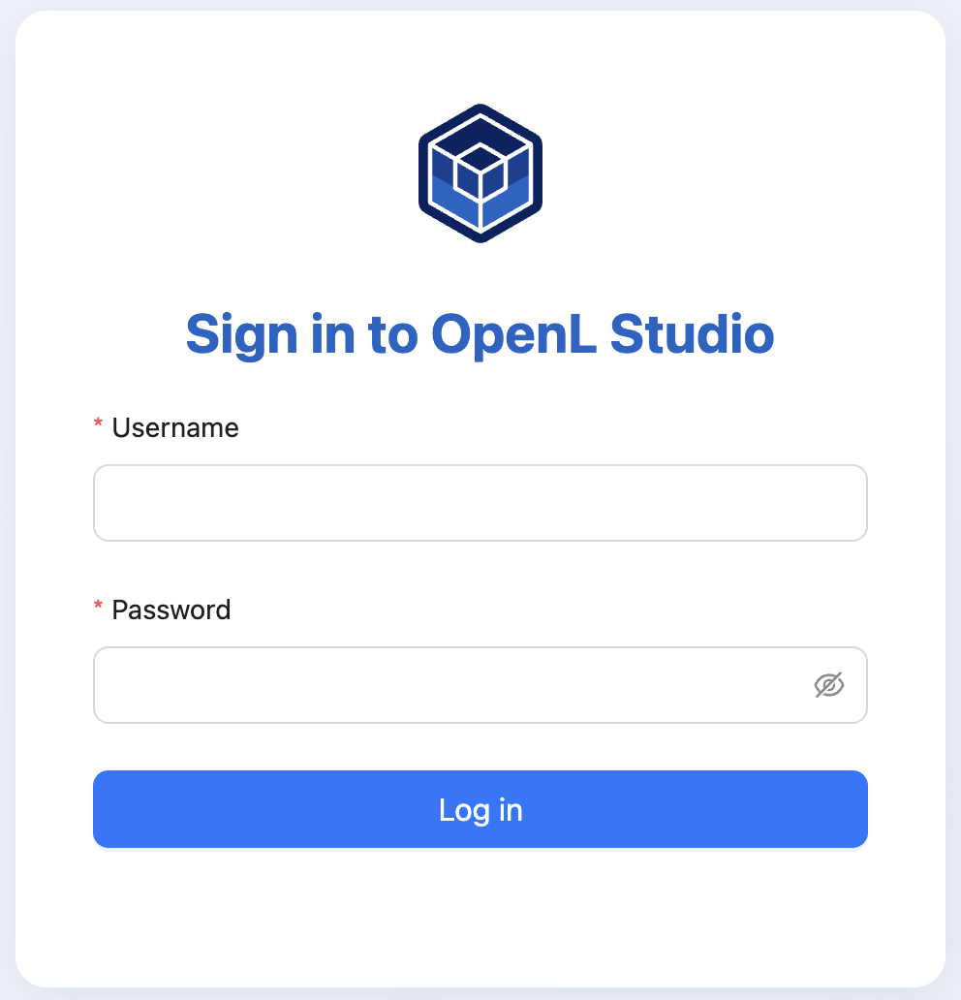
       
       *Login window*
       
1.  Enter the user name and password provided by the system administrator and click **Sign in**.

For more information on OpenL Studio UI, see [Introducing Rules Editor](#introducing-rules-editor) and [Introducing Repository Editor](#introducing-repository-editor). For more information on the single and multi-user modes, see [Security Overview](#security-overview).

### Modifying User Profile

OpenL Studio provides a navigation panel accessible from the top-right corner of the application for updating profile information and editing personal settings. To open it, click the user icon in the top-right corner. The panel displays the current username and email address, and provides access to the following items:

-   **My Profile** — update account details, name, and password
-   **My Settings** — configure display and testing preferences
-   **Help** — open the OpenL Studio help
-   **Sign Out** — end the current session

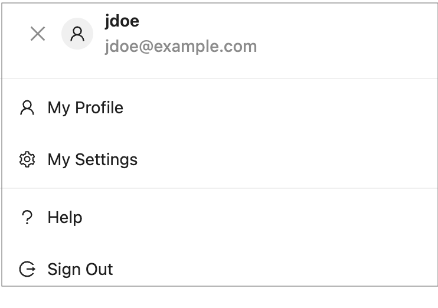

*Opening the user profile panel*

This section describes how to modify user profile information and includes the following topics:

-   [Modifying My Profile](#modifying-my-profile)
-   [Synchronizing with a Third Party Service](#synchronizing-with-a-third-party-service)
-   [Modifying My Settings](#modifying-my-settings)
-   [Managing Personal Access Tokens](#managing-personal-access-tokens)

#### Modifying My Profile

To manage profile details, proceed as follows:

1.  In OpenL Studio, in the top-right corner, click the user icon.
2.  In the panel, click **My Profile**.

    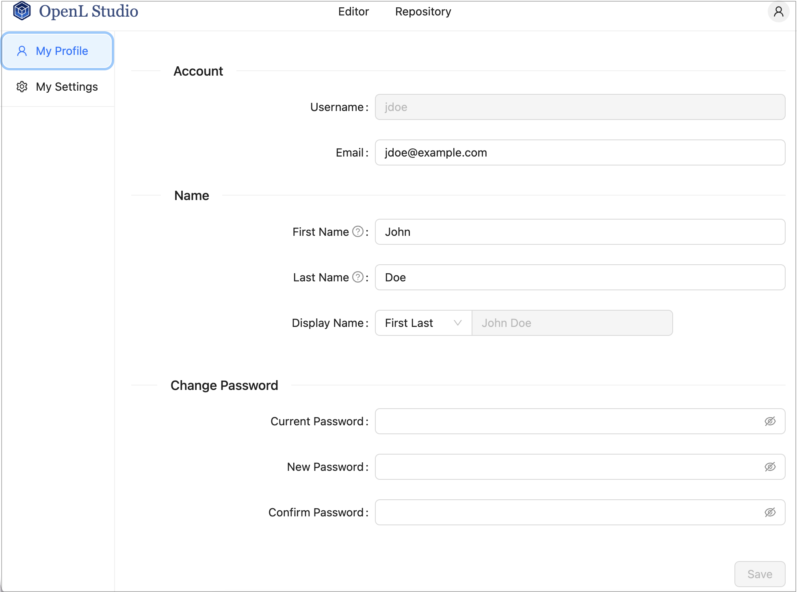

    *My Profile page*

3.  In the **Account** section, update the **Email** field as needed. The **Username** field is read-only.
4.  In the **Name** section, update **First Name**, **Last Name**, and **Display Name** as needed.

    If user data is synchronized from an external system such as Active Directory, the first name, last name, and display name fields are locked from editing, which is indicated by a tooltip icon next to the field label.

    The **Display Name** field includes a format selector to choose how the name is displayed, with a preview shown alongside.

5.  To change the password, in the **Change Password** section, enter the **Current Password**, **New Password**, and **Confirm Password** values.
6.  Click **Save**.

#### Synchronizing with a Third Party Service

When users are managed by a third party service, such as Active Directory, it is necessary to regularly check that the data in the OpenL Studio user storage is synchronized with the data defined in the third party service. Data is compared periodically or on specific events and if necessary, must be synchronized.

The following user information requires synchronization:

-   first name
-   last name
-   display name
-   email address

The following general guidelines apply:

-   If the field value is synchronized with the third party service, the field becomes locked from editing.
-   If the field is added locally and not synchronized, the field value remains available for editing.

The following synchronization rules apply:

-   If the third party email address, first name, or last name value is empty or unavailable, the current email address, first name, or last name is not emptied.
-   If the third party email address, first name, last name, or display name is not empty, the current values for local user email address, first name, last name, or display name is changed to the value received from the third party.
-   If the display name value is empty or unavailable, the local display name is not modified.

An exception is the situation when the first or last name was changed.

-   If the display name was set to “first name + space + last name”, it is updated to the new “first name + space + last name”.
-   If the display name was set to the “last name + space + first name”, it is updated to the new “last name + space + first name”.
-   If the display name is set to **Other** and its value in OpenL Studio is not empty, and in the third party service, it is empty, upon synchronization, the display name set locally is not changed.
-   If the display name value is empty in OpenL Studio and the third party service, but the first name and last name values are not empty, the display name is set to “first name + space + last name”, regardless of the pattern specified upon local user creation.

If this user was not created as a local user previously but instead, created upon the external user logon, the display name value stays empty.

#### Modifying My Settings

To manage personal settings, proceed as follows:

1.  In OpenL Studio, in the top-right corner, click the user icon.
2.  In the panel, click **My Settings**.

    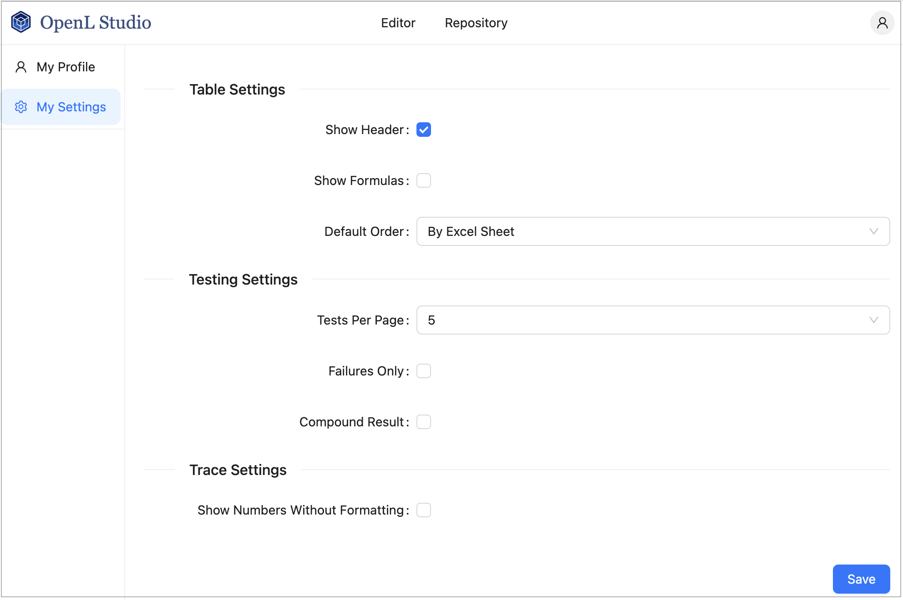

    *My Settings page*

3.  In the **Table Settings** section, configure the following options:

    -   **Show Header** — display the table header row.
    -   **Show Formulas** — display MS Excel formulas in table cells.
    -   **Default Order** — set the default sort order for tables.

4.  In the **Testing Settings** section, configure the following options:

    -   **Tests Per Page** — number of test results displayed per page. Default is 5.
    -   **Failures Only** — show only failed test cases in the results.
    -   **Compound Result** — display compound test results.

    For more information on testing settings, see [Running Unit Tests](editing-testing.md#running-unit-tests).

5.  In the **Trace Settings** section, configure the following option:

    -   **Show Numbers Without Formatting** — display numeric values without locale-based formatting in the trace view.

6.  Click **Save**.

#### Managing Personal Access Tokens

Personal access tokens allow you to authenticate with OpenL Studio APIs without using your password. They are useful for scripts, integrations, and automated tools.

Personal access tokens are available only when **SSO: OIDC (OAuth2)** or **SSO: SAML** authentication mode is configured. The **Personal Access Tokens** item is not displayed in other authentication modes.

To create a personal access token, proceed as follows:

1.  In OpenL Studio, in the top-right corner, click the user icon.
2.  In the panel, click **Personal Access Tokens**.

    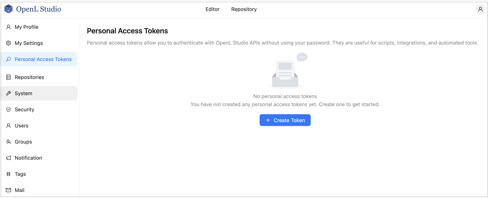

    *Personal Access Tokens page*

3.  Click **+ Create Token**.

    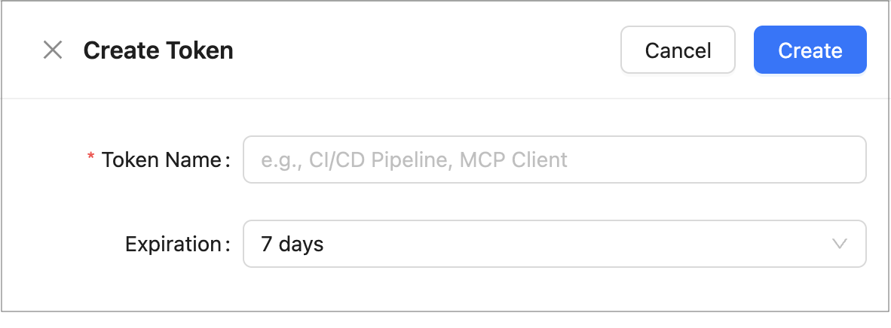

    *Create Token drawer*

4.  In the **Create Token** drawer, enter a **Token Name** that identifies the token's purpose, such as `CI/CD Pipeline` or `MCP Client`.
5.  Select an **Expiration** period: 7 days, 30 days, 60 days, 90 days, a custom date, or no expiration.
6.  Click **Create**.
7.  Copy the generated token value immediately.

    The token is displayed only once and cannot be retrieved after closing the drawer.

    The token can be used in API requests with the following header:

    `Authorization: Token <value>`

To delete a token, in the tokens list, click the delete icon next to the token and confirm the deletion.

### Displaying the OpenL Studio Help

To display the OpenL Studio help topics, in OpenL Studio, in the top-right corner, click the user icon and select **Help**.

### Signing Out of OpenL Studio

To sign out of OpenL Studio, proceed as follows:

1.  In OpenL Studio, in the top-right corner, click the user icon.
2.  In the panel, click **Sign Out**.

### Introducing Rules Editor

This section briefly introduces Rules Editor and includes the following topics:

-   [Rules Editor Overview](#rules-editor-overview)
-   [View Modes](#view-modes)

For more information on tasks that can be performed in Rules Editor, see [Using Rules Editor](rules-editor.md#using-rules-editor).

#### Rules Editor Overview

**Rules Editor** enables users to browse rule modules and modify table data. A default editor is displayed when a user opens a table in a module.

*OpenL Studio Rules Editor*

Rules Editor displays one module at a time. To switch between modules, select a module in the **Projects** tree or use breadcrumb navigation for quick switching between projects or modules of the current project.

*Rules Editor breadcrumb navigation*

One rule project can contain several modules.

The following table describes Rules Editor organization:

| Pane                     | Description                                                                                                                                        |
|--------------------------|----------------------------------------------------------------------------------------------------------------------------------------------------|
| Left pane              | Displays the module tree providing a list of elements in the currently displayed rule module.                                                      |
| Middle pane              | Displays contents of the table selected in the left pane and provides controls for modifying table data, running tests, and checking test results. |
| Right pane               | Displays properties of the currently displayed table.                                                                                              |
| Upper part  of the window | Contains toolbars with controls as described further in this section.                                                                              |

The following table describes the Rules Editor toolbar controls:

| Control                                                                                                                           | Description                                                                                                                                                                                                                                                                                                            |
|-----------------------------------------------------------------------------------------------------------------------------------|------------------------------------------------------------------------------------------------------------------------------------------------------------------------------------------------------------------------------------------------------------------------------------------------------------------------|
| 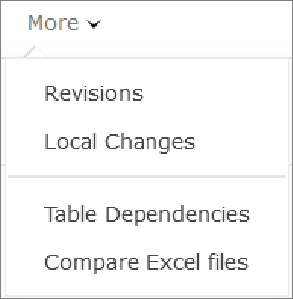                                                                  | The following table describes the available options:  - Revisions: displays project revisions.  - Local Changes: opens a page for reverting module changes.  - Table Dependencies: opens a graph displaying dependencies among tables of the module.  - Compare Excel files: initiates a dialog for comparing Excel files. |
| 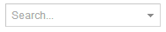                                                                  | Runs a simple search. For more information on performing searches, see [Performing a Search](rules-editor.md#performing-a-search).                                                                                                                                                                                                    |
|                                                                   | Refreshes OpenL Studio with the latest changes in Excel files.                                                                                                                                                                                                                                              |
|                                                                   | Initiates the table creation wizard.                                                                                                                                                                                                                                                                                   |
|                                                                   | Displays recently viewed tables instead of the module tree.                                                                                                                                                                                                                                                            |
|                                                                   | Returns to the module tree view.                                                                                                                                                                                                                                                                                       |
|                                                                   | Hides comment tables and dispatcher tables generated automatically when a rule table is overloaded by business dimension property.                                                                                                                                                                                     |
| 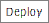                                                                  | Deploys the project. For more information on project deployment, see [Deploying a Project](repository-editor.md#deploying-a-project).                                                                                                                                                                                                        |
|                                                                   | Synchronizes and merges the updates made in the specified branches.                                                                                                                                                                                                                                                    |
| 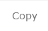                                                                  | Copies the project. For more information on project copying, see [Copying a Project](rules-editor.md#copying-a-project).                                                                                                                                                                                                              |
|                                                                   | Saves the changes and sets the project status to **No Changes**.                                                                                                                                                                                                                                                       |
|   | Updates the current module or project with uploaded file or zip file. Exports the current version of the module or project.                                                                                                                                                                                            |
|                                                                   | Switches user interface to repository editor. For more information on repository editor, see [Introducing Repository Editor](#introducing-repository-editor).                                                                                                                                                          |
|                                                                   | Switches user interface to Rules Editor. For more information on Rules Editor, see [Using Rules Editor](rules-editor.md#using-rules-editor).                                                                                                                                                                                          |
|                                                                   | Switches user interface to the **Administration** mode. For more information on administrative functions, see [Using Administration Tools](administration.md#using-administration-tools).                                                                                                                                               |

#### View Modes

OpenL Studio provides different modes for displaying rule elements. In this guide, modes are contingently divided into a **simple view** and **extended view**.

To switch between views, in the top right corner, select **My Settings** and use the **Show Header** and **Show Formula** options.

When a table is opened in a simple view, OpenL Studio hides various technical table details, such as table header and MS Excel formulas. An example of a table opened in a simple view is as follows.

*A rule table in a simple view*

In the extended view, all table structure is displayed. An example of a table opened in an extended view is as follows.

*A rule table in an extended view*

Rule tables can be organized, or sorted, and displayed in the module tree in different way depending on the selected value.

*Modes for sorting tables in the module tree*

By default, tables are sorted by their location in Excel sheets.

| Mode                     | Description                                                                                                                                                                                                                                                                                                                                                                                                             |
|--------------------------|-------------------------------------------------------------------------------------------------------------------------------------------------------------------------------------------------------------------------------------------------------------------------------------------------------------------------------------------------------------------------------------------------------------------------|
| **By Category**          | The tree structure is rather logical than physical.  Rule tables are organized into categories based on the **Category** table property or, if the property is not defined, based on the Excel table sheet names.  This view is **simple.** An example of a module tree sorted by the category parameter is as follows:  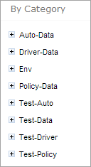  *Module tree sorted by category* |
| **By Category  Detailed** | The **By Category Detailed** view displays modules sorted by the first value of the **Category** property.  In the following example, the same module tree is sorted by **Category Detailed** and, for example, **Test \> Auto** category is displayed  in the **Test** node and **Auto** sub-node:    *Module tree sorted by Category Detailed*            |
| **By Category  Inversed** | The following example provides the module tree sorted by **Category Inversed** where modules are sorted by the second value of the **Category** property:    *Module tree sorted by Category Inversed*                                                                                                                                                |

**Note:** If the scope in a **Properties** table is defined as **Module**, in the **By Category** view, this table is displayed in the **Module Properties** sub-node as in the last example. If the scope is defined as **Category**, the table is displayed in the Category **Properties** sub-node.

The two following modes display a project in a way convenient to experienced users, with module tree elements organized by physical structure rather than logically, in an **extended** view.

| Mode        | Description                                                                                                                                                                            |
|-------------|----------------------------------------------------------------------------------------------------------------------------------------------------------------------------------------|
| **By Type** | An example of a module tree displayed in extended view and sorted by type is as follows:  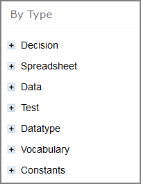  *Module tree sorted by type* |
| **By Excel Sheet** | The following tree is sorted by the order the tables are stored in the Excel file:    *Module tree sorted by order in the Excel file*         |

### Introducing Repository Editor

**Repository editor** provides controls for browsing and managing Design repository. A user can switch to repository editor by clicking the **Repository** control. Repository editor resembles the following:

*OpenL Studio repository editor*

The following table describes repository editor organization:

| Pane        | Description                                                                                                                                                                                                                                                                                                                                                                                                                                                                                                                                      |
|-------------|--------------------------------------------------------------------------------------------------------------------------------------------------------------------------------------------------------------------------------------------------------------------------------------------------------------------------------------------------------------------------------------------------------------------------------------------------------------------------------------------------------------------------------------------------|
| Left pane | Contains a tree of projects stored in Design repository and user's workspace.  Unlike Rules Editor, repository editor displays physical project contents in terms of files and folders.                                                                                                                                                                                                                                                                                                                                                           |
| Middle pane | Displays content for the element selected in the tree. For each project, the following actions are available:  - copying a project   - archiving a project   - closing a project   - opening a project   - deploying a project  |

A user can switch to Rules Editor by clicking the **Rules Editor** control.

For more information on tasks that can be performed in repository editor, see [Using Repository Editor](#using-repository-editor).

