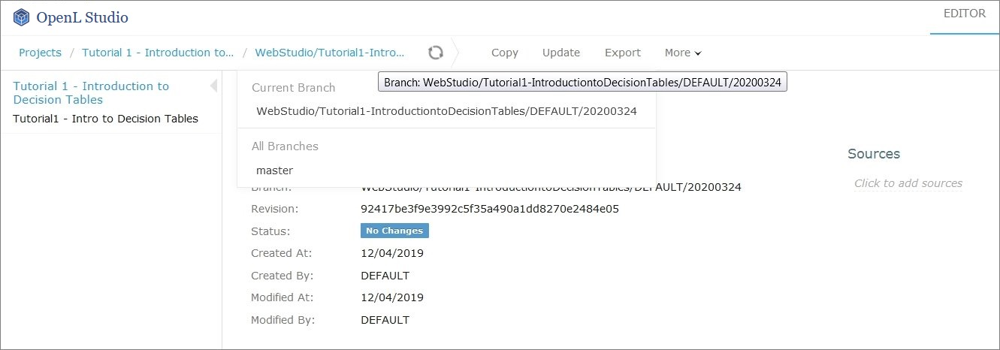
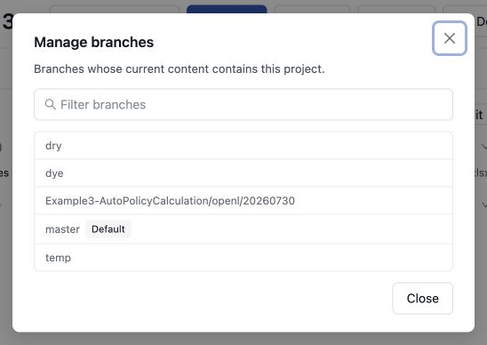
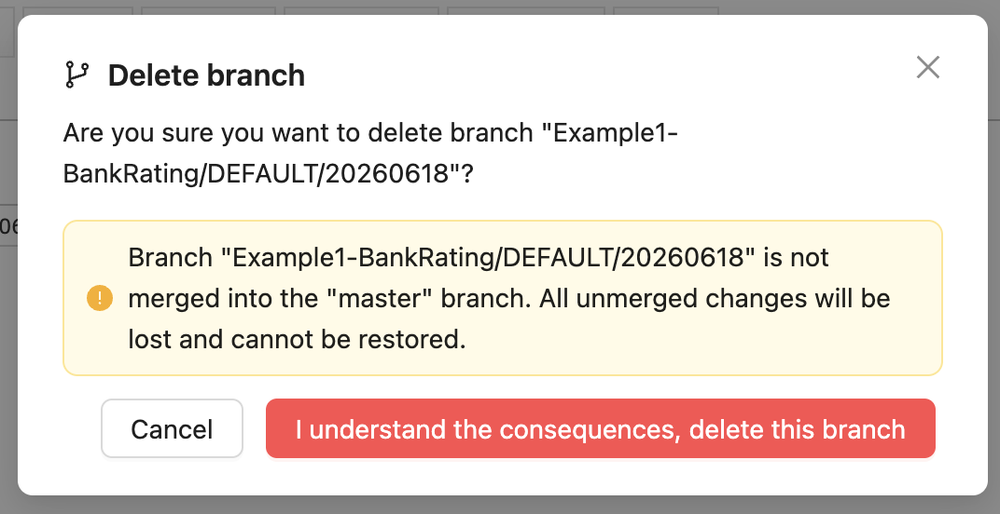
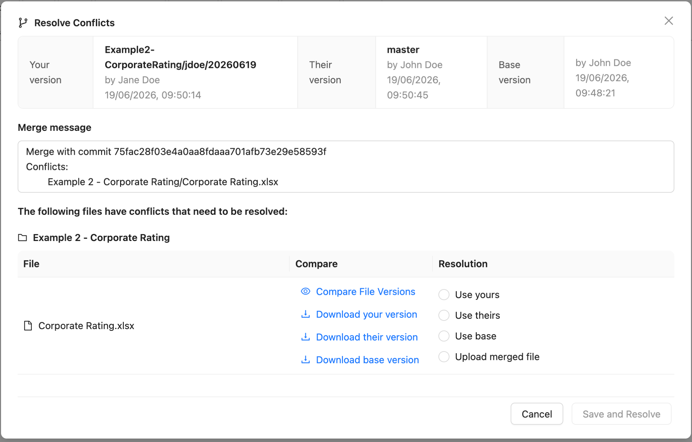
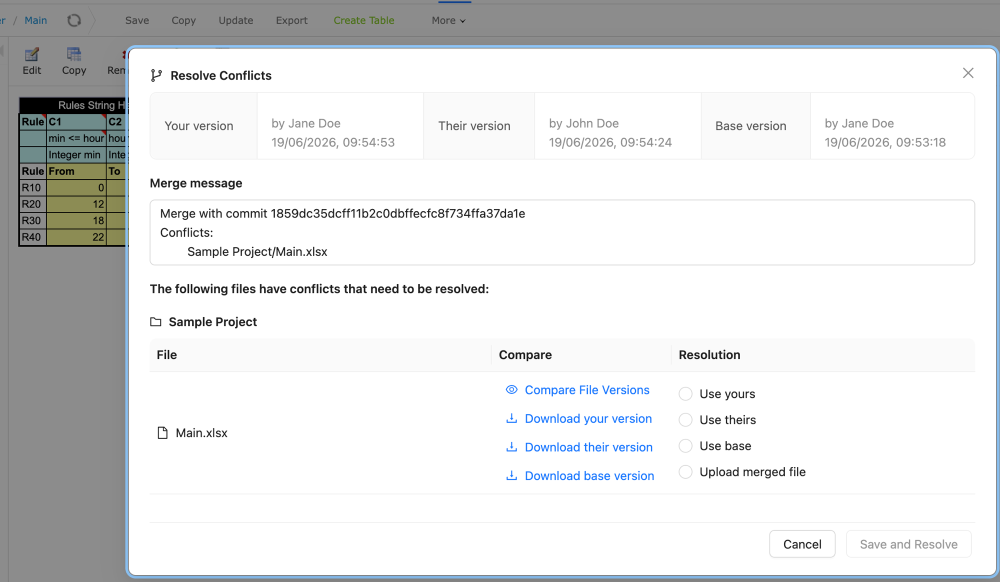
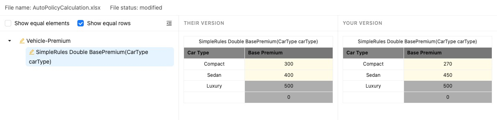

## Working with Project Branches

This section introduces project branches and describes how to use them. Branches are useful when several users work on the same project simultaneously and then merge the changes or keep them as separate project versions.

The following topics are included in this section:

-   [Creating a Branch](#creating-a-branch)
-   [Working with Branches](#working-with-branches)
-   [Resolving Conflicts](#resolving-conflicts)
-   [Using Protected Branches](#using-protected-branches)

### Creating a Branch

A repository branch can be selected or created while creating a project. This applies to projects created from a
template, Excel files, an OpenAPI file, a ZIP archive, another project, or the user's workspace. Both configured and
user-defined names can be used. For more information on name patterns, see [Setting Up a Connection to a Git
Repository](administration/01-repository-settings/02-git-repository-settings.md#setting-up-a-connection-to-a-git-repository).

Proceed as follows:

1.  In the repository, click **Create Project** and select a creation method.
1.  Select a branch-capable Design repository.
1.  In the single **Branch** field, select an existing branch from the suggestions or enter a valid new branch name.
1.  Complete the remaining fields and click **Create**.

If the entered branch does not exist, OpenL Studio creates it from the repository default branch and writes the new
project there. A project created only in that branch uses it as the home branch and is listed for other authorized
users without a manual refresh. If the repository is empty, the first project commit creates the selected branch,
including a valid non-default branch. Invalid Git names and names that do not match the configured branch-name pattern
are reported below the **Branch** field before the request is sent.

> [!Note]
> To copy an existing project, select **Copy Project** as the creation method. The copy has its own project name and
> target branch.

### Working with Branches

This section describes how to view existing branches, switch between them in the editor and repository,
inspect project membership, and delete branches. OpenL Studio discovers projects from the current Git tree
of every readable branch. A project that exists only outside the default branch therefore appears in the
project list. Its **Branch** field shows the current branch and loads the branches that contain the project when
the branch menu is opened. Proceed as follows:

1.  To display a current project branch, in OpenL Studio, in the editor or repository, open a project.

    The current project branch is displayed.

1.  To switch between branches in the editor, click the last link in the address bar identifying the branch name and in the list that appears, select the required branch.

    

    *Switching between branches in the editor*

1.  To switch between branches in the repository, for a project, in the **Branch** field, select the required branch.
2.  To inspect which repository branches contain the project, click the dots next to the **Branch** field.

    **Manage Branches** lists only the branches whose current content contains the project. Membership is read-only
    because it is discovered from Git content.

    

    To create a copy in another branch, use **Create Project** > **Copy Project** and select the target branch.
    To remove a project from a branch, switch the project to that branch and use **Delete**.

1.  To delete a non-default branch, switch to this branch in the project properties and click **Delete Branch.**

    The non-default branch is deleted completely, it cannot be later restored, and it does not appear in the **Manage
    branches** list. The project in the branch is deleted. If the non-default branch contains commits not merged to the
    default branch, a warning message is displayed upon deletion attempt. A branch on which the project is locked by
    another user cannot be deleted while the lock is held: the lock means that user is editing the project there.

    **Delete Branch** is unavailable in these cases:

    - the branch is the default one;
    - the branch is protected and the user cannot bypass branch protection;
    - the branch is the only one that contains the project and the user cannot delete the project. Deleting that
      branch removes the project, so it takes the same permission as deleting the project. Users who have it are
      warned in the confirmation dialog that the project will be gone.

    

    *Deleting a non-default branch with unmerged commits*

1.  To delete a project from its current branch, in the repository, select the required project branch and click
    **Delete**.

    The project is deleted from the current branch of Design repository. It disappears from the project list only when
    it does not exist in another branch. This change is recorded in repository history.

1.  To merge two branches, click **Sync** and select one of the following options:

    | Option                | Description                                                                   |
    |-----------------------|-------------------------------------------------------------------------------|
    | Receive their updates | Changes from a selected branch are copied to the currently active branch.     |
    | Send your updates     | Changes from the currently active branch are uploaded to the selected branch. |

    The selected target does not have to contain the project yet. Synchronizing a clean project can introduce it into
    another repository branch.

    If upon saving there is a conflict due to updates in the same module sheet, the **Resolve Conflicts** dialog appears.

    

    *Resolving conflicts on merging branches*

    Conflicts can be resolved by selecting one of the following options:

    | Option             | Description                                                                                                                  |
    |--------------------|------------------------------------------------------------------------------------------------------------------------------|
    | Use yours          | Changes in the currently active branch are applied on merge. The changes applied by another user are lost.                   |
    | Use theirs         | Changes in the selected branch are applied on merge. The changes made by you are lost.                                       |
    | Use base           | The common base version of the file is applied on merge. Changes from both branches are discarded.                          |
    | Upload merged file | Depending on the selected merging options, changes in the manually updated and uploaded file override changes in the branch. |

1.  To view the changes made by another user, compare them to your changes, or view the base version of the file, select a corresponding option in the **Compare** column.

### Resolving Conflicts

If the same version of the project is edited by several users, upon submitting their changes using different clients, the **Resolve Conflicts** dialog appears, listing the conflicting files and the resolution options for each one.



*Resolving conflicts upon saving concurrent changes*

The dialog contains the **Compare File Versions** link that allows viewing both conflicting versions for comparison.



*Comparing conflicting versions*

### Using Protected Branches

OpenL Tablets allows defining a list of protected branches for Git design repository to avoid pushing erroneous changes into main or release branches.

If a branch is marked as protected, all actions that can impact Git history, such as deleting a project or module or synchronizing to a protected branch, are forbidden. In this case, separate branches are modified and then merged into the protected branch only via the Git CI process.

Branches can be defined as protected using the following property:

```
repository.design.protected-branches
```

Branches must be separated by comma.

Wildcards can be used to specify a group of branches, such as release-\*, so all branches that start with release- keyword are protected.

By default, branches are not protected.

Branches can also be defined as protected in the OpenL Studio administration navigation menu as described in [Setting Up a Connection to a Git Repository](administration/01-repository-settings/02-git-repository-settings.md#setting-up-a-connection-to-a-git-repository).
