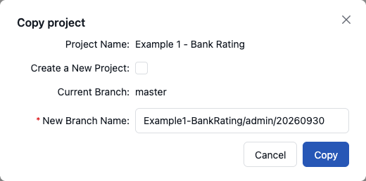
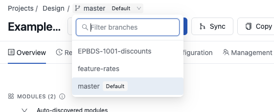
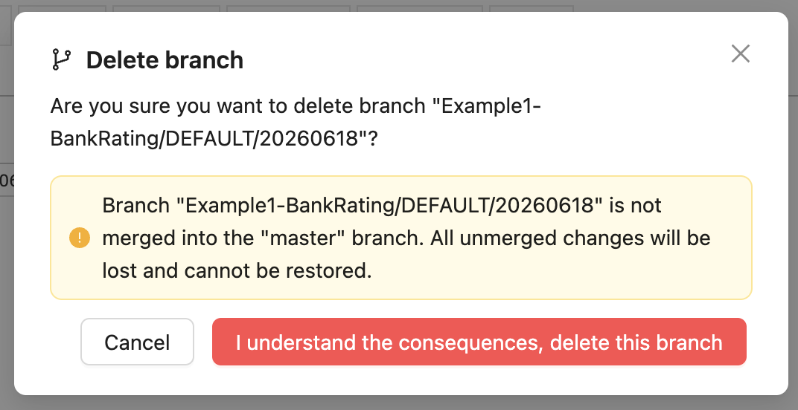
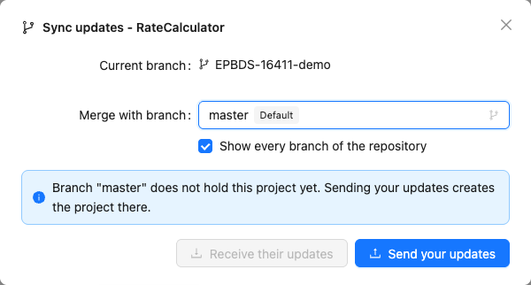
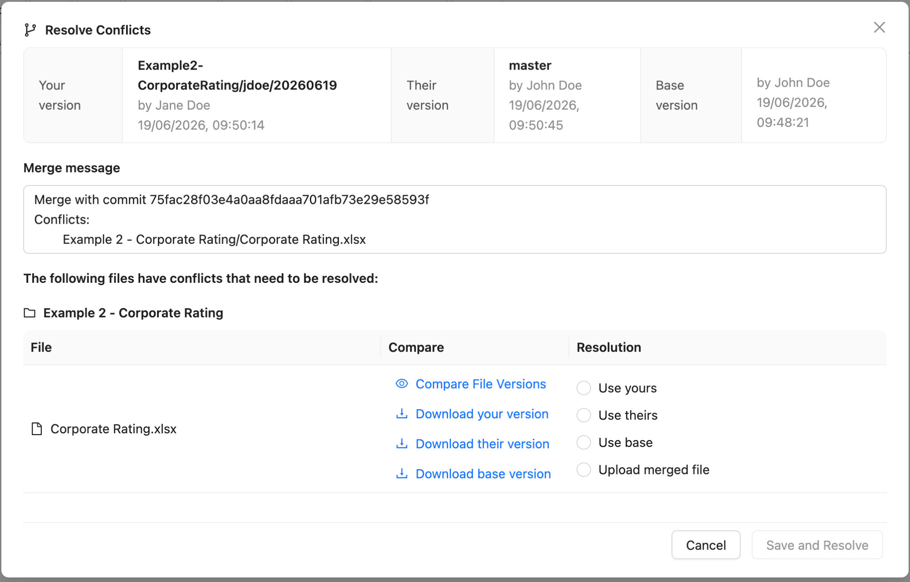
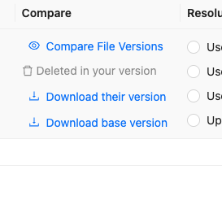
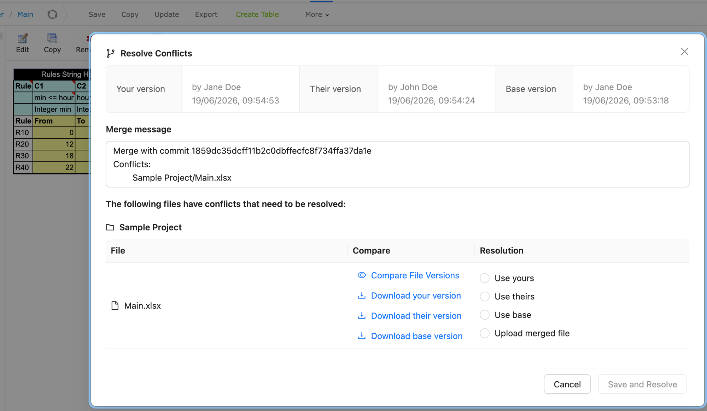
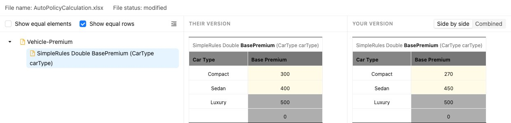

## Working with Project Branches

This section introduces project branches and describes how to use them. Branches are useful when several users work on the same project simultaneously and then merge the changes or keep them as separate project versions.

The following topics are included in this section:

-   [Creating a Branch](#creating-a-branch)
-   [Working with Branches](#working-with-branches)
-   [Resolving Conflicts](#resolving-conflicts)
-   [Using Protected Branches](#using-protected-branches)

### Creating a Branch

A repository branch can be selected or created while creating a project. This applies to projects created from a
template, Excel files, an OpenAPI file, a ZIP archive, another project, or the user's workspace. Both configured and
user-defined names can be used. For more information on name patterns, see [Setting Up a Connection to a Git
Repository](administration/01-repository-settings/02-git-repository-settings.md#setting-up-a-connection-to-a-git-repository).

Proceed as follows:

1.  On the **Projects** page, click **New Project** and select a creation method.
1.  Select a branch-capable Design repository.
1.  In the single **Branch** field, select an existing branch from the suggestions or enter a valid new branch name.
1.  Complete the remaining fields and click **Create**.

If the entered branch does not exist, OpenL Studio creates it from the repository default branch and writes the new
project there. A project created only in that branch uses it as the home branch. After the project is created, its
page opens. The project list shows it while it is open in the
workspace, or once its branch is picked in the **Branch** filter; other authorized users find it the same way,
without a manual refresh. For more information, see [Filtering and Grouping the Project
Tree](repository-editor.md#filtering-and-grouping-the-project-tree). If the repository is empty, the first project
commit creates the selected branch, including a valid non-default branch. Invalid Git names and names that do not
match the configured branch-name pattern are reported below the **Branch** field before the request is sent.

> [!Note]
> To copy an existing project, select **Copy project** as the creation method. The copy has its own project name and
> target branch.

#### Creating a Branch of an Existing Project

A branch of an existing project starts from the last commit of the branch the project is on. To create it, proceed as follows:

1.  Click the **Copy** icon in the row of the project on the **Projects** page, or click **Copy** on the page of the project.

    The **Copy project** window shows the **Current Branch** and suggests a name in the **New Branch Name** field. The name follows the pattern configured for the repository.

    

    *Creating a branch of a project*

1.  Enter another name if necessary. Invalid Git names and names that do not match the configured branch-name pattern are reported below the field.
1.  Click **Copy**.

The project moves to the new branch. If the project has unsaved changes, the window warns that the new branch starts from the last commit and moving the project onto it discards them, and asks for the confirmation **I understand the consequences, move to the new branch**. When the project cannot move, OpenL Studio creates the branch and leaves the project on its current branch. Save or discard the changes, and then switch the project to the new branch.

### Working with Branches

This section describes how to view existing branches, switch between them on the project page and in the editor,
inspect project membership, and delete branches. OpenL Studio discovers projects from the current Git tree
of every readable branch. A folder with `rules.xml` is always a project. A folder without the descriptor is also
treated as a project when it has an Excel file in its root and the global
`project.detect-by-excel-files` setting is enabled. This setting is disabled by default. A project that
exists only outside the default branch is represented by a protected branch when one contains it and by the branch
with the newest commit otherwise. While no branch is picked in the **Branch** filter, the project list and the
project tree keep to the default branch of each repository, so such a project is listed once its branch is picked,
or while it is open in the workspace. The branch menu loads the branches that
contain the project when it is opened. Proceed as follows:

1.  To display a current project branch, open a project.

    The current project branch is displayed in the path above the project name, in the **Branch** field of the **Overview** tab, and in the **Branch** column of the **Projects** page. The default branch is marked **Default**, and a protected branch is marked with a shield icon.

1.  To switch between branches, click the branch in the path above the project name, in the **Branch** field of the **Overview** tab or in the row of the project on the **Projects** page. The editor offers the same branch menu above the modules. In the list that appears, select the required branch.

    

    *Switching between branches*

    The menu lists only the branches whose current content contains the project. Membership is read-only
    because it is discovered from Git content. The **Filter branches** field narrows a long list down.

    If the project has unsaved changes, switching the branch asks to confirm that they are lost.

    To create a copy in another branch, use **New Project** > **Copy project** and select the target branch.
    To remove a project from a branch, switch the project to that branch and use **Delete**.

1.  To delete a non-default branch, switch to this branch and click **Delete Branch** on the page of the project, or click the **Delete Branch** icon in its row on the **Projects** page.

    The non-default branch is deleted completely, it cannot be later restored, and it does not appear in the **Manage
    branches** list. The project in the branch is deleted. If the non-default branch contains commits not merged to the
    default branch, a warning message is displayed upon deletion attempt. A branch on which the project is locked by
    another user cannot be deleted while the lock is held: the lock means that user is editing the project there.

    **Delete Branch** is unavailable in these cases:

    - the branch is the default one;
    - the branch is protected and the user cannot bypass branch protection;
    - the branch is the only one that contains the project and the user cannot delete the project. Deleting that
      branch removes the project, so it takes the same permission as deleting the project. Users who have it are
      warned in the confirmation dialog that the project will be gone.

    

    *Deleting a non-default branch with unmerged commits*

1.  To delete a project from its current branch, switch the project to the required branch and click
    **Delete** on the page of the project.

    The project is deleted from the current branch of Design repository. A project that another branch still holds
    stays in the repository on that branch; while no branch is picked in the **Branch** filter, the project list keeps
    showing it only when the default branch holds it. This change is recorded in repository history.

1.  To merge two branches, click **Sync** and select one of the following options:

    | Option                | Description                                                                   |
    |-----------------------|-------------------------------------------------------------------------------|
    | Receive their updates | Changes from a selected branch are copied to the currently active branch.     |
    | Send your updates     | Changes from the currently active branch are uploaded to the selected branch. |

    **Merge with branch** lists the branches that hold the project. To merge into a branch that does not hold it
    yet — the main branch, for a project created in its own branch — select **Show every branch of the
    repository**. A project whose only branch is the current one offers that wider list right away, so the
    target can always be selected. Synchronizing a clean project introduces it into the selected branch, and the
    dialog says so when the selected branch does not hold the project yet.

    If the updates received in the editor remove the module that is open, the page of the project opens with a
    message that the module is no longer in the project.

    

    *Selecting a branch that does not hold the project yet*

    Sync merges the changes of both branches by itself where they do not overlap: a text file line by line, and a
    module workbook sheet by sheet. A sheet both branches changed is merged cell by cell: each cell takes the change
    of the branch that made it. The value, the style and the comment of a cell are merged separately, so one branch
    can change the text of a cell and the other its style. Such a sheet stays a conflict in the following cases:

    -   Both branches change the value, the style or the comment of the same cell, the height or the visibility of
        the same row, the width or the visibility of the same column, the default column width or row height, the
        merged cells or the pictures of the sheet differently.
    -   A branch inserts or deletes rows or columns inside the content of the sheet. Edits that cannot be told apart
        from such a move, such as many rows rewritten at once, count as one.
    -   Both branches fill empty cells next to each other, so two tables would touch and be read as one.
    -   A branch merges cells over a value the other branch wrote.
    -   The branch whose changes are merged in changes the data validation, the conditional formatting, the
        hyperlinks or the frozen panes of the sheet. It is the selected branch for **Receive their updates** and the
        current branch for **Send your updates**.
    -   Both branches add a sheet with the same name and different content, or one branch removes a sheet the other
        changes.

    If Sync finds such a conflict, or both branches changed the same place of any other file, the **Resolve
    Conflicts** dialog appears.

    

    *Resolving conflicts on merging branches*

    Conflicts can be resolved by selecting one of the following options:

    | Option             | Description                                                                                                                  |
    |--------------------|------------------------------------------------------------------------------------------------------------------------------|
    | Use yours          | Changes in the currently active branch are applied on merge. The changes applied by another user are lost.                   |
    | Use theirs         | Changes in the selected branch are applied on merge. The changes made by you are lost.                                       |
    | Use base           | The common base version of the file is applied on merge. Changes from both branches are discarded.                          |
    | Upload merged file | Depending on the selected merging options, changes in the manually updated and uploaded file override changes in the branch. |

1.  To view the changes made by another user, compare them to your changes, or view the base version of the file, select a corresponding option in the **Compare** column.

    **Compare File Versions** opens a window that puts the version being merged in against the version of the
    current branch. The window names the file and says whether the merge modified or deleted it. An Excel file is
    compared element by element, as described in
    [Comparing Excel Files](rules-editor.md#comparing-excel-files), with the **Show equal elements** and **Show
    equal rows** check boxes heading the list of elements; a file of any other format is compared line by line. A
    file that one of the two versions no longer holds has nothing to be compared with, and the window says so.

    Download links are available only for versions in which the conflicted file exists. The **Compare** column marks
    a deleted file as **Deleted in your version**, **Deleted in their version**, or **Deleted in base version** instead
    of offering a download.

    

    *A deleted version is shown as a status instead of a download action*

### Resolving Conflicts

If the same version of the project is edited by several users, saving combines their changes the way Sync does:
changes in other lines of a text file and in other cells of a workbook sheet are merged without a question. When the
users changed the same place, upon submitting their changes using different clients, the **Resolve Conflicts** dialog
appears, listing the conflicting files and the resolution options for each one.

The dialog also appears when a project is renamed and saved, then an earlier revision is opened and renamed again.
The project remains available to the dialog under the identifier issued after the first rename.



*Resolving conflicts upon saving concurrent changes*

The dialog contains the **Compare File Versions** link that opens the two conflicting versions side by side, in a
window of its own.



*Comparing conflicting versions*

### Using Protected Branches

OpenL Tablets allows defining a list of protected branches for Git design repository to avoid pushing erroneous changes into main or release branches.

If a branch is marked as protected, all actions that can impact Git history, such as deleting a project or synchronizing to a protected branch, are forbidden. In this case, separate branches are modified and then merged into the protected branch only via the Git CI process.

An action refused this way, such as creating a project in a protected branch, is reported in the dialog where it was started, with the name of the protected branch.

Branches can be defined as protected using the following property:

```
repository.design.protected-branches
```

Branches must be separated by comma.

Wildcards can be used to specify a group of branches, such as release-\*, so all branches that start with release- keyword are protected.

By default, branches are not protected.

Branches can also be defined as protected in the OpenL Studio administration navigation menu as described in [Setting Up a Connection to a Git Repository](administration/01-repository-settings/02-git-repository-settings.md#setting-up-a-connection-to-a-git-repository).
