## Using the Projects Page

This chapter describes tasks that can be performed on the **Projects** page and on the page of a project. For general information on these pages, see [Introducing the Projects Page](getting-started.md#introducing-the-projects-page).

The following topics are included in this chapter:

-   [Browsing Projects](#browsing-projects)
-   [Filtering and Grouping the Project Tree](#filtering-and-grouping-the-project-tree)
-   [Creating Projects in Design Repository](#creating-projects-in-design-repository)
-   [Opening a Project](#opening-a-project)
-   [Closing a Project](#closing-a-project)
-   [Saving a Project](#saving-a-project)
-   [Viewing the Project Overview](#viewing-the-project-overview)
-   [Tagging a Project](#tagging-a-project)
-   [Managing Project Access](#managing-project-access)
-   [Modifying Project Contents](#modifying-project-contents)
-   [Copying a Project](#copying-a-project)
-   [Removing a Project](#removing-a-project)
-   [Deploying a Project](#deploying-a-project)
-   [Comparing Project Revisions](#comparing-project-revisions)
-   [Exporting a Project or a File](#exporting-a-project-or-a-file)
-   [Unlocking a Project](#unlocking-a-project)
-   [Browsing Deployments](#browsing-deployments)
-   [User Data for Git Commits](#user-data-for-git-commits)

### Browsing Projects

The **Projects** page lists the projects of the user's workspace and of Design repository. The **Projects** and **Deployments** links in the top bar switch between this page and the page of deployments described in [Browsing Deployments](#browsing-deployments). While no branch is picked in the **Branch** filter, the page keeps to the default branch of each repository, as described in [Filtering and Grouping the Project Tree](#filtering-and-grouping-the-project-tree).

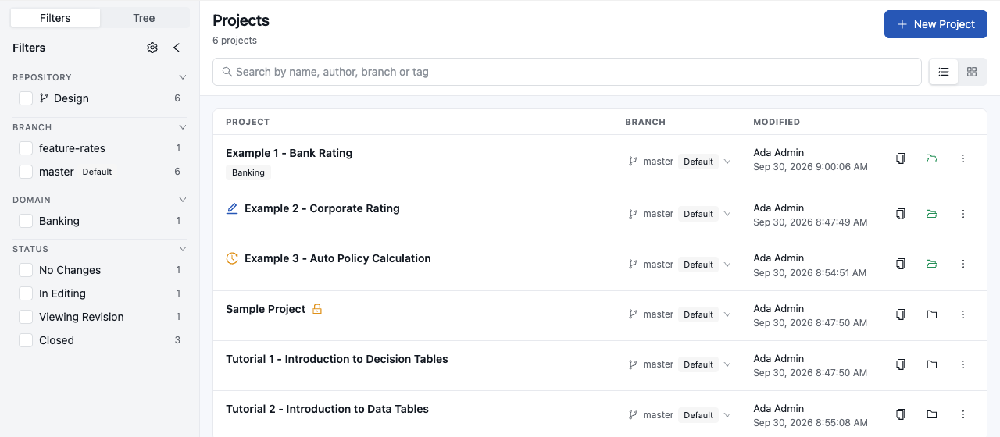

*The Projects page*

The page consists of the following parts:

-   **Filters** and **Tree** views on the left narrow the list down and group it, as described in [Filtering and Grouping the Project Tree](#filtering-and-grouping-the-project-tree).
-   The search box finds projects by name, author, branch or tag.
-   The **List** and **Grid** buttons next to the search box switch between a table and cards.
-   **New Project** creates a project as described in [Creating Projects in Design Repository](#creating-projects-in-design-repository).
-   The list shows the projects of all repositories in one alphabetical list. A row shows the project name with its tags, the branch it is on, who modified it and when, and the actions available for it.

A click on a project opens its page, described in [Working with the Project Page](#working-with-the-project-page).

The row of a project offers the everyday actions as icons and keeps the others behind the **Actions** menu **⋮**. A card in the grid view keeps all of them in that menu.

-   The **Copy** icon copies the project, as described in [Copying a Project](#copying-a-project).
-   The **Delete Branch** icon deletes the branch the project is on, as described in [Working with Project Branches](project-branches.md#working-with-branches). It is shown only when the branch can be deleted.
-   The folder icon opens a closed project, and the green open folder icon closes an open one.
-   The **Actions** menu lists **Save**, **Open Revision**, **Sync**, **Deploy**, **Compare**, **Export** and **Delete**, as far as they are available for the project.
-   The branch next to the name switches the project to another branch, as described in [Working with Project Branches](project-branches.md#working-with-branches).

Only the actions that the user is allowed to perform on the project in its current state are offered.

The status of a project is shown on the list and on the project page:

| Status               | Description                                                                                                                                                                                                                                                                      |
|----------------------|----------------------------------------------------------------------------------------------------------------------------------------------------------------------------------------------------------------------------------------------------------------------------------|
| **Closed**           | The project is available only in Design repository. A closed folder icon stands for it. It must be opened to be viewed in the editor or modified.                                                                                                                              |
| **No Changes**       | The project is open and copied to the user's workspace. A green open folder icon stands for it. It can be modified and has no unsaved changes.                                                                                                                               |
| **In Editing**       | The project is open and modified by the current user, which a pencil icon before the name marks. Other users cannot edit it. The project must be saved to store the changes.                                                                                                     |
| **Viewing Revision** | The project is open on an earlier revision, not on the latest one, which a history icon before the name marks. It can be browsed and, after a warning, edited, as described in [Opening a Project](#opening-a-project).                                                            |
| **Local**            | The project exists only in the user's workspace but not in Design repository. Other users do not see it. The user can delete it, or export it and import the archive into Design repository as described in [Saving a Project](#saving-a-project). |

A lock icon after the project name means that another user edits the project. The project cannot be edited by anyone else until that user saves or closes it or the lock is released, as described in [Unlocking a Project](#unlocking-a-project).

#### Working with the Project Page

The page of a project shows everything about one project. Its title row carries the following:

-   The path **Projects / Design / master**, where the repository and the branch the project is on follow the **Projects** link. The branch is a switcher, as described in [Working with Project Branches](project-branches.md#working-with-branches).
-   The project name, preceded by the status icon when the project is in editing or opened on an earlier revision.
-   The actions of the project, listed in the table below.

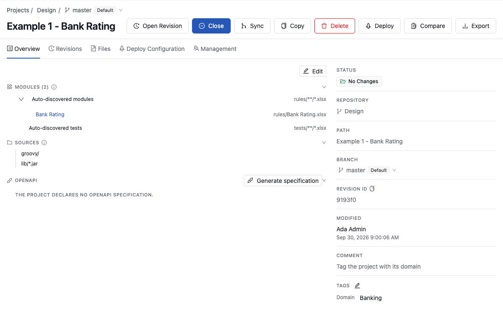

*The page of an open project*

The following table describes the actions of the project page in their display order. A user sees only the actions that are available in the current state of the project.

| Action            | Description                                                                                                        | Available when                                                                                 |
|-------------------|--------------------------------------------------------------------------------------------------------------------|------------------------------------------------------------------------------------------------|
| **Save**          | Saves the changes as a new revision. See [Saving a Project](#saving-a-project).                                    | The project has unsaved changes.                                                               |
| **Open**          | Opens the project. Its menu offers **Open Revision**. See [Opening a Project](#opening-a-project).                 | The project is closed.                                                                         |
| **Open Revision** | Opens an earlier revision of the project. See [Opening a Project](#opening-a-project).                             | The project is open, or from the **Open** menu while it is closed.                             |
| **Close**         | Closes the project. See [Closing a Project](#closing-a-project).                                                   | The project is open.                                                                           |
| **Sync**          | Merges the project with another branch. See [Working with Project Branches](project-branches.md#working-with-branches). | The repository supports branches and the project has no unsaved changes.                       |
| **Copy**          | Copies the project into a new project or a new branch. See [Copying a Project](#copying-a-project).                | The user can create projects or branch this one.                                               |
| **Delete Branch** | Deletes the branch the project is on. See [Working with Project Branches](project-branches.md#working-with-branches). | The branch is not the default one and is not protected.                                        |
| **Delete**        | Deletes the project. See [Removing a Project](#removing-a-project).                                                | The project is not locked by another user.                                                     |
| **Deploy**        | Deploys the project. See [Deploying a Project](#deploying-a-project).                                              | The project has no unsaved changes and is not **Local**.                                       |
| **Compare**       | Compares the project with its revisions. See [Comparing Project Revisions](#comparing-project-revisions).          | The project is not **Local**.                                                                  |
| **Export**        | Downloads the project. See [Exporting a Project or a File](#exporting-a-project-or-a-file).                        | The user can read the project.                                                                 |
| **Unlock**        | Releases the lock of another user. See [Unlocking a Project](#unlocking-a-project).                                | Another user locks the project and the current user has administrative rights on it.          |

When the window is too narrow for all actions, the last ones move into the **Actions** menu **⋮**.

The tabs below the title row show the following:

-   **Overview** shows the project configuration and properties. See [Viewing the Project Overview](#viewing-the-project-overview).
-   **Revisions** lists the revisions of the project. See [Opening a Project](#opening-a-project).
-   **Files** shows the files and folders of the project. See [Modifying Project Contents](#modifying-project-contents).
-   **Deploy Configuration** shows the `rules-deploy.xml` settings and the deployments of the project. See [Deploying a Project](#deploying-a-project).
-   **Management** assigns roles on the project. See [Managing Project Access](#managing-project-access).

The panel on the left of the page shows the project **Tree** view described in [Browsing the Project Tree](#browsing-the-project-tree). The **Reload the tree** and **Hide the panel** icons in its header refresh the tree and fold the panel away.

### Filtering and Grouping the Project Tree

The panel on the left of the **Projects** page has two views, switched at its top: **Filters** and **Tree**. Both work
on the projects of the list beside them.

While no branch is picked in the **Branch** filter, the list and the tree show the following projects:

-   projects that the default branch of their repository contains, on whichever branch the user switched them to;
-   projects open in the user's workspace, even when they exist only outside the default branch;
-   projects of repositories without branches, and local projects.

A project that exists only in another branch appears once its branch is picked in the **Branch** filter. Picking one or
more branches shows the projects on these branches instead.

#### Filtering Projects

The **Filters** view lists the filter values in groups: **Repository**, **Branch**, one group per tag type, and
**Status**. Each value shows how many projects it covers.

-   Several values of one group show the projects that match any of them.
-   Values of different groups show the projects that match all of them.
-   The **Branch** group lists every branch with its count, including a branch whose projects the default view hides.
    While no branch is picked, the counts of the other groups cover only the projects the default view shows.

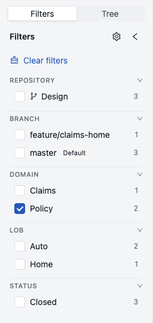

To reorder the groups or hide some of them, click **Arrange the filters**, the gear icon in the header of the view.
While the filters are arranged, each group shows only its title:

-   To move a group, drag it by its title to another place. To move it with the keyboard, focus its title, press
    Space, move it with the arrow keys, and press Space again.
-   To hide a group, click **Hide this filter** next to its title. The hidden groups are listed below the others, and
    **Show this filter** returns a group to the view.
-   To finish, click **Done**. The groups list their values again, each folded or unfolded as before. The browser
    remembers the arrangement for the next visit.

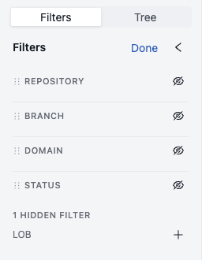

#### Browsing the Project Tree

The **Tree** view shows the projects that the **Filters** view selects, the same ones the list shows, as a tree. Its own
search box narrows the tree by name and leaves the list as it is.

-   Selecting a group, such as a repository or a tag value, sets its filters: the list shows the projects of the group,
    and the tree narrows to it until the filters are cleared.
-   Selecting a project opens it, and expanding a project lists its files.
-   On a project page, the panel shows the **Tree** view only. The tree applies the filters last used on the Projects
    list and always shows the project being viewed.

To group projects by repository, branch or tag types, click **Group projects** 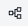 and
select up to three levels. Tag values used for grouping are taken from the most recent version of a project, so after
changing the tags of an opened project, save the project for the tree to show the change. For more information on tag
definition for a project, see [Managing Tags](administration/06-tags.md#managing-tags).

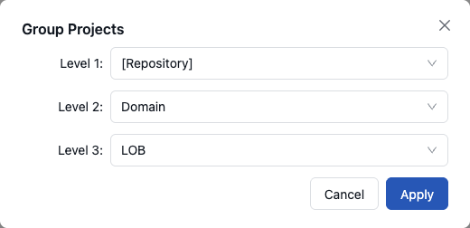

#### Clearing Filters

While any filter is picked, the **Filters** and **Tree** views show **Clear filters** at their top, under the title.
In the **Tree** view, the button also tells that the tree is filtered.

-   **Clear filters** removes the status, repository, branch and tag picks and forgets the group selected in the tree,
    returning both views to the default-branch view. The search boxes keep their text.
-   When the filters hide every project, the list offers **Clear all filters**, which clears the search as well.

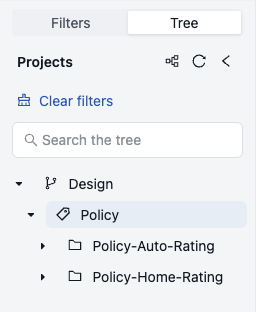

### Creating Projects in Design Repository

OpenL Studio allows users to create new rule projects in the Design repository. To start, click **New Project** on the **Projects** page. The **Create project** dialog offers the following ways:

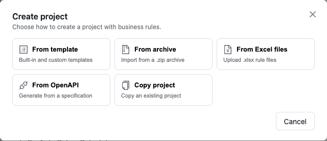

*Choosing how to create a project*

| Way                                        | Section                                                                       |
|--------------------------------------------|-------------------------------------------------------------------------------|
| Create a rule project from a template      | [Creating a Project from Template](#creating-a-project-from-template)         |
| Create a rule project from a zip archive   | [Creating a Project from ZIP Archive](#creating-a-project-from-zip-archive)   |
| Create a rule project from Excel files     | [Creating a Project from Excel Files](#creating-a-project-from-excel-files)   |
| Create a rule project from an OpenAPI file | [Creating a Project from OpenAPI file](#creating-a-project-from-openapi-file) |
| Copy an existing rule project              | [Copying a Project](#copying-a-project)                                       |

After a way is chosen, the dialog shows the source of the project and the settings that are common to all ways. **Back** returns to the choice of the way.

-   **Project Name** — the name by which the project is presented in Design repository. The name of the template, the archive or the source project is suggested.
-   **Repository** — the Design repository that stores the project. Only the repositories where the user may create projects are offered.
-   **Branch** — the branch of a Git repository, described below. The field is shown for repositories that support branches.
-   **Path** — the folder of the repository where the project is stored. Leave it empty to store the project in the root of the repository, enter a path such as `folder/subfolder`, or click **Browse folders** **⋮** to select an existing folder. The field is shown for repositories that keep projects in folders.
-   **Comment** — the comment of the commit that creates the project. A standard comment is suggested.

After the project is created, its page opens and the project has the **No Changes** status, which means that it is open and can be modified.

For a Git Design repository that supports branches, every creation method displays one **Branch** field after a repository is selected. Select an existing branch from the suggestions, or type a valid new branch name in the same field. When the name does not exist, OpenL Studio creates the branch from the repository default branch and then creates the project there. Its **Branch** value is the branch where it was created. A project created in another branch than the default one is listed once that branch is picked in the **Branch** filter, or while it is open in the workspace; see [Filtering and Grouping the Project Tree](#filtering-and-grouping-the-project-tree). In an empty repository, the first project creates the selected valid branch, including a non-default branch. Names that violate Git naming rules or the repository branch-name pattern are shown as errors below the field and are not submitted.

Projects with the same name can be created in different repositories. These projects cannot be in the same status. If the first project is in the **No Changes** status, the second one is assigned the **Closed** status. After closing the first project, the second can be opened.

#### Creating a Project from Template

This section describes how to create a project using a template and includes the following topics:

-   [Creating a Project Using a Default Repository Template](#creating-a-project-using-a-default-repository-template)
-   [Creating a Project Using a Custom Template](#creating-a-project-using-a-custom-template)

##### Creating a Project Using a Default Repository Template

This is the easiest way to create a rule project in the Design repository that must be preferably used for demonstration or introductory purposes.

The templates are organized into the following categories:

| Category      | Description                                                                                                                                                                                                                                        |
|---------------|----------------------------------------------------------------------------------------------------------------------------------------------------------------------------------------------------------------------------------------------------|
| **Templates** | Include the following: <br/>**- Sample Project** is a very simple project consisting of one rule table and hence, one Excel file. <br/>**- Empty Project** allows creating a project with an empty Excel file. <br/>Open the project and create tables as needed. |
| **Examples**  | Provide several simple projects demonstrating how OpenL Tablets can be used in various business domains.                                                                                                                                           |
| **Tutorials** | Represents projects designed to familiarize users with OpenL Tablets step-by-step, from simple features and concepts to more complex ones.                                                                                                         |

Every built-in template uses the standard project layout. It contains `rules.xml` in the project root, stores rule
workbooks in `rules/`, and stores test workbooks, when present, in `tests/`.

Projects represented as Examples and Tutorials can be used not only to learn how they are organized and work, but also to create user’s own projects from them.

To create a new project from template, proceed as follows:

1.  On the **Projects** page, click **New Project** and then click **From template**.

    The dialog lists the template categories with the number of templates in each of them. A category with custom templates is marked **custom**.

1.  Click the category, and then click the required template.

    A check mark shows the selected template, and its name appears in the **Project Name** field. **Back** above the templates returns to the categories. The following example demonstrates creating a project based on the example.

    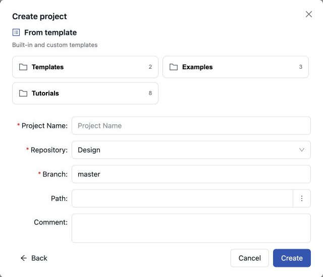

    *Creating a simple project from a template*

1.  If necessary, modify the project name.
1.  Select the repository, and, for a branch-capable repository, select an existing branch or enter a new branch name in the **Branch** field.

    For the **Path** and **Comment** fields, see [Creating Projects in Design Repository](#creating-projects-in-design-repository).

1.  Click **Create**.

    A new project is created in Design repository and opens. Initially, project structure corresponds to the selected project template but can be constructed manually.

1.  To construct the project structure, add folders and upload files as described in [Modifying Project Contents](#modifying-project-contents).

##### Creating a Project Using a Custom Template

A custom project template can be created and then used during new projects definition. To create a new custom project template, proceed as follows:

1.  In the OpenL Studio home directory `\<OPENL_HOME>,` create the following directory:

    ```
    \<OPENL_HOME>\project-templates
    ```

1.  Create a subfolder with a template category name.

    An example is `\<OPENL_HOME>\project-templates\My Custom Templates`.

1.  For project templates that store files with project rules, create subfolders.

    For example, `\<OPENL_HOME>\project-templates\My Custom Templates\MyRule1\rating.xlsx` will be presented as the **MyRule1** template project in the `My Custom Templates` category containing the `rating.xlsx` file.

    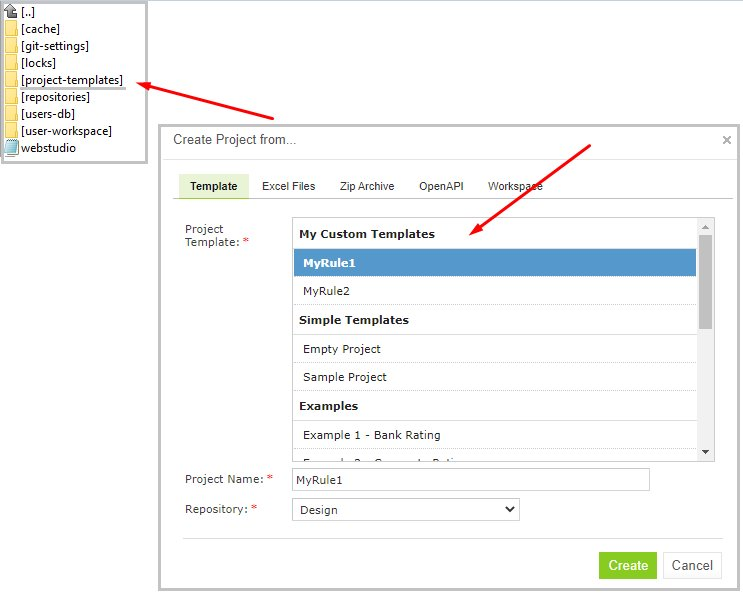

    *Creating a custom project template*

#### Creating a Project from Excel Files

A rule project in the Design repository can be created by loading one or more Excel files that contain OpenL rule tables or entire rule projects.

Proceed as follows:

1.  On the **Projects** page, click **New Project** and then click **From Excel files**.
2.  Click or drag the necessary Excel files to the upload area. The `.xlsx` and `.xls` formats are accepted.
3.  If required, add more files for the project.

    All files are listed under the upload area.

    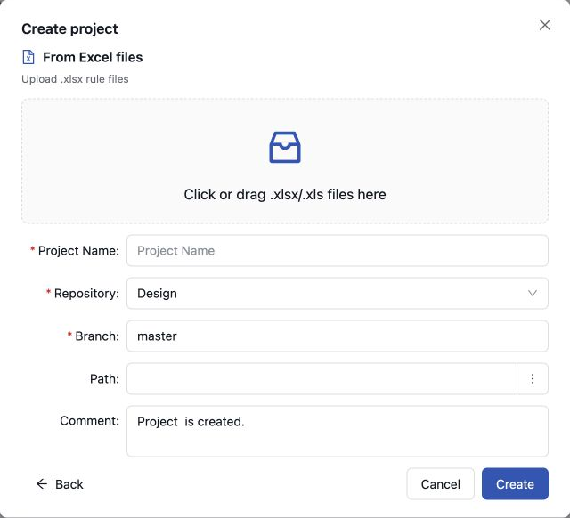

    *Creating a project from Excel files*

    A file can be removed from the list by clicking the delete icon next to its name.

1.  In the **Project Name** field, enter the name by which the project must be represented in Design repository.
2.  Select a repository.

    For more information on available repositories, see [Creating Projects in Design Repository](#creating-projects-in-design-repository).

1.  For a branch-capable repository, select an existing branch or enter a new branch name in the **Branch** field.
1.  Click **Create** to complete.

OpenL Studio creates `rules.xml` in the project root and stores all uploaded workbooks in the `rules/` folder.

#### Creating a Project from OpenAPI file

A rule project in the Design repository can be created by uploading the OpenAPI file.

The OpenAPI Specification (OAS) defines a standard, language-agnostic interface to RESTful APIs which allows both humans and computers to discover and understand the capabilities of the service without access to source code, documentation, or through network traffic inspection.

The algorithm for generating a project from an OpenAPI file is described in the [Appendix B: OpenAPI Project Generation Algorithm](appendices/openapi-generation.md#appendix-b-openapi-project-generation-algorithm).

The OpenAPI file must have a valid structure and a JSON, YAML(YML) extension.

To create a project from the OpenAPI file, proceed as follows:

1.  On the **Projects** page, click **New Project** and then click **From OpenAPI**.
2.  Click or drag the required OpenAPI file to the upload area.
3.  To remove the uploaded file, click the delete icon next to its name.

    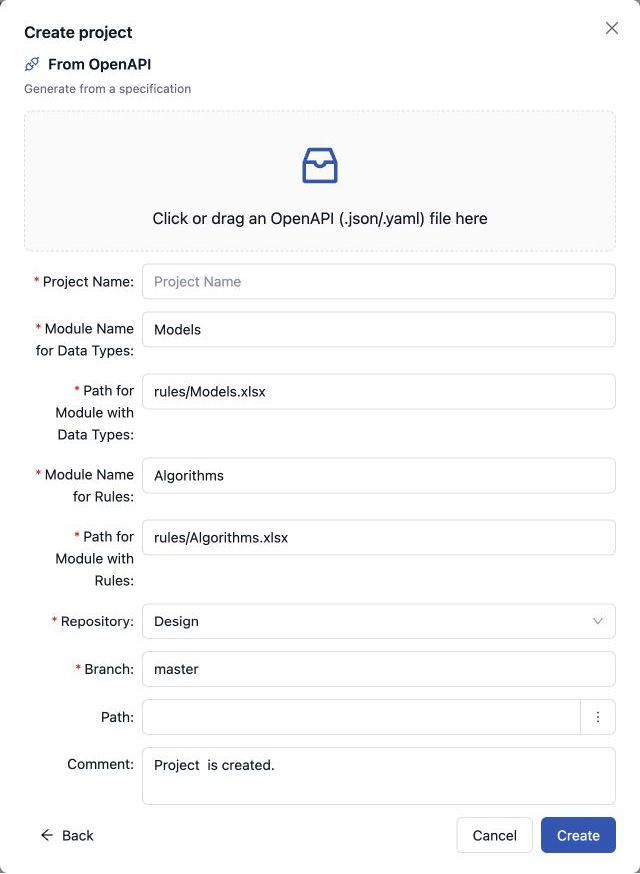

    *Creating a project from an OpenAPI file*

1.  If necessary, modify the names and the file locations of the generated modules: **Module Name for Data Types**, **Path for Module with Data Types**, **Module Name for Rules** and **Path for Module with Rules**.
2.  In the **Project Name** field, enter the name by which the project must be presented in the Design repository.
3.  Select a repository.

    For more information on available repositories, see [Creating Projects in Design Repository](#creating-projects-in-design-repository).

1.  For a branch-capable repository, select an existing branch or enter a new branch name in the **Branch** field.
1.  Click **Create**.

With the default file locations, OpenL Studio stores the generated Models and Algorithms workbooks in the `rules/`
folder. The generated `rules.xml` relies on the standard module layout and omits redundant project and module
declarations. Nonstandard module names or file locations are declared explicitly.

The uploaded OpenAPI file is stored in the project root. Its name is normalized to `openapi.json` for a JSON file or
`openapi.yaml` for a YAML or YML file, regardless of the uploaded file name. The generated `rules.xml` does not contain
an `openapi` block. The normalized file is discovered automatically in the default reconciliation mode, so it validates
the project without continuing to regenerate the workbooks and overwrite subsequent edits.

#### Creating a Project from ZIP Archive

OpenL Studio provides a control for loading rule projects archived in a ZIP file into Design repository. The procedure resembles creating a project from Excel files described above although there are a few differences.

ZIP is the only supported archive format — `.rar` or `.7z` archives cannot be used. A project **folder** is accepted as well, because OpenL Studio packs it into a `zip` archive in the browser first and validates it exactly like an uploaded one — the folder must be a project, holding a `rules.xml` or an Excel file at its root.

The archive must also arrive in full. OpenL Studio reads the directory the archive keeps at its end, so an upload that was cut short is rejected instead of becoming a project with part of its content, and checks the files the archive carries against the checksums recorded for them. An archive that unpacks to more than 2 GB keeps the first check and skips the checksums, so that verifying it cannot itself be turned into an attack.

1.  On the **Projects** page, click **New Project** and then click **From archive**.
1.  Choose **Archive** or **Folder**, click or drag the necessary zip archive or project folder to the upload area.

    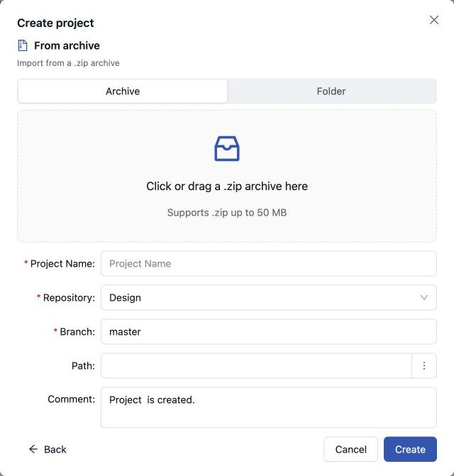

    *Creating a project from ZIP file*

    **Project Name** text box is automatically populated with the project name defined in `rules.xml,` if the uploaded ZIP file contains `rules.xml,` or with the file name.

    An archive that is not a project, because it has neither `rules.xml` nor an Excel file in its root, is refused with a message below the upload area.

1.  If necessary, modify the project name.

    It will be updated in `rules.xml` accordingly.

1.  Select a repository.

    For more information on available repositories, see [Creating Projects in Design Repository](#creating-projects-in-design-repository).

1.  For a branch-capable repository, select an existing branch or enter a new branch name in the **Branch** field.
1.  Click **Create** to complete.

    The new project opens in the workspace right away, the same as a project created from a template or Excel files.

If the archive has no `rules.xml` in its root, OpenL Studio creates one without moving any files in the archive. The
generated descriptor declares `*.xlsx` as the module pattern for workbooks in the project root. Root-level workbooks
in older Excel formats are declared as individual modules so they remain available.

If the archive contains the `tags.properties` file, the tags of the project are taken from it. For more information, see [Tagging a Project](#tagging-a-project).

### Opening a Project

An opened project is copied to user's workspace and becomes available for selection in the editor. The project is opened for viewing and can be modified if it is not locked by another user. When a user modifies a project, its status is set to **In Editing** and it becomes locked for other users who now can only view it.

To open a project, proceed as follows:

-   On the **Projects** page, click the folder icon in the row of the project. To open another revision, select **Open Revision** in the **Actions** menu of the row.
-   On the page of a closed project, click one of the following buttons as required:

    | Button            | Description                                                                                          |
    |-------------------|------------------------------------------------------------------------------------------------------|
    | **Open**          | Opens the latest revision of project.                                                                |
    | **Open Revision** | Available from the menu next to **Open**. Displays window where user can specify which project revision must be opened. |

When the project declares dependencies, **Open** first asks whether to open them together with it. Opening them
is the default, because the project needs them to compile.

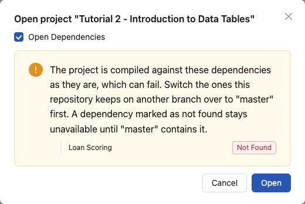

*Opening a project with dependencies*

The same window warns about every dependency the branch of the project does not hold. The project is compiled
against them as they are, which can fail, and the two kinds are dealt with differently:

-   A dependency of the same repository that the workspace keeps on another branch is switched over to the branch
    of the project before opening it. Branches of one repository are not switched together: each project keeps the
    branch it was switched to.
-   A dependency marked **Not Found** stays unavailable until the branch of the project contains it, so switching
    branches does not help. Bring the project into that branch, or open the depending project on a branch that
    already has it.

A dependency of another repository is never reported here: repositories keep no branches in step, so its branch
means nothing to this project.

Any project revision can be opened, with the project status set to **Viewing Revision**, as follows:

-   [Opening a Project Revision Using the Open Revision Button](#opening-a-project-revision-using-the-open-revision-button)
-   [Opening a Project Revision Using the Revisions Tab](#opening-a-project-revision-using-the-revisions-tab)

If the project has unsaved changes, opening a revision asks to confirm that they are lost.

#### Opening a Project Revision Using the Open Revision Button

To open a project revision using the **Open Revision** button, proceed as follows:

1.  On the page of the project, click **Open Revision**. For a closed project, click the arrow next to **Open** and select **Open Revision**.
2.  In the **Project Revision** field, select the required revision.

    A revision is listed by its number, followed by the author and the time it was created,
    so revisions made moments apart can be told apart.

    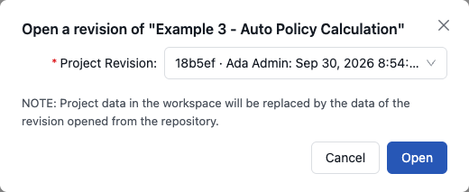

    *Opening a project revision using the Open Revision button*

1.  Click **Open**.

#### Opening a Project Revision Using the Revisions Tab

To open a project revision using the **Revisions** tab, proceed as follows:

1.  On the **Projects** page, select a project.
2.  Click the **Revisions** tab.

    A list of revisions appears, the newest first. A blue dot marks the revision that the project is open on.

    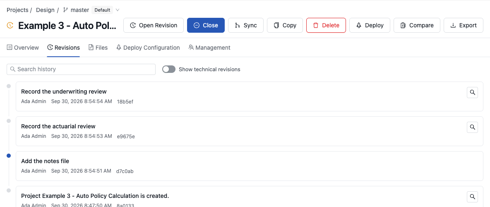

    *List of project revisions*

1.  Navigate to the revision that needs to be opened and click the magnifier icon **Open Revision** at the end of its row.

If a project has the **Viewing Revision** status, the opened project revision becomes available for viewing and modifying, not the latest revision.

If the user tries to modify an old revision of the project in the editor, the system displays the warning message, “**Overwrite the newer revision?**” It explains that saving the old revision overwrites everything committed since. When the user confirms and modifies the old revision, it becomes the current version of the project, and its status changes to **In Editing**.

Revisions can also be accessed through the editor by selecting **More \> Revisions** for a project.

The features **Show technical revisions** and **Search history** are available in OpenL Studio when the repository type is Git.<br/>
The **Show technical revisions** toggle, when on, allows users to see revisions that are not directly related to the current project (for example, changes related to code updates or changes in other projects).<br/>
The **Search history** field helps users quickly locate specific revisions by searching through the comments, modified by, and revision IDs.

### Closing a Project

Closing a project deletes it from the user's workspace. No changes made to the project will be applied and stored. From that point, the project is not available for selection in the editor. Users can still browse closed projects on the **Projects** page.

To close a project, click the green open folder icon in the row of the project, or click **Close** on the page of the project.

If the project has unsaved changes, OpenL Studio asks to confirm that they are discarded.

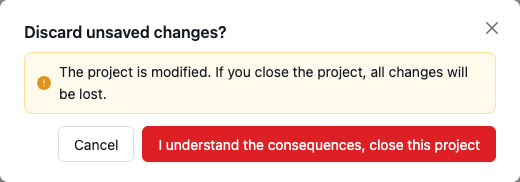

*Closing a modified project*

### Saving a Project

A modified project is saved and copied from the user's workspace to Design repository as a new revision.

**Save** is available only for a project linked to a Design repository. A project with the **Local** status has no
Design repository revision to update; export it as described in
[Exporting a Project or a File](#exporting-a-project-or-a-file) and import the archive as described in
[Creating a Project from ZIP Archive](#creating-a-project-from-zip-archive) instead. The imported project cannot be
opened while the **Local** project of the same name is still in the workspace, so delete the **Local** project after
the import.

To save a project, proceed as follows:

1.  On the page of the project, click **Save**. On the **Projects** page, **Save** is in the **Actions** menu of the row.

    The **Save project** window appears:

    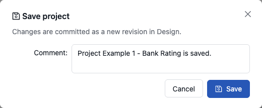

    *Save changes in a project*

1.  Enter a comment if needed and click **Save**.

    A standard comment is suggested. If the repository requires comments of a certain form, a comment that does not match it is refused.

If another user saved the same files in the meantime, the **Resolve Conflicts** window appears, as described in [Resolving Conflicts](project-branches.md#resolving-conflicts).

An editable project can be saved and closed directly from the editor as described in [Editing and Saving a Project](rules-editor.md#editing-and-saving-a-project).

### Viewing the Project Overview

The **Overview** tab of a project page shows the configuration of the project on the left and its properties on the right. A section or a property that the project has no value for is not shown.


*The Overview tab of a project*

The left part describes the project configuration that is stored in `rules.xml`:

-   **Modules** lists the modules of the project. Modules that are found by the standard `rules/` and `tests/` folders are shown as **Auto-discovered modules** and **Auto-discovered tests** with the pattern that finds them, and modules that `rules.xml` declares are shown with their names and paths. Click the name of a module to open it in the editor.
-   **Version patterns**, **Properties processor** and **Exposed methods** show the corresponding settings of `rules.xml`.
-   **Dependencies** lists the projects that this project depends on and the projects that depend on it. A link opens the project, and **Not Found** marks a dependency that no project of the repository satisfies.
-   **Sources** lists the folders and libraries that hold the source code of the project.
-   **OpenAPI** shows the OpenAPI file of the project and its mode.

To change this configuration, click **Edit** above the sections. The button is shown while the project can be modified. For more information, see [Editing and Saving a Project](rules-editor.md#editing-and-saving-a-project).

The right part shows the properties of the project:

-   **Status** — one of the statuses described in [Browsing Projects](#browsing-projects).
-   **Repository** and **Path** — the repository and the folder where the project is stored.
-   **Branch** — the branch the project is on. The branch is a switcher, as described in [Working with Project Branches](project-branches.md#working-with-branches).
-   **Revision ID** — the short ID of the revision the project is based on. The copy icon copies the full revision ID.
-   **Modified** — who modified the project last and when. For a Git repository, the display name of the user is shown.
-   **Comment** — the comment of the last revision.
-   **Tags** — the tags of the project. See [Tagging a Project](#tagging-a-project).

When another user locks the project, the tab starts with a note saying who locked the project and when, and the **Release lock** button unlocks it, as described in [Unlocking a Project](#unlocking-a-project).

### Tagging a Project

Project tags classify projects, for example, by business domain or line of business. The tag types and values are defined as described in [Managing Tags](administration/06-tags.md#managing-tags).

The tags of a project are stored in the `tags.properties` file located in the root directory of the project, one `<type>=<value>` line per tag. OpenL Studio does not ask for tags when a project is created. A project has the tags that its files carry, for instance, when it is created from a ZIP archive or copied from another project.

Tags are shown in the **Tags** section of the **Overview** tab and in the project list, and they can be used for filtering and grouping projects. To tag a project, proceed as follows:

1.  Open the project and its **Overview** tab.
1.  Click the pencil icon **Edit tags** next to **Tags**. The icon is shown only while the project can be modified.
1.  Click **Add**, and enter the tag type in the first field and the tag value in the second one.

    The fields suggest the tag types and values defined in OpenL Studio, but any name and value can be entered. Each tag type can be used only once in a project.

    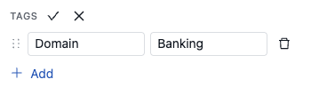

    *Editing the tags of a project*

1.  To remove a tag, click the trash icon at the end of its line.
1.  Click the check mark to save the tags, or the cross to cancel the changes.

    A tag with an empty type or an empty value is left out.

The tags are written to the `tags.properties` file, and the project status changes to **In Editing**. When every tag is removed, the file is deleted. Save the project to store the tags in Design repository.

If a tag is used for grouping in a project tree, its value in a tree gets updated only when the project is saved.

When a project created from an archive or copied from another project carries a value of an extensible tag type that is not yet configured in OpenL Studio, OpenL Studio adds the value to the tag type.

### Managing Project Access

A user gets access to a project through a role, as described in
[Understanding Roles](administration/04-user-information/01-groups.md#understanding-roles). An Administrator assigns
roles in the **Administration** panel. A user with the **Manager** role can also grant, change, and revoke the roles
other users have on the projects the user manages, without involving an Administrator.

A Manager does it in the **Management** tab of a project. The tab is shown to:

-   Administrators.
-   Users with the **Manager** role on the project or on its repository.

The tab is not shown for a project in the **Local** status, which is not shared with anyone, or in the single-user
mode, where there are no other users to grant access to.

To manage the access to a project, proceed as follows:

1.  Open the page of the project and click the **Management** tab.

    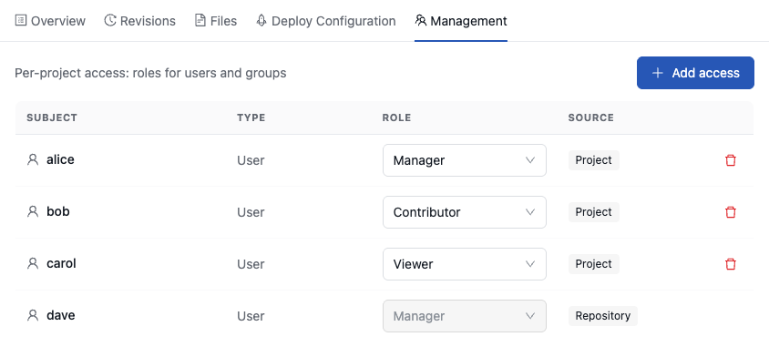

    *Roles on a project*

    The tab lists everyone who has a role on the project:

    -   **Subject** and **Type** — the name of the user or group. Groups are listed only where OpenL Studio is
        integrated with an external user management system, such as Active Directory, LDAP, or an SSO provider.
    -   **Role** — **Viewer**, **Contributor**, or **Manager**.
    -   **Source** — **Project** for a role assigned on the project itself, and **Repository** for a role held on
        the whole repository.

1.  Do any of the following:

    -   To grant a role, click **Add access**. Start typing the username and select the user from the suggestions,
        which appear from the second character. Choose the **Role**, **Viewer** at first, and click **Grant access**.
        Where groups are supported, the dialog also asks for the **Subject Type**, **User** or **Group**. A name that
        does not exist in OpenL Studio is refused with an error in the dialog, and a user who already has a role on
        the project gets the new role instead of the old one.

        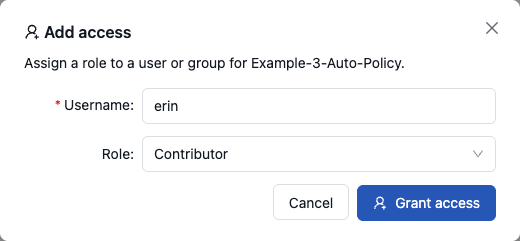

        *Granting a role on a project*

    -   To change a role, select another one in the **Role** column. The change is saved at once.
    -   To revoke a role, click the trash icon at the end of the row and click **OK** to confirm.

A change takes effect at once: the next request of the user is checked against the new role, and the user does not
need to sign in again.

Keep in mind:

-   Revoking removes only the role assigned on the project. The user keeps the access that comes from a role on the
    repository, from a group, or from the Default Group. A role assigned on the project takes precedence over the
    one inherited from the repository, as described in
    [Role Inheritance and Conflict Resolution](administration/04-user-information/01-groups.md#role-inheritance-and-conflict-resolution).
-   A role from the **Repository** is listed only to a Manager of that repository. It applies to every project of the
    repository, so it is read-only here and is changed by an Administrator in the **Administration** panel.
-   A Manager cannot revoke their own role on the project: the row has no trash icon.

### Modifying Project Contents

This section describes modifying the physical structure of the project in the **Files** tab and includes the following topics:

-   [Creating a Folder](#creating-a-folder)
-   [Creating a Text File](#creating-a-text-file)
-   [Uploading a File](#uploading-a-file)
-   [Updating a File](#updating-a-file)
-   [Editing a Text File](#editing-a-text-file)
-   [Renaming, Moving and Copying a File](#renaming-moving-and-copying-a-file)
-   [Deleting a Folder or a File](#deleting-a-folder-or-a-file)

The **Files** tab shows the folders and files of the project as a tree, with the size of every file. The search box above the tree filters it by name. Select a file to view it, or a folder to see the actions available for it, in the pane on the right.

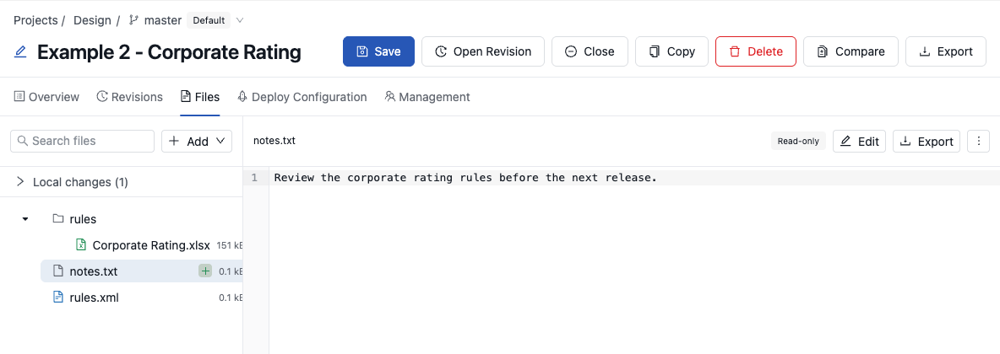

*The Files tab of a project*

A project can be modified only while it is open and not locked by another user. The **Add** menu and the actions for files and folders are not shown otherwise.

Every change is made in the workspace copy of the project. The project status changes to **In Editing**, the added, modified and deleted files are marked in the tree, and **Local changes** above the tree lists them. Save the project to store the changes in Design repository, as described in [Saving a Project](#saving-a-project).

An uploaded Excel workbook or ZIP archive is checked for completeness before it is stored. A file that did not
arrive in full — an upload interrupted halfway, or content damaged on its way — is rejected with an error, so a
module nobody can open never reaches the project. Files of any other type are stored as they arrive, and an
upload larger than 1000 MB is refused rather than checked.

#### Creating a Folder

To create a new folder in the project structure, proceed as follows:

1.  In the tree, select the parent folder in which the new folder must be created.
1.  Click **Add** and select **New folder**.
2.  In the **New folder** window, enter the path of the folder in the **Path** field and click **OK**.

    The path starts with the folder selected in the tree. To create a root level folder, enter the folder name only. To select an existing folder as the beginning of the path, click **Browse folders** **⋮**.

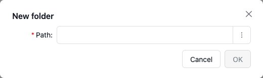

*Creating a folder*

A new folder is not stored on its own: it stays empty in the tree until a file is added to it, and only then appears in Design repository. **Remove empty folder** in the folder pane removes a folder that has no files yet.

#### Creating a Text File

To create an empty text file, for instance, a `rules-deploy.xml` or a properties file, proceed as follows:

1.  Click **Add** and select **New text file**.
2.  In the **New text file** window, enter the file name in the **Name** field. To place the file in a folder, enter or select the folder in the **Path** field.
3.  Click **OK**.

The file is created empty and can be filled in as described in [Editing a Text File](#editing-a-text-file).

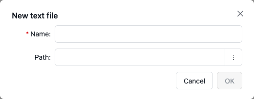

*Creating a text file*

#### Uploading a File

To upload files to a project folder, proceed as follows:

1.  In the tree, select the folder where the files should be uploaded.

    The **Path** field of the window starts with the selected folder.

1.  Click **Add** and select **Upload**.

    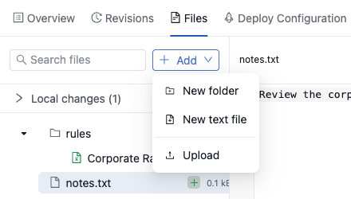

    *The Add menu*

    The **Upload** window appears:

    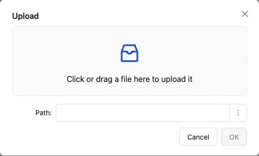

    *Uploading a file*

1.  Click or drag one or more files to the upload area.
2.  If a single file is uploaded, the **Name** field suggests its name. Enter the name of the file to be used in Design repository if it must differ.

    Several files keep their own names.

1.  In the **Path** field, enter or select the folder. Leave the field empty to upload files to the project root.
2.  Click **OK**.

#### Updating a File

To replace the content of a file of the project, proceed as follows:

1.  In the tree, select the file to be updated.
2.  Click the **More actions** icon **⋮** and select **Update**.
3.  In the **Update file** window, click or drag the file with the new content to the upload area.
4.  Click **Update** to end the action.

The file keeps its path and name.

#### Editing a Text File

A text file, such as `rules.xml`, `rules-deploy.xml` or a Groovy script, opens in a viewer on the right. To edit it, proceed as follows:

1.  Select the file and click **Edit**.
2.  Change the content.
3.  Click **Save** to keep the changes in the workspace copy, or **Cancel** to discard them.

An Excel workbook or another binary file cannot be viewed here. Its pane offers **Export**, and for a module of the project, **Open in Editor** opens the tables of the module in the editor.

#### Renaming, Moving and Copying a File

The **More actions** icon **⋮** of a selected file offers the following actions:

-   **Rename** — changes the name of the file. Enter the name in the **New File Name** field.
-   **Move** — moves the file to another folder. Enter or select the folder in the **Path** field.
-   **Copy** — creates a copy of the file. Enter the name of the copy in the **New File Name** field and the folder of the copy in the **Path** field.

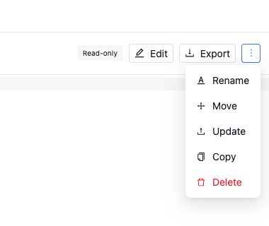

*The actions of a file*

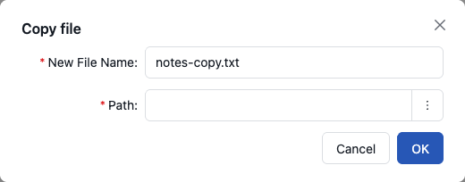

*Copying a file*

A folder can be copied as well: select the folder and click **Copy** in its pane.

The newly created file appears in the tree.

#### Deleting a Folder or a File

To delete a folder or a file in the project structure, proceed as follows:

1.  Expand the tree and select the folder or file to be deleted.
2.  For a file, click the **More actions** icon **⋮** and select **Delete**. For a folder, click **Delete** in its pane.
3.  In the confirmation window, click **Delete**.

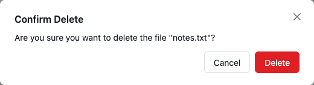

*Deleting a file*

Deleting a folder or a file changes the opened project. Save the project to store the deletion in Design repository.

### Copying a Project

Copying a project creates a new project with identical contents and a different name in Design repository, or a new branch of the same project. A copy can
be created from the **New Project** wizard or from the selected project's **Copy** action.

To copy a project from the **New Project** wizard, proceed as follows:

1.  Click **New Project** and select **Copy project**.
2.  Select the source project and enter the new project name.
3.  Select the target repository.
4.  For a branch-capable repository, select an existing branch or enter a new branch name in the single **Branch**
    field.
5.  If necessary, specify a path and modify the commit comment.
6.  Click **Create**.

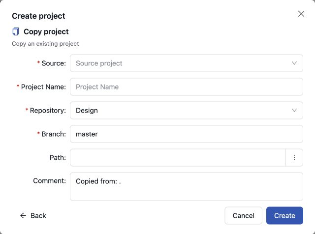

*Copying a project in the Create Project wizard*

To copy the selected project, proceed as follows:

1.  Click the **Copy** icon in the row of the project, or click **Copy** on the page of the project.

    For a repository that supports branches, the **Copy project** window initially offers to create a branch of the project: it shows the **Current Branch** and suggests a name in the **New Branch Name** field. For more information, see [Creating a Branch](project-branches.md#creating-a-branch).

    

    *The Copy project window offering a new branch*

2.  Select **Create a New Project** to copy the project instead of branching it.
3.  Enter the new project name and select the target repository.
4.  For a branch-capable target repository, select an existing branch or enter a new branch name in **Branch**.
5.  If necessary, specify the target path and modify the commit comment.
6.  To copy an earlier state, select **Copy an Old Revision** and choose the revision.
7.  Click **Copy**.

A copy in the default branch appears in the project list at once; a copy in another branch is listed once that branch
is picked in the **Branch** filter. The selected branch is its home branch when no other branch contains the project.

### Removing a Project

Deleting a project removes it from the user's workspace and from the current state of Design repository. For Git
repositories, OpenL Studio stores this change as a regular delete commit, so repository history keeps the deletion
event. If the project is opened by any user on the deleted branch, OpenL Studio closes it before removal and
discards unsaved changes. If the project also exists in another branch, it remains available in that branch, and
copies opened from those other branches are not removed.

> [!Note]
> Projects in the **Local** status that were not uploaded to Design repository will be removed physically and cannot be restored.

To delete a project, proceed as follows:

1.  Perform one of the following steps as required:
    -   On the page of the project, click **Delete**.
    -   On the **Projects** page, select **Delete** in the **Actions** menu **⋮** of the row of the project.
1.  In the confirmation window, enter a comment.
2.  Select **I understand that the project will be deleted**.
3.  Click **Delete**.

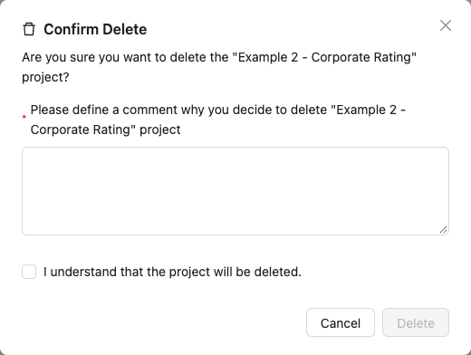

*Deleting a project*

### Deploying a Project

OpenL Studio allows deploying a project directly to a deployment repository.

To deploy a project, proceed as follows:

1.  Perform one of the following steps as required:
    -   On the page of the project, click **Deploy**.
    -   On the **Projects** page, select **Deploy** in the **Actions** menu **⋮** of the row of the project.

    > [!Note]
    > The **Deploy** action is not offered if the project has the **Local** status or has unsaved changes. Save the project first.

    The **Deploy "&lt;Project Name&gt;" project** dialog appears.

    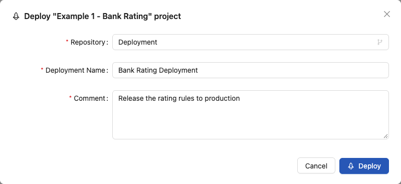

    *Deploy project dialog*

2.  In the **Repository** dropdown, select the target deployment repository. Only the repositories the user may deploy to are offered.
3.  In the **Deployment Name** field, select an existing deployment from the list or type a new name to create one.
4.  In the **Comment** field, enter a comment describing the deployment.
5.  Click **Deploy**.

The project is deployed to the selected deployment repository, and the **Project deployed** message is displayed. The project is listed in the deployment on the **Deployments** page and in **Existing deployments** of its **Deploy Configuration** tab.

A deployment repository can be configured to take projects only from the main branch of Design repository. For a project that is on another branch, the dialog explains that the project must be switched to the main branch or another repository must be selected, and **Deploy** is disabled.

The following topics are included in this section:

-   [Configuring Rules Deploy Configuration Settings](#configuring-rules-deploy-configuration-settings)
-   [Defining Rule Service Version](#defining-rule-service-version)

#### Configuring Rules Deploy Configuration Settings

Deployment rules can be added before deploying a project to deployment repository. They are stored in the `rules-deploy.xml` configuration file of the project and shown in the **Deploy Configuration** tab. The right part of the tab, **Existing deployments**, lists the deployments of the project: the name of the deployment, its repository, the design revision that was deployed with its author and the time it was deployed.

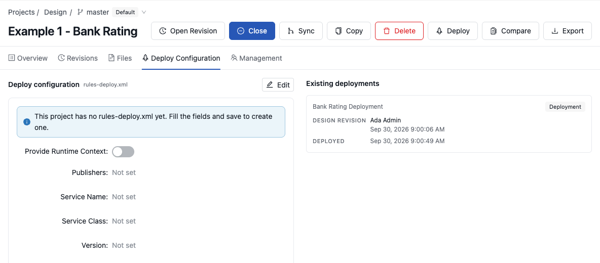

*The Deploy Configuration tab*

Proceed as follows:

1.  Open the project and click the **Deploy Configuration** tab.
2.  Click **Edit**. The button is shown while the project can be modified.

    A project without the `rules-deploy.xml` file shows the note that the file will be created when the settings are saved.

3.  In the tab, enter the following information about the rules:
    -   **Provide Runtime Context** — switch it on to provide runtime context.
    -   **Publishers** — select the publishers, for example, RESTFUL or KAFKA.
    -   **Service Name** — enter the service name.

        The service name is displayed for a deployed project only in the embedded mode.

    -   **Service Class** — define the service class.
    -   **Version** — define the service version.

        For more information on service version definition, see [Defining Rule Service Version](#defining-rule-service-version).

    -   **URL** — enter URL of the service.
    -   **Annotation Template Class** — define the annotation template class.
    -   **Groups** — define comma separated service groups.
    -   **Configuration (XML)** — add configuration description to the XML file.

        For more information on the **Deploy Configuration** tab settings configuration, see [OpenL Tablets Rule Services Usage and Customization Guide > Service Configurer](../rule-services/configuration.md#service-configurer).

1.  Click **Save**.

    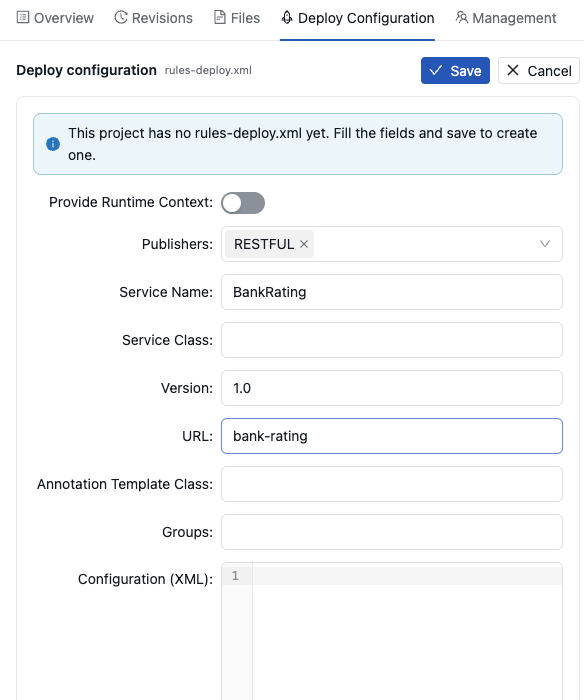

    *Defining rules deploy configuration settings*

    The settings are written to `rules-deploy.xml`. The file is a project file, so the project status changes to **In Editing**. Save the project to store the settings in Design repository.

> [!Note]
> Only **Annotation Template Class** is offered. When `rules-deploy.xml` names the class in the `interceptingTemplateClassName` element, the value is shown in this field, and the file is saved with the `annotationTemplateClassName` element.

A `rules-deploy.xml` that keeps settings in a legacy form shows the **Migrate** button. It brings the file to the current minimal form: drops the default runtime-context flag and renames the legacy template class setting. The file is written anew, so its comments and layout are not kept.

#### Defining Rule Service Version

OpenL Studio supports versioning definition for rule services. This functionality allows specifying a version for the project revision to be deployed. The required version of the deployed project can be called from deployment repository. All specified versions of the project appear on the OpenL Tablets Rule Services page with a version number defined in brackets.

To check the services version deployment, in OpenL Tablets Rule Services, find the name of the deployed project. Services version is set both in the services header and in the services URL.

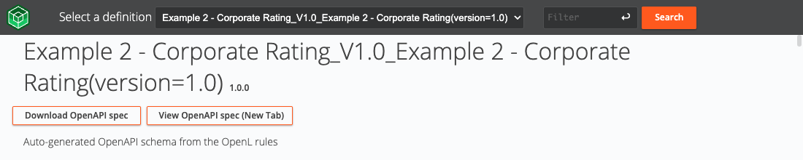

*Services header and URL with the version number*

To define the rule service version, proceed as follows:

1.  Open the project and click the **Deploy Configuration** tab.
2.  Click **Edit**.
3.  In the **Version** field, enter the services version.

    For example, to create the services version 1.0, enter `1.0`.

1.  For more information on how to configure deployment configuration settings, see [Configuring Rules Deploy Configuration Settings](#configuring-rules-deploy-configuration-settings).
2.  Click **Save**.

The selected services version is displayed in the **Deploy Configuration** tab of the project. For the example displayed in this section, the project version is 1.0.

### Comparing Project Revisions

OpenL Studio compares an Excel file of the project as the working copy has it now with the same file as a revision holds it.
To compare the working copy with another revision, proceed as follows:

1.  On the page of the project, click **Compare**. On the **Projects** page, **Compare** is in the **Actions** menu **⋮** of the row.

    The comparison opens in a window of its own, where what to compare is picked: the Excel file of the working copy on the left, and the branch, the revision and the Excel file to compare it with on the right.

    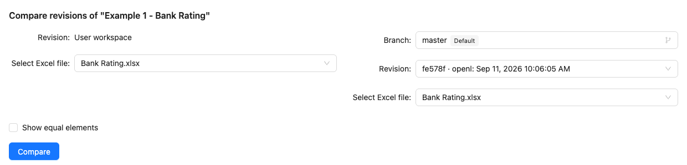

    *Picking the working copy on one side and a revision on the other*

1.  To list the elements that are the same in both files as well, select the **Show equal elements** check box.
2.  Click **Compare**.

    The elements that differ are listed grouped by Excel sheet. Selecting an element displays the two versions of it next to each other, with the cells that read differently highlighted, exactly as described in [Comparing Excel Files](rules-editor.md#comparing-excel-files).

1.  To compare another pair, click **Select other files**.

### Exporting a Project or a File

To export a project, proceed as follows:

1.  On the page of the project, click **Export**. On the **Projects** page, **Export** is in the **Actions** menu **⋮** of the row.
2.  In the **Export** window, select the required **Project Revision** and click **Export**. A full project in the selected revision is downloaded as a ZIP archive.

    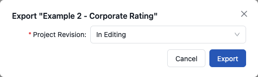

    *Exporting a project*

The default project version for export is the one that a user has currently open. If it contains unsaved changes, it is marked as **In Editing,** otherwise, it is called **Viewing**. A closed project offers its revisions only, the latest first, and the list loads older revisions on demand: click **Load older revisions** at its end.

To export a file or a folder of the project as it is now, proceed as follows:

1.  Open the project and click the **Files** tab.
2.  In the tree, select the file or the folder to be exported.
3.  Click **Export** in the pane on the right.

A file is downloaded as it is, and a folder as a ZIP archive.

To export any revision of an Excel file of a module, click **Export** in the toolbar of the module in the editor. In the window that opens, select the required **File Revision** and click **Export**.

> [!Note]
> A project in the **Local** status has no revisions in a Design repository, so the export window offers
> its working copy only, listed as **Local**.

### Unlocking a Project

OpenL Studio provides a function for a user to unlock a project which is edited and, therefore, locked by another user. Be aware that after unlocking, all unsaved changes made by another user will be lost and the project will be closed. A lock icon follows the project name in the list, and the note on top of the **Overview** tab names the user who locked the project and says when.

To unlock a project, proceed as follows:

1.  Perform one of the following steps as required:
    -   On the page of the project, click **Unlock**.
    -   In the note on top of the **Overview** tab, click **Release lock**.
1.  In the confirmation, click **OK**.

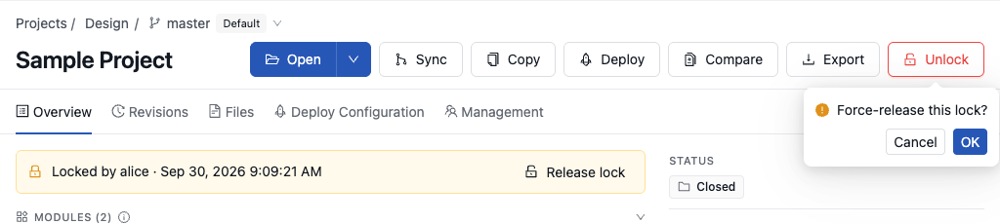

*Unlocking a project that another user edits*

**Unlock** is offered only to users who have administrative rights on the project. It is recommended to grant permission to the “Unlock” functionality only for administrators.

### Browsing Deployments

**The Deployment repository** contains project deployments and is also the location from where solution applications use them. OpenL Studio allows connecting several deployment repositories. For information on how to configure deployment repositories, refer to [Managing Repository Settings](administration/01-repository-settings/index.md#managing-repository-settings).

To browse a deployment repository, proceed as follows:

1.  Click **Deployments** in the top bar.
2.  In the **Repositories** panel, select the deployment repository to be browsed.

    The deployments of the selected deployment repository are listed on the right. The search box above the list finds a deployment by name.

    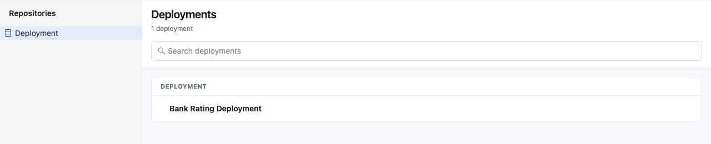

    *The Deployments page*

1.  Click a deployment to see the projects deployed in it.

OpenL Studio displays only the latest revisions of each deployment in the deployment repository.

When browsing deployments in the deployment repository, users can see their content, namely what rules projects are deployed.

For every deployed project, the list displays the following information:

-   **Project** — the name of the deployed project
-   **Revision in Design Repository** — the revision the project has in the design repository it was built from, named by who committed it and, underneath, when
-   **Modified By** and **Modified At** — who deployed the project and when

A deployed project keeps no reference back to where it came from, so its design revision is recognized by content: OpenL Studio indexes the revisions of the design repositories in the background and looks for the one whose files match the deployed project. Two consequences follow:

-   the revision of a project that was just deployed appears once the indexing reaches it, not immediately;
-   the revision stays unknown for a project deployed from a design repository this OpenL Studio does not have, and for content that no design revision matches.

The indexing is controlled by the `repository.cache.monitor.enabled` property. Switching it off leaves the **Revision in Design Repository** column empty for every deployed project.

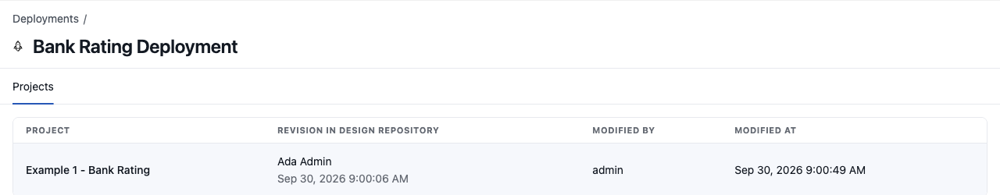

*The projects of a deployment*

### User Data for Git Commits

Upon user logon, OpenL Studio requires the user's email address and display name. If either value is missing, the
**Complete Your Profile** window opens before the user can continue to OpenL Studio. First Name and Last Name are
optional and can be used to generate the display name. The completed display name and email are used for Git commits
for the following actions:

-   create a project
-   copy a project
-   save a project
-   merge a project
-   delete a project
-   delete a branch
-   deploy a project
-   synchronize a project
