## Using Rules Editor

This chapter describes basic tasks that can be performed in Rules Editor. For more information on Rules Editor, see [Introducing Rules Editor](getting-started.md#introducing-rules-editor).

The following topics are included in this chapter:

-   [Filtering Projects](#filtering-projects)
-   [Viewing a Project](#viewing-a-project)
-   [Viewing a Module](#viewing-a-module)
-   [Managing Projects and Modules](#managing-projects-and-modules)
-   [Defining Project Dependencies](#defining-project-dependencies)
-   [Viewing Tables](#viewing-tables)
-   [Modifying Tables](#modifying-tables)
-   [Referring to Tables](#referring-to-tables)
-   [Managing Range Data Types](#managing-range-data-types)
-   [Copying a Table](#copying-a-table)
-   [Performing a Search](#performing-a-search)
-   [Creating Tables](#creating-tables)
-   [Comparing Excel Files](#comparing-excel-files)
-   [Viewing and Editing Project-Related OpenAPI Details](#viewing-and-editing-project-related-openapi-details)
-   [Reconciling an OpenAPI Project](#reconciling-an-openapi-project)

### Filtering Projects

To limit a list of projects displayed in the **Projects** list, start typing a project name in the field located above the list of projects.

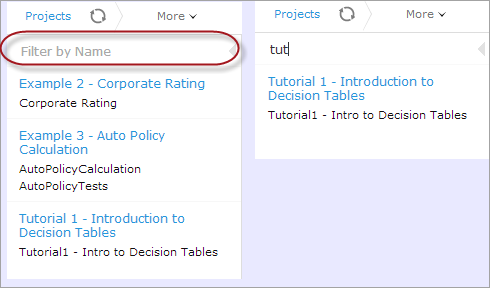

*Filtering projects by Name*

To get a full list of projects, delete filter text value in the field.

### Viewing a Project

Rules Editor allows a user to work with one project at a time. To select a project, in the **Projects** tree, select the blue hyperlink of the required project name. The project page with general information about the project and configuration details appears in the middle pane of the editor.

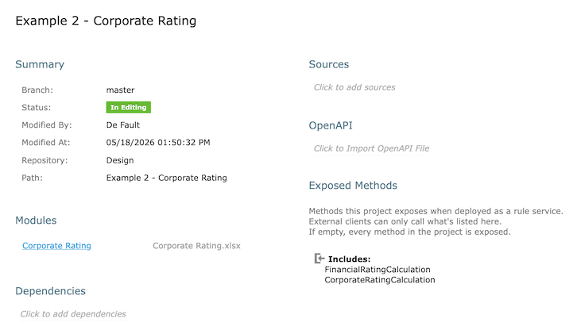

*A project page in Rules Editor*

If a particular project is not available, it must be opened as described in [Opening a Project](repository-editor.md#opening-a-project).

### Viewing a Module

Rules Editor allows a user to work with one module at a time. To select a module, in the **Projects** tree, select the black hyperlink of the module name. The following module information is displayed:

-   tree in the left pane displaying module tables
-   general module information displayed in the middle pane, including project and module names, associated Excel file, number of tables, and module dependencies

If a particular module is not available, the project in which it is defined must be opened as described in [Opening a Project](repository-editor.md#opening-a-project).

By default, a project is opened in the multi-module mode. This is a common production mode. In the multi-module mode, all modules of the current project with all their dependencies are displayed, that is, modules of projects defined as the project dependencies.

For more information on project and module dependencies, see [OpenL Tablets Reference Guide > Project and Module Dependencies](https://openldocs.readthedocs.io/en/latest/documentation/guides/reference_guide/#project-and-module-dependencies).

The first opened module page is displayed right after the module is loaded, while loading of the whole project continues in the background. The loading progress bar is displayed in the **Problems** section. Errors and warnings are displayed dynamically while more modules are compiled.

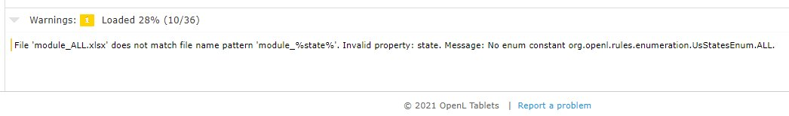

*Loading progress bar*

If a module is modified during loading, this module is re-compiled and project loading continues. When the loading is complete, the progress bar is displayed for ten more seconds and then disappears.

The loading progress bar is not displayed for newly opened projects if a project has only one module or multiple small modules which loading takes less than one second. The loading progress bar is also not displayed if the project is already opened and fully compiled and the following actions happen:

-   A page is refreshed using the browser refresh button.
-   A user leaves the project by switching to the main Editor or Repository page and then returns to the project without opening other projects in the meantime.
-   A user switches between modules of the same project.

If a user clicks the refresh button in OpenL Studio, loading restarts and progress bar appears again. While loading in process, the **Run, Trace, Test,** and **Benchmark** actions work only for currently opened module. That is why the **Within Current Module Only** check box is selected and cannot be edited in the menu of these actions while loading is in progress.

When loading is completed, the **Within Current Module Only** check box is cleared and becomes editable.

### Managing Projects and Modules

This section explains the following tasks that can be performed on projects in Rules Editor:

-   [Editing and Saving a Project](#editing-and-saving-a-project)
-   [Updating and Exporting a Project](#updating-and-exporting-a-project)
-   [Copying a Project](#copying-a-project)
-   [Exporting, Updating, and Editing a Module](#exporting-updating-and-editing-a-module)
-   [Comparing and Reverting Module Changes](#comparing-and-reverting-module-changes)
-   [Copying a Module](#copying-a-module)

#### Editing and Saving a Project

A project can be opened for editing and saved directly in Rules Editor.

1.  To save the edited project, click **Save** .

    **Note:** If a project is in the **Local** status, this option is not available in Rules Editor.

2.  To modify the project in the **Project** page, modify the values as described in the following table:

| Project details                                                                                                                               | Available actions                                                                                                                                                                                                                                                                                                                                                                                                                                                                                                                                                                                                                                                                                                                                        |
|-----------------------------------------------------------------------------------------------------------------------------------------------|----------------------------------------------------------------------------------------------------------------------------------------------------------------------------------------------------------------------------------------------------------------------------------------------------------------------------------------------------------------------------------------------------------------------------------------------------------------------------------------------------------------------------------------------------------------------------------------------------------------------------------------------------------------------------------------------------------------------------------------------------------|
| General project information  and configuration,  such as OpenL version compatibility,  description, project name,  and custom file name processor | Put the mouse cursor over the project name and click **Edit**  .  Project name can be edited only for projects in a non-flat Git repository.  The project name will be changed in OpenL Studio only, while the folder name remains unchanged.  For more information on properties pattern for the file name, see  [OpenL Tablets Reference Guide > Properties Defined in the File Name](https://openldocs.readthedocs.io/en/latest/documentation/guides/reference_guide/#properties-defined-in-the-file-name). |
| Project sources                                                                                                                               | Put the mouse cursor over the **Sources** label and click **Manage Sources**  .                                                                                                                                                                                                                                                                                                                                                                                                                                                                                                                                                                                                          |
| Modules configuration                                                                                                                         | Put the mouse cursor over the **Modules** label or a particular module name and click **Add Module**  or **Edit Module**   or **Remove Module** .                                                                                                                                                                                                                                                                                                                                                                                                         |
| Project dependencies                                                                                                                          | Manage dependencies as described in [Defining Project Dependencies](#defining-project-dependencies).                                                                                                                                                                                                                                                                                                                                                                                                                                                                                                                                                                                                                                                     |

All changes are saved in the project `rules.xml` file. For more information on this XML file, see the [OpenL Tablets Developers Guide](https://openldocs.readthedocs.io/en/latest/documentation/guides/developer_guide).

#### Updating and Exporting a Project

To update or export a project, proceed as follows:

1.  To update a project directly in Rules Editor, in the top line menu, click **Update**.

    The **Update** button is available for projects in the **In Editing** status.

    In the dialog that appears, upload a `.zip` archive with the project content, or switch to **Folder** and select a folder with the project files. The upload replaces the project content: files with the same path are overwritten, new files are added, and project files absent from the upload are deleted.

1.  To export the project to the user’s local machine, for a project, in the top line menu, click **Export** and select a project revision.

The default project version for export is the one that a user has currently open in Rules Editor. If it contains unsaved changes, it is marked as **In Editing,** otherwise, it is called **Viewing.**

Exported project is downloaded as a `.zip` archive.

#### Copying a Project

To create a copy of a project, proceed as follows:

1.  In the top line menu, click **Copy**.
2.  In the window that appears, enter the new project name.
3.  Modify **Comment** if needed.
4.  When you need to copy a project with revisions, select the **Copy old revisions** check box and provide the necessary number of revisions in the **Revisions to copy** field.
5.  Click **Copy.**

The new project appears in the project list.

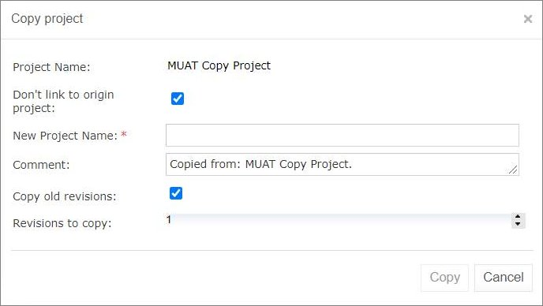

*Copying a project*

#### Exporting, Updating, and Editing a Module

A user can export, update, or edit a module directly in Rules Editor. Proceed as follows:

1.  To upload a changed module file, for a module, in the top line menu, click **Update** and select an Excel file. The uploaded file replaces the module file. When the selected file name differs from the current module file name, a warning is displayed.
2.  To export the module to the user’s local machine, for a module, in the top line menu, click **Export** and select a module revision.

    The default module version for export is the one that a user has currently open in Rules Editor. If it contains unsaved changes, it is marked as **In Editing,** otherwise, it is called **Viewing**.

1.  To modify module configuration, such as module name, path, and included or excluded methods, in the **Module** page place the mouse cursor over the module name and click **Edit** .

    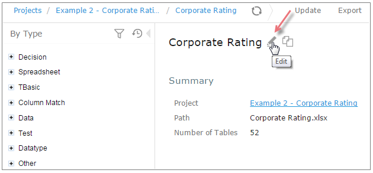

    *Initiating module editing*

    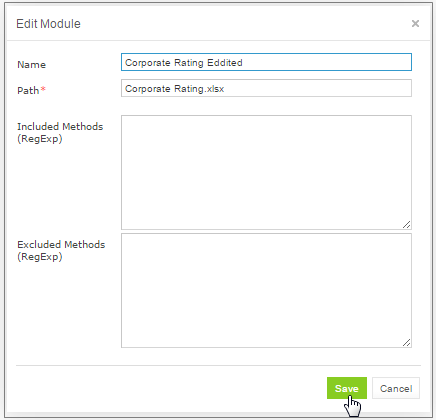

    *Editing module information*

1.  To save the changes, click **Save** .

**Notes:** The 'Included Methods' and 'Excluded Methods' on this UI has been deprecated and kept for backward
compatibility. The new fields for filterring exposed methods are located on the project info UI.
For more information, refer to the [Rule Services and Customization Guide > Dynamic Interface Support](https://openldocs.readthedocs.io/en/latest/documentation/guides/rule_services_usage_and_customization_guide/#dynamic-interface-support)

#### Comparing and Reverting Module Changes

OpenL Studio allows comparing module versions and rolling back module changes against the specific date.
To compare module versions, proceed as follows:

1.  In the **Projects** tree, select the module.
2.  In the top line menu, select **More** **\>** **Local** **Changes**.
    The **Local** **Changes** page appears displaying all module versions, with the latest versions on the top.

    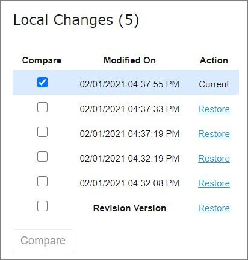

    *Displaying the Changes window*

    When a project is modified, upon clicking the **Save** icon 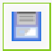, a temporary version of the module is created, and it appears in the list of local changes. When project update is complete, clicking **Save** removes all temporary versions from Local Changes, and a new version is added to the list of revisions.

    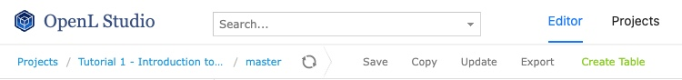

    *Clicking Save to complete project update and save changes as a revision version*

1. To compare the changes, select check boxes for two required versions and click **Compare**.

    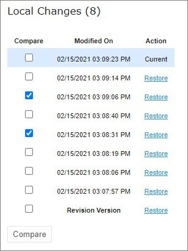

    *Comparing module versions*

    The system displays the module in a separate browser window where changed tables are marked as displayed in the following example.

    

    *Tables with changes*

1. To view the changes, click the required table.

    The result of the comparison is displayed in the bottom of the window.

    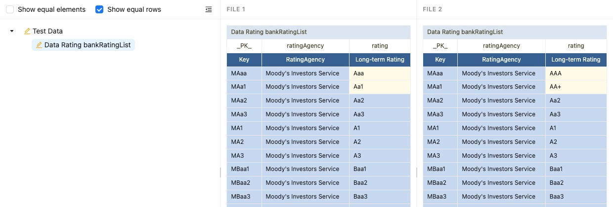

    *The result of the module version comparison*

1.  To revert module changes, for the required module version, click the **Restore** link and confirm the changes.

    When **Restore** is clicked, the corresponding changes are restored but this action is not added to the history as a change.

#### Copying a Module

OpenL Studio allows creating a copy of the existing module, in Editor, in either **Project** page, or in the **Module** page. The following topics are included in this section:

-   [Copying a Simple Module](#copying-a-simple-module)
-   [Copying a Module Defined Using the File Path Pattern](#copying-a-module-defined-using-the-file-path-pattern)

##### Copying a Simple Module

To create a copy of a module, proceed as follows:

1.  Do one of the following:
    -   To create a copy of a module using the **Project** page, in the project tree, select a project which module must be copied, in the modules list, put the mouse cursor over the selected module name, and click **Copy Module** .
    -   To create a copy of a module using the **Module** page, in the project tree, select a module to be copied, put the mouse cursor over the module name, and click **Copy Module** .
1.  In the window that appears, enter the new module name.

    When the new module name is entered, the **Copy** button becomes enabled.

1.  Optionally, edit the **New File Name** field value.

    The file name can differ from the module name.

1.  Optionally, to copy the module to the specific folder, in the **New File Name** field, enter the file name and its location.

    The original path cannot be modified other than by entering the specific path in the **New File Name** field. For example, if the original module is located in `folder1`, the new module will be copied to `folder1`. `Folder1` cannot be changed, but a user can define a new file name, such as `folder2/Bank Rating ver2.xlsx,` and then the new module will be created in `folder1/folder2/Bank Rating ver2.xlsx`.

1.  Click **Copy**.

A new simple module is displayed in the modules list.

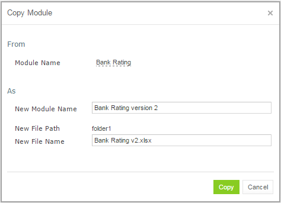

*Creating a copy of a module*

##### Copying a Module Defined Using the File Path Pattern

If the module is defined using **File Path Pattern**, to copy such module, proceed as follows:

1.  Do one of the following:
    -   To create a copy of a module using the **Project** page, put the mouse cursor over multiple modules, click **Copy Module** , in the window that appears, click **Select module,** and in the **File Path** drop-down list, select the name of the module to copy.
    -   To create a copy of a module using the **Module** page, in the project tree, select a module to copy, put the mouse cursor over the module name, and click **Copy Module** .
1.  Click **Select module** and in the **File Path** drop-down list, select the name of the module to copy.
2.  Enter the new module name.
3.  Click **Copy**.

The new module is displayed in the modules list.

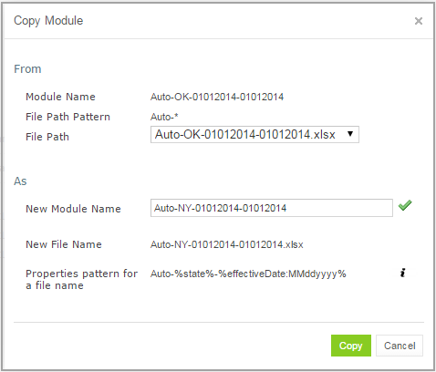

*Copying a module with the defined file path and properties patterns*

If the new module name does not match the properties pattern for the file name, no business dimension properties will be applied to the rules inside the module.

### Defining Project Dependencies

A project dependency can be defined when a particular rule project, or **root project**, depends on contents of another project, or **dependency project**. Project dependencies are checked when projects are deployed to the deployment repository. OpenL Studio displays warning messages when a user deploys projects with conflicting dependencies.

To define a dependency on another project, proceed as follows:

1.  In Rules Editor, in the project tree, select a project name.
2.  If the project is not editable, make it editable as described in [Editing and Saving a Project](#editing-and-saving-a-project).
3.  Put the mouse cursor over the **Dependencies** label and click **Manage Dependencies**  .
4.  In the window that appears, update information as required and click **Save**.

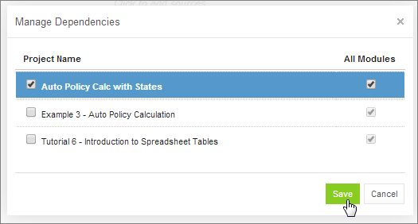

*Managing project dependencies*

If the **All Modules** option is selected in the multi-module mode, tables of all modules of the dependency project are accessible from any module of the root project.

If the **All Modules** option is cleared or the single module mode is selected, the root project module has access to the particular module of the dependency project only if an appropriate dependency is added in the **Environment** table of the root module.

**Note:** Module names of the root and dependency projects must be unique.

**Note:** Dependency projects must be available in Rules Editor to make dependency work.

For more information on project and module dependencies, see the [OpenL Tablets Reference Guide > Project and Module Dependencies](https://openldocs.readthedocs.io/en/latest/documentation/guides/reference_guide/#project-and-module-dependencies).

### Viewing Tables

OpenL Tablets module tables are listed in the module tree. Table types are represented by different icons in Rules Editor. The following table describes table type icons:

| Icon                                                             | Table type                                                                           |
|------------------------------------------------------------------|--------------------------------------------------------------------------------------|
|  | Decision table.                                                                      |
|  | Decision table with unit tests.                                                      |
|  | Column match table.                                                                  |
|  | Column match table with unit tests.                                                  |
|  | Tbasic table.                                                                        |
|  | Tbasic table with unit tests.                                                        |
| 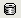 | Data table.                                                                          |
| 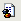 | Datatype table.                                                                      |
|  | Method table.                                                                        |
| 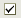 | Unit test table.                                                                     |
|  | Run method table.                                                                    |
|  | Environment table.                                                                   |
|  | Property table.                                                                      |
|  | Table not corresponding to any preceding types. Such tables are considered comments. |
| 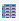 | Spreadsheet table, Constants table.                                                  |

For more information on table types, see [OpenL Tablets Reference Guide](https://openldocs.readthedocs.io/en/latest/documentation/guides/reference_guide/). If a table contains an error, a small red cross is displayed in the corner of the icon.

To view contents of a particular table, in the module tree, select the table. The table is displayed in the middle pane. If the project is not in the **In Editing** status, the table can be viewed but cannot be modified.

### Modifying Tables

OpenL Studio provides embedded tools for modifying table data directly in a web browser. To modify a table, proceed as follows:

1.  In the module tree, select the required table.

    The selected table is displayed in the middle pane in read mode.

    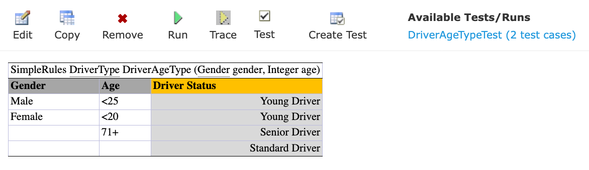

    *Table opened in OpenL Studio*

1.  To switch between simple and extended view, in **My Settings**, select or clear the **Show Header** and **Show Formula** options as required.
2.  To switch the table to the edit mode, perform one of the following steps:
    -   Above the table, click **Edit**.
    -   Right-click anywhere in the table and click **Edit**.
    -   Double click the cell to edit.

    Alternatively, the file can be edited in Excel. Clicking the **Export** button initiates file download. After editing the file locally, it can be uploaded back to the project in Rules Editor as described in [Exporting, Updating, and Editing a Module](#exporting-updating-and-editing-a-module) or via the repository.

    The following table is switched to the edit mode:

    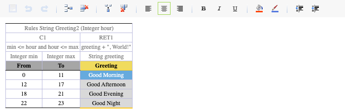

    *Table in the edit mode*

    The edit mode provides the following functional buttons:

    | Button                                                           | Description                                             |
    |------------------------------------------------------------------|---------------------------------------------------------|
    |  | Saves changes in table.                                 |
    |  | Reverses last changes.                                  |
    |  | Reapplies reversed changes.                             |
    | 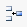 | Inserts a row.                                          |
    | 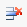 | Deletes a row.                                          |
    | 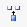 | Inserts a column.                                       |
    | 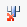 | Deletes a column.                                       |
    |  | Aligns text in currently selected cell with left edge.  |
    |  | Centers text in currently selected cell.                |
    |  | Aligns text in currently selected cell with right edge. |
    |  | Make the text font **bold**.                            |
    | 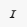 | Applies *italics* to the cell text.                     |
    |  | Underlines the cell text.                               |
    |  | Sets the fill color.                                    |
    |  | Sets the font color.                                    |
    |  | Decreases indent.                                       |
    |  | Increases indent.                                       |

1.  To modify a cell value, double click it or press **Enter** while the cell is selected.
2.  To enter a formula in the cell, double click it, perform a right click, and select **Formula Editor.**

    Now a user can enter formulas in the selected cell.

1.  To save changes, click **Save** .

    If a table contains an error, the appropriate message is displayed.

    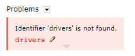

    *Example of an error in a table*

    The arrow under the message allows viewing all stack trace for this error.

    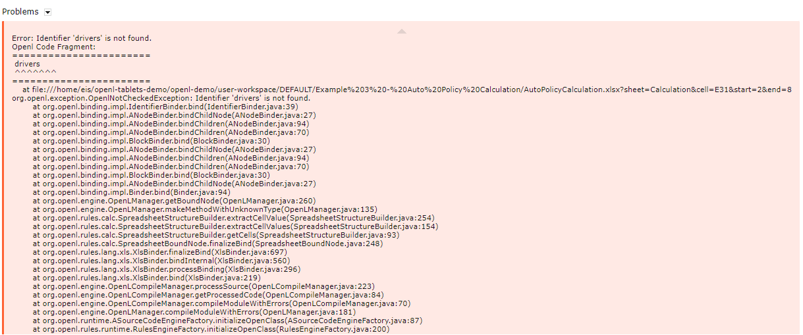

    *Error stack trace example*

### Referring to Tables

OpenL Studio supports references from one table to another table. A referred table can be located in the same module where the first table resides, or in the different module of the same project.

Links to the following tables are allowed:

-   data table
-   datatype table
-   rule table types

Links to the rule tables are underlined and marked blue. When a mouse cursor is put over the link, a tooltip with method name and input parameters with types is displayed.

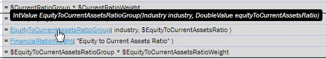

*A tooltip for the linked method to a decision table*

Links to the data and datatype tables are underlined with a dotted line and has an appropriate tooltip with description.

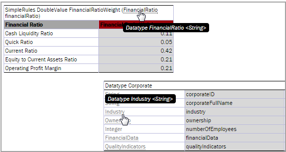

*Links to the datatype tables from the decision and datatype table*

All fields of the datatype tables are also linked and contain tooltips.

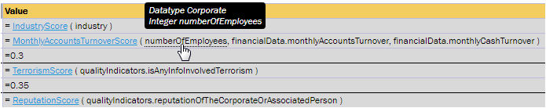

*A link to the field of the Corporate datatype table*

### Managing Range Data Types

OpenL Studio provides a special tool, **Range Editor**, for adding and editing range data types, such as IntRange and DoubleRange, in rule tables and test tables.

This section briefly introduces Range Editor and provides examples of its functionality.

The main Range Editor goal is to move to a single range format in OpenL rules, namely, the ‘..’ format. For more information on ranges on OpenL Tablets, see [OpenL Tablets Reference Guide > Representing Range Types](https://openldocs.readthedocs.io/en/latest/documentation/guides/reference_guide/#representing-range-types).

Consider the following principles while working with Range Editor:

-   The default range format is set to ‘..’ in OpenL Studio.
-   When a new range is created, the ‘..’ format is used.
-   When a range format other than ‘..’ is edited, if only range values are edited, the format remains the same.

If any editor control is used, for example, a check box or the **Done** button, the range format is set to ‘..’.

The following example displays the decision table with data represented as a range:

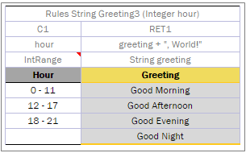

*Decision table with a range data type*

In this table, the **Hour** column contains hours with the IntRange Data type. All range sells are filled except for the last one. This example is used further in this section to demonstrate how Range Editor works.

The following controls are available in Range Editor:

-   **From** — indicates the left border of the range
-   **To** — indicates the right border of the range
-   **Include** — indicates whether the border is included in the range
-   **‘\>’** — indicates values greater than the specified border
-   **‘\<’** — indicates values smaller than the specified border
-   **‘=’** — indicates a constant
-   **‘-’** — indicates a range

To create a range, proceed as follows:

1.  Double click the cell to be edited.

    For example, edit the cell containing 18-21. The table is extended by the pop-up window with a set of controls for editing the range.

    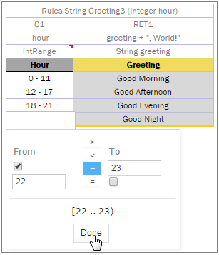

    *Creating a range in Range Editor*

1.  In the **From** field, enter the left border of the range, which is 22 for the example described in this section.
2.  In the **To** field, enter the right border of the range.

    In this example, the **To** value must be 24, but an erroneous value 23 is entered for further editing of this border.

1.  Clear the **Include** check box.
2.  Click **Done** to complete.

    The last cell in the **Hour** column is filled as follows:

    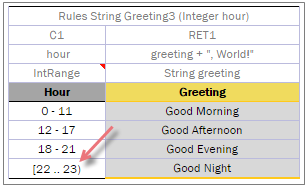

    *New range created in Range Editor*

1.  To modify the range in Range Editor, double click the cell with the [22-23) range.

    The table resembles the following:

    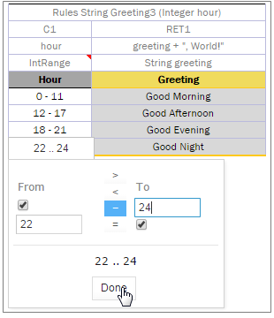

    *Editing a range in Range Editor*

1.  Select the **To** field, set the right border to 24, and select **Include**.
2.  Click **Done** to save the work.

    The range resembles the following:

    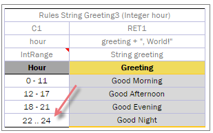

    *The range edited in Range Editor*

A range can also be modified using ‘\>’, ‘\<’ and ‘=’ controls as described in the beginning of this section.

### Copying a Table

To create a table as a copy of the existing table, proceed as follows:

1.  In the module list, select a table to copy.
2.  Click the **Copy Table** icon .
    OpenL Studio displays the **Copy table "TableName"** window.

    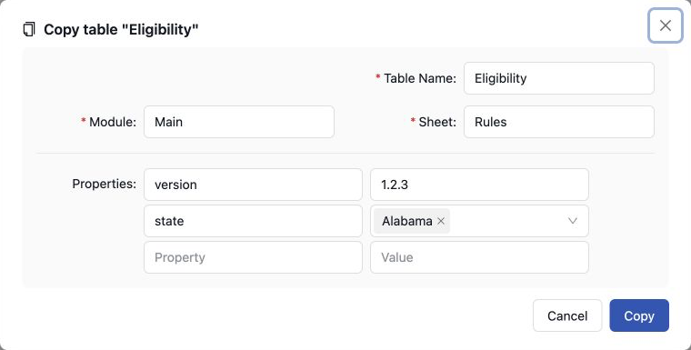

    *Copying an existing table*

1.  Enter a valid OpenL identifier in **Table Name**. It may match an existing table name when the table is
    distinguished by its signature or properties.
2.  Select or enter the destination **Module**.
3.  Select or enter the destination **Sheet**.
4.  Review the property name and value rows. The names are properties applicable to the copied table's type:
    - complete the last row to add another property;
    - use the row controls to insert or delete a property;
    - select a suggested property name or enter one;
    - enter text directly, select a date in the date picker, select or clear a Boolean check box, or select an enum
      display value from the dropdown, according to the property type. A single-value enum is selected from a closed
      dropdown and does not accept typed text.
      The date picker follows the user's locale; OpenL Studio writes the selected date as ISO 8601 `yyyy-MM-dd`.
5.  Click **Copy** to save your changes.

The table appears in the module list.

### Performing a Search

OpenL Studio provides search functionality available both from the module level and the project-level. When opened from the project level screen, the search covers the entire project without requiring a specific module to be open.

The following topics describe search modes in OpenL Studio:

-   [Performing a Simple Search](#performing-a-simple-search)
-   [Performing an Advanced Search](#performing-an-advanced-search)

#### Performing a Simple Search

In the **simple search** mode, the system searches for a specific word or phrase across all tables within the current module, the current project, or the current project and its dependency projects depending on the selected option.
To perform a simple search, in the **Search** field, enter a word or phrase and press **Enter**.

*Starting a simple search*

OpenL Studio displays all tables containing the entered text. The **View Table** link opens the table in Rules Editor.

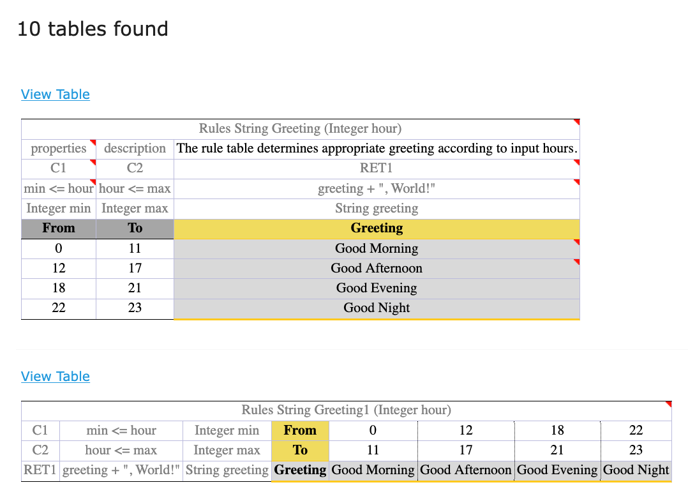

*Search results*

To search for any cell contents, right click the cell and in the context menu, select **Search**. The table is opened in the read mode.

#### Performing an Advanced Search

Advanced search allows specifying criteria to narrow the search through tables. To limit the search, specify the table type, text from the table header, and table properties as described further in this section.

1.  To launch an advanced search, click the arrow to the right of the search window.

    

    *Initiating the advanced search*

1.  In the **Search** field on the top, select whether search must be performed within the current module, or within the project, or within the current project and its dependent projects.

    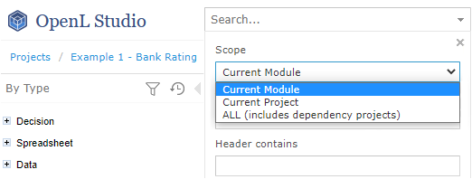

    *Specifying search area*

1.  In the filter form, click the **Table Types** field and select the required table type or select **Select All** to search in all table types.
2.  In the **Header contains** field, enter the word or phrase to search for.
3.  Expand the **Table Properties** list, select the required table property, and then click the **Add** button on the right.

    The text field for entering the property name appears.

1.  Enter the property name.
2.  In the similar way, add as many table properties as required.
3.  To remove a property, click the cross icon to the right of the property.

    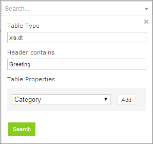

    *A filled form for advanced search*

1.  Click **Search** to run the search.

As a result, the system displays the tables matching the search criteria along with links to the relevant Excel files and the **View Table** links leading to the table editing page.

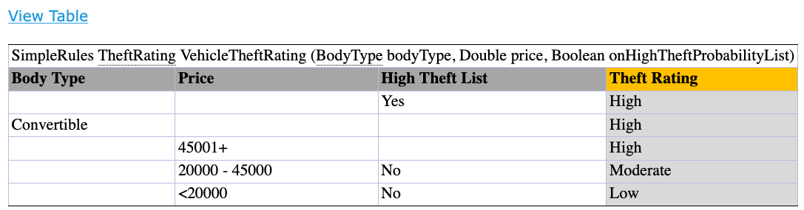

*Advanced search result*

### Creating Tables

The **Create Table** action opens one window that holds the whole table: a settings strip for the type, the name and
the destination, and below it the sheet itself. The skeleton is rebuilt the moment the table type changes, and the
header cell at the top of the sheet shows the exact OpenL header the table will be written with.

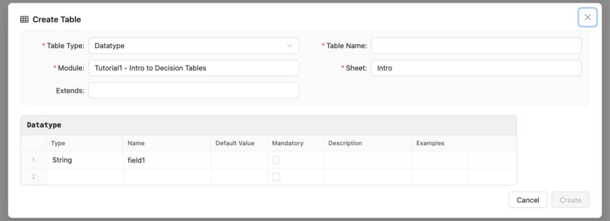

*The Create Table window*

To create a table:

1. In OpenL Studio, click **Create Table**.
2. In **Table Type**, select one of the supported types:

   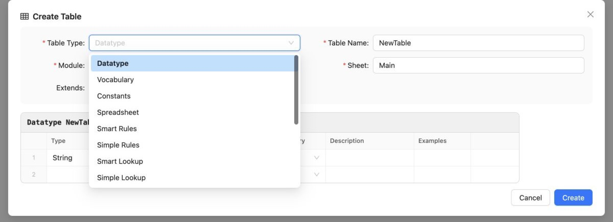

   *Selecting the table type*

   - **Datatype** — Type, Name, Default Value, Mandatory, Description, and Examples. Type accepts a value directly or
     a value selected from simple types, vocabularies, and datatypes visible to the module. **Extends** suggests only
     the project's complex datatypes and writes the selected parent into the header; it does not offer
     `SpreadsheetResult`. Select the **Mandatory** check box to write `true`; clear it to leave the cell empty.
   - **Vocabulary** — one value column and a simple **Base Type**, written in angle brackets in the Datatype header.
     The value cells use that type's editor.
   - **Constants** — Type, Name, and Default Value. Type is selected from simple types, and Default Value uses the
     selected type's editor. A Constants table carries no name of its own, so the **Table Name** field is not shown.
   - **Spreadsheet** — Steps and Formula, returning `SpreadsheetResult` unless another type is chosen. A
     Spreadsheet names its own columns in the first row of the table, so those names are cells to edit and more
     columns can be added beside them.
   - **Smart Rules** and **Simple Rules** — one column for each input argument. A simple result adds an Output column;
     a Datatype result adds one output column for each Datatype field.
   - **Smart Lookup** and **Simple Lookup** — a two-dimensional table, read where a row and a column cross. The
     leading arguments run down the left, one column each, and the trailing ones across the top, one row each. The
     corner where the two meet is kept as square as it can be and gains a row before a column: two arguments give
     one of each, three give two rows and one column, five give three and two. That corner is written as a merged
     cell, because its height is what tells OpenL how many arguments run across the top. A lookup takes at least
     two arguments.

     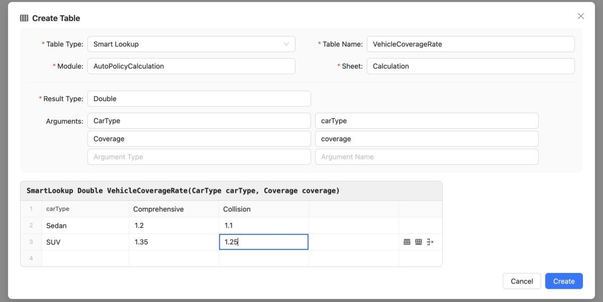

     *A lookup with one argument down the left and one across the top*

   - **Rules** — Condition and Output.
   - **Test** and **Run** — columns generated from the signature of the selected executable table: one for every
     value a call has to supply, plus `_res_` for the expected result, which Run omits. An argument of a datatype
     contributes one column per field, named by the path OpenL reads it back with — `policy.mainDriver.age` — as
     deep as the datatypes nest. An argument of any other type, a collection included, stays one column. The target
     can be any executable table in the project, whichever module holds it. Test excludes a table that returns
     nothing because there would be no result to assert; Run includes it because Run only calls the table. The new
     table opens named after the table it exercises — `PremiumTest`, `PremiumRun` — and can be renamed. A Test or Run
     table is placed with the project's tests: selecting the type moves the destination to a module under `tests/`,
     and a module created for it goes under `tests/` too.
     Select **Transposed** to put the generated fields down rows and test or run cases across columns.
   - **Data** — columns generated from the selected Datatype. Select **Transposed** to put fields down rows and data
     records across columns. Test, Run and Data display every word in generated titles in Title Case, such as
     **Main Driver Age**.
   - **Environment** — Key and Value. Key is suggested from the three keywords OpenL acts on — `dependency`,
     `import` and `include`. An Environment table carries no name of its own.
   - **Properties** — Property and Value. Property is suggested from the properties that may appear in a Properties
     table. Its value uses the editor declared for that property: text, date picker, Boolean check box, or enum
     dropdown. Single-value enum dropdowns do not accept typed text. Enum lists show display values and write their
     codes. Multiple selected values wrap onto additional lines within the value column. Dates follow the user's
     locale in the date picker and are written as ISO 8601 `yyyy-MM-dd`. The skeleton starts with the mandatory
     `scope` property set to `Module`; change it to `Global` or to `Category` — adding a `category` row to name the
     category — as required. A Properties table carries no name of its own.
   - **Free Form Table** — a plain grid, with the sheet's own column letters over it and nothing else. It has no
     header cell and no name: OpenL does not recognize such a table, and names it after whatever its first cell
     says. It is written exactly as it stands. Only that first cell is required — OpenL reads a table from it.

3. Enter the table name, where the table type has one. The field opens empty and is required wherever it is shown.

   The name must be a valid identifier — letters, digits, `_` and `$`, not starting with a digit — because it
   becomes the name OpenL compiles. It may match an existing table name: signatures and properties supplied by the
   file name, a Properties table, or the table's own properties section distinguish table overloads and versions.
   Constants, Environment, Properties and Free Form tables carry no name and do not show the field.

4. In **Module**, choose the module that receives the table, then choose the sheet. Both fields suggest what the
   project already has and accept anything else typed into them. The sheets offered are the ones the chosen
   module's own workbook holds, and choosing a module selects its first sheet, since a sheet belongs to a module.
   The module decides only where the table is written — it does not change what a Test or Run table may target.

   A module name the project does not declare creates a module. OpenL Studio derives its project-relative `.xlsx`
   path — `rules/` for a rules table, `tests/` for a Test or Run table — creates the workbook, and registers it in
   `rules.xml` when the path is not already covered by a module wildcard. For a simple project without `rules.xml`,
   OpenL Studio creates the descriptor and keeps all existing root modules registered.

   A sheet name that the chosen module does not have creates a sheet.

   The sheet name cannot contain `/ \ * ? [ ] :`, which Excel does not allow in a worksheet name.

   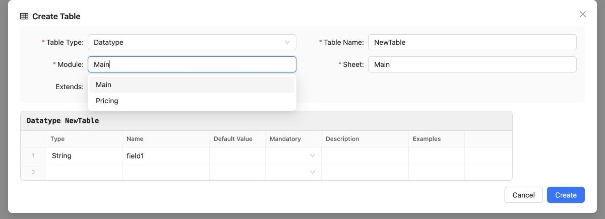

   *Choosing the module that receives the table*

5. For Spreadsheet, Rules, Smart Rules, Simple Rules, Smart Lookup, and Simple Lookup, set **Result Type** and
   **Arguments**. A type can be a simple type, a vocabulary, or a datatype visible to the selected module;
   `SpreadsheetResult` is offered here as well, because only a signature can name it. The header cell at the top of
   the sheet updates as the signature is filled in.

   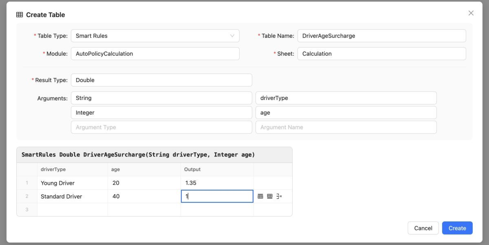

   *A signature builds the header cell and the columns*

6. Edit the skeleton cells.

   - Every body cell can be edited. The header cell at the top is a read-only preview generated from the settings.
     A Datatype parent is set with **Extends**, which builds a header such as `Datatype Policy extends Base`.
   - The first row opens filled in as an example. It is a placeholder to write over: every cell holds a value of
     the type its column declares — `1` for an Integer, `TRUE` for a Boolean, `2026-06-15` for a Date, `1-10` for
     an IntRange, and for a vocabulary the first value that vocabulary offers — so a table created untouched is a
     table that works. A cell whose value no single cell can spell out, such as another datatype or a collection,
     opens on `<field>_id_1`, the way a Data table row holding that value is referenced.
   - A value cell uses the editor for the type its table definition gives it. Boolean cells offer `TRUE`, `FALSE`
     and an empty value. Vocabulary cells use a closed dropdown that offers their declared values and empty, without
     accepting typed text. Numeric cells use a number input, Date cells a date picker that displays the user's locale
     and stores ISO 8601 `yyyy-MM-dd`, and Character cells accept one character. Byte, Short, Integer and Long values
     must stay within the range of the selected type. This applies to Datatype defaults and examples, Constants and
     Vocabulary values, and generated Rules, lookup, Test, Run and Data cells.
   - Filling the last row automatically adds an empty row below it.
   - Point at a row to reveal its actions: insert a row above or below it, or delete it. A Free Form Table reveals
     the same actions for its columns, above the grid.

     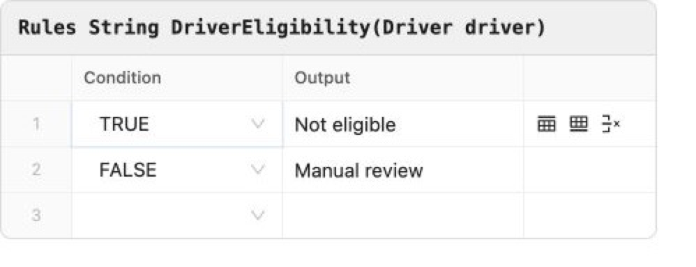

     *Actions revealed for the row under the pointer*

   - Columns controlled by a table signature, Datatype, or tested table change when that definition changes.
   - Where a table type has no fixed set of columns — a Free Form Table, a Spreadsheet, a lookup — filling the last
     column adds an empty column to the right. A table wider than the dialog scrolls sideways rather than widening
     it.
   - Blank rows are not written. OpenL reads a blank row as the end of a table, so an empty row left in the middle of
     the skeleton is dropped together with the trailing one kept for input.
   - A Spreadsheet needs at least one filled row, because OpenL rejects a table with no body. **Create** stays
     disabled until one is entered.
   - A lookup needs a value in every row of its top band — one for each argument running across the top — and at
     least one row below to look up by. A blank row is never written, so a top row left empty would shorten the
     merged corner and change how many arguments OpenL reads as horizontal. **Create** stays disabled until both
     are filled.
   - A lookup's top band and the argument titles beside it belong to the table type and carry no row controls.

7. Click **Create**.

The table is created in the selected module and opens in the Rules Editor. Its availability to other modules depends
on project and module dependencies. For more information, see
[OpenL Tablets Reference Guide > Project and Module Dependencies](https://openldocs.readthedocs.io/en/latest/documentation/guides/reference_guide/#project-and-module-dependencies).

For an executable table, **Create Test** opens the same window with a Test table skeleton generated from the selected
table signature. The generated columns contain every input parameter and the expected result. The tested table can
also be changed in the window.

*A Test table generated from the tested table*

### Comparing Excel Files

OpenL Studio supports comparing contents of Excel files displaying tables and Excel elements that are modified. To compare two Excel files, proceed as follows:

1.  In OpenL Studio Rules Editor, in the top line menu, select **More \> Compare Excel Files.**

    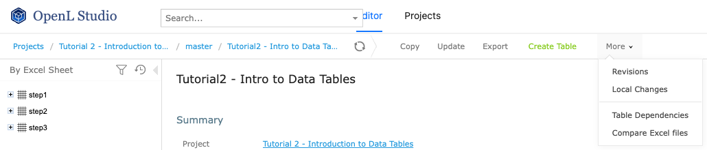

    *Initiating Excel comparison functionality*

1.  In the window that appears, click **Add** and select two Excel files to compare.
2.  Click **Upload** and wait until file status is changed to **Done.**

    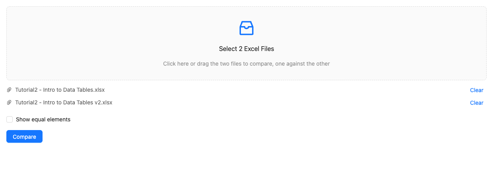

    *Excel files ready for comparison*

1.  To display tables and other Excel file elements that differ in the selected Excel files, click **Compare.**

    The list of tables and Excel elements is displayed, grouped by Excel sheets. Clicking on the table or element in the list displays the changes in the section below.

    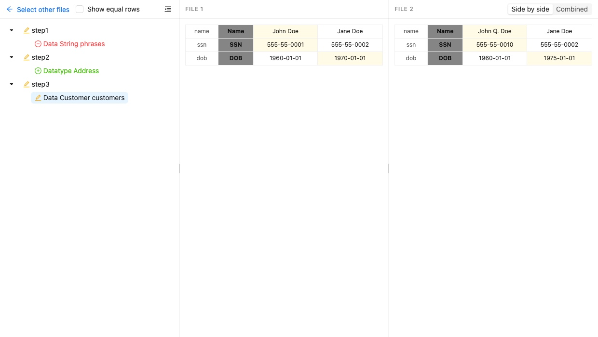

    *Excel file comparison results*

    Elements and tables that changed the location or contents are marked with the asterisk icon . Added elements are marked with the plus sign icon . Removed elements or tables are marked with the deletion icon .

1.  To view or hide equal rows in the table, select or clear the **Show equal rows** check box.
2.  To display all equal tables and Excel file elements in the selected Excel files, select **Show equal elements** check box and click **Compare.**

All elements that are equal in the selected Excel files are displayed, grouped by Excel sheets. Elements that are relocated, added, or removed are marked with an appropriate icon.

If contents of two Excel files with different names is completely identical, the **File elements are identical** message is displayed.

### Viewing and Editing Project-Related OpenAPI Details

When a project is generated from the imported OpenAPI file, it becomes available in Rules Editor.

The generated project contains information about the last file import date, name of the OpenAPI file, mode, and modules names in rules.xml. This information is available in OpenL Studio, the OpenAPI section.

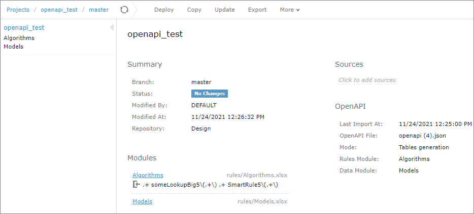

*OpenAPI project in Rules Editor, in the Tables Generation mode*

It contains the following information:

| Field          | Description                                                                                                                                                                                                                                                                                                                                                                                   |
|----------------|-----------------------------------------------------------------------------------------------------------------------------------------------------------------------------------------------------------------------------------------------------------------------------------------------------------------------------------------------------------------------------------------------|
| Last Import At | Date of the last upload of the OpenAPI file.  The OpenAPI file can be replaced in the Repository tab or generated or regenerated from rules tables and datatype tables.                                                                                                                                                                                                                        |
| OpenAPI File   | Location and name of the OpenAPI file, such as openAPI.json and files/example.json.                                                                                                                                                                                                                                                                                                           |
| Mode           | Last operation performed with this OpenAPI project.  **- Tables generation** mode means that the last performed operation is generation or regeneration of the project based on the OpenAPI file.  For the **Tables generation** option, project reconciliation is done, too.  **- Reconciliation** mode is set to validate the project against the newly uploaded OpenAPI file with a new name. |
| Rules Module   | Name of the module that contains rules.                                                                                                                                                                                                                                                                                                                                                       |
| Data Module    | Name of the module that contains data types.                                                                                                                                                                                                                                                                                                                                                  |

The following topics are described in this section:

-   [Generating an OpenAPI File from Rules and Datatype Tables for Reconciliation](#generating-an-openapi-file-from-rules-and-datatype-tables-for-reconciliation)
-   [Adding OpenAPI for Reconciliation to an Existing Project](#adding-openapi-for-reconciliation-to-an-existing-project)
-   [Regenerating a Project from Another OpenAPI File](#regenerating-a-project-from-another-openapi-file)
-   [Updating the OpenAPI File](#updating-the-openapi-file)

#### Generating an OpenAPI File from Rules and Datatype Tables for Reconciliation

If a project is not generated from an OpenAPI file and it is necessary to add the OpenAPI file, this file can be generated in Rules Editor from the existing rules and datatypes tables. Proceed as follows:

1.  In Rules Editor, open the project overview page.
2.  Click the **OpenAPI** section.

    

    *Initiating OpenAPI file generation*

1.  If an OpenAPI file does not exist, ensure that the **Generate from Rules and Datatype tables** and **Reconciliation** options are selected.

    

    *Reviewing settings for the OpenAPI file generation*

    If the OpenAPI file already exists, the **Uploaded in the Repository** option is selected by default and the file name is displayed in the field. If the file must be regenerated according to the current project tables, the **Generate from Rules and Datatype tables** and **Reconciliation** options must be selected.

1.  Click **Import.**

The file creation confirmation message is displayed. The OpenAPI file is added to the project and appears in the OpenAPI section.

*The OpenAPI file added to the OpenAPI section*

Note that successful generation of the OpenAPI file requires that the project has no compilation errors and tables contain data for the OpenAPI methods.

#### Adding OpenAPI for Reconciliation to an Existing Project

If a project is not generated from the OpenAPI file, but it is required to add the OpenAPI file and generate modules from it, proceed as follows:

1.  Ensure that the OpenAPI file is uploaded to the project via the **Repository** tab.
2.  In Rules Editor, click **Click to Import OpenAPI File.**

    

    *Initiating OpenAPI file import*

1.  Enter the name of the OpenAPI imported file, such as example.json.
2.  Select the **Tables generation** mode.

    

    *Selecting the generation mode*

1.  If necessary, modify the default values for the rules and data modules and click **Import**.
2.  If no module with the entered name is found, set up the path to the generated file and click **Import.**

    

    *Module settings window, both modules are new*

    If a module already exists, it will be overwritten, and the corresponding warning message is displayed. In this case, there is no option to define a file name.

    

    *Module settings window, one of modules already exists*

1.  Click on the **Import and overwrite**.

The rules and model modules are created or updated. The OpenAPI data is updated.

#### Regenerating a Project from Another OpenAPI File

If a project is initially created from an OpenAPI file, it can be regenerated from another OpenAPI file. For project regeneration, follow the steps described in [Adding OpenAPI for Reconciliation to an Existing Project](#adding-openapi-for-reconciliation-to-an-existing-project). The name of the OpenAPI file is preset for regeneration.

#### Updating the OpenAPI File

When the project is generated from the OpenAPI file and reconciliation is done, the system automatically validates the generated OpenL Tablets rules and data types. If the file is updated in the **Repository** tab and the name is not changed, reconciliation is completed immediately.

To reconcile a project using an OpenAPI file with a different name, proceed as follows:

1.  Ensure that the OpenAPI file is uploaded to the project via the **Repository** tab.
2.  In Rules Editor, click **OpenAPI Import icon .**

    

    *Initiating OpenAPI import*

1.  In the Import OpenAPI File window, enter the OpenAPI file location, select **Reconciliation,** and click **Import**.

    

    *Selecting an OpenAPI file for reconciliation*

The project is validated using the newly imported file.

*Viewing results of the last reconciliation*

### Reconciling an OpenAPI Project

If an OpenAPI file is set for a project, during project compilation, the system automatically checks whether the project matches the defined OpenAPI file. If the generated OpenAPI for the deployed project does not match the existing OpenAPI file, errors and warnings are displayed. This process is called **reconciliation**.

Reconciliation does not expect exactly the same OpenAPI generated by the project and checks the following:

-   All paths defined in the existing OpenAPI file are generated by the project.
-   All paths generated by the project are defined in the existing OpenAPI file.
-   All operations for each path in the existing OpenAPI file are the same as operations in the generated OpenAPI file for the correspond path.
-   Operation parameters in the existing OpenAPI file and parameters in OpenAPI generated based on the project for a corresponding operation are the same and all parameter types are compatible.
-   Schemas that are not a part of API are ignored in the reconciliation process.
-   All schemas in the existing OpenAPI file that are a part of API must be generated by the project.
-   All schemas generated by the project must be defined in the existing OpenAPI file.
-   All fields defined in schemas must exist in schemas generated by the project.
-   All fields generated by the project for corresponding schemas must be defined in the existing OpenAPI file.
-   Field types in schemas must be compatible.

| OpenAPI type defined in the file | OpenAPI type generated by the project                |
|----------------------------------|------------------------------------------------------|
| Integer (int32)                  | Integer (int32)                                      |
| Integer (int64)                  | Integer (int32), Integer (int64)                     |
| Integer(no format)               | Integer (int32), Integer (int64), Integer(no format) |
| String                           | String                                               |
| String (date/date-time)          | String (date/date-time)                              |
| Number(float)                    | Number(float)                                        |
| Number (double)                  | Number(float), Number (double)                       |
| Number(no format)                | Number(float), Number (double), Number(no format)    |
| Boolean                          | Boolean                                              |
