## Using Rules Editor

This chapter describes basic tasks that can be performed in Rules Editor. For more information on Rules Editor, see [Introducing Rules Editor](getting-started.md#introducing-rules-editor).

The following topics are included in this chapter:

-   [Switching to Another Project or Module](#switching-to-another-project-or-module)
-   [Viewing a Project](#viewing-a-project)
-   [Viewing a Module](#viewing-a-module)
-   [Managing Projects and Modules](#managing-projects-and-modules)
-   [Defining Project Dependencies](#defining-project-dependencies)
-   [Viewing Tables](#viewing-tables)
-   [Modifying Tables](#modifying-tables)
-   [Referring to Tables](#referring-to-tables)
-   [Managing Range Data Types](#managing-range-data-types)
-   [Copying a Table](#copying-a-table)
-   [Searching for Tables](#searching-for-tables)
-   [Creating Tables](#creating-tables)
-   [Comparing Excel Files](#comparing-excel-files)
-   [Viewing and Editing Project-Related OpenAPI Details](#viewing-and-editing-project-related-openapi-details)
-   [Reconciling an OpenAPI Project](#reconciling-an-openapi-project)

### Switching to Another Project or Module

The breadcrumb above the module name shows the project and the branch the module belongs to and switches the editor to another project or module:

-   To switch to another project, click the arrow next to the project name, start typing the project name in the **Find a project** field to narrow the list down, and select the project.
-   To switch to another module of the current project, click the arrow next to the module name, start typing the module name in the **Find a module** field, and select the module.

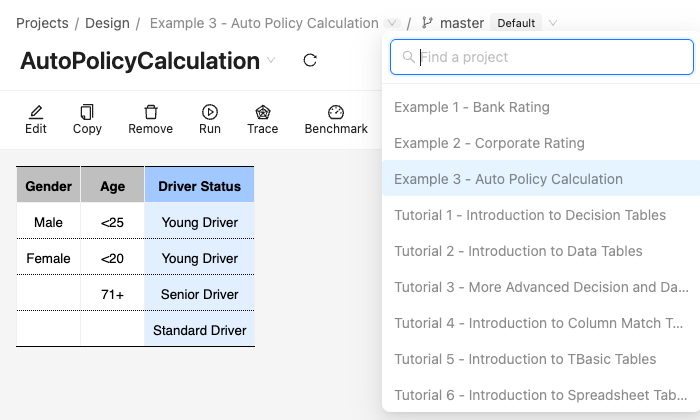

*Rules Editor breadcrumb navigation*

To get a full list of projects or modules, delete the filter text in the field.

### Viewing a Project

Rules Editor allows a user to work with one project at a time. To view a project, select it on the **Projects** page. The project page with general information about the project and configuration details appears on its **Overview** tab, as described in [Viewing the Project Overview](repository-editor.md#viewing-the-project-overview).

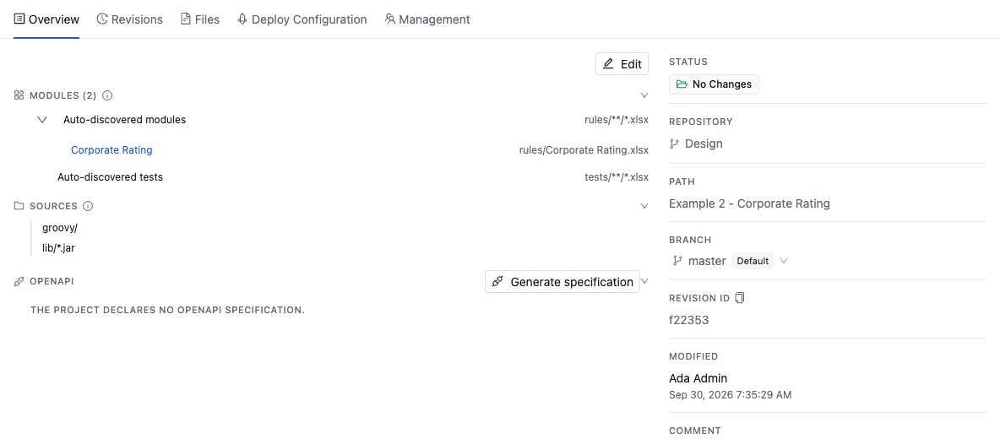

*A project page*

If a particular project is not available in Rules Editor, it must be opened as described in [Opening a Project](repository-editor.md#opening-a-project).

### Viewing a Module

Rules Editor allows a user to work with one module at a time. To open a module, click its name in the **Modules** section of the **Overview** tab of an open project, or select it in the module switcher of the breadcrumb. The following module information is displayed:

-   tree in the left pane displaying module tables
-   contents of the table selected in the tree in the middle pane
-   properties of the selected table in the right pane
-   project and branch names, module name, and the actions for the module above the panes

If a particular module is not available, the project in which it is defined must be opened as described in [Opening a Project](repository-editor.md#opening-a-project).

By default, a project is opened in the multi-module mode. This is a common production mode. In the multi-module mode, all modules of the current project with all their dependencies are displayed, that is, modules of projects defined as the project dependencies.

For more information on project and module dependencies, see [OpenL Tablets Reference Guide > Project, Module, and Rule Dependencies](../reference-guide/04-working-with-projects/02-project-module-and-rule-dependencies.md#project-module-and-rule-dependencies).

The first opened module page is displayed right after the module is loaded, while loading of the whole project continues in the background. The **Compiling N of M** indicator beside the module name shows how many modules are compiled, and the tree shows a skeleton until the tables of the module are read. The compilation problems panel at the bottom of the page lists errors and warnings as more modules are compiled, and the number of errors is shown in the tree next to the tables that have them.

*Loading progress indicator*

If a module is modified during loading, this module is re-compiled and project loading continues.

The loading indicator is not displayed for newly opened projects if a project has only one module or multiple small modules which loading takes less than one second. The loading indicator is also not displayed if the project is already opened and fully compiled and the following actions happen:

-   A page is refreshed using the browser refresh button.
-   A user leaves the project by switching to the **Projects** page and then returns to the project without opening other projects in the meantime.
-   A user switches between modules of the same project.

If a user clicks the **Refresh** button next to the module name, loading restarts and the indicator appears again. While loading is in process, or while other modules have errors, the **Run, Trace, Test,** and **Benchmark** actions work only for the currently opened module. That is why the **Within Current Module Only** check box is selected and cannot be edited in the menu of these actions in such a case.

When loading is completed and the other modules have no errors, the **Within Current Module Only** check box is cleared and becomes editable.

### Managing Projects and Modules

This section explains the following tasks that can be performed on projects and modules in Rules Editor:

-   [Editing and Saving a Project](#editing-and-saving-a-project)
-   [Exporting and Copying a Project](#exporting-and-copying-a-project)
-   [Exporting, Updating, and Editing a Module](#exporting-updating-and-editing-a-module)
-   [Comparing and Reverting Module Changes](#comparing-and-reverting-module-changes)

#### Editing and Saving a Project

A project can be opened for editing and saved directly in Rules Editor.

1.  To save the edited project, click **Save** .

    > [!Note]
    > If a project is in the **Local** status, this option is not available in Rules Editor.

2.  To modify the project configuration, open the project page, click **Edit** in its **Overview** tab and modify the values as described in the following table. The **Edit** button is shown while the project is open and not locked by another user.

| Project details                                                                   | Available actions                                                                                                                                                                                                                                                                                                                          |
|-----------------------------------------------------------------------------------|--------------------------------------------------------------------------------------------------------------------------------------------------------------------------------------------------------------------------------------------------------------------------------------------------------------------------------------------|
| Project description                                                               | Enter the text in the **Description** section.                                                                                                                                                                                                                                                                                             |
| Modules configuration                                                             | In the **Modules** section, enter the name and the rules root path of every module, select **Compile this module only** to compile the module without the modules it does not depend on, drag a module to reorder it, click **Add** to add a module, or click the trash icon to remove it. |
| Custom file name processor and properties defined in the file name                | In the **Version patterns** section, click **Add** to enter a file name pattern. The question mark next to the section name opens the description of patterns. In **Properties processor**, enter the class of the custom file name processor. For more information on properties pattern for the file name, see [OpenL Tablets Reference Guide > Properties Defined in the File Name](../reference-guide/02-working-with-openl-tables/04-table-properties/08-properties-defined-in-the-file-name.md#properties-defined-in-the-file-name). |
| Methods exposed by the project                                                    | In the **Exposed methods** section, enter one pattern per line in **Includes** and **Excludes**. The patterns support the `*` wildcard for any characters and the `?` wildcard for one character. When both are empty, every method of the project is exposed.                                                                      |
| Project dependencies                                                              | Manage dependencies as described in [Defining Project Dependencies](#defining-project-dependencies).                                                                                                                                                                                                                                       |
| Project sources                                                                   | In the **Sources** section, click **Add** to enter a path to the folder or library that holds the source code, or click the trash icon to remove a path.                                                                                                                                                                                 |
| OpenAPI specification                                                             | Manage the OpenAPI specification as described in [Viewing and Editing Project-Related OpenAPI Details](#viewing-and-editing-project-related-openapi-details).                                                                                                                                                                             |

Click **Save** above the sections to keep the changes, or **Cancel** to discard them. All changes are saved in the project `rules.xml` file, and the project status changes to **In Editing**. For more information on this XML file, see the [OpenL Tablets Developer Guide > Rules Project Descriptor](https://openl-tablets.github.io/openl-tablets/developer-guides/rules-projects#rules-project-descriptor).

Modules and sources that the standard `rules/`, `tests/`, `lib/` and `groovy/` folders provide are found automatically. They are listed in the sections but cannot be edited while `rules.xml` does not declare them: to add a module, put its Excel file in the `rules/` or `tests/` folder, and to add a library, put its JAR file in the `lib/` folder.

The **Migrate** button is offered for a project that keeps its workbooks in the project root, or whose `rules.xml` keeps settings in a legacy form. For a project with workbooks in the root, it moves them into the `rules/` folder and creates `rules.xml`, so that the project configuration can be edited. If the move would turn another Excel file into a module, OpenL Studio names these workbooks and blocks the migration until they are declared in `rules.xml` or removed. For `rules.xml`, **Migrate** rewrites the file to its minimal form, so its comments and layout are not kept.

#### Exporting and Copying a Project

The project actions of the editor are the ones described for the **Projects** page:

-   To export the project to the user’s local machine, see [Exporting a Project or a File](repository-editor.md#exporting-a-project-or-a-file).
-   To copy the project, click **Copy** above the module and see [Copying a Project](repository-editor.md#copying-a-project).
-   To synchronize the project with another branch, click **Sync** and see [Working with Project Branches](project-branches.md#working-with-branches).
-   To deploy the project, click **Deploy** and see [Deploying a Project](repository-editor.md#deploying-a-project).

The content of a project is replaced by the content of a ZIP archive by creating a project from the archive, as described in [Creating a Project from ZIP Archive](repository-editor.md#creating-a-project-from-zip-archive), or file by file on the **Files** tab, as described in [Modifying Project Contents](repository-editor.md#modifying-project-contents).

#### Exporting, Updating, and Editing a Module

A user can export, update, or edit a module directly in Rules Editor. Proceed as follows:

1.  To upload a changed module file, for a module, above the table click **Update** and select an Excel file. The uploaded file replaces the module file. When the selected file name differs from the current module file name, a warning is displayed.

    

    The button is shown while the project can be modified.
2.  To export the module to the user’s local machine, for a module, click **Export** and select a module revision.

    The default module version for export is the one that a user has currently open in Rules Editor. If it contains unsaved changes, it is marked as **In Editing,** otherwise, it is called **Viewing**.

    The list offers the revisions of the module file itself, so a project revision that did not change the
    module is not proposed. Older revisions are loaded on demand through **Load older revisions**.

1.  To modify module configuration, such as module name and path, open the **Overview** tab of the project page, click **Edit** and change the module in the **Modules** section.

    

    *Editing module information*

1.  To save the changes, click **Save** above the sections.

The **Exposed methods** section of the project filters the methods of the whole project. The method filter that a module declares in `rules.xml` is the legacy form of it: the **Modules** section shows its **Includes** and **Excludes** under the module, but the module form does not edit them.
For more information, refer to the [OpenL Tablets Rule Services Usage and Customization Guide > Dynamic Interface Support](../rule-services/advanced-configuration.md#dynamic-interface-support).

#### Comparing and Reverting Module Changes

OpenL Studio allows comparing module versions and rolling back module changes against the specific date.
To compare module versions, proceed as follows:

1.  Open the module.
2.  Above the table, select **More** **\>** **Local** **Changes**.
    The **Local** **Changes** window appears displaying the selected module's local versions, with the latest
    versions on the top. In a multi-module project, switching modules shows the local history stored for that
    module only.

    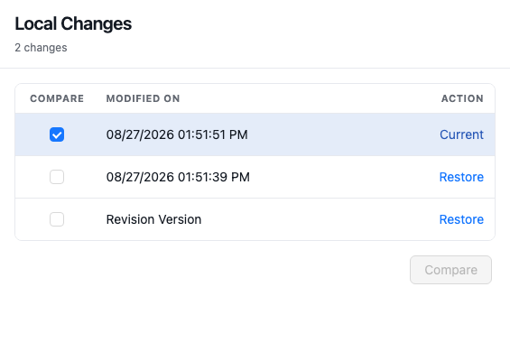

    *Displaying the Changes window*

    When a project is modified, upon clicking the **Save** icon , a temporary version of the module is created, and it appears in the list of local changes. When project update is complete, clicking **Save** removes all temporary versions from Local Changes, and a new version is added to the list of revisions.

    

    *Clicking Save to complete project update and save changes as a revision version*

1. To compare the changes, select check boxes for two required versions and click **Compare**.

    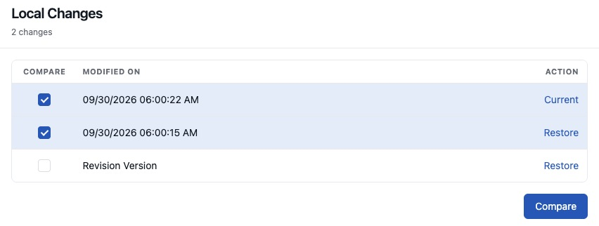

    *Comparing module versions*

    The comparison opens in a window of its own and lists the elements that differ, grouped by Excel sheet, as displayed in the following example.

    

    *Tables with changes*

1. To view the changes, click the required element.

    The two versions of the element are displayed next to each other, with the cells that read differently highlighted. The window is the one described in [Comparing Excel Files](#comparing-excel-files), except that it has no files to pick: it opens on the comparison of the two versions, and the **Show equal elements** check box heads the list of elements instead of standing next to the files.

    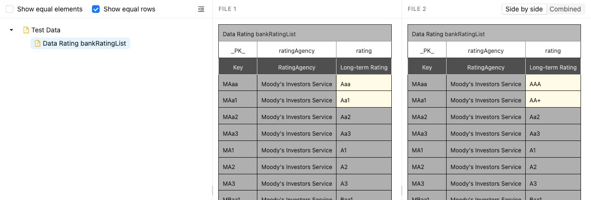

    *The result of the module version comparison*

1.  To revert module changes, for the required module version, click the **Restore** link and confirm the changes.

    When **Restore** is clicked, the corresponding changes are restored but this action is not added to the history as a change.

### Defining Project Dependencies

A project dependency can be defined when a particular rule project, or **root project**, depends on contents of another project, or **dependency project**. Project dependencies are checked when projects are deployed to the deployment repository. OpenL Studio displays warning messages when a user deploys projects with conflicting dependencies.

To define a dependency on another project, proceed as follows:

1.  Open the **Overview** tab of the page of the project.
2.  If the project is not editable, make it editable as described in [Editing and Saving a Project](#editing-and-saving-a-project).
3.  Click **Edit**.
4.  In the **Dependencies** section, click **Add**, select the dependency project in the **Project name** field, and select **Auto-included** if required. To remove a dependency, click the trash icon next to it.
5.  Click **Save** above the sections.

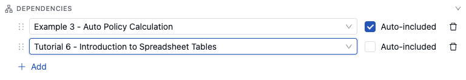

*Managing project dependencies*

If **Auto-included** is selected in the multi-module mode, tables of all modules of the dependency project are accessible from any module of the root project.

If **Auto-included** is cleared or the single module mode is selected, the root project module has access to the particular module of the dependency project only if an appropriate dependency is added in the **Environment** table of the root module.

> [!Note]
> Module names of the root and dependency projects must be unique.

> [!Note]
> Dependency projects must be open to make dependency work. When a project with dependencies is opened, OpenL Studio offers to open its dependencies too, as described in [Opening a Project](repository-editor.md#opening-a-project).

For more information on project and module dependencies, see the [OpenL Tablets Reference Guide > Project, Module, and Rule Dependencies](../reference-guide/04-working-with-projects/02-project-module-and-rule-dependencies.md#project-module-and-rule-dependencies).

### Viewing Tables

OpenL Tablets module tables are listed in the module tree. Table types are represented by different icons in Rules Editor. The following table describes table type icons:

| Icon                                                             | Table type                                                                           |
|------------------------------------------------------------------|--------------------------------------------------------------------------------------|
|  | Decision table.                                                                      |
|  | Decision table with unit tests.                                                      |
|  | Column match table.                                                                  |
|  | Column match table with unit tests.                                                  |
| 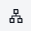 | Tbasic table.                                                                        |
|  | Tbasic table with unit tests.                                                        |
|  | Data table.                                                                          |
|  | Datatype table.                                                                      |
| 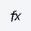 | Method table.                                                                        |
|  | Unit test table.                                                                     |
|  | Run method table.                                                                    |
|  | Environment table.                                                                   |
|  | Property table.                                                                      |
|  | Table not corresponding to any preceding types. Such tables are considered comments. |
|  | Spreadsheet table, Constants table.                                                  |

For more information on table types, see [OpenL Tablets Reference Guide > Table Types](../reference-guide/index.md#table-types). The number of errors that a table or a group of tables contains is displayed as a red badge next to its name in the tree.

The tables that correspond to none of these types — the utility tables — are hidden by default: they take no part in the rules. To list them, in the module tree, click the filter button next to the sorting mode, select **Show utility tables** in the **Advanced filter** dialog and click **Apply**. A utility table is named by whatever its first cell says, opens as the grid it is, and can be edited the same way as any other table; it carries no properties, so the **Table Details** pane offers none for it.

To view contents of a particular table, in the module tree, select the table. The table is displayed in the middle pane. If the project is closed or locked by another user, the table can be viewed but cannot be modified. Modifying a table of an open project changes its status to **In Editing**.

### Modifying Tables

OpenL Studio provides embedded tools for modifying table data directly in a web browser. To modify a table, proceed as follows:

1.  In the module tree, select the required table.

    The selected table is displayed in the middle pane in read mode.

    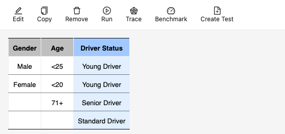

    *Table opened in OpenL Studio*

1.  To switch between simple and extended view, in **My Settings**, select or clear the **Show Header** and **Show Formula** options as required.
2.  To switch the table to the edit mode, perform one of the following steps:
    -   Above the table, click **Edit**.
    -   Double click the cell to edit.

    Alternatively, the file can be edited in Excel. Clicking the **Export** button initiates file download. After editing the file locally, it can be uploaded back to the project in Rules Editor as described in [Exporting, Updating, and Editing a Module](#exporting-updating-and-editing-a-module) or on the **Files** tab of the project.

    The following table is switched to the edit mode:

    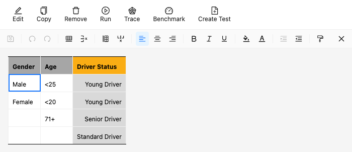

    *Table in the edit mode*

    The edit mode provides the following functional buttons:

    | Button                                                           | Description                                             |
    |------------------------------------------------------------------|---------------------------------------------------------|
    |  | Saves changes in table.                                 |
    |  | Reverses last changes.                                  |
    |  | Reapplies reversed changes.                             |
    |  | Inserts a row after the selected one.                   |
    | 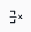 | Deletes a row and selects the row that takes its place, or the new last row. |
    |  | Inserts a column before the selected one.               |
    |  | Deletes a column and selects the column that takes its place, or the new last column. |
    |  | Aligns text in currently selected cell with left edge.  |
    |  | Centers text in currently selected cell.                |
    |  | Aligns text in currently selected cell with right edge. |
    |  | Make the text font **bold**.                            |
    |  | Applies *italics* to the cell text.                     |
    |  | Underlines the cell text.                               |
    |  | Sets the fill color.                                    |
    |  | Sets the font color.                                    |
    |  | Decreases indent.                                       |
    |  | Increases indent.                                       |
    |  | Applies a table theme to a table of any type but Other, as described in [Applying the Table Theme](#applying-the-table-theme). |

    The **Close** button at the end of the toolbar leaves the edit mode. When the table has unsaved changes, OpenL Studio asks whether to discard them.

    A merged cell grows over the line laid down beside it, the way it does in Excel. A row inserted inside a
    merged group therefore has a cell only in the columns the group leaves free, and a row inserted under a
    merged heading is banked across the table as that heading is. The table shows this before anything is
    typed into the new line, so every value is saved in the column it was typed under.

    The first column is the reader's like any other: the table header is banked across every column, so a
    column inserted before the first one widens that bank and a first column removed narrows it. The header
    keeps the corner OpenL finds the table by. The header row itself cannot be removed, since a table that
    starts on a line OpenL reads as no header is a table nobody can find again.

    A table too large to draw at once opens on its first rows, with **Show more rows** under it for the rest.
    A merged cell is never split between two of those readings: the first reading runs on to the end of a
    group it would otherwise have cut, so the group is one cell on screen and every action on it — taking its
    rows away, adding a row after it, writing its value — acts on the whole of it.

1.  To modify a cell value, double click it or press **Enter** while the cell is selected.

    A cell is written the way its own type asks for — a whole number takes no decimal point, a date is picked
    from a calendar, a value of a known set is chosen from a list — and it keeps that way of writing wherever a
    row or a column laid down since has moved it.

    Most tables declare what a whole part of them holds. A Data table and a Test table declare their columns,
    a decision table its conditions and its returns, a lookup the cells its rules meet in — and every cell of
    that part is written the way the part was declared, however many rows or rules the table has. A line added
    to such a table is therefore written the same way at once: a column of dates takes a calendar in the new
    row too, a rule added to a lookup takes numbers where the returns are, and a column added beside the last
    one takes the values its horizontal condition allows. A table whose columns are declared and which holds
    no rows or no rules yet says the same before anything is written in it.

    Elsewhere — in a Spreadsheet, in a Datatype, in a table written as a plain grid — a cell of a line just
    added is written as plain text: nothing is known about it until the table is saved and read again.
2.  To enter a formula in the cell, double click it, right-click the cell being edited, and in the **Switch to** list select **Formula Editor.**

    Now a user can enter formulas in the selected cell. The same list offers **Text Editor** and **Multiline Editor** to write the value in another way.

1.  To save changes, click **Save** .

    Cells written and not yet saved live on the screen alone. Anything that reads the workbook afresh —
    switching the branch, opening a revision, restoring a local version, refreshing the module — asks
    whether to discard them first, so none of them is lost without a word. Saving the table's properties in
    **Table Details** writes them along with the properties, since the properties are rows of the table
    itself. The cells are written first, so they stay saved even when the properties are refused.

    A table that has no room to grow where it stands, such as one given a row at its end right above another
    table, is moved to an empty area of its sheet when it is saved. The table stays open at its new place.

    If a table contains an error, the appropriate message is displayed.

    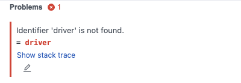

    *Example of an error in a table*

    The **Show stack trace** link under the message allows viewing all stack trace for this error.

    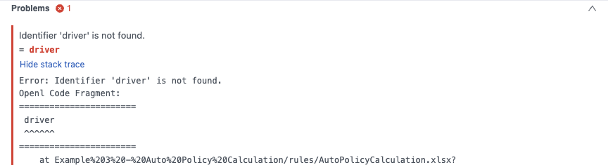

    *Error stack trace example*

### Applying the Table Theme

A table theme gives every table but a table of the type **Other** one consistent look. For example, the **Default**
theme that OpenL Studio ships formats the tables as follows:

-   **Header** — the keyword, the type, and the parameters in grey and the name in bold, alike for every kind of
    table. The header of a Datatype or a Vocabulary is filled, and the header of a Data, a Test, or a Run table
    starts at the left.
-   **Properties** — a line under the table properties, alike for every kind of table.
-   **Fields** — the field names filled, the default values centered. In a transposed Datatype table, which has a
    field in each column, the field names are a row.
-   **Values** — the values of a Vocabulary centered.
-   **Steps** — the column titles of a Spreadsheet in bold and filled, and its formulas filled. A step whose name is
    merged across its row heads a section, such as **Policy Factors Calculation**, and is written in bold italic. A
    step marked with `*` for the result, such as `PolicyNumber*`, is bold, and so is the step whose value a
    Spreadsheet returns when it returns a type other than `SpreadsheetResult`.
-   **Algorithms** — a TBasic table looks like a Spreadsheet: the row of its column IDs, such as `operation`, in
    grey and closed by a line, its titles in bold and filled, and its actions filled, while its conditions are not. A
    step that starts a subroutine with `SUB` or `FUNCTION` heads a section and is written in bold italic, and a step
    that returns with `RETURN` is bold. The operations keep their indent, which tells the level of each step.
-   **Code** — the code of a Method table in the look every cell starts from.
-   **Data** — the field names of a Data, a Test, or a Run table in grey, its titles in bold and filled, and its
    values centered. The IDs of a Data table, and the values a Test or a Run table takes from a Data table by their
    IDs, are bold and highlighted. A value that is not filled is grey. A Test and a Run table look like a Data table.
-   **Decision tables** — the titles of the conditions of a Rules, SimpleRules, SmartRules, SimpleLookup, or
    SmartLookup table in bold and filled grey, with a line between the columns of conditions, and the titles and the
    values of what the table returns filled blue. The values of the horizontal conditions across the top of a lookup
    table are bold and filled, and the rows of code of a Rules table, such as `C1` and `RET1`, are grey and closed by
    a line. A value of a condition merged over several rules sets them apart with a line above and below them. Every
    kind of decision table looks like a Rules table.
-   **Column match** — a ColumnMatch table looks like a Rules table: the row of its column IDs in grey and closed by
    a line, its titles filled grey, the rows that give what it returns or scores, such as **Return Values**, filled
    blue, and a line after the names it checks and between its values. A condition with the conditions indented
    under it, which the table checks together, sets them apart with a line above and below them. The names keep
    their indent.
-   **Declarations** — a Conditions, an Actions, and a Returns table, which declare what decision tables take by
    their titles, look like the code and the titles of a Rules table: their inputs, expressions, and parameters
    are grey and closed by a line, the titles of the conditions are filled grey, and the titles of the actions and
    the returns are filled blue.
-   **Technical tables** — an Environment and a Properties table in greys: the header filled grey, the settings,
    such as `import`, and the properties filled light grey, and a light line under every row. A Properties table
    looks like an Environment table. The types of a Constants table are grey and the names of its constants
    filled, as the field names of a Datatype.
-   **Last row** — a line under the last row that closes the table.
-   **Everything else** — the theme overrides the formatting the Excel file gives the table: its fills, lines,
    fonts, and alignment. A cell the theme fills no other way is white, and a text the file formats in pieces of its
    own, other than the header, is drawn in the font of its cell.

OpenL Studio also ships the **Green** theme. How a theme file is written is described in
[Appendix E: Table Themes](appendices/table-themes.md). A theme can be used in the following ways:

-   **Viewed only** — in **My Settings**, in the **Table Theme** list, select the theme. Every table but a table of
    the type **Other** is then drawn with the theme while it is viewed, and the Excel file keeps its own formatting.
    A table switched to the edit mode is drawn as the file holds it, so the formatting changed in the edit mode is
    the formatting of the file. To draw the tables with the formatting of the file again, select **Excel
    Formatting**.
-   **Written into one table** — switch the table to the edit mode, click **Apply Theme**
     on the toolbar, and select the theme. The table is drawn with the theme,
    and the theme is written into the Excel file with the other changes of the table when **Save** is clicked.
    **Undo** takes the theme back. The button is displayed for every table but a table of the type **Other**.
-   **Written into the whole project** — above the table, click **More**, select **Apply Table Theme to Project**,
    select the theme, and click **Apply Theme**. The theme is written into every table of every module of the
    project but the tables of the type **Other**. A module set to compile alone has the whole project compiled first,
    and a project whose compilation was stopped is not themed. The theme selected first is the one that **My
    Settings** names, or the first theme in the list when **My Settings** names **Excel Formatting**.

> [!Note]
> Until **Save** is clicked, the theme is drawn as it fits the table without the changes made in the edit mode. A row
> added there is drawn without the theme, and once a row or a column is inserted or deleted, a cell may show the look
> of the place it had before. The theme is written over the table as it is when saved.

Writing the theme changes only the look of a table:

-   Each cell keeps its value and every formatting option the theme does not set, such as its number format.
-   A text that the Excel file formats in pieces of its own, other than the header, is written in the font of its
    cell.
-   The header keeps its text, and its keyword, name, type, and parameters are formatted in pieces.
-   Cells outside the table are not changed, and applying the theme again changes nothing more.
-   The formatting set in the edit mode is written over the theme, so a cell formatted by hand keeps that
    formatting.
-   A table written as several partial tables and a table of a dependency project are left as they are.

Like any other change of a table, the change is kept in the workspace until the project is saved.

> [!Note]
> A theme written into the Excel file is not kept up to date by the edits made after it. When rows or columns are
> later inserted into the table or deleted from it, the theme is not written again by itself: writing it needs the
> table to compile, and it takes longer the larger the table is. Apply the theme again by hand once the edits are
> finished, to the table or to the whole project. Only the screen follows the edits by itself: with a theme selected
> in **My Settings**, the tables are drawn with the theme as they are now.

OpenL Studio also draws the formatting of text pieces that an Excel file holds, such as a header with a grey
keyword and a bold name, and the cell borders the file draws, for every table.

### Referring to Tables

OpenL Studio supports references from one table to another table. A referred table can be located in the same module where the first table resides, or in the different module of the same project.

Links to the following tables are allowed:

-   data table
-   datatype table
-   rule table types

Links to the rule tables are underlined and marked blue. When a mouse cursor is put over the link, a tooltip with method name and input parameters with types is displayed.

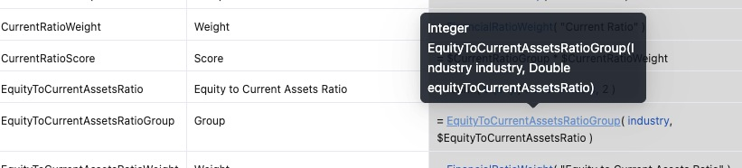

*A tooltip for the linked method to a decision table*

Links to the data and datatype tables are underlined with a dotted line and has an appropriate tooltip with description.

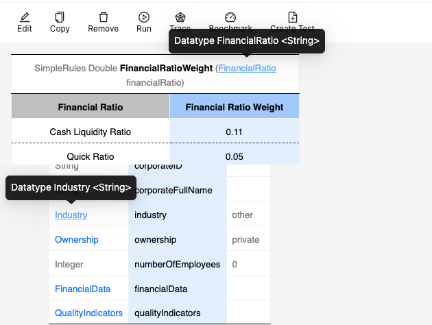

*Links to the datatype tables from the decision and datatype table*

All fields of the datatype tables are also linked and contain tooltips.

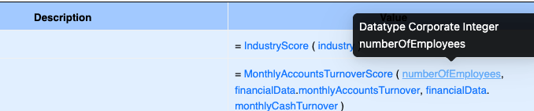

*A link to the field of the Corporate datatype table*

### Managing Range Data Types

OpenL Studio provides a special tool, **Range Editor**, for adding and editing range data types, such as IntRange and DoubleRange, in rule tables and test tables.

This section briefly introduces Range Editor and provides examples of its functionality.

The main Range Editor goal is to move to a single range format in OpenL rules, namely, the ‘..’ format. For more information on ranges on OpenL Tablets, see [OpenL Tablets Reference Guide > Representing Range Types](../reference-guide/02-working-with-openl-tables/03-table-types/10-representing-values-of-different-types.md#representing-range-types).

Consider the following principles while working with Range Editor:

-   The default range format is set to ‘..’ in OpenL Studio.
-   When a new range is created, the ‘..’ format is used.
-   When a range format other than ‘..’ is edited, if only range values are edited, the format remains the same.

If any editor control is used, for example, a check box or the **Done** button, the range format is set to ‘..’.

The following example displays the decision table with data represented as a range:

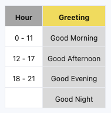

*Decision table with a range data type*

In this table, the **Hour** column contains hours with the IntRange Data type. All range sells are filled except for the last one. This example is used further in this section to demonstrate how Range Editor works.

The following controls are available in Range Editor:

-   **From** — indicates the left border of the range
-   **To** — indicates the right border of the range
-   **Include** — indicates whether the border is included in the range
-   **‘\>’** — indicates values greater than the specified border
-   **‘\<’** — indicates values smaller than the specified border
-   **‘=’** — indicates a constant
-   **‘-’** — indicates a range

To create a range, proceed as follows:

1.  Double click the cell to be edited.

    For example, edit the cell containing 18-21, and click the field of the cell. The table is extended by the pop-up window with a set of controls for editing the range.

    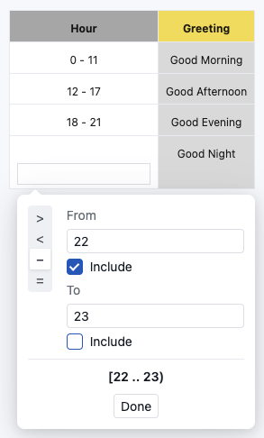

    *Creating a range in Range Editor*

1.  In the **From** field, enter the left border of the range, which is 22 for the example described in this section.
2.  In the **To** field, enter the right border of the range.

    In this example, the **To** value must be 24, but an erroneous value 23 is entered for further editing of this border.

1.  Clear the **Include** check box.
2.  Click **Done** to complete.

    The last cell in the **Hour** column is filled as follows:

    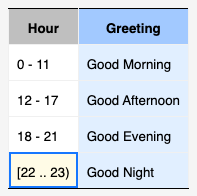

    *New range created in Range Editor*

1.  To modify the range in Range Editor, double click the cell with the [22-23) range.

    The table resembles the following:

    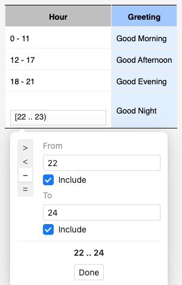

    *Editing a range in Range Editor*

1.  Select the **To** field, set the right border to 24, and select **Include**.
2.  Click **Done** to save the work.

    The range resembles the following:

    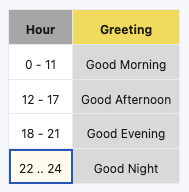

    *The range edited in Range Editor*

A range can also be modified using ‘\>’, ‘\<’ and ‘=’ controls as described in the beginning of this section.

### Copying a Table

To create a table as a copy of the existing table, proceed as follows:

1.  In the module tree, select a table to copy.
2.  Above the table, click **Copy**.
    OpenL Studio displays the **Copy table "TableName"** window.

    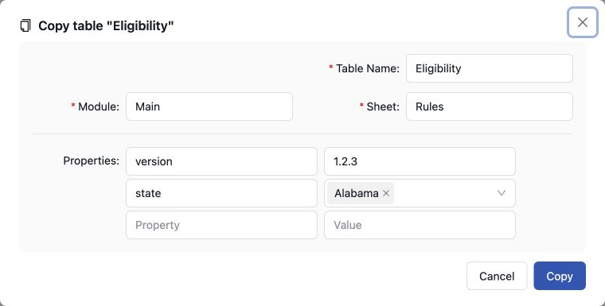

    *Copying an existing table*

1.  Enter a valid OpenL identifier in **Table Name**. It may match an existing table name when the table is
    distinguished by its signature or properties. A name of any other shape is refused, by the window and by the
    server alike.
2.  Select or enter the destination **Module**.
3.  Select or enter the destination **Sheet**. The sheet is the table's category, so a new sheet name creates a new
    category.
4.  Review the property name and value rows. The names are the properties applicable to the copied table's type,
    offered the way the **Table Details** editor lists them — by display name, under the **Info**, **Business
    Dimension**, **Version** and **Dev** groups, so the dimensional properties are presented rather than guessed:
    - complete the last row to add another property, or delete a row with its row control;
    - select a property by its display name; a property another row already carries is not offered again, since
      a table declares each property once;
    - enter text directly, select a date in the date picker, select or clear a Boolean check box, or select an enum
      display value from the dropdown, according to the property type. A single-value enum is selected from a closed
      dropdown and does not accept typed text.
      The date picker opens on the date the copied table declares and follows the user's locale; OpenL Studio
      carries a date value as ISO 8601 `yyyy-MM-dd`. A date naming a moment of the day keeps that moment when
      another day is selected, because the picker chooses a day.
    - **Version** is entered as its three numbers — major, minor and variant — with the version the copied table
      stands for named beside them. It opens on the first version the table's versions leave free, and a version
      one of them already carries is refused.
5.  Click **Copy** to save your changes.

The copy is stamped as created: OpenL Studio records **Created By** and **Created On** on it, as it does for a table
created from scratch, provided **Update table properties** is selected in the system settings.

The table appears in the module list.

### Searching for Tables

The search field above the module tree narrows the tree down by table name, and **Extended search** looks for tables by several criteria in the current module, in the current project, or in all compiled projects, dependencies included.

#### Searching by Table Name

To find a table in the module tree, start typing its name in the **Search tables by name** field above the tree. The tree shows only the tables with the typed text in their names. To get a full list of tables, delete the text in the field.

*Searching by table name*

#### Performing an Extended Search

Extended search allows specifying criteria to narrow the search through tables. To limit the search, specify the table type, text from the table name, header or cells, and table properties as described further in this section.

1.  To launch an extended search, click **Extended search**, the filter icon at the end of the search field.

    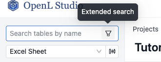

    *Initiating the extended search*

1.  In the **Scope** field, select whether search must be performed within the current module, within the current project, or within everything compiled, dependencies included.

    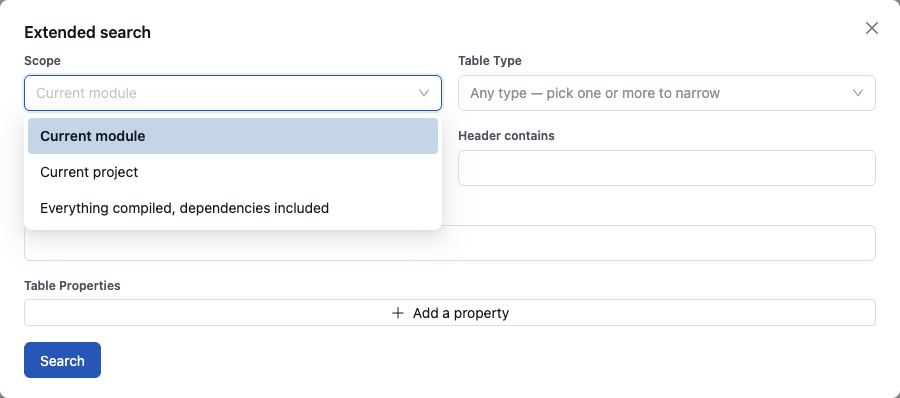

    *Specifying search area*

    A search that is wider than the open module waits until the project is compiled.

1.  In the **Table Type** field, select one or more table types to search in. Leave the field empty to search in all table types. The utility tables, of the type **Other**, are found only when that type is selected.
2.  In the **Name contains**, **Header contains** and **Text in cells** fields, enter the words or phrases to search for.
3.  In **Table Properties**, click **Add a property**, select the required table property and enter its value.
4.  In the similar way, add as many table properties as required.
5.  To remove a property, click the trash icon to the right of the property.

    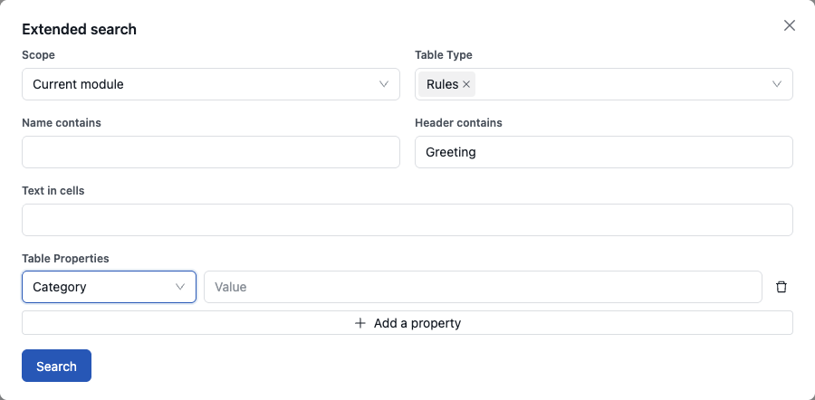

    *A filled form for extended search*

1.  Click **Search** to run the search.

As a result, the system displays the tables matching the search criteria with the name of the Excel file they are written in. The **View table** link opens the table in Rules Editor. The **Show body** link shows the first rows of the table right in the list, and **Hide body** folds them back.

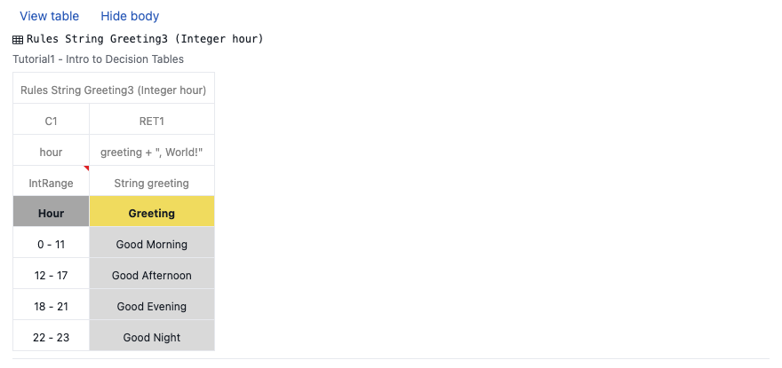

*Extended search result*

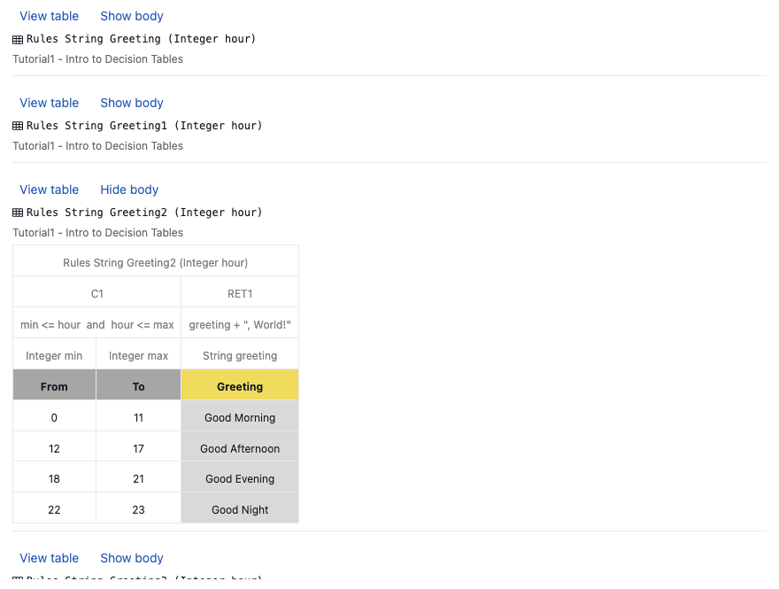

*Search results with the bodies of some tables shown*

### Creating Tables

The **Create Table** action opens one window that holds the whole table: a settings strip for the type, the name and
the destination, and below it the sheet itself. The skeleton is rebuilt the moment the table type changes, and the
header cell at the top of the sheet shows the exact OpenL header the table will be written with.

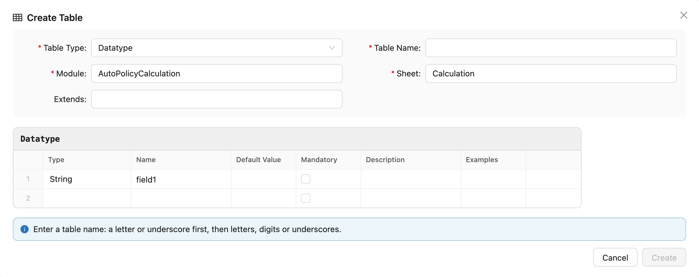

*The Create Table window*

To create a table:

1. In OpenL Studio, click **Create Table**.
2. In **Table Type**, select one of the supported types:

   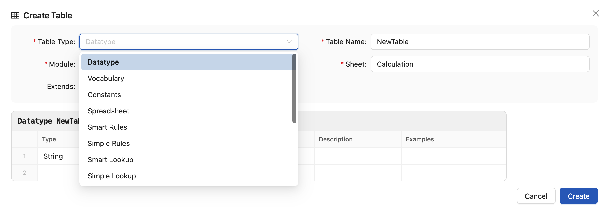

   *Selecting the table type*

   - **Datatype** — Type, Name, Default Value, Mandatory, Description, and Examples. Type accepts a value directly or
     a value selected from simple types, vocabularies, and datatypes visible to the module. **Extends** suggests only
     the project's complex datatypes and writes the selected parent into the header; it does not offer
     `SpreadsheetResult`. Select the **Mandatory** check box to write `true`; clear it to leave the cell empty.
   - **Vocabulary** — one value column and a simple **Base Type**, written in angle brackets in the Datatype header.
     The value cells use that type's editor.
   - **Constants** — Type, Name, and Default Value. Type is selected from simple types, and Default Value uses the
     selected type's editor. A Constants table carries no name of its own, so the **Table Name** field is not shown.
   - **Spreadsheet** — Steps and Formula, returning `SpreadsheetResult` unless another type is chosen. A
     Spreadsheet names its own columns in the first row of the table, so those names are cells to edit and more
     columns can be added beside them.
   - **Smart Rules** and **Simple Rules** — one column for each input argument. A simple result adds an Output column;
     a Datatype result adds one output column for each Datatype field.
   - **Smart Lookup** and **Simple Lookup** — a two-dimensional table, read where a row and a column cross. The
     leading arguments run down the left, one column each, and the trailing ones across the top, one row each. The
     corner where the two meet is kept as square as it can be and gains a row before a column: two arguments give
     one of each, three give two rows and one column, five give three and two. That corner is written as a merged
     cell, because its height is what tells OpenL how many arguments run across the top.

     A lookup of one argument has no second axis to spread over, so it is laid out exactly like a Simple Rules
     table — the argument down the left, the result beside it, and no corner at all. Every row is a rule from
     the first one, so no title row is written above them.

     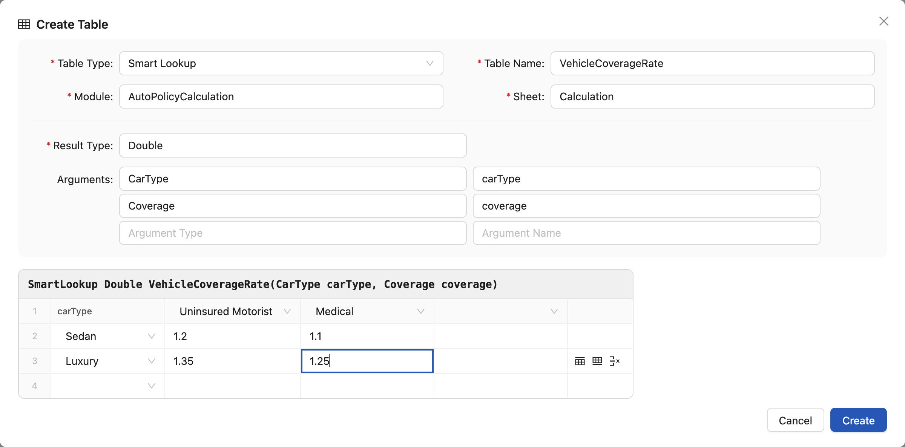

     *A lookup with one argument down the left and one across the top*

   - **Rules** — Condition and Output.
   - **Test** and **Run** — columns generated from the signature of the selected executable table: one for every
     value a call has to supply, plus `_res_` for the expected result, which Run omits. An argument of a datatype
     contributes one column per field, named by the path OpenL reads it back with — `policy.mainDriver.age` — as
     deep as the datatypes nest. An argument of any other type, a collection included, stays one column. The target
     can be any executable table in the project, whichever module holds it. Test excludes a table that returns
     nothing because there would be no result to assert; Run includes it because Run only calls the table. The new
     table opens named after the table it exercises — `PremiumTest`, `PremiumRun` — and can be renamed. A Test or Run
     table is placed with the project's tests: selecting the type moves the destination to a module under `tests/`,
     and a module created for it goes under `tests/` too.
     Select **Transposed** to put the generated fields down rows and test or run cases across columns.
   - **Data** — columns generated from the selected Datatype. Select **Transposed** to put fields down rows and data
     records across columns. Test, Run and Data display every word in generated titles in Title Case, such as
     **Main Driver Age**.
   - **Environment** — Key and Value. Key is suggested from the three keywords OpenL acts on — `dependency`,
     `import` and `include`. An Environment table carries no name of its own.
   - **Properties** — Property and Value. Property is suggested from the properties that may appear in a Properties
     table. Its value uses the editor declared for that property: text, date picker, Boolean check box, or enum
     dropdown. Single-value enum dropdowns do not accept typed text. Enum lists show display values and write their
     codes. Multiple selected values wrap onto additional lines within the value column. Dates follow the user's
     locale in the date picker and are written as ISO 8601 `yyyy-MM-dd`. The skeleton starts with the mandatory
     `scope` property set to `Module`; change it to `Global` or to `Category` — adding a `category` row to name the
     category — as required. A Properties table carries no name of its own.
   - **Free Form Table** — a plain grid, with the sheet's own column letters over it and nothing else. It has no
     header cell and no name: OpenL does not recognize such a table, and names it after whatever its first cell
     says. It is written exactly as it stands. Only that first cell is required — OpenL reads a table from it.

3. Enter the table name, where the table type has one. The field opens empty and is required wherever it is shown.

   The name must be a valid identifier — letters, digits, `_` and `$`, not starting with a digit — because it
   becomes the name OpenL compiles. It may match an existing table name: signatures and properties supplied by the
   file name, a Properties table, or the table's own properties section distinguish table overloads and versions.
   Constants, Environment, Properties and Free Form tables carry no name and do not show the field.

4. In **Module**, choose the module that receives the table, then choose the sheet. Both fields suggest what the
   project already has and accept anything else typed into them. The sheets offered are the ones the chosen
   module's own workbook holds, and choosing a module selects its first sheet, since a sheet belongs to a module.
   The module decides only where the table is written — it does not change what a Test or Run table may target.

   A module name the project does not declare creates a module. OpenL Studio derives its project-relative `.xlsx`
   path — `rules/` for a rules table, `tests/` for a Test or Run table — creates the workbook, and registers it in
   `rules.xml` when the path is not already covered by a module wildcard. For a simple project without `rules.xml`,
   OpenL Studio creates the descriptor and keeps all existing root modules registered.

   A sheet name that the chosen module does not have creates a sheet.

   The sheet name cannot contain `/ \ * ? [ ] :`, which Excel does not allow in a worksheet name.

   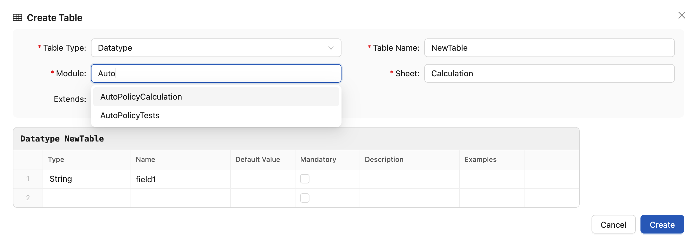

   *Choosing the module that receives the table*

5. For Spreadsheet, Rules, Smart Rules, Simple Rules, Smart Lookup, and Simple Lookup, set **Result Type** and
   **Arguments**. A type can be a simple type, a vocabulary, or a datatype visible to the selected module;
   `SpreadsheetResult` is offered here as well, because only a signature can name it. The header cell at the top of
   the sheet updates as the signature is filled in.

   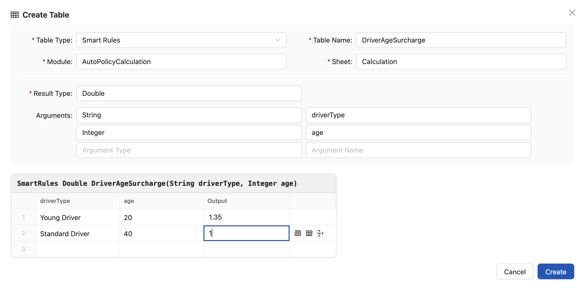

   *A signature builds the header cell and the columns*

6. Edit the skeleton cells.

   - Every body cell can be edited. The header cell at the top is a read-only preview generated from the settings.
     A Datatype parent is set with **Extends**, which builds a header such as `Datatype Policy extends Base`.
   - The first row opens filled in as an example. It is a placeholder to write over: every cell holds a value of
     the type its column declares — `1` for an Integer, `TRUE` for a Boolean, `2026-06-15` for a Date, `1-10` for
     an IntRange, and for a vocabulary the first value that vocabulary offers — so a table created untouched is a
     table that works. A cell whose value no single cell can spell out, such as another datatype or a collection,
     opens on `<field>_id_1`, the way a Data table row holding that value is referenced.
   - A value cell uses the editor for the type its table definition gives it. Boolean cells offer `TRUE`, `FALSE`
     and an empty value. Vocabulary cells use a closed dropdown that offers their declared values and empty, without
     accepting typed text. Numeric cells use a number input, Date cells a date picker that displays the user's locale
     and stores ISO 8601 `yyyy-MM-dd`, and Character cells accept one character. Byte, Short, Integer and Long
     values must stay within the range of the selected type. This applies to Datatype defaults and examples,
     Constants and Vocabulary values, and generated Rules, lookup, Test, Run and Data cells, except for the
     condition cells described below.
   - A condition cell of a Smart Rules, Simple Rules, Smart Lookup or Simple Lookup table is matched by range as
     readily as by equality, so a condition of a numeric, Character, String or Date type is typed rather than
     picked: it takes `18-30`, `>=18`, `[18 .. 30)` or `18 and more` as well as a single value, it is not held to
     the range of its type, and a Character condition is not capped at one character. What OpenL cannot read is
     reported when the table compiles. A Boolean or Vocabulary condition has no range of its own and keeps the
     dropdown its type gives it.
   - Filling the last row automatically adds an empty row below it.
   - Point at a row to reveal its actions: insert a row above or below it, or delete it. A Free Form Table reveals
     the same actions for its columns, above the grid.

     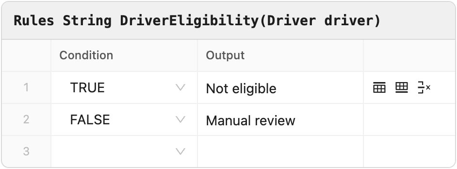

     *Actions revealed for the row under the pointer*

   - Columns controlled by a table signature, Datatype, or tested table change when that definition changes.
   - Where a table type has no fixed set of columns — a Free Form Table, a Spreadsheet, a lookup — filling the last
     column adds an empty column to the right. A table wider than the dialog scrolls sideways rather than widening
     it.
   - Blank rows are not written. OpenL reads a blank row as the end of a table, so an empty row left in the middle of
     the skeleton is dropped together with the trailing one kept for input.
   - While **Create** is unavailable, the dialog names what is missing, one thing at a time and in the order the
     fields are laid out, so the first thing shown is the first thing to fix.
   - A Spreadsheet needs at least one filled row, because OpenL rejects a table with no body. **Create** stays
     disabled until one is entered.
   - A lookup of two or more arguments needs a value in every row of its top band — one for each argument running
     across the top — and at least one row below to look up by. A blank row is never written, so a top row left
     empty would shorten the merged corner and change how many arguments OpenL reads as horizontal. **Create**
     stays disabled until both are filled. A lookup of one argument has no band, so it needs only a filled row.
   - A lookup's top band and the argument titles beside it belong to the table type and carry no row controls.

7. Click **Create**.

The table is created in the selected module and opens in the Rules Editor. Its availability to other modules depends
on project and module dependencies. For more information, see
[OpenL Tablets Reference Guide > Project, Module, and Rule Dependencies](../reference-guide/04-working-with-projects/02-project-module-and-rule-dependencies.md#project-module-and-rule-dependencies).

For an executable table, **Create Test** opens the same window with a Test table skeleton generated from the selected
table signature. The generated columns contain every input parameter and the expected result. The tested table can
also be changed in the window.

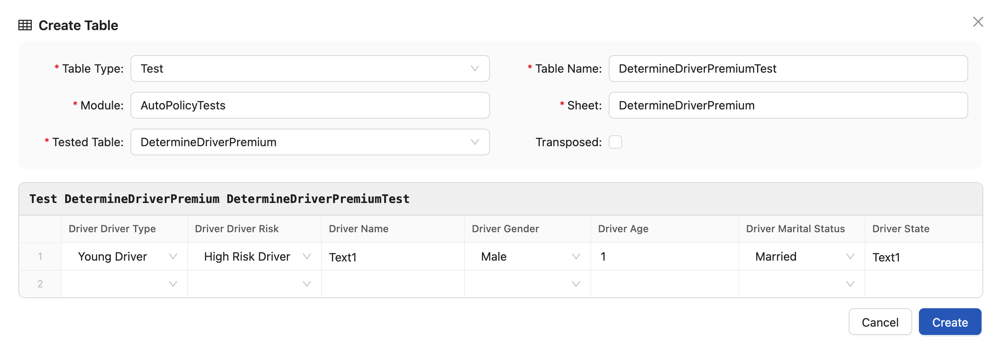

*A Test table generated from the tested table*

### Comparing Excel Files

OpenL Studio compares two Excel files and shows the tables and other elements that differ. To compare two Excel files, proceed as follows:

1.  In Rules Editor, above the table, select **More \> Compare Excel files.**

    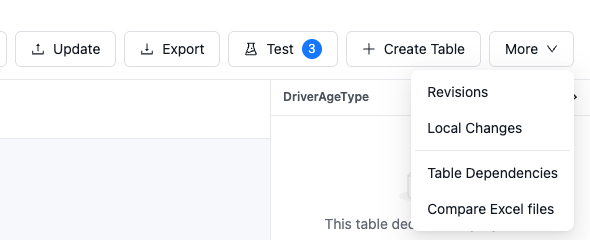

    *Initiating Excel comparison functionality*

    The comparison opens in a window of its own.

1.  Drag the two files to compare into the box, or click it and select them.

    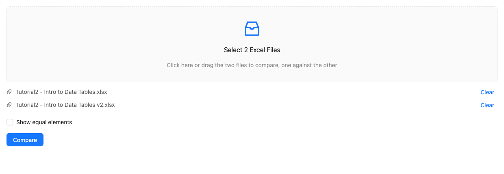

    *Excel files ready for comparison*

1.  To list the elements that are the same in both files as well, select the **Show equal elements** check box.
2.  Click **Compare.**

    The elements of the two files are listed grouped by Excel sheet. Selecting an element displays it as it stands in each of the files, one next to the other, with the cells that differ highlighted. The cells that read the same in both files are drawn in grey, so that the differences are what the eye lands on.

    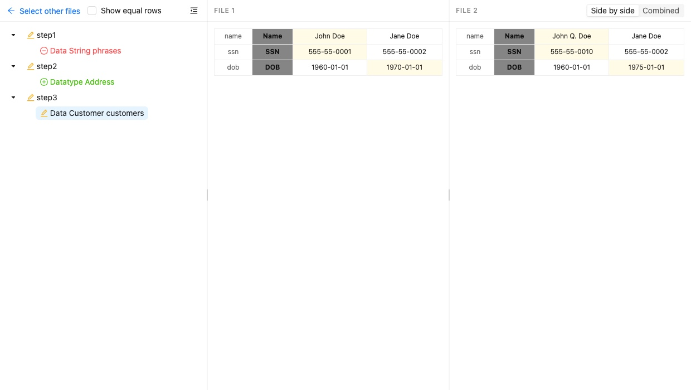

    *Excel file comparison results*

    Every element is marked with what became of it. An element that changed its location or its contents carries the changed file icon , one that the second file adds carries the added file icon , one that it no longer holds carries the removed file icon , and one that reads the same in both files carries a plain file icon.

    The list of elements, the first file and the second one are separated by dividers. Drag a divider to give
    either side more room. The button above the list hides it and leaves the tables alone; while the list is
    hidden, the button that brings it back and **Select other files** are above the first file.

1.  To read the two versions as one table instead of two, select **Combined** at the end of the line the files are named on.

    Each row is led by the sign that says what became of it, and a cell the two files read differently carries both values, the one the first file has before the one the second file has in its place. The signs the table is read by are listed beside the file names, and each sign in the table says what it means when the pointer rests on it.

    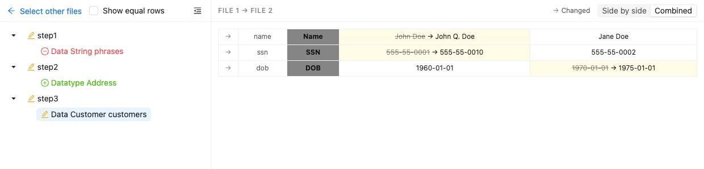

    *The two versions drawn as one table*

    When the two files hold a different number of rows, there is nothing to read one against the other. What the first file holds is shown first, each row marked with a minus, and what the second file holds after it, each row marked with a plus.

1.  To display the rows that read the same in both files, select the **Show equal rows** check box. Without it, an element shows only the rows that differ.
2.  To compare another pair of files, click **Select other files**.

If the two files hold the same elements with the same contents, the **File elements are identical** message is displayed.

### Viewing and Editing Project-Related OpenAPI Details

When a project is created from an imported OpenAPI file, the normalized file in the project root is used for
reconciliation by default. The generated `rules.xml` does not store OpenAPI generation settings, so OpenL Studio does
not regenerate the workbooks automatically and overwrite later edits.

The **OpenAPI** section of the **Overview** tab of the project page shows the specification of the project. A project that declares no specification shows the note **The project declares no OpenAPI specification**. A specification that is stored in the project root under the default name `openapi.yaml`, `openapi.yml` or `openapi.json` is found automatically and used for reconciliation even if `rules.xml` does not declare it.

After an explicit OpenAPI import or generation operation stores its settings in `rules.xml`, the OpenAPI section shows
the OpenAPI file name, mode, and module names.

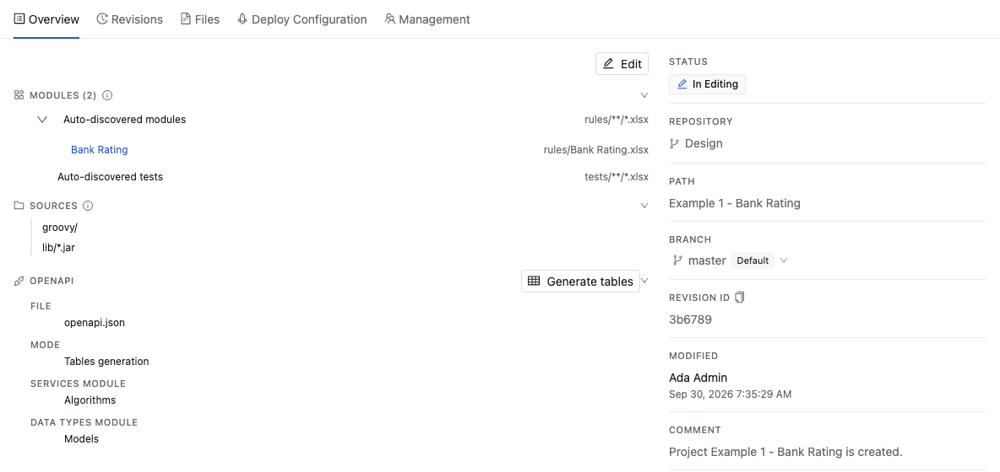

*OpenAPI project after explicitly running Tables generation*

It contains the following information:

| Field          | Description                                                                                                                                                                                                                                                                                                                                                                                   |
|----------------|-----------------------------------------------------------------------------------------------------------------------------------------------------------------------------------------------------------------------------------------------------------------------------------------------------------------------------------------------------------------------------------------------|
| File           | Location and name of the OpenAPI file in the project, such as openapi.json and files/example.json.                                                                                                                                                                                                                                                                                            |
| Mode           | Last operation performed with this OpenAPI project.  **- Tables generation** mode is used for generation or regeneration of the rules and data type modules based on the OpenAPI file.  For the **Tables generation** option, project reconciliation is done, too.  **- Reconciliation** mode is set to validate the project against the OpenAPI file. To revalidate the project, change the path to the OpenAPI file. |
| Services module | Name of the module that contains rules. It is shown for the **Tables generation** mode.                                                                                                                                                                                                                                                                                                      |
| Data types module | Name of the module that contains data types. It is shown for the **Tables generation** mode.                                                                                                                                                                                                                                                                                              |

The OpenAPI file and the mode are changed in the edit mode of the **Overview** tab: click **Edit** and change the **OpenAPI** section, as described further in this section. Like any other configuration change, it is written to `rules.xml`, and the project must be saved to store it in Design repository.

The following topics are described in this section:

-   [Generating an OpenAPI File from Rules and Datatype Tables for Reconciliation](#generating-an-openapi-file-from-rules-and-datatype-tables-for-reconciliation)
-   [Adding OpenAPI for Reconciliation to an Existing Project](#adding-openapi-for-reconciliation-to-an-existing-project)
-   [Regenerating a Project from Another OpenAPI File](#regenerating-a-project-from-another-openapi-file)
-   [Updating the OpenAPI File](#updating-the-openapi-file)

#### Generating an OpenAPI File from Rules and Datatype Tables for Reconciliation

If a project is not generated from an OpenAPI file and it is necessary to add the OpenAPI file, this file can be generated from the existing rules and datatypes tables. Proceed as follows:

1.  Open the project page and its **Overview** tab.
2.  In the **OpenAPI** section, click **Generate specification**.

    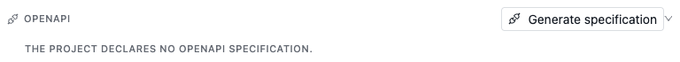

    *Initiating OpenAPI file generation*

    The button is shown while the project can be modified and does not use the **Tables generation** mode.

The file is written to the project right away, without a window to confirm. The message with the file name is displayed, the project is pointed at the file in the **Reconciliation** mode, and the file appears in the **OpenAPI** section. When the file already exists, it is updated according to the current project tables.

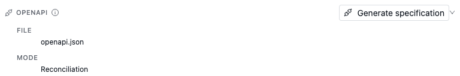

*The OpenAPI file added to the OpenAPI section*

Note that successful generation of the OpenAPI file requires that the project has no compilation errors and tables contain data for the OpenAPI methods.

#### Adding OpenAPI for Reconciliation to an Existing Project

If a project is not generated from the OpenAPI file, but it is required to add the OpenAPI file and generate modules from it, proceed as follows:

1.  Open the **Overview** tab of the project page and click **Edit**.
2.  In the **OpenAPI** section, select the OpenAPI file in the **File** field. The list offers the `.json`, `.yaml` and `.yml` files of the project. To use a file from the user's computer, click the upload icon  and select the file. The file is added to the project when the changes are saved.

    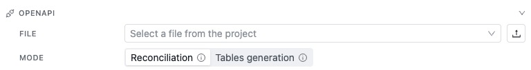

    *Choosing the OpenAPI file and the mode*

3.  Select the **Tables generation** mode.

    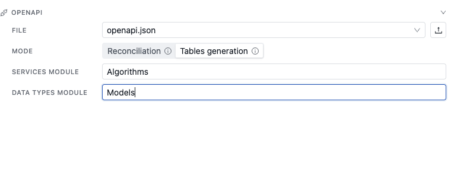

    *Selecting the generation mode*

1.  If necessary, modify the default names of the **Services module** and the **Data types module**, and click **Save** above the sections.

    The services and the data types are generated into a module each, so the two names must differ, letter case
    aside. Names that do not are refused under both fields with the **Module names cannot be the same** message,
    and the settings are not saved. Names saved that way before stay as they are, and the **Generate tables**
    dialog refuses them with the same message until they differ.

2.  In the **OpenAPI** section, click **Generate tables** and review what the generation will write.

    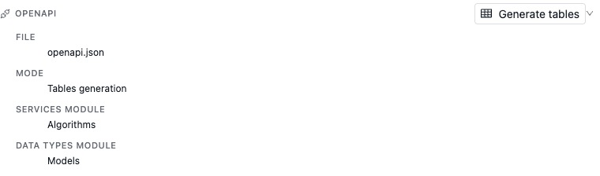

    *The OpenAPI section with the Tables generation mode*

    If no module with the entered name is found, the workbook it is written to can be edited, and the reset
    icon beside the field puts back the proposed path.

    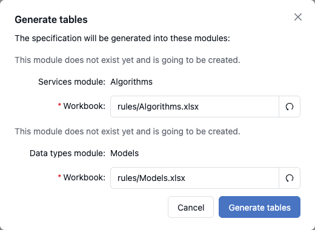

    *Generate tables window, both modules are new*

    If the project already reads a module of that name, it is written wherever the project reads it, so there is no option to define a file name. When a workbook stands there, it is overwritten and the corresponding warning message is displayed.

    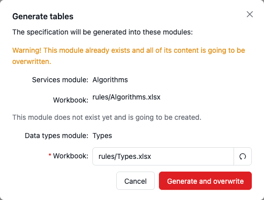

    *Generate tables window, one of modules already exists*

1.  Click **Generate tables**, or **Generate and overwrite** when the window says a workbook is replaced.

The rules and model modules are created or updated, and the message **The tables were generated from the OpenAPI specification** is displayed.

#### Regenerating a Project from Another OpenAPI File

If a project is initially created from an OpenAPI file, it can be regenerated explicitly from another OpenAPI file.
Follow the steps described in
[Adding OpenAPI for Reconciliation to an Existing Project](#adding-openapi-for-reconciliation-to-an-existing-project),
select **Tables generation**, and choose the OpenAPI file. Regeneration overwrites the selected rules and data modules.

#### Updating the OpenAPI File

When the project is generated from the OpenAPI file and reconciliation is done, the system automatically validates the generated OpenL Tablets rules and data types. If the file is updated in the **Files** tab, as described in [Updating a File](repository-editor.md#updating-a-file), and the name is not changed, reconciliation is completed immediately.

To reconcile a project using an OpenAPI file with a different name, proceed as follows:

1.  Ensure that the OpenAPI file is uploaded to the project via the **Files** tab, or pick it from the computer with the upload icon in the next step.
2.  Open the **Overview** tab of the project page and click **Edit**.
3.  In the **File** field of the **OpenAPI** section, select the OpenAPI file, select **Reconciliation,** and click **Save**.

    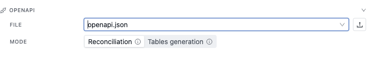

    *Selecting an OpenAPI file for reconciliation*

The project is validated using the newly selected file.

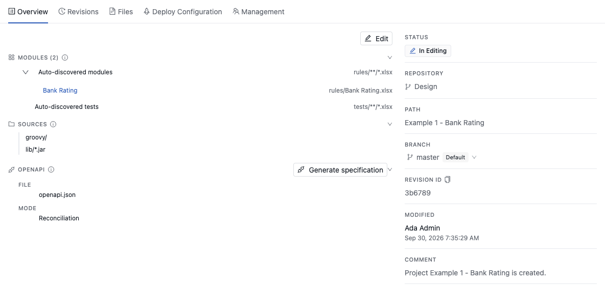

*Viewing results of the last reconciliation*

### Reconciling an OpenAPI Project

If an OpenAPI file is set for a project, during project compilation, the system automatically checks whether the project matches the defined OpenAPI file. If the generated OpenAPI for the deployed project does not match the existing OpenAPI file, errors and warnings are displayed. This process is called **reconciliation**.

Reconciliation does not expect exactly the same OpenAPI generated by the project and checks the following:

-   All paths defined in the existing OpenAPI file are generated by the project.
-   All paths generated by the project are defined in the existing OpenAPI file.
-   All operations for each path in the existing OpenAPI file are the same as operations in the generated OpenAPI file for the correspond path.
-   Operation parameters in the existing OpenAPI file and parameters in OpenAPI generated based on the project for a corresponding operation are the same and all parameter types are compatible.
-   Schemas that are not a part of API are ignored in the reconciliation process.
-   All schemas in the existing OpenAPI file that are a part of API must be generated by the project.
-   All schemas generated by the project must be defined in the existing OpenAPI file.
-   All fields defined in schemas must exist in schemas generated by the project.
-   All fields generated by the project for corresponding schemas must be defined in the existing OpenAPI file.
-   Field types in schemas must be compatible.
-   A field, a parameter, or a returned value whose schema lists `enum` values in the existing OpenAPI file must be of a vocabulary data type with exactly the same values. A schema without `enum` is checked by type only, so a vocabulary data type is accepted where the file says a plain type. A `null` value in the list is ignored, numbers are compared by value, so `2` and `2.0` are the same value, and a Java enum is not checked against the list.

| OpenAPI type defined in the file | OpenAPI type generated by the project                |
|----------------------------------|------------------------------------------------------|
| Integer (int32)                  | Integer (int32)                                      |
| Integer (int64)                  | Integer (int32), Integer (int64)                     |
| Integer(no format)               | Integer (int32), Integer (int64), Integer(no format) |
| String                           | String                                               |
| String (date/date-time)          | String (date/date-time)                              |
| Number(float)                    | Number(float)                                        |
| Number (double)                  | Number(float), Number (double)                       |
| Number(no format)                | Number(float), Number (double), Number(no format)    |
| Boolean                          | Boolean                                              |
