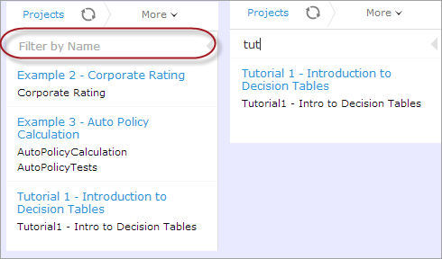
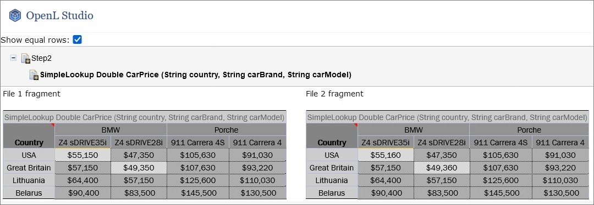
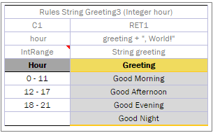
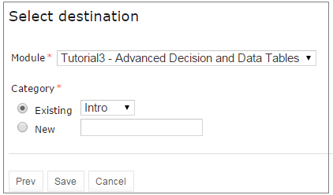

## Using Rules Editor

This chapter describes basic tasks that can be performed in Rules Editor. For more information on Rules Editor, see [Introducing Rules Editor](#introducing-rules-editor).

The following topics are included in this chapter:

-   [Filtering Projects](#filtering-projects)
-   [Viewing a Project](#viewing-a-project)
-   [Viewing a Module](#viewing-a-module)
-   [Managing Projects and Modules](#managing-projects-and-modules)
-   [Defining Project Dependencies](#defining-project-dependencies)
-   [Viewing Tables](#viewing-tables)
-   [Modifying Tables](#modifying-tables)
-   [Referring to Tables](#referring-to-tables)
-   [Managing Range Data Types](#managing-range-data-types)
-   [Creating Tables by Copying](#creating-tables-by-copying)
-   [Performing a Search](#performing-a-search)
-   [Creating Tables](#creating-tables)
-   [Comparing Excel Files](#comparing-excel-files)
-   [Viewing and Editing Project-Related OpenAPI Details](#viewing-and-editing-project-related-openapi-details)
-   [Reconciling an OpenAPI Project](#reconciling-an-openapi-project)

### Filtering Projects

To limit a list of projects displayed in the **Projects** list, start typing a project name in the field located above the list of projects.

*Filtering projects by Name*

To get a full list of projects, delete filter text value in the field.

### Viewing a Project

Rules Editor allows a user to work with one project at a time. To select a project, in the **Projects** tree, select the blue hyperlink of the required project name. The project page with general information about the project and configuration details appears in the middle pane of the editor.

*A project page in Rules Editor*

If a particular project is not available, it must be opened as described in [Opening a Project](#opening-a-project).

### Viewing a Module

Rules Editor allows a user to work with one module at a time. To select a module, in the **Projects** tree, select the black hyperlink of the module name. The following module information is displayed:

-   tree in the left pane displaying module tables
-   general module information displayed in the middle pane, including project and module names, associated Excel file, number of tables, and module dependencies

If a particular module is not available, the project in which it is defined must be opened as described in [Opening a Project](#opening-a-project).

By default, a project is opened in the multi-module mode. This is a common production mode. In the multi-module mode, all modules of the current project with all their dependencies are displayed, that is, modules of projects defined as the project dependencies.

For more information on project and module dependencies, see [OpenL Tablets Reference Guide > Project and Module Dependencies](https://openldocs.readthedocs.io/en/latest/documentation/guides/reference_guide/#project-and-module-dependencies).

The first opened module page is displayed right after the module is loaded, while loading of the whole project continues in the background. The loading progress bar is displayed in the **Problems** section. Errors and warnings are displayed dynamically while more modules are compiled.

*Loading progress bar*

If a module is modified during loading, this module is re-compiled and project loading continues. When the loading is complete, the progress bar is displayed for ten more seconds and then disappears.

The loading progress bar is not displayed for newly opened projects if a project has only one module or multiple small modules which loading takes less than one second. The loading progress bar is also not displayed if the project is already opened and fully compiled and the following actions happen:

-   A page is refreshed using the browser refresh button.
-   A user leaves the project by switching to the main Editor or Repository page and then returns to the project without opening other projects in the meantime.
-   A user switches between modules of the same project.

If a user clicks the refresh button in OpenL Studio, loading restarts and progress bar appears again. While loading in process, the **Run, Trace, Test,** and **Benchmark** actions work only for currently opened module. That is why the **Within Current Module Only** check box is selected and cannot be edited in the menu of these actions while loading is in progress.

When loading is completed, the **Within Current Module Only** check box is cleared and becomes editable.

### Managing Projects and Modules

This section explains the following tasks that can be performed on projects in Rules Editor:

-   [Editing and Saving a Project](#editing-and-saving-a-project)
-   [Saving a Project for Backward Compatibility](#saving-a-project-for-backward-compatibility)
-   [Updating and Exporting a Project](#updating-and-exporting-a-project)
-   [Copying a Project](#copying-a-project)
-   [Exporting, Updating, and Editing a Module](#exporting-updating-and-editing-a-module)
-   [Comparing and Reverting Module Changes](#comparing-and-reverting-module-changes)
-   [Copying a Module](#copying-a-module)

#### Editing and Saving a Project

A project can be opened for editing and saved directly in Rules Editor.

1.  To save the edited project, click **Save** .

    **Note:** If a project is in the **Local** status, this option is not available in Rules Editor.

2.  To modify the project in the **Project** page, modify the values as described in the following table:

| Project details                                                                                                                               | Available actions                                                                                                                                                                                                                                                                                                                                                                                                                                                                                                                                                                                                                                                                                                                                        |
|-----------------------------------------------------------------------------------------------------------------------------------------------|----------------------------------------------------------------------------------------------------------------------------------------------------------------------------------------------------------------------------------------------------------------------------------------------------------------------------------------------------------------------------------------------------------------------------------------------------------------------------------------------------------------------------------------------------------------------------------------------------------------------------------------------------------------------------------------------------------------------------------------------------------|
| General project information  and configuration,  such as OpenL version compatibility,  description, project name,  and custom file name processor | Put the mouse cursor over the project name and click **Edit**  .  For more information on OpenL version compatibility, see [Saving a Project for Backward Compatibility](#saving-a-project-for-backward-compatibility).  Project name can be edited only for projects in a non-flat Git repository.  The project name will be changed in OpenL Studio only, while the folder name remains unchanged.  For more information on properties pattern for the file name, see  [OpenL Tablets Reference Guide > Properties Defined in the File Name](https://openldocs.readthedocs.io/en/latest/documentation/guides/reference_guide/#properties-defined-in-the-file-name). |
| Project sources                                                                                                                               | Put the mouse cursor over the **Sources** label and click **Manage Sources**  .                                                                                                                                                                                                                                                                                                                                                                                                                                                                                                                                                                                                          |
| Modules configuration                                                                                                                         | Put the mouse cursor over the **Modules** label or a particular module name and click **Add Module**  or **Edit Module**   or **Remove Module** .                                                                                                                                                                                                                                                                                                                                                                                                         |
| Project dependencies                                                                                                                          | Manage dependencies as described in [Defining Project Dependencies](#defining-project-dependencies).                                                                                                                                                                                                                                                                                                                                                                                                                                                                                                                                                                                                                                                     |

All changes are saved in the project `rules.xml` file. For more information on this XML file, see the [OpenL Tablets Developers Guide](https://openldocs.readthedocs.io/en/latest/documentation/guides/developer_guide).

#### Saving a Project for Backward Compatibility

For backward compatibility, a project can be saved in earlier OpenL versions, for example, 5.11.0 or 5.12.0.

It is important that the structure of `rules.xml` and `rules-deploy.xml` is changed after saving a project in a previous OpenL version, and may result, for example, in disappeared UI fragments.

*Selecting an OpenL Tablets version for creating a backward compatible project version*

#### Updating and Exporting a Project

To update or export a project, proceed as follows:

1.  To update a project directly in Rules Editor, in the top line menu, click **Update** and make the necessary changes.
    
    The **Update** button is available for projects in the **In Editing** status.
    
1.  To export the project to the user’s local machine, for a project, in the top line menu, click **Export** and select a project revision.

The default project version for export is the one that a user has currently open in Rules Editor. If it contains unsaved changes, it is marked as **In Editing,** otherwise, it is called **Viewing.**

Exported project is downloaded as a `.zip` archive.

*Importing and updating the project from a .zip file*

#### Copying a Project

To create a copy of a project, proceed as follows:

1.  In the top line menu, click **Copy**.
2.  In the window that appears, enter the new project name.
3.  Modify **Comment** if needed.
4.  When you need to copy a project with revisions, select the **Copy old revisions** check box and provide the necessary number of revisions in the **Revisions to copy** field.
5.  Click **Copy.**

The new project appears in the project list.

*Copying a project*

#### Exporting, Updating, and Editing a Module

A user can export, update, or edit a module directly in Rules Editor. Proceed as follows:

1.  To upload a changed module file, for a module, in the top line menu, click **Upload**.
2.  To export the module to the user’s local machine, for a module, in the top line menu, click **Export** and select a module revision.
    
    The default module version for export is the one that a user has currently open in Rules Editor. If it contains unsaved changes, it is marked as **In Editing,** otherwise, it is called **Viewing**.
    
1.  To modify module configuration, such as module name, path, and included or excluded methods, in the **Module** page place the mouse cursor over the module name and click **Edit** .
    
    
    
    *Initiating module editing*
    
    
    
    *Editing module information*
    
1.  To save the changes, click **Save** .

**Notes:** The 'Included Methods' and 'Excluded Methods' fields provide the ability to set method filters. For more information, refer to the [Rule Services and Customization Guide > Dynamic Interface Support](https://openldocs.readthedocs.io/en/latest/documentation/guides/rule_services_usage_and_customization_guide/#dynamic-interface-support)

#### Comparing and Reverting Module Changes

OpenL Studio allows comparing module versions and rolling back module changes against the specific date.
To compare module versions, proceed as follows:

1.  In the **Projects** tree, select the module.
2.  In the top line menu, select **More** **\>** **Local** **Changes**.
    The **Local** **Changes** page appears displaying all module versions, with the latest versions on the top.
    
    
    
    *Displaying the Changes window*
    
    When a project is modified, upon clicking the **Save** icon , a temporary version of the module is created, and it appears in the list of local changes. When project update is complete, clicking **Save** removes all temporary versions from Local Changes, and a new version is added to the list of revisions.
    
    
    
    *Clicking Save to complete project update and save changes as a revision version*
    
1. To compare the changes, select check boxes for two required versions and click **Compare**.
    
    
    
    *Comparing module versions*
    
    The system displays the module in a separate browser window where changed tables are marked as displayed in the following example.
     
    
    
    *Tables with changes*
    
1. To view the changes, click the required table.
    
    The result of the comparison is displayed in the bottom of the window.
    
    
    
    *The result of the module version comparison*
    
1.  To revert module changes, for the required module version, click the **Restore** link and confirm the changes.
    
    When **Restore** is clicked, the corresponding changes are restored but this action is not added to the history as a change.

#### Copying a Module

OpenL Studio allows creating a copy of the existing module, in Editor, in either **Project** page, or in the **Module** page. The following topics are included in this section:

-   [Copying a Simple Module](#copying-a-simple-module)
-   [Copying a Module Defined Using the File Path Pattern](#copying-a-module-defined-using-the-file-path-pattern)

##### Copying a Simple Module

To create a copy of a module, proceed as follows:

1.  Do one of the following:
    -   To create a copy of a module using the **Project** page, in the project tree, select a project which module must be copied, in the modules list, put the mouse cursor over the selected module name, and click **Copy Module** .
    -   To create a copy of a module using the **Module** page, in the project tree, select a module to be copied, put the mouse cursor over the module name, and click **Copy Module** .
1.  In the window that appears, enter the new module name.
    
    When the new module name is entered, the **Copy** button becomes enabled.
    
1.  Optionally, edit the **New File Name** field value.
    
    The file name can differ from the module name.
    
1.  Optionally, to copy the module to the specific folder, in the **New File Name** field, enter the file name and its location.
    
    The original path cannot be modified other than by entering the specific path in the **New File Name** field. For example, if the original module is located in `folder1`, the new module will be copied to `folder1`. `Folder1` cannot be changed, but a user can define a new file name, such as `folder2/Bank Rating ver2.xlsx,` and then the new module will be created in `folder1/folder2/Bank Rating ver2.xlsx`.
    
1.  Click **Copy**.
    
A new simple module is displayed in the modules list.

*Creating a copy of a module*

##### Copying a Module Defined Using the File Path Pattern

If the module is defined using **File Path Pattern**, to copy such module, proceed as follows:

1.  Do one of the following:
    -   To create a copy of a module using the **Project** page, put the mouse cursor over multiple modules, click **Copy Module** , in the window that appears, click **Select module,** and in the **File Path** drop-down list, select the name of the module to copy.
    -   To create a copy of a module using the **Module** page, in the project tree, select a module to copy, put the mouse cursor over the module name, and click **Copy Module** .
1.  Click **Select module** and in the **File Path** drop-down list, select the name of the module to copy.
2.  Enter the new module name.
3.  Click **Copy**.

The new module is displayed in the modules list.

*Copying a module with the defined file path and properties patterns*

If the new module name does not match the properties pattern for the file name, no business dimension properties will be applied to the rules inside the module.

### Defining Project Dependencies

A project dependency can be defined when a particular rule project, or **root project**, depends on contents of another project, or **dependency project**. Project dependencies are checked when projects are deployed to the deployment repository. OpenL Studio displays warning messages when a user deploys projects with conflicting dependencies.

To define a dependency on another project, proceed as follows:

1.  In Rules Editor, in the project tree, select a project name.
2.  If the project is not editable, make it editable as described in [Editing and Saving a Project](#editing-and-saving-a-project).
3.  Put the mouse cursor over the **Dependencies** label and click **Manage Dependencies**  .
4.  In the window that appears, update information as required and click **Save**.

*Managing project dependencies*

If the **All Modules** option is selected in the multi-module mode, tables of all modules of the dependency project are accessible from any module of the root project.

If the **All Modules** option is cleared or the single module mode is selected, the root project module has access to the particular module of the dependency project only if an appropriate dependency is added in the **Environment** table of the root module.

**Note:** Module names of the root and dependency projects must be unique.

**Note:** Dependency projects must be available in Rules Editor to make dependency work.

For more information on project and module dependencies, see the [OpenL Tablets Reference Guide > Project and Module Dependencies](https://openldocs.readthedocs.io/en/latest/documentation/guides/reference_guide/#project-and-module-dependencies).

### Viewing Tables

OpenL Tablets module tables are listed in the module tree. Table types are represented by different icons in Rules Editor. The following table describes table type icons:

| Icon                                                             | Table type                                                                           |
|------------------------------------------------------------------|--------------------------------------------------------------------------------------|
|  | Decision table.                                                                      |
|  | Decision table with unit tests.                                                      |
|  | Column match table.                                                                  |
|  | Column match table with unit tests.                                                  |
|  | Tbasic table.                                                                        |
|  | Tbasic table with unit tests.                                                        |
|  | Data table.                                                                          |
|  | Datatype table.                                                                      |
|  | Method table.                                                                        |
|  | Unit test table.                                                                     |
|  | Run method table.                                                                    |
|  | Environment table.                                                                   |
|  | Property table.                                                                      |
|  | Table not corresponding to any preceding types. Such tables are considered comments. |
|  | Spreadsheet table, Constants table.                                                  |

For more information on table types, see [OpenL Tablets Reference Guide](https://openldocs.readthedocs.io/en/latest/documentation/guides/reference_guide/). If a table contains an error, a small red cross is displayed in the corner of the icon.

To view contents of a particular table, in the module tree, select the table. The table is displayed in the middle pane. If the project is not in the **In Editing** status, the table can be viewed but cannot be modified.

### Modifying Tables

OpenL Studio provides embedded tools for modifying table data directly in a web browser. To modify a table, proceed as follows:

1.  In the module tree, select the required table.
    
    The selected table is displayed in the middle pane in read mode.
    
    
    
    *Table opened in OpenL Studio*
    
1.  To switch between simple and extended view, in **User settings**, select or clear the **Show Header** and **Show Formula** options as required.
2.  To switch the table to the edit mode, perform one of the following steps:
    -   Above the table, click **Edit**.
    -   Right-click anywhere in the table and click **Edit**.
    -   Double click the cell to edit.
    
    Alternatively, the file can be edited in Excel. Clicking the **Open** button initiates file download. After editing the file locally, it can be uploaded back to the project in Rules Editor as described in [Exporting, Updating, and Editing a Module](#exporting-updating-and-editing-a-module) or via the repository.
    
    The following table is switched to the edit mode:
    
    
    
    *Table in the edit mode*
    
    The edit mode provides the following functional buttons:
    
    | Button                                                           | Description                                             |
    |------------------------------------------------------------------|---------------------------------------------------------|
    |  | Saves changes in table.                                 |
    |  | Reverses last changes.                                  |
    |  | Reapplies reversed changes.                             |
    |  | Inserts a row.                                          |
    |  | Deletes a row.                                          |
    |  | Inserts a column.                                       |
    |  | Deletes a column.                                       |
    |  | Aligns text in currently selected cell with left edge.  |
    |  | Centers text in currently selected cell.                |
    |  | Aligns text in currently selected cell with right edge. |
    |  | Make the text font **bold**.                            |
    |  | Applies *italics* to the cell text.                     |
    |  | Underlines the cell text.                               |
    |  | Sets the fill color.                                    |
    |  | Sets the font color.                                    |
    |  | Decreases indent.                                       |
    |  | Increases indent.                                       |
    
1.  To modify a cell value, double click it or press **Enter** while the cell is selected.
2.  To enter a formula in the cell, double click it, perform a right click, and select **Formula Editor.**
    
    Now a user can enter formulas in the selected cell.
    
1.  To save changes, click **Save** .
    
    If a table contains an error, the appropriate message is displayed.
    
    
    
    *Example of an error in a table*
    
    The arrow under the message allows viewing all stack trace for this error.
    
    
    
    *Error stack trace example*

### Referring to Tables

OpenL Studio supports references from one table to another table. A referred table can be located in the same module where the first table resides, or in the different module of the same project.

Links to the following tables are allowed:

-   data table
-   datatype table
-   rule table types

Links to the rule tables are underlined and marked blue. When a mouse cursor is put over the link, a tooltip with method name and input parameters with types is displayed.

*A tooltip for the linked method to a decision table*

Links to the data and datatype tables are underlined with a dotted line and has an appropriate tooltip with description.

*Links to the datatype tables from the decision and datatype table*

All fields of the datatype tables are also linked and contain tooltips.

*A link to the field of the Corporate datatype table*

### Managing Range Data Types

OpenL Studio provides a special tool, **Range Editor**, for adding and editing range data types, such as IntRange and DoubleRange, in rule tables and test tables.

This section briefly introduces Range Editor and provides examples of its functionality.

The main Range Editor goal is to move to a single range format in OpenL rules, namely, the ‘..’ format. For more information on ranges on OpenL Tablets, see [OpenL Tablets Reference Guide > Representing Range Types](https://openldocs.readthedocs.io/en/latest/documentation/guides/reference_guide/#representing-range-types).

Consider the following principles while working with Range Editor:

-   The default range format is set to ‘..’ in OpenL Studio.
-   When a new range is created, the ‘..’ format is used.
-   When a range format other than ‘..’ is edited, if only range values are edited, the format remains the same.

If any editor control is used, for example, a check box or the **Done** button, the range format is set to ‘..’.

The following example displays the decision table with data represented as a range:

*Decision table with a range data type*

In this table, the **Hour** column contains hours with the IntRange Data type. All range sells are filled except for the last one. This example is used further in this section to demonstrate how Range Editor works.

The following controls are available in Range Editor:

-   **From** — indicates the left border of the range
-   **To** — indicates the right border of the range
-   **Include** — indicates whether the border is included in the range
-   **‘\>’** — indicates values greater than the specified border
-   **‘\<’** — indicates values smaller than the specified border
-   **‘=’** — indicates a constant
-   **‘-’** — indicates a range

To create a range, proceed as follows:

1.  Double click the cell to be edited.
    
    For example, edit the cell containing 18-21. The table is extended by the pop-up window with a set of controls for editing the range.
    
    
    
    *Creating a range in Range Editor*
    
1.  In the **From** field, enter the left border of the range, which is 22 for the example described in this section.
2.  In the **To** field, enter the right border of the range.
    
    In this example, the **To** value must be 24, but an erroneous value 23 is entered for further editing of this border.
    
1.  Clear the **Include** check box.
2.  Click **Done** to complete.
    
    The last cell in the **Hour** column is filled as follows:
    
    
    
    *New range created in Range Editor*
    
1.  To modify the range in Range Editor, double click the cell with the [22-23) range.
    
    The table resembles the following:
    
    
    
    *Editing a range in Range Editor*
    
1.  Select the **To** field, set the right border to 24, and select **Include**.
2.  Click **Done** to save the work.
    
    The range resembles the following:
    
    
    
    *The range edited in Range Editor*

A range can also be modified using ‘\>’, ‘\<’ and ‘=’ controls as described in the beginning of this section.

### Creating Tables by Copying

A table can be created based on another table using one of the following methods:

-   [Copying the Existing Table](#copying-the-existing-table)
-   [Creating a New Version of the Table](#creating-a-new-version-of-the-table)
-   [Creating a Table as a New Business Dimension Version](#creating-a-table-as-a-new-business-dimension-version)

#### Copying the Existing Table

To create a table as a copy of the existing table, proceed as follows:

1.  In the module list, select a table to copy.
2.  Click the **Copy Table** icon .
    The system displays the **Copy Table** form with **New Table** selected by default.
    
    
    
    *Copying the existing table*
    
1.  If necessary, modify the **Name** field value.
2.  To change the workbook and worksheet where the copy must be saved, click the link in the **Save To** area and in the corresponding drop-down list, select the required module and category.
3.  To save the copied table in a new category, use the **New** option.
4.  Click **Copy** to save your changes.

The table appears in the module list.

#### Creating a New Version of the Table

To create a new version of the existing table, proceed as described in [Using Table Versioning](#using-table-versioning). In that case, dimensional properties of a new version are exactly the same as for the original one. OpenL Tablets allows creating an overloaded table from an existing one.

#### Creating a Table as a New Business Dimension Version

To create a table as a new business dimension version, proceed as follows:

1.  In the module list, select a table and click the **Copy Table** icon.
2.  In the **Copy as** list, select **New Business Dimension Version**.
3.  Specify business dimension properties as required.
4.  If necessary, modify the workbook and worksheet values in the **Save as** area.
5.  Click **Copy** to save the table.

### Performing a Search

OpenL Studio provides search functionality to look through all module tables data for a particular project. The following topics describe search modes in OpenL Studio:

-   [Performing a Simple Search](#performing-a-simple-search)
-   [Performing an Advanced Search](#performing-an-advanced-search)

#### Performing a Simple Search

In the **simple search** mode, the system searches for a specific word or phrase across all tables within the current module, the current project, or the current project and its dependency projects depending on the selected option.
To perform a simple search, in the **Search** field, enter a word or phrase and press **Enter**.

*Starting a simple search*

OpenL Studio displays all tables containing the entered text. The **View Table** link opens the table in Rules Editor.

*Search results*

To search for any cell contents, right click the cell and in the context menu, select **Search**. The table is opened in the read mode.

#### Performing an Advanced Search

Advanced search allows specifying criteria to narrow the search through tables. To limit the search, specify the table type, text from the table header, and table properties as described further in this section.

1.  To launch an advanced search, click the arrow to the right of the search window.
    
    
    
    *Initiating the advanced search*
    
1.  In the **Search** field on the top, select whether search must be performed within the current module, or within the project, or within the current project and its dependent projects.
    
    
    
    *Specifying search area*
    
1.  In the filter form, click the **Table Types** field and select the required table type or select **Select All** to search in all table types.
2.  In the **Header contains** field, enter the word or phrase to search for.
3.  Expand the **Table Properties** list, select the required table property, and then click the **Add** button on the right.
    
    The text field for entering the property name appears.
    
1.  Enter the property name.
2.  In the similar way, add as many table properties as required.
3.  To remove a property, click the cross icon to the right of the property.
    
    
    
    *A filled form for advanced search*
    
1.  Click **Search** to run the search.

As a result, the system displays the tables matching the search criteria along with links to the relevant Excel files and the **Edit Table** links leading to the table editing page.

*Advanced search result*

### Creating Tables

OpenL Studio allows creating tables of the following types:
-   datatype table
-   vocabulary table
-   data table
-   test table
-   properties table
-   simple rules table

Tables are created via the wizard initiated by clicking the **Create Table** button . The wizard creates a table for the current module. The table is available for all included modules and modules linked by dependencies. For more information on dependencies, see [OpenL Tablets Reference Guide > Project and Module Dependencies](https://openldocs.readthedocs.io/en/latest/documentation/guides/reference_guide/#project-and-module-dependencies).

The following topics are included in this section:

-   [Creating a Datatype Table](#creating-a-datatype-table)
-   [Creating a Data Table](#creating-a-data-table)
-   [Creating a Test Table and Defining the ID Column for Test Cases](#creating-a-test-table-and-defining-the-id-column-for-test-cases)
-   [Creating a Simple Rules Table](#creating-a-simple-rules-table)

#### Creating a Datatype Table

To create a datatype table, proceed as follows:

1.  In OpenL Studio, click **Create Table**.
2.  In the list of table types, select **Datatype Table** and click **Next**.
    
    
    
    *Creating a datatype table*
    
1.  Enter the data type name and if necessary, select the existing data type as a parent.  
    If a parent data type value is specified, the newly created data type will have access to all fields defined in the parent data type as described in [OpenL Tablets Reference Guide > Inheritance in Data Types](https://openldocs.readthedocs.io/en/latest/documentation/guides/reference_guide/#inheritance-in-data-types).
    
    This option is unavailable if no custom data types are created in the module.
    
    
    
    *Specifying the data type name and parent type*
    
1.  To define data type fields, click **Add parameter**, specify values as required, and then click **Next**.
    
    
    
    *Defining data type fields*
    
1.  To indicate the new datatype table location, in the **Select destination** window, select an existing sheet, or in the **New** field, enter the new sheet name.
    
    The **Module** value cannot be changed. All created tables go to the current module.
    
    
    
    *Specifying table location*
    
1.  Click **Save** to complete table creation.
The datatype table is created and becomes available in OpenL Studio.

#### Creating a Data Table

Creating a data table resembles creating a datatype table described in [Creating a Datatype Table](#creating-a-datatype-table). Proceed as follows:

1.  In OpenL Studio, click **Create Table**.
2.  Select the **Data Table** item and click **Next**.
    
    
    
    *Initiating data table creation*
    
1.  Select the table type, enter the table name, and click **Next**.
    
    
    
    *Defining table type and name*
    
1.  Define the table columns configuration.
    For the **Loss1** type selected in the previous window, column configuration resembles the following:
    
    
    
    *Defining column configuration*
    
1.  To indicate new data table location, in the **Select destination** window, select an existing sheet, or in the **New** field, enter the new sheet name.
    The **Module** value cannot be changed. All created tables go to the current module.
    
    
    
    *Specifying table location*
    
1.  Click **Save** to complete table creation.
The new data table is created and can be modified as needed.

OpenL Tablets supports array value definition in data tables as described in [OpenL Tablets Reference Guide > Representing Arrays](https://openldocs.readthedocs.io/en/latest/documentation/guides/reference_guide/#representing-arrays).

#### Creating a Test Table and Defining the ID Column for Test Cases

This section describes how to create a test table and define the ID column for test cases and includes the following topics:

-   [Creating a Test Table](#creating-a-test-table)
-   [Defining the ID Column for Test Cases](#defining-the-id-column-for-test-cases)

##### Creating a Test Table

To create a test table, proceed as follows:

1.  In OpenL Studio, click **Create Table**.
2.  Select **Test Table** and click **Next**.
    
    
    
    *Creating a test table*
    
1.  In the **Select table** window, select the rule table and click **Next**.
    
    
    
    *Selecting a rule table to create a test table for*
    
    **Note:** If there is no rule table available in this module, a test table cannot be created, and an error message is displayed.
    
1.  In the **Input name** window, if necessary, modify the generated test table name and click **Next**.
    
    
    
    *Reviewing the test table name*
    
1.  To define the test table location, in the **Select destination** window, select an existing sheet, or in the **New** field, enter the new sheet name.
    The **Module** value cannot be changed. All created tables go to the current module.
    
    
    
    *Specifying table location*
    
1.  To complete table creation, click **Save**.
The test table is created and becomes available in OpenL Studio.

OpenL Tablets supports array value definition in test tables as described in [OpenL Tablets Reference Guide > Representing Arrays](https://openldocs.readthedocs.io/en/latest/documentation/guides/reference_guide/#representing-arrays).

##### Defining the ID Column for Test Cases

The ID column is not mandatory in a test table. A user can define the ID column and set the appropriate unique value for each test case.

*A test table with the ID column defined*

If the ID column is not defined for the test table, default numeric values are displayed beside each test case.
When running a test table, to run the test cases, expand the additional settings for the **Run** button and select the required cases.

*Running the specified test cases*

To use ranges of IDs for executing the required cases, enable the **Use the Range** setting and in the **Range of IDs** field, specify the ID values separated by dash or comma.

*Specifying test cases ID range*

#### Creating a Simple Rules Table

This section describes how to create a new simple rules table in OpenL Studio.

1.  In OpenL Studio, click **Create Table**.
2.  Select **Simple Rules Table** and click **Next**.
    
    
    
    *Initiating table creation*
    
1.  Enter table name and select the required data type to return.
2.  Click **Add Input Parameters** and specify values as required.
    
    
    
    *Specifying table parameters*
    
1.  When finished, click **Next**.
    
    In the **Construct a table** window that appears, a blank simple rules table with the header constructed based on the previously entered values appears.
    
    
    
    *Adding data to a table*
    
    Now the table can be filled with data.
    
    
    
    *Selecting an action from the context menu*
    
1.  Right click any cell and select one of the following actions:
    
    | Action                                                   | Description                                                                                                                                                                                                                      |
    |----------------------------------------------------------|------------------------------------------------------------------------------------------------------------------------------------------------------------------------------------------------------------------------------|
    | **Add Property**                                         | Appears after selecting a property in the drop-down list and indicating its value.                                                                                                                                               |
    | **Add Rule**                                             | Allows entering data. An example is as follows:    *Entering table data*  This action can be repeated as many times as required.                                    |
    | **Insert Condition Before**  / **Insert Condition After** | Adds a condition column to the specified position. An example of the added **DriverOccupation** condition column is as follows:    *Adding a condition column* |
    | **Delete Condition** / **Delete Rule**                   | Removes a condition or rule.                                                                                                                                                                                                 |
    
1.  When finished, click **Next**.
2.  To indicate new table location, in the **Select destination** window, select an existing sheet, or in the **New** field, enter the new sheet name.
    
    The **Module** value cannot be changed. All created tables go to the current module.
    
1.  Click **Save** to save the changes.
The new simple rules table is created and appears in the project.

### Comparing Excel Files

OpenL Studio supports comparing contents of Excel files displaying tables and Excel elements that are modified. To compare two Excel files, proceed as follows:

1.  In OpenL Studio Rules Editor, in the top line menu, select **More \> Compare Excel Files.**
    
    
    
    *Initiating Excel comparison functionality*
    
1.  In the window that appears, click **Add** and select two Excel files to compare.
2.  Click **Upload** and wait until file status is changed to **Done.**
    
    
    
    *Excel files ready for comparison*
    
1.  To display tables and other Excel file elements that differ in the selected Excel files, click **Compare.**
    
    The list of tables and Excel elements is displayed, grouped by Excel sheets. Clicking on the table or element in the list displays the changes in the section below.
    
    
    
    *Excel file comparison results*
    
    Elements and tables that changed the location or contents are marked with the asterisk icon . Added elements are marked with the plus sign icon . Removed elements or tables are marked with the deletion icon .
    
1.  To view or hide equal rows in the table, select or clear the **Show equal rows** check box.
2.  To display all equal tables and Excel file elements in the selected Excel files, select **Show equal elements** check box and click **Compare.**

All elements that are equal in the selected Excel files are displayed, grouped by Excel sheets. Elements that are relocated, added, or removed are marked with an appropriate icon.

If contents of two Excel files with different names is completely identical, the **File elements are identical** message is displayed.

### Viewing and Editing Project-Related OpenAPI Details

When a project is generated from the imported OpenAPI file, it becomes available in Rules Editor.

The generated project contains information about the last file import date, name of the OpenAPI file, mode, and modules names in rules.xml. This information is available in OpenL Studio, the OpenAPI section.

*OpenAPI project in Rules Editor, in the Tables Generation mode*

It contains the following information:

| Field          | Description                                                                                                                                                                                                                                                                                                                                                                                   |
|----------------|-----------------------------------------------------------------------------------------------------------------------------------------------------------------------------------------------------------------------------------------------------------------------------------------------------------------------------------------------------------------------------------------------|
| Last Import At | Date of the last upload of the OpenAPI file.  The OpenAPI file can be replaced in the Repository tab or generated or regenerated from rules tables and datatype tables.                                                                                                                                                                                                                        |
| OpenAPI File   | Location and name of the OpenAPI file, such as openAPI.json and files/example.json.                                                                                                                                                                                                                                                                                                           |
| Mode           | Last operation performed with this OpenAPI project.  **- Tables generation** mode means that the last performed operation is generation or regeneration of the project based on the OpenAPI file.  For the **Tables generation** option, project reconciliation is done, too.  **- Reconciliation** mode is set to validate the project against the newly uploaded OpenAPI file with a new name. |
| Rules Module   | Name of the module that contains rules.                                                                                                                                                                                                                                                                                                                                                       |
| Data Module    | Name of the module that contains data types.                                                                                                                                                                                                                                                                                                                                                  |

The following topics are described in this section:

-   [Generating an OpenAPI File from Rules and Datatype Tables for Reconciliation](#generating-an-openapi-file-from-rules-and-datatype-tables-for-reconciliation)
-   [Adding OpenAPI for Reconciliation to an Existing Project](#adding-openapi-for-reconciliation-to-an-existing-project)
-   [Regenerating a Project from Another OpenAPI File](#regenerating-a-project-from-another-openapi-file)
-   [Updating the OpenAPI File](#updating-the-openapi-file)

#### Generating an OpenAPI File from Rules and Datatype Tables for Reconciliation

If a project is not generated from an OpenAPI file and it is necessary to add the OpenAPI file, this file can be generated in Rules Editor from the existing rules and datatypes tables. Proceed as follows:

1.  In Rules Editor, open the project overview page.
2.  Click the **OpenAPI** section.
    
    
    
    *Initiating OpenAPI file generation*
    
1.  If an OpenAPI file does not exist, ensure that the **Generate from Rules and Datatype tables** and **Reconciliation** options are selected.
    
    
    
    *Reviewing settings for the OpenAPI file generation*
    
    If the OpenAPI file already exists, the **Uploaded in the Repository** option is selected by default and the file name is displayed in the field. If the file must be regenerated according to the current project tables, the **Generate from Rules and Datatype tables** and **Reconciliation** options must be selected.
    
1.  Click **Import.**

The file creation confirmation message is displayed. The OpenAPI file is added to the project and appears in the OpenAPI section.

*The OpenAPI file added to the OpenAPI section*

Note that successful generation of the OpenAPI file requires that the project has no compilation errors and tables contain data for the OpenAPI methods.

#### Adding OpenAPI for Reconciliation to an Existing Project

If a project is not generated from the OpenAPI file, but it is required to add the OpenAPI file and generate modules from it, proceed as follows:

1.  Ensure that the OpenAPI file is uploaded to the project via the **Repository** tab.
2.  In Rules Editor, click **Click to Import OpenAPI File.**
    
    
    
    *Initiating OpenAPI file import*
    
1.  Enter the name of the OpenAPI imported file, such as example.json.
2.  Select the **Tables generation** mode.
    
    
    
    *Selecting the generation mode*
    
1.  If necessary, modify the default values for the rules and data modules and click **Import**.
2.  If no module with the entered name is found, set up the path to the generated file and click **Import.**
    
    
    
    *Module settings window, both modules are new*
    
    If a module already exists, it will be overwritten, and the corresponding warning message is displayed. In this case, there is no option to define a file name.
    
    
    
    *Module settings window, one of modules already exists*
    
1.  Click on the **Import and overwrite**.

The rules and model modules are created or updated. The OpenAPI data is updated.

#### Regenerating a Project from Another OpenAPI File

If a project is initially created from an OpenAPI file, it can be regenerated from another OpenAPI file. For project regeneration, follow the steps described in [Adding OpenAPI for Reconciliation to an Existing Project](#adding-openapi-for-reconciliation-to-an-existing-project). The name of the OpenAPI file is preset for regeneration.

#### Updating the OpenAPI File

When the project is generated from the OpenAPI file and reconciliation is done, the system automatically validates the generated OpenL Tablets rules and data types. If the file is updated in the **Repository** tab and the name is not changed, reconciliation is completed immediately.

To reconcile a project using an OpenAPI file with a different name, proceed as follows:

1.  Ensure that the OpenAPI file is uploaded to the project via the **Repository** tab.
2.  In Rules Editor, click **OpenAPI Import icon .**
    
    
    
    *Initiating OpenAPI import*
    
1.  In the Import OpenAPI File window, enter the OpenAPI file location, select **Reconciliation,** and click **Import**.
    
    
    
    *Selecting an OpenAPI file for reconciliation*

The project is validated using the newly imported file.

*Viewing results of the last reconciliation*

### Reconciling an OpenAPI Project

If an OpenAPI file is set for a project, during project compilation, the system automatically checks whether the project matches the defined OpenAPI file. If the generated OpenAPI for the deployed project does not match the existing OpenAPI file, errors and warnings are displayed. This process is called **reconciliation**.

Reconciliation does not expect exactly the same OpenAPI generated by the project and checks the following:

-   All paths defined in the existing OpenAPI file are generated by the project.
-   All paths generated by the project are defined in the existing OpenAPI file.
-   All operations for each path in the existing OpenAPI file are the same as operations in the generated OpenAPI file for the correspond path.
-   Operation parameters in the existing OpenAPI file and parameters in OpenAPI generated based on the project for a corresponding operation are the same and all parameter types are compatible.
-   Schemas that are not a part of API are ignored in the reconciliation process.
-   All schemas in the existing OpenAPI file that are a part of API must be generated by the project.
-   All schemas generated by the project must be defined in the existing OpenAPI file.
-   All fields defined in schemas must exist in schemas generated by the project.
-   All fields generated by the project for corresponding schemas must be defined in the existing OpenAPI file.
-   Field types in schemas must be compatible.

| OpenAPI type defined in the file | OpenAPI type generated by the project                |
|----------------------------------|------------------------------------------------------|
| Integer (int32)                  | Integer (int32)                                      |
| Integer (int64)                  | Integer (int32), Integer (int64)                     |
| Integer(no format)               | Integer (int32), Integer (int64), Integer(no format) |
| String                           | String                                               |
| String (date/date-time)          | String (date/date-time)                              |
| Number(float)                    | Number(float)                                        |
| Number (double)                  | Number(float), Number (double)                       |
| Number(no format)                | Number(float), Number (double), Number(no format)    |
| Boolean                          | Boolean                                              |

