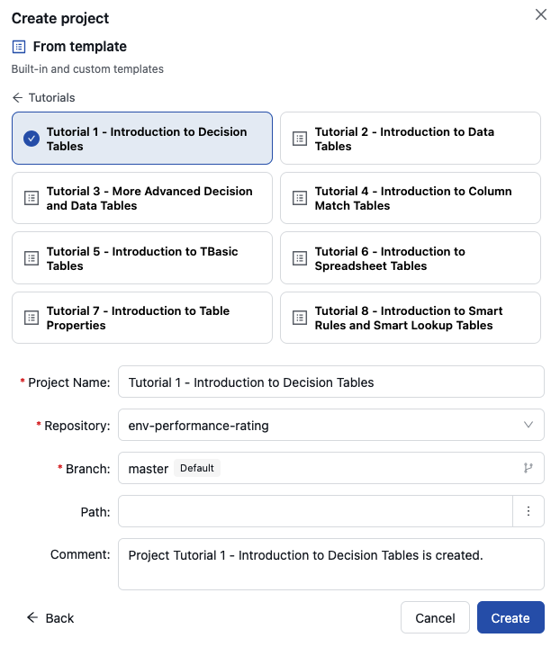
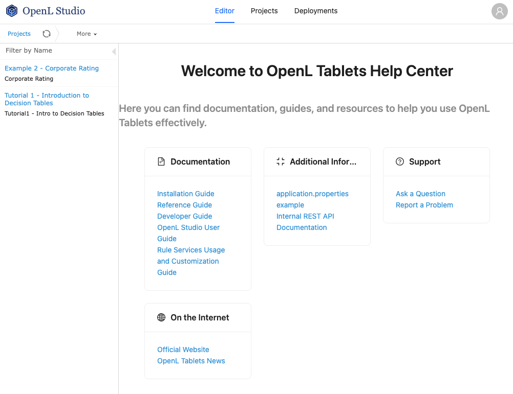

### Tutorials and Examples

OpenL Tablets provides a number of preconfigured projects developed for new users who want to learn working with OpenL Tablets quickly.

These projects are organized into following groups:

-   [Tutorials](#tutorials)
-   [Examples](#examples)

#### Tutorials

OpenL Tablets provides a set of the tutorial projects demonstrating basic OpenL Tablets features starting from very simple and following with more advanced projects. Files in the tutorial projects contain detailed comments allowing new users to grasp basic concepts quickly.

The following tutorials are available:

| Tutorial   | Topic                                       |
|------------|---------------------------------------------|
| Tutorial 1 | Introduction to Decision Tables             |
| Tutorial 2 | Introduction to Data Tables                 |
| Tutorial 3 | More Advanced Decision and Data Tables      |
| Tutorial 4 | Introduction to Column Match Tables         |
| Tutorial 5 | Introduction to TBasic Tables               |
| Tutorial 6 | Introduction to Spreadsheet Tables          |
| Tutorial 7 | Introduction to Table Properties            |
| Tutorial 8 | Introduction to Smart Rules and Smart Lookup Tables |

To create a tutorial project, proceed as follows:

1.  In OpenL Studio, click **+ New Project** .

    The **Create project** dialog appears.

1.  Click **From template**.
1.  Click the **Tutorials** category.

    The tutorials listed above appear.

1.  Click the required tutorial.

    The **Project Name** and **Comment** fields are filled in automatically and can be changed.

    

    *Creating a tutorial project*

1.  Optionally, change the **Repository** and, for a branch-capable repository, the **Branch**. Both are filled in with defaults.
1.  Click **Create**.

    The project appears in the **Projects** list and is available for usage.

For more information on the other ways to create a project, see [OpenL Studio Guide > Creating a Project from Template](../../openl-studio/repository-editor.md#creating-a-project-from-template).

To open the project, in the top line menu, click **Editor**. It is highly recommended to start from reading Excel files for examples and tutorials which provide clear explanations for every step involved.

*Tutorial project in OpenL Studio*

#### Examples

In addition to tutorials, OpenL Tablets provides several example projects that demonstrate how OpenL Tablets can be used in various business domains.

To create an example project, follow the steps described in [Tutorials](#tutorials) but click the **Examples** category instead of **Tutorials**, and select an example to explore. When completed, the example appears in the OpenL Studio Editor.
