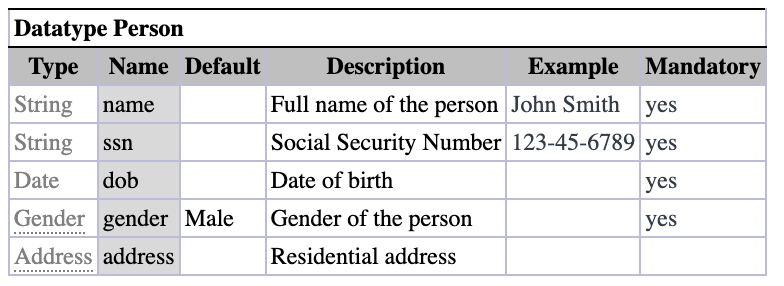
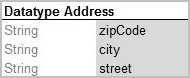
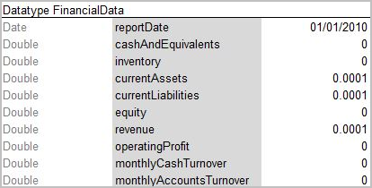
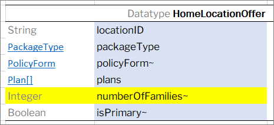
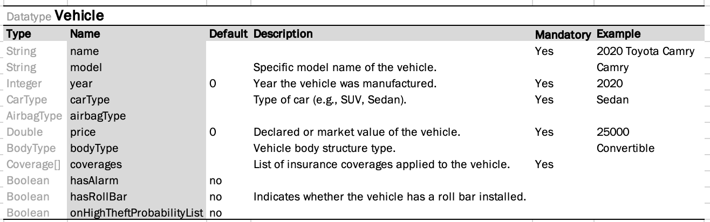
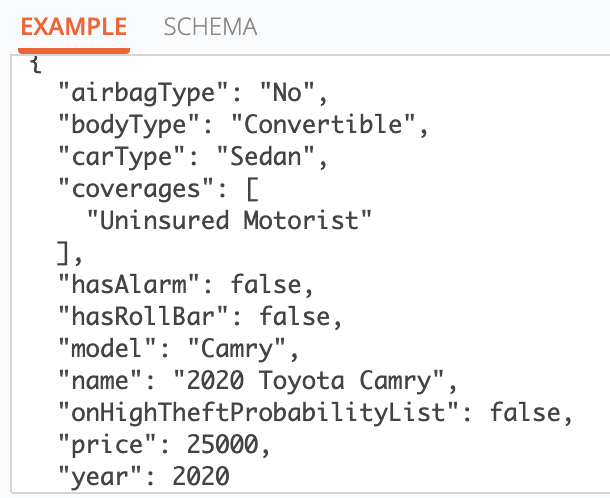
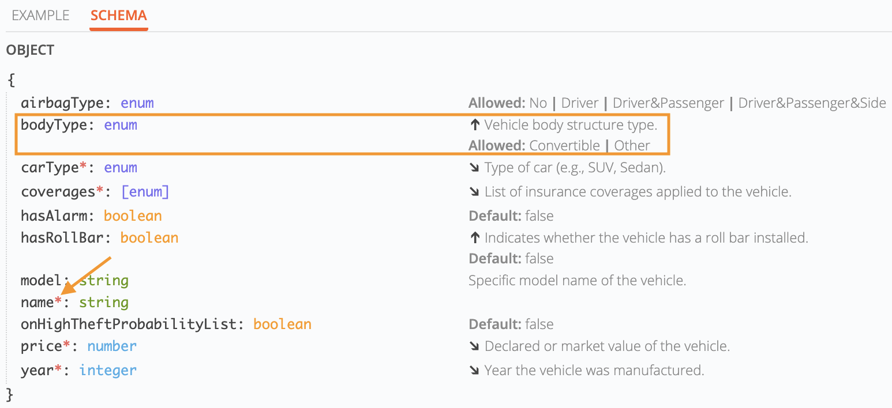

#### Datatype Table

This section describes datatype tables and includes the following topics:

-   [Introducing Datatype Tables](#introducing-datatype-tables)
-   [Inheritance in Data Types](02-inheritance-in-data-types.md#inheritance-in-data-types)
-   [Vocabulary Data Types](03-vocabulary-data-types.md#vocabulary-data-types)

##### Introducing Datatype Tables

A **Datatype table** defines an OpenL Tablets data structure. A Datatype table is used for the following purposes:

-   create a hierarchical data structure combining multiple data elements and their associated data types in hierarchy
-   define the default values
-   create vocabulary for data elements

A compound data type defined by Datatype table is called a **custom data type**. Datatype tables enable users to create their own data model which is logically suited for usage in a particular business domain.

For more information on creating vocabulary for data elements, see [Vocabulary Data Types](03-vocabulary-data-types.md#vocabulary-data-types).

A Datatype table has the following structure:

1.  The first row is the header containing the **Datatype** keyword followed by the name of the data type.
2.  After the first row, the remaining part of the table defines the attributes of that datatype. Each row represents a single attribute of the datatype. Each column provides a specific piece of information about that attribute.

    **Required columns:**

    -   **Type** — data type of the attribute.
    -   **Name** — name of the attribute.

    **Note:** While there are no special restrictions, usually an attribute type starts with a capital letter and attribute name starts with a small letter.

    **Optional columns:**

    -   **Default** — specifies a default value for the attribute.
    -   **Description** — provides context, purpose, or usage information.
    -   **Example** — gives a sample value to illustrate typical input.
    -   **Mandatory** — indicates whether the attribute is required. It does not perform any validation and is intended for informational purposes only. This field accepts Boolean values exclusively.

    The following table summarizes when column headers are required:

    | Columns Used | Column Headers Required |
    |---|---|
    | Type, Name | No |
    | Type, Name, Default | No |
    | Any additional columns (e.g., Description, Example, Mandatory) | Yes |

    **Note:** When column headers are present, all columns in a Datatype table may appear in any order. Optional columns can be included in any combination.

Consider the case when a hierarchical logical data structure must be created. The following example of a Datatype table defines a custom data type called **Person**. The table represents a structure of the **Person** data object and combines **Person's** data elements, such as name, social security number, date of birth, gender, and address.

*Datatype table Person*

*Datatype table Person with column headers*

Note that data attribute, or element, address of **Person** has, by-turn, custom data type **Address** and consists of zip code, city, and street attributes.

*Datatype table Address*

The following example extends the **Person** data type with default values for specific fields.

*Datatype table with default values*

The **Gender** field has the given value **Male** for all newly created instances if other value is not provided. If a value is provided, it has a higher priority over the default value and overrides it.

One attribute type can be used for many attribute names if their data elements are the same. For example, insuredGender and spouseGender attribute names may have Gender attribute type as the same list of values (Male, Female) is defined for them.

**Note for experienced users:** Java beans can be used as custom data types in OpenL Tablets. If a Java bean is used, the package where the Java bean is located must be imported using a configuration table as described in [Configuration Table](../09-configuration-table/01-configuration-table-description.md#configuration-table).

Consider an example of a Datatype table defining a custom data type called Corporation. The following table represents a structure of the Corporation data object and combines Corporation data elements, such as ID, full name, industry, ownership, and number of employees. If necessary, default values can be defined in the Datatype table for the fields of complex type when combination of fields exists with default values.

*Datatype table containing value \_DEFAULT\_*

FinancialData refers to the FinancialData data type for default values.

*Datatype table with defined default values*

During execution, the system takes default values from FinancialData data type.

*Datatype table with default values*

**Note:** For array types \_DEFAULT_creates an empty array.

**Note:** A default value can be defined for String fields of the Datatype table by assigning the "" empty string.

For more information on using runtime context properties in Datatype tables, see [Runtime Context Properties in Datatype Tables](../../04-table-properties/05-rule-versioning.md#runtime-context-properties-in-datatype-tables).

Datatype table output results can be customized the same way as spreadsheets as described in [Spreadsheet Result Output Customization](../03-spreadsheet-table/06-spreadsheet-result-output-customization.md#spreadsheet-result-output-customization).

If a spreadsheet returns a data type rather than SpreadsheetResult and the attributes of this data type must be filtered, that is, included or excluded from the final output structure, attributes of this data type must be marked with ~ or *. An example is available in [Introducing Datatype Tables](https://openldocs.readthedocs.io/en/latest/documentation/guides/reference_guide/#introducing-datatype-tables).

*Filtering data type attributes for the output structure*

If a datatype is used as an input or output in a rule exposed as an API endpoint, its optional fields — if provided — are shown in the API specification.

*Datatype Vehicle table with optional columns*

*Example of how values from a Datatype table are displayed in the API schema.*

-   Example values are retrieved from the Example column and used to illustrate the expected data format for each attribute.
-   Descriptions are extracted from the Description column, as shown in the Schema screenshot. These are displayed in the API schema to provide additional context for each field.
-   Default value, along with a list of Allowed values (when applicable), is presented within a collapsible section under an expandable arrow icon.
-   Fields marked as Mandatory are indicated with an asterisk (*) in the schema view, helping users identify required fields at a glance.
