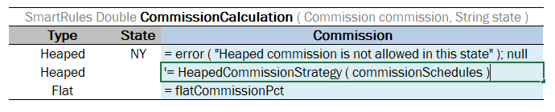

##### Calling a Table from Another Table

When one table’s results are required for calculation in another table, the first table can be called using `‘= TableName ( <inputParameter1 attribute name>, <inputParameter2 attribute name>, <inputParameterN attribute name> ) `where input parameters can be retrieved as follows:

-   from the current table
-   specifically declared as in the following ChildBenefitRate table example
-   calculated using expressions, that is, formulas or by calling other rules

The input parameter attribute type is not specified when calling a nested rule.

In the following example, a nested rule table **HeapedCommissionStrategy** is called from the **CommissionCalculation** smart rule table.

*Calling a nested rule table from a rule table*

The return value type of the nested rule table must match the return value type of the current rule table.

Sometimes specific values must be sent to the nested table. In this case, input parameter values can be specified as follows:

-   decalred in the quatation marks “” for String values
-   set to true or false for Boolean values
-   provided as a number for Double and Integer values
-   set to null for empty values

For example, usually the detailed information about children is not included in the insurance policy and so default values are used to get the rates:

*Declaring specific inputs when calling a nested rule table*

