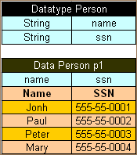
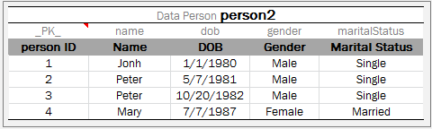
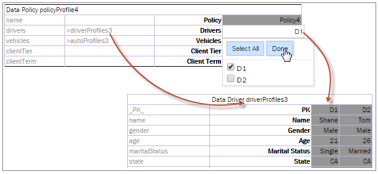

##### Using Advanced Data Tables

Advanced data tables are used for storing information of a complex structure, such as custom data types and arrays. For more information on data types, see [Datatype Table](../01-datatype-table/01-introducing-datatype-tables.md#datatype-table).

1.  The first row of an advanced data table contains text in the following format:

    `Data <data type> <data table name>`

1.  Each cell in the second row contains an attribute name of the data type.

    For an array of objects, the [i] syntax can be used to define an array of simple datatypes, and [i]. \<attributeName\> to define an array of custom datatypes.

1.  The third row contains attribute display names.
2.  Each row starting from the fourth one contains values for specific data rows.

The following diagram displays a datatype table and a corresponding data table with concrete values below it.



*Datatype table and a corresponding data table*

**Note:** There can be blank cells left in data rows of the table. In this case, OpenL Tablets considers such data as non-existent for the row and does not initialize any value for it, that is, there will be a **null** value for attributes or even **null** for the array of values if all corresponding cells for them are left blank.

There might be a situation when a user needs a Data table column with unique values, while other columns contain values that are not unique. In this case, add a column with the predefined \_PK\_ attribute name, standing for the primary key. It is called an **explicit definition** of the primary key.



*A Data table with unique \_PK\_ column*

If the \_PK\_ column is not defined, the first column of the table is used as a primary key. This is called an **implicit definition** of the primary key.



*Referring from one Data table to another using a primary key*

A user can call any value from a data table using the following syntax:

```
<datatable name>[<number of row>] Example: testcars[0]
<datatable name>["<value of the first datatype field>"] Example: testcars["BMW 35"]
```

A text index returns the first row whose first datatype field equals the text, or null if no row matches. The primary
key is not used here: the \_PK\_ column, or the first column of a table without it, identifies rows only for references
from other tables, as described in [Ensuring Data Integrity](05-ensuring-data-integrity.md#ensuring-data-integrity). A
row whose first field value is not unique is available by its row number. For more information on indexes, see
[Working with Arrays from Rules](../../../03-functions-and-data-types/04-working-with-arrays.md#working-with-arrays-from-rules).
