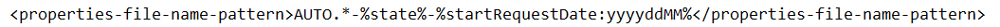

#### Properties Defined in the File Name

**Module level properties**, or table properties applied to all tables of a module, can be defined in the module file name. These properties are usually specified when the logic of the whole project must be split by certain major parameters, such as country, state, or date. The following conditions must be met for such properties definition:

-   A file name pattern is configured directly in a rules project descriptor, in the `rules.xml` file, as the `properties-file-name-pattern `tag, or via OpenL Studio as **Properties pattern for a file name** in the **Project** page.
-   The module file name matches the pattern.

The file name pattern can include the following:

-   text symbols
-   table property names enclosed in ‘%’ marks

    Multiple properties can be defined under one pattern and then parsed into different properties. For example, the .\*-%lob%-%effectiveDate,startRequestDate:ddMMyyyy%-%state% pattern allows a user to parse effectiveDate and start RequestDate property values.

-   wildcards, or characters that may be substituted for any of a defined subset of all possible characters

For more information on wildcards that can be used in a pattern as regular expressions, see <https://docs.oracle.com/en/java/javase/11/docs/api/java.base/java/text/SimpleDateFormat.html>.

If a table property value is supposed to be a date, the **Date** format must be specified right after the property name and colon as follows:

```
...<text>%<property name>%<text>%<property name>:<date format>%...
```

**Example:** .\*-%state%-%effectiveDate %-%startRequestDate %

In this example, the project name or any other text comes instead of .\*. Any part of this pattern can be replaced, removed, or its order can be changed. For more information on properties that can be included, see [Business Dimension Properties](../../04-table-properties/05-rule-versioning.md#business-dimension-properties).

For more information on date formats description and examples, see <https://docs.oracle.com/en/java/javase/11/docs/api/java.base/java/text/SimpleDateFormat.html>.

The default date format is yyyyMMdd.

File name pattern definition can use wildcards. For example, the .\*`-%`startRequestDate`:MMddyyyy% `pattern is defined. Then for the `AUTO-01012013.xls` file name, the module property **Start Request Date = 01 Jan 2013** is retrieved and the first part of the file name with the text is ignored as `.*` stands for any symbols.

In the following example, the **Bank Rating** project is configured in the way so that a user can specify the **US State** and **Start Request Date** properties values using the module file name:


*File name pattern configured via OpenL Studio*



*File name pattern in a rules project descriptor directly*

Multiple patterns can be used for a file name, for example, to process module names differently. In this case, first, modules are compared to the first pattern, then the modules that did not match the first pattern and compared to the next pattern and so on.

For instance, for the **Bank Rating** project module with the file name `AUTO-FL-01012014.xlsx,` the module properties **US State= ‘Florida’**, **Start Request Date = 01 Jan 2014** will be retrieved and inherited by module tables.

If a file name does not match the pattern, module properties are not defined.

To view detailed information about the properties added to the file name pattern, click information icon next to the **Properties pattern for a file name** field.


*Properties file name pattern description*

The same property cannot be defined both in a file name and **Properties** table of the module.

For the **lob, caProvinces, lang, country, currency, usregion**, and **state** properties, multiple comma-separated values can be defined in the file name for usage. An example for three LOB and two states is as follows:

`Product-CRV,MTH,STR-rules-01022018-01022018-OK,PR.xlsx`

A template for this example is as follows: `.*-%lob%-.*-%effectiveDate:ddMMyyyy%-%startRequestDate:ddMMyyyy%-%state% `

`Properties are stored not as single values, but as arrays of values.`

**Note for experienced users:** This section describes default implementation of properties definition in the file name. To use a custom implementation, specify the required file name processor class in a rules project descriptor. When the **Custom file name processor** check box is selected, the **File name processor class** field is displayed.


*Custom file name processor class*
