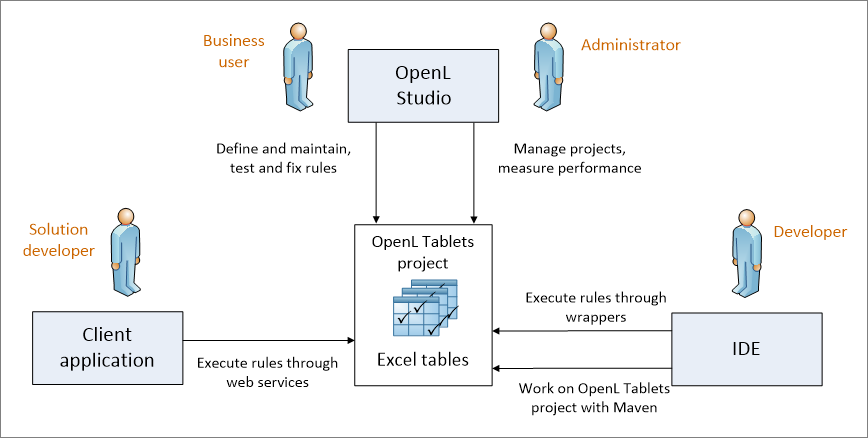

### System Overview

The following diagram displays how OpenL Tablets is used by different types of users.

*OpenL Tablets overview*

A typical lifecycle of an OpenL Tablets project is as follows:

1.  A business analyst creates an OpenL Tablets project in OpenL Studio.
2.  Optionally, development team may provide the analyst with a project in case of complex configuration.
3.  The business analyst creates correctly structured tables in Excel files based on requirements and includes them in the project.
    
    Typically, this task is performed through Excel or OpenL Studio in a web browser.
    
1.  Business analyst performs unit and integration tests by creating test tables and performance tests on rules through OpenL Studio.
    
    As a result, fully working rules are created and ready to be used.
    
1.  Development team creates other parts of the solution and employs business rules directly through the OpenL Tablets engine or remotely through web services.
2.  Whenever required, a business user updates or adds new rules to project tables.

OpenL Tablets business rules management applications, such as OpenL Studio, Rules Repository, and OpenL Rule Services, can be set up to provide self-service environment for business user changes.
