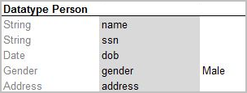
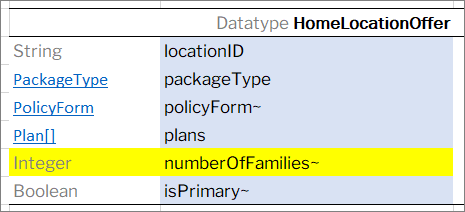

#### Datatype Table

This section describes datatype tables and includes the following topics:

-   [Introducing Datatype Tables](#introducing-datatype-tables)
-   [Inheritance in Data Types](02-inheritance-in-data-types.md#inheritance-in-data-types)
-   [Vocabulary Data Types](03-vocabulary-data-types.md#vocabulary-data-types)

##### Introducing Datatype Tables

A **Datatype table** defines an OpenL Tablets data structure. A Datatype table is used for the following purposes:

-   create a hierarchical data structure combining multiple data elements and their associated data types in hierarchy
-   define the default values
-   create vocabulary for data elements

A compound data type defined by Datatype table is called a **custom data type**. Datatype tables enable users to create their own data model which is logically suited for usage in a particular business domain.

For more information on creating vocabulary for data elements, see [Vocabulary Data Types](03-vocabulary-data-types.md#vocabulary-data-types).

A Datatype table has the following structure:

1.  The first row is the header containing the **Datatype** keyword followed by the name of the data type.
2.  Every row, starting with the second one, represents one attribute of the data type.
    
    The first column contains attribute types, and the second column contains corresponding attribute names.
    
    **Note:** While there are no special restrictions, usually an attribute type starts with a capital letter and attribute name starts with a small letter.
    
1.  The third column is optional and defines default values for fields.

Consider the case when a hierarchical logical data structure must be created. The following example of a Datatype table defines a custom data type called **Person**. The table represents a structure of the **Person** data object and combines **Person’s** data elements, such as name, social security number, date of birth, gender, and address.

*Datatype table Person*

Note that data attribute, or element, address of **Person** has, by-turn, custom data type **Address** and consists of zip code, city, and street attributes.

*Datatype table Address*

The following example extends the **Person** data type with default values for specific fields.

*Datatype table with default values*

The **Gender** field has the given value **Male** for all newly created instances if other value is not provided. If a value is provided, it has a higher priority over the default value and overrides it.

One attribute type can be used for many attribute names if their data elements are the same. For example, insuredGender and spouseGender attribute names may have Gender attribute type as the same list of values (Male, Female) is defined for them.

**Note for experienced users:** Java beans can be used as custom data types in OpenL Tablets. If a Java bean is used, the package where the Java bean is located must be imported using a configuration table as described in [Configuration Table](../09-configuration-table/01-configuration-table-description.md#configuration-table).

Consider an example of a Datatype table defining a custom data type called Corporation. The following table represents a structure of the Corporation data object and combines Corporation data elements, such as ID, full name, industry, ownership, and number of employees. If necessary, default values can be defined in the Datatype table for the fields of complex type when combination of fields exists with default values.

*Datatype table containing value \_DEFAULT\_*

FinancialData refers to the FinancialData data type for default values.

*Datatype table with defined default values*

During execution, the system takes default values from FinancialData data type.

*Datatype table with default values*

**Note:** For array types \_DEFAULT_creates an empty array.

**Note:** It is strongly recommended to leave an empty column right after the third column with default values if such column is used. Otherwise, in case the data type has 3 or less attributes, errors occur due to transposed tables support in OpenL Tablets.

*Datatype table with comments nearby*

**Note:** A default value can be defined for String fields of the Datatype table by assigning the "" empty string.

For more information on using runtime context properties in Datatype tables, see [Runtime Context Properties in Datatype Tables](../../04-table-properties/05-rule-versioning.md#runtime-context-properties-in-datatype-tables).

Datatype table output results can be customized the same way as spreadsheets as described in [Spreadsheet Result Output Customization](../03-spreadsheet-table/06-spreadsheet-result-output-customization.md#spreadsheet-result-output-customization).
  
If a spreadsheet returns a data type rather than SpreadsheetResult and the attributes of this data type must be filtered, that is, included or excluded from the final output structure, attributes of this data type must be marked with ~ or *. An example is available in [Introducing Datatype Tables](https://openldocs.readthedocs.io/en/latest/documentation/guides/reference_guide/#introducing-datatype-tables).
  

*Filtering data type attributes for the output structure*

