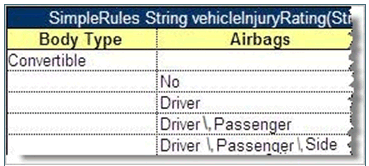

##### Ranges and Arrays in Smart and Simple Decision Tables

Range and array data types can be used in simplified and smart rules and lookup tables. If a condition is represented as an array or range, the rule is executed for any value from that array or range. As an example, in the following image, there is the same Car Price for all regions of Belarus and Great Britain, so, using an array, three rows for each of these countries can be replaced by a single one as displayed in the following table.

*Simple lookup table with an array*

If a string value contains a comma, the value must be delimited with the backslash (\\) separator followed by a comma as illustrated for **Driver\\, Passenger\\, Side** in the following example. Otherwise, it is treated as an array of string elements.

*Comma within a string value in a Simple Rule table*

The following example explains how to use a range in a simple rules table.

*Simple rules table with a Range*

OpenL looks through the **Condition** column, that is, **ZIP Code**, meets a range, which is not necessarily the first one, and defines that all the data in the column are IntRange, where Integer is defined in the header, **Integer vehicleZip**.

Simple and smart rules and smart lookup tables support using arrays of ranges. In the following example, the Z100-Z105, Z107, Z109 condition is a string range array where single elements Z107, Z109 are treated by system as ranges Z107-Z107, Z109-Z109.

*Using arrays of ranges in a table*

**Note:** String ranges are only supported in smart rules tables. For more information on range data types in OpenL Tablets, see [Range Data Types](../../../03-openl-tablets-functions-and-supported-data-types/02-working-with-data-types.md#range-data-types).

