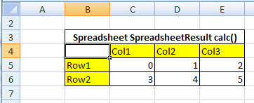
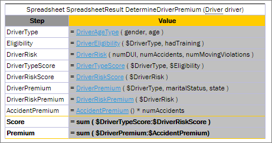

#### Spreadsheet Table

In OpenL Tablets, a **spreadsheet** table is an analogue of the Excel table with rows, columns, formulas, and calculations as contents even though none of Excel formulas are used in OpenL Tables. Spreadsheets can also call decision tables or other executable tables to make decisions on values, and based on those, make calculations.

The format of the spreadsheet table header is as follows:

```
Spreadsheet SpreadsheetResult <table name> (<input parameters>)
```

or

```
Spreadsheet <return type> <table name> (<input parameters>)
```

The following table describes the spreadsheet table header syntax:

| Element              | Description                                                                                                                                                                                                                                   |
|----------------------|-----------------------------------------------------------------------------------------------------------------------------------------------------------------------------------------------------------------------------------------------|
| Spreadsheet          | Reserved word that defines the type of the table.                                                                                                                                                                                             |
| SpreadsheetResult    | Type of the return value. SpreadsheetResult returns the calculated content of the whole table.                                                                                                                                                |
| \<return type\>      | Data type of the returned value. If only a single value is required, its type must be defined here as a return data type and calculated <br/>in the row or column named RETURN, or in the last row or column if the RETURN keyword is not defined. |
| \<table name\>       | Valid name of the table as for any executable table.                                                                                                                                                                                          |
| \<input parameters\> | Input parameters as for any executable table.                                                                                                                                                                                                 |

The first column and row of a spreadsheet table, after the header, make the table column and row names. Values in other cells are the table values. An example is as follows.



*Spreadsheet table organization*

It is common practice to create a spreadsheet table with two columns only: **Step** where business step names are specified, and **Formula** containing action description. A spreadsheet table cell can contain:

-   simple values, such as a string or numeric values
-   values of other data types
-   formulas, which can be mathematical expressions, rule calls, and other operators or functions

Formulas are preceded by an apostrophe followed by = if editing a table in Excel, or directly with = if editing a table in OpenL Studio.

-   another cell value or a range of another cell values referenced in a cell formula

The following table describes how a cell value can be referenced in a spreadsheet table.

| Cell name             | Reference       | Description                                                   |
|-----------------------|-----------------|---------------------------------------------------------------|
| `$columnName`         | By column name. | Used to refer to the value of another column in the same row. |
| `$rowName`            | By row name.    | Used to refer to the value of another row in the same column. |
| `$columnName$rowName` | Full reference. | Used to refer to the value of another row and column.         |

For more information on how to specify a range of cells, see [Using Ranges in Spreadsheet Table](03-using-ranges-in-spreadsheet-table.md#using-ranges-in-spreadsheet-table). Below is an example of a spreadsheet table with different calculations for an auto insurance policy. Table cells contain simple values, formulas, references to the value of another cell, and other information.


*Spreadsheet table with calculations as content*

The data type for each cell can be determined by OpenL Tablets automatically or it can be defined explicitly for each row or column. The data type for a whole row or column can be specified using the following syntax:

```
<column name or row name> : <data type>
```

**Note:** If both column and row of the cell have a data type specified, the data type of the column is taken.

In OpenL Rule Services, spreadsheet output can be customized by adding or removing rows and columns to display as described in [Spreadsheet Result Output Customization](06-spreadsheet-result-output-customization.md#spreadsheet-result-output-customization).

The following topics are included in this section:

-   [Parsing a Spreadsheet Table](#parsing-a-spreadsheet-table)
-   [Accessing Spreadsheet Result Cells](02-accessing-spreadsheet-result-cells.md#accessing-spreadsheet-result-cells)
-   [Using Ranges in Spreadsheet Table](03-using-ranges-in-spreadsheet-table.md#using-ranges-in-spreadsheet-table)
-   [Auto Type Discovery Usage](04-auto-type-discovery-usage.md#auto-type-discovery-usage)
-   [Custom Spreadsheet Result](05-custom-spreadsheet-result.md#custom-spreadsheet-result)
-   [Spreadsheet Result Output Customization](06-spreadsheet-result-output-customization.md#spreadsheet-result-output-customization)
-   [Testing Spreadsheet Result](07-testing-spreadsheet-result.md#testing-spreadsheet-result)

##### Parsing a Spreadsheet Table

OpenL Tablets processes spreadsheet tables in two different ways depending on the return type:

1.  A spreadsheet returns the result of **SpreadsheetResult** data type.
2.  A spreadsheet returns the result of any other data type different from **SpreadsheetResult**.

In the first case, users get the value of SpreadsheetResult type that is an analog of result matrix. All calculated cells of the spreadsheet table are accessible through this result. The following example displays a spreadsheet table of this type.

  


*Spreadsheet table returns the SpreadsheetResult datatype*

In the second case, the returned result type is a data type as in all other rule tables, so there is no need for **SpreadsheetResult** in the rule table header. The value of the last row, or the latest one if there are several columns, is returned. OpenL Tablets calculates line by line as follows:


*Spreadsheet table returning a single value*

