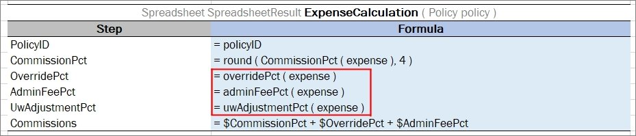

##### Referencing Attributes

To address an attribute of an object in a rule, use the following syntaxes:

-   \<object name\>.\<attribute name\>
    
    
    
    *Defining an object attribute*
    
-   \<attribute name\> (\<object name\>)
    
    
    
    *Defining an object attribute*
    
The following rules apply:

-   When a complex object is used as an input parameter in a rule, it is recommended to use a simplified reference without the input parameter name to address the direct attributes of this object.
-   If input parameters do not have objects with the same attributes, the input parameter name can be omitted in the reference.
-   If a complex object X is used as an input parameter in a rule, and this object has complex object Y as its attribute, when referencing object Y attributes in a rule, the input parameter name of the object X can be omitted.

An example of a redundant reference as follows:

*A spreadsheet with a redundant reference*

A full reference is redundant here and can be omitted as numberOfFamilies is an attribute of the policyEndorsementForm input paramter. The correct way to use the reference is as follows:

*A spreadsheet with correct reference*

An example of referencing an attribute of a complex object that is an attribute of a complex object input parameter is as follows:

*A model describing complex objects structure and their attributes*

*A rule that is using reference to the attributes of the nested complex object*

In this example, the input parameter in the rule is a complex object Policy, and one of its attributes is a complex object Plan. The Plan object includes its own attributes where one of them, Coverage, is a complex object as well.

Part of the rule logic is to check rate basis across all plans and coverages to make sure it is the same across all policy. To get to the rate basis attribute from the Policy object, go 2 levels down and omit the Policy level as Policy is already used as an input parameter: Plan (1st level down) \> Coverage (2nd level down).

policyNumber, situsState do not have the policy.situsState reference as they are direct attributes of Policy. This means omitting input parameter reference of the top level.

The same syntax can be used in the array of objects, for example, cars.model or model(cars). The models of all cars in the received array are returned.

