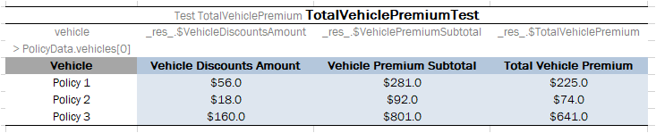

##### Ensuring Data Integrity

If a data table contains values defined in another data table, it is important to specify this relationship. The relationship between two data tables is defined using **foreign keys**, a concept that is used in database management systems. Reference to another data table must be specified in an additional row below the row where attribute names are entered. The following format must be used:

`> <referenced data table name> <column name of the referenced data table>`

In the following example, the **cities** data table contains values from the **states** table. To ensure that correct values are entered, a reference to the **code** column in the **states** table is defined.

*Defining a reference to another data table*

If an invalid state abbreviation is entered in the **cities** table, OpenL Tablets reports an error.

The target column definition is not required if it is the first column or \_PK\_ column in the referenced data table. For example, if a reference is made to the **name** column in the **states** **table**, the following simplified reference can be used:

`>states`

If a data table contains values defined as a part of another data table, the following format can be used:

`> <referenced data table name>.<attribute name> <column name>`

The difference from the previous format is that an attribute name of the referenced data table, which corresponding values are included in the other data table, is specified additionally.

If `<column name>` is omitted, the reference by default is constructed using the first column or \_PK\_ column of the referenced data table.

In the following diagram, the **claims** data table contains values defined in the **policies** table and related to the **vehicle** attribute. A reference to the **name** column of the **policies** table is omitted as this is the first column in the table.

*Defining a reference to another data table*

**Note:** To ensure that correct values are provided, cell data validation lists can be used in Excel, thus limiting the range of values that can be entered.

**Note:** The same syntax of data integration is applicable to the input values or expected result values definition in the Test and Run tables.

**Note:** The attribute path can be of any arbitrary depth, for example, `>policies.coverage.limit`.

If the array is stored in the field object of the data table, array elements can be referred. An example is as follows.

*Referring array elements in a test table*
