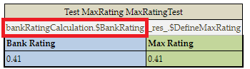

##### Creating a Test Table for a Spreadsheet or Decision Table with SpreadsheetResult as Input Parameter

To create a test table for a spreadsheet or decision table that has another SpreadsheetResult as an input parameter, define the test table input as follows:

\<Input_name\>.\$\<column_name\>\$\<row_name\>

\<Input_name\> is the name of the input parameter. Spreadsheetresult, column_name, and row_name are names from the spreadsheet table used as input for a table to be tested.

Consider the following spreadsheet table.

*Sample spreadsheet table*

There is also one more spreadsheet table that uses fields from the first spreadsheet table.

*Another spreadsheet table referencing fields of the first spreadsheet table*

The following syntax is used to define the bankRatings value from SpreadsheetResult BankRatingCalculation as input for the test table.

*A test table for a spreadsheet table with SpreadsheetResult as input parameter*

