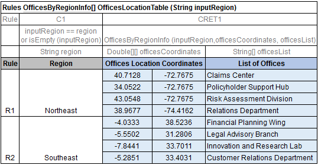

##### Representing Values of Different Types

The following sections describe how to present some values – list or range of numbers, dates, logical values – in OpenL table cells. The following topics are included in this section:

-   [Representing Arrays](#representing-arrays)
-   [Representing Date Values](#representing-date-values)
-   [Representing Boolean Values](#representing-boolean-values)
-   [Representing Range Types](#representing-range-types)

###### Representing Arrays

For all tables that have properties of the `enum[]` type or fields of the array type, arrays can be defined as follows:

-   horizontally
-   vertically
-   as comma separated arrays

The first option is to arrange array values horizontally using multiple subcolumns. The following is an example of this approach:

*Arranging array values horizontally*

In this example, the contents of the `set` variable for the first rule are `[1,3,5,7,9],` and for the second rule, `[2,4,6,8]`. Values are read from left to right.

The second option is to present parameter values vertically as follows:

*Arranging array values vertically*

In the second case, the boundaries between rules are determined by the height of the leftmost cell. Therefore, an additional column must be added to the table to specify boundaries between arrays.

In both cases, empty cells are not added to the array.

The third option is to define an array by separating values by a comma. If the value itself contains a comma, it must be escaped using back slash symbol “`\`”` `by putting it before the comma.

*Array values separated by comma*

In this example, the array consists of the following values:

-   test 1
-   test 3, 4
-   test 2

*Array values separated by comma. The second example*

In this example, the array consists of the following values:

-   value1
-   value2
-   value3

Two-dimensional arrays can be used in rules tables, where mixing values and expressions in arrays is allowed. An example is as follows:

*Using two-dimensional arrays in a rules table*

###### Representing Date Values

To represent date values in table cells, either Excel format or one of the following format must be used for the text:
* `<year>-<month>-<date>` (ISO 8601)
* `<month>/<date>/<year>` (US)

Note: In Excel, inputted text can be treated as a date and converted into Excel's date format. To prevent this, it's necessary to precede the text with an apostrophe to signify that it should be treated as text. Excel recognizes these values as simple text and does not automatically convert them into a date format.

The following are valid date value examples:
* `1980-07-12`
* `5/7/1981`
* `10/20/2002`

OpenL Tablets recognizes all Excel date formats.

###### Representing Boolean Values

OpenL Tablets supports either Excel Boolean format or the following formats of Boolean values as a text:

-   true, yes, y
-   false, no, n

OpenL Tablets recognizes the Excel Boolean value, such as native Excel Boolean value TRUE or FALSE. For more information on Excel Boolean values, see Excel help.

###### Representing Range Types

In OpenL, the following data types are designed to work with ranges:

-   IntRange
-   DoubleRange

For more information on these data types used for ranges, see [Range Data Types](../../../03-openl-tablets-functions-and-supported-data-types/02-working-with-data-types.md#range-data-types).

*Decision table with IntRange*

**Note:** Be careful with using `Integer.MAX_VALUE` in a decision table. If there is a range with the border `max_number `equals to `Integer.MAX_VALUE`, for example, `[100; 2147483647]`, it is not included to the range. This is a known limitation.

