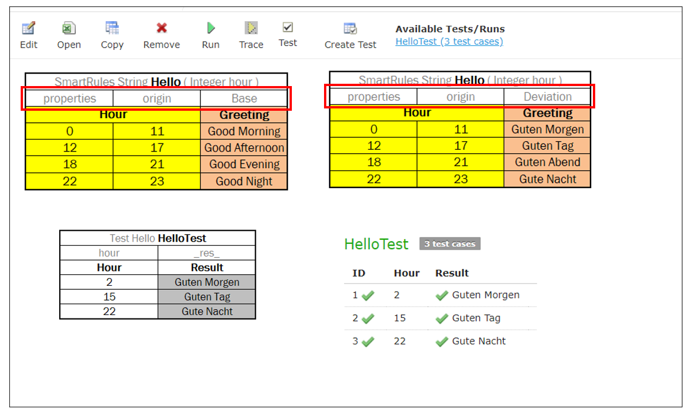
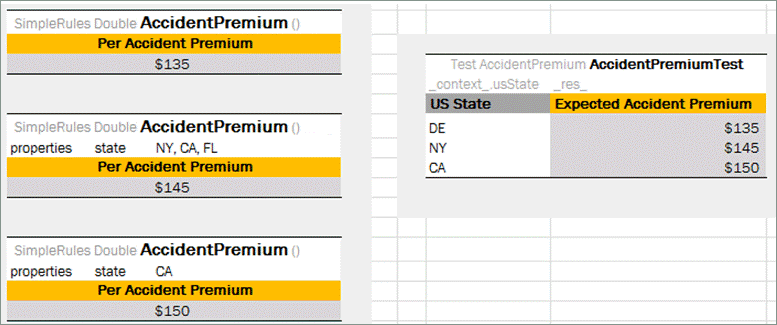
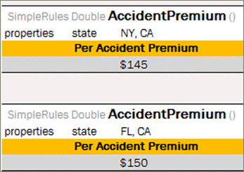

#### Rule Versioning

In OpenL Tablets, business rules can be versioned in different ways using properties as described in [Table Properties](../../04-table-properties/01-category-and-module-level-properties.md#table-properties). This section describes the most popular versioning properties:

| Property                                                        | Description                                                                                                                                                                     |
|-----------------------------------------------------------------|---------------------------------------------------------------------------------------------------------------------------------------------------------------------------------|
| [Business Dimension Properties](../../04-table-properties/05-rule-versioning.md#business-dimension-properties) | Targets advanced rules usage when several rule sets are used simultaneously. <br/>This versioning mechanism is more extendable and flexible.                                         |
| [Active Table](../../04-table-properties/05-rule-versioning.md#active-table)                                | Is more suitable for “what-if” analysis. <br/>It allows storing the previous versions of rule tables in an inactive status in a project to track changes or for any other reference. |

##### Business Dimension Properties

This section introduces the **Business Dimension** group properties and includes the following topics:

-   [Introducing Business Dimension Properties](../../04-table-properties/05-rule-versioning.md#introducing-business-dimension-properties)
-   [Using Effective and Expiration Date](../../04-table-properties/05-rule-versioning.md#using-effective-and-expiration-date)
-   [Using a Request Date](../../04-table-properties/05-rule-versioning.md#using-a-request-date)
-   [Using an Origin Property](../../04-table-properties/05-rule-versioning.md#using-an-origin-property)
-   [Overlapping of Properties Values for Versioned Rule Tables](../../04-table-properties/05-rule-versioning.md#overlapping-of-properties-values-for-versioned-rule-tables)
-   [Rules Runtime Context](../../04-table-properties/05-rule-versioning.md#rules-runtime-context)
-   [Runtime Context Properties in Datatype Tables](../../04-table-properties/05-rule-versioning.md#runtime-context-properties-in-datatype-tables)

###### Introducing Business Dimension Properties

The properties of the **Business Dimension** group are used to version rules by *property values*. This type of versioning is typically used when there are rules with the same meaning applied under different conditions. In their projects, users can have as many rules with the same name as needed; the system selects and applies the required rule by its properties. For example, calculating employees’ salary for different years can vary by several coefficients, have slight changes in the formula, or both. In this case using the **Business Dimension** properties enables users to apply appropriate rule version and get proper results for every year.

The following table types support versioning by Business Dimension properties:

-   Decision tables, including rules, simple rules, smart rules, simple lookups, and smart lookup tables
-   Spreadsheet
-   TBasic
-   Method
-   ColumnMatch

**Note:** Test, Datatype, and Data table types cannot be versioned.

When dealing with almost equal rules of the same structure but with slight differences, for example, with changes in any specific date or state, there is a very simple way to version rule tables by Business Dimension properties. Proceed as follows:

1.  Take the original rule table and set Business Dimension properties that indicate by which property the rules must be versioned.
    
    Multiple Business Dimension properties can be set.
    
1.  Copy the original rule table, set new dimension properties for this table, and make changes in the table data as appropriate.
2.  Repeat steps 1 and 2 if more rule versions are required.

Now the rule can be called by its name from any place in the project or application. If there are multiple rules with the same name but different Business Dimension properties, OpenL Tablets reviews all rules and selects the corresponding one according to the specified context variables or, in developers’ language, by runtime context values.
  
**Note: **When creating a versioned rule, keep the input parameter name exactly the same as in the original rule. This is required for backward compatibility.

The following table contains a list of **Business Dimension** properties used in OpenL Tablets:

| Property                     | Name to be used <br/>in rule tables  | Name to be <br/>used in context | Level to define <br/>a property at | Type     | Description                                                                                                                                                                                                                                                      |
|------------------------------|---------------------------------|----------------------------|------------------------------------------|----------|------------------------------------------------------------------------------------------------------------------------------------------------------------------------------------------------------------------------------------------------------------------|
| Effective / <br/>Expiration dates | - effectiveDate <br/>- expirationDate    | currentDate                | Module Category Table                    | Date     | Time interval within which a rule table is active. <br/>The table becomes active on the effective date and inactive <br/>after the expiration date. <br/>Multiple instances of the same table can exist in the same <br/>module with different effective and expiration date ranges. |
| Start / <br/>End Request dates    | - startRequestDate <br/>- endRequestDate | requestDate                | Module Category Table                    | Date     | Time interval within which a rule table is introduced <br/>in the system and is available for usage.                                                                                                                                                                  |
| LOB <br/>(Line of Business)       | lob                             | lob                        | Module Category Table                    | String[] | LOB for a rule table, that is, business area for which <br/>the given rule works and must be used.                                                                                                                                                                    |
| US Region                    | usregion                        | usRegion                   | Module Category Table                    | Enum[]   | US regions for which the table works and must be used.                                                                                                                                                                                                           |
| Countries                    | country                         | country                    | Module Category Table                    | Enum[]   | Countries for which the table works and must be used.                                                                                                                                                                                                            |
| Currency                     | currency                        | currency                   | Module Category Table                    | Enum[]   | Currencies for which the table works and must be used.                                                                                                                                                                                                           |
| Language                     | lang                            | lang                       | Module Category Table                    | Enum[]   | Languages for which this table works and must be used.                                                                                                                                                                                                           |
| US States                    | state                           | usState                    | Module Category Table                    | Enum[]   | US states for which this table works and must be used.                                                                                                                                                                                                           |
| Canada Province              | caProvinces                     | caProvince                 | Module Category Table                    | Enum[]   | Canada provinces of operation to use the table for.                                                                                                                                                                                                  |
| Canada Region                | caRegions                       | caRegion                   | Module Category Table                    | Enum[]   | Canada regions of operation to use the table for.                                                                                                                                                                                                    |
| Region                       | region                          | region                     | Module Category                          | Enum[]   | Economic regions for which the table works and <br/>must be used.                                                                                                                                                                                                     |
| Origin                       | origin                          |                            | Module Category Table                    | Enum     | Origin of rule to enable hierarchy of more generic <br/>and more specific rules.                                                                                                                                                                                      |
| Nature                       | nature                          | nature                     | Module Category Table                    | String   | Property of any kind holding user-defined <br/>business meaning.                                                                                                                                                                                                      |

The table properties can be obtained using the following syntax:

| Variable                     | Description                     |
|------------------------------|---------------------------------|
| **$properties** | Returns the object containing all properties of the current table, for example, the effective date of the rules version <br/>that OpenL determines according to the context data or effective date of the next rule set if such rule set exists. <br/>To access a particular property, use the $properties.usState syntax.  |
| **$dispatchingProperties** | Returns an array of property objects for all tables with the same signature, that is, all tables used in the dispatching logic.     |

**Example:** Use setTime(date,0,0,0,0) for testing endRequestDate or expirationDate as follows:
=setTime($properties.endRequestDate, 0, 0,0,0)  	
  
**Note for experienced users:** A particular rule can be called directly regardless of its dimension properties and current runtime context in OpenL Tablets. This feature is supported by setting the ID property as described in [Dev Properties](../../04-table-properties/07-dev-properties.md#dev-properties), in a specific rule, and using this ID as the name of the function to call. During runtime, direct rule is executed avoiding the mechanism of dispatching between overloaded rules.

For more information on using attributes for runtime context definition, see [Runtime Context Properties in Datatype Tables](../../04-table-properties/05-rule-versioning.md#runtime-context-properties-in-datatype-tables).

Illustrative and very simple examples of how to use Business Dimension properties are provided further in the guide on the example of **Effective/Expiration Date** and **Request Date**.

###### Using Effective and Expiration Date

The following Business Dimension properties are intended for versioning business rules depending on specific dates:

| Property            | Description                                                                                                                                                                                                                                                                                      |
|---------------------|--------------------------------------------------------------------------------------------------------------------------------------------------------------------------------------------------------------------------------------------------------------------------------------------------|
| **Effective Date**  | Date as of which a business rule comes into effect and produces required and expected results.                                                                                                                                                                                                   |
| **Expiration Date** | Date after which the rule is no longer applicable. If **Expiration Date** is not defined, the rule works at any time on or after the effective date. <br/>If **Expiration Date** is not defined and several versions of a rule satisfy the context, a rule with the newest effective date is applied. |

The date *for which* the rule is to be performed must fall into the effective and expiration date time interval.

Users can have multiple versions of the same rule table in the same module with different effective and expiration date ranges. However, these dates cannot overlap with each other, that is, if in one version of the rule effective and expiration dates are 1.2.2010 – 31.10.2010, do not create another version of that rule with effective and expiration dates within this dates frame if no other property is applied.

Consider a rule for calculating a car insurance premium quote. The rule is completely the same for different time periods except for a specific coefficient, a Quote Calculation Factor, or **Factor**. This factor is defined for each model of car.

The further examples display how these properties define which rule to apply for a particular date.

The following figure displays a business rule for calculating the quote for 2011.The effective date is 1/1/2011 and the expiration date is 12/31/2011.


*Business rule for calculating a car insurance quote for year 2011*

However, the rule for calculating the quote for the year 2012 cannot be used because the factors for the cars differ from the previous year.

The rule names and their structure are the same but with the factor values differ. Therefore, it is a good idea to use versioning in the rules.

To create the rule for the year 2012, proceed as follows:

1.  To copy the rule table, use the **Copy as New Business Dimension** feature in OpenL Studio as described in [OpenL Studio Guide, Creating Tables by Copying section](https://openldocs.readthedocs.io/en/latest/documentation/guides/webstudio_user_guide/#creating-tables-by-copying).
2.  Change effective and expiration dates to 1/1/2012 and 12/31/2012 appropriately.
3.  Replace the factors as appropriate for the year 2012.

The new table resembles the following:


*Business rule for calculating the same quote for the year 2012*

To check how the rules work, test them for a certain car model and particular dates, for example, 5/10/2011 and 11/2/2012. The test result for BMW is as follows:


*Selection of the Factor based on Effective / Expiration Dates*

In this example, the date on which calculation must be performed, per client’s request, is displayed in the **Current Date** column. In the first row for BMW, the current date value is 5/10/2011, and since 5/10/2011\>= 1/1/2011 and 10/5/2011\<= 12/31/2011, the result factor for this date is **20**.

In the second row, the current date value is 2/11/2012, and since 2/11/2012 \>= 1/1/2012 and 2/11/2012 \<= 12/31/2012, the factor is **25**.

###### Using a Request Date

In some cases, it is necessary to define additional time intervals for which user’s business rule is applicable. Table properties related to dates that can be used for selecting applicable rules have different meaning and work with slightly different logic compared to the previous ones.

| Property               | Description                                                                                                                                  |
|------------------------|----------------------------------------------------------------------------------------------------------------------------------------------|
| **Start Request Date** | Date when the rule is introduced in the system and is available for usage.                                                                   |
| **End Request Date**   | Date from which the system stops using the rule. If not defined, the rule can be used any time on or after the **Start Request Date** value. |

The date when the rule is applied must be within the **Start Request Date** and **End Request Date** interval. In OpenL Tablets rules, this date is defined as a **request date**.

**Note:** Pay attention to the difference between the previous two properties: effective and expiration dates identify the date to which user’s rules are applied. These dates usually bear legal meaning and a user refers to them when a definite milestone is achieved, for example, when some business logic or regulations are approved, and the company becomes legally allowed to use it. In contrast, request dates identify when user’s rules are used, or called from the application.

Users can have multiple rules with different start and end request dates, where dates must intersect. In such cases, priority rules are applied as follows:

1.  The system selects the rule with the latest **Start Request** date.
    
    
    
    *Example of the priority rule applied to rules with intersected Start Request date*
    
1.  If there are rules with the same **Start Request** date, OpenL Tablets selects the rule with the earliest **End Request** date.
    
    
    
    *Example of the priority rule applied to the rules with End Request date*
    
If the start and end request dates coincide completely, the system displays an error message saying that such table already exists.

**Note:** A rule table version with exactly the same **Start Request Date** or **End Request Date** cannot be created because it causes an error message.

**Note:** In particular cases, request date is used to define the date when the business rule was called for the very first time.

Consider the same rule for calculating a car insurance quote but add date properties, **Start Request Date** and **End Request Date**, in addition to the effective and expiration dates.

For some reason, the rule for the year 2012 must be entered into the system in advance, for example, from 12/1/2011. For that purpose, add 12/1/2011 as **Start Request Date** to the rule as displayed in the following figure. Adding this property tells OpenL Tablets that the rule is applicable from the specified **Start Request** date.


*The rule for calculating the quote is introduced from 12/1/2011*

Assume that a new rule with different factors from 2/3/2012 is introduced as displayed in the following figure.


*The rule for calculating the Quote is introduced from2.3.2011*

However, the US legal regulations require that the same rules for premium calculations must be used; therefore, users must follow the previous rules for older policies. In this case, storing a request date in the application helps to solve this issue. By the provided request date, OpenL Tablets will be able to select rules available in the system on the designated date.

The following figure displays results of testing the rules for BMW for particular request dates and effective dates.


*Selection of the Factor based on Start / End Request Dates*

In this example, the dates for which the calculation is performed are displayed in the Current Date column. Remember that it is not today’s date. The dates when the rule is run and calculation is performed are displayed in the **Request Date** column. Request date is the date when the results of the rule call are actually requested.

Pay attention to the row where **Request Date** is 3/10/2012. This date falls in both start and end Request date intervals displayed in Figure 144 and Figure 145. However, the **Start Request** date in Figure 145 is later than the one defined in the rule in Figure 144. As a result, correct factor value is **35**.

###### Using Context Variables as Arguments

Context variables can be used as input parameters. It is one more way to define context, in addition to using a `_context_` object or defining a field in a datatype table.

An example of using a context variable as an argument is as follows:


*Using a context variable as an input parameter*

###### Using an Origin Property

The **Origin** Business Dimension property indicates the origin of rules used to generate a hierarchy of more generic and more specific rules. This property has two values, **Base** and **Deviation**. A rule with the **Deviation** property value has higher priority than a rule with the **Base** value or a rule without property value. A rule with the **Base** property value has higher priority than a rule without property value. As a result, selecting the correct version of the rule table does not require any specific value to be assigned in the runtime context, and the correct rule table is selected based on the hierarchy.

An example is as follows.



*Example Rule table with origin property*

###### Overlapping of Properties Values for Versioned Rule Tables

By using different sets of Business Dimension properties, a user can flexibly apply versioning to rules, keeping all rules in the system. OpenL Tablets runs validation to check gaps and overlaps of properties values for versioned rules.

There are two types of overlaps by Business Dimension properties, “good” and “bad” overlaps. The following diagram illustrates overlap of properties, representing properties value sets of a versioned rule as circles. For simplicity, two sets are displayed.


*Example of logic for “good” and “bad” overlaps*

The **No overlap** case means that property value sets are totally different and the only one rule table can be selected according to the specified client request in runtime context. An example is as follows:


*Example of No overlap case*

The **“Good” overlap** case describes the situation when several rule versions can be selected according to the client request as there are intersections among their sets, but one of the sets completely embeds another one. In this situation, the rule version with the most detailed properties set, that is, the set completely embedded in all other sets, is selected for execution.

**Note:** If a property value is not specified in the table, the property value is all possible values, that is, any value. It also covers the case when a property is defined but its value is not set, that it, the value field is left empty.

**Detailed properties values** mean that all these values are mentioned, or included, or implied in properties values of other tables. Consider the following example.



*Example of a rule with “good” overlapping*

The first rule table is the most general rule: there are no specified states, so this rule is selected for any client request. It is the same as if the property state is defined with all states listed in the table. The second rule table has several states values set, that is, NY, CA, and FL. The last rule version has the most detailed properties set as it can be selected only if the rule is applied to the California state.

The following diagram illustrates example overlapping.


*Logic of properties set inclusion*

For the Delaware state, the only the first rule is applicable, that is, 135\$ Accident Premium. If the rule is applied to the New York state, then the first and second rule versions are suitable by property values, but according to the “good” overlapping logic, the premium is 145\$ because the second rule table is executed. And, finally, Accident Premium for the California state is 150\$ despite the fact that this property is set in all three rule tables: absence of property state in the first table means the full list of states set.

The **“Bad” overlap** is when there is no certain result variant. “Bad” overlap means that sets Si and Sj have intersections but are not embedded. When a “bad” overlap occurs, the system displays the ambiguous error message.

Consider the following example.



*Example of a rule with “bad” overlapping*

For the California state, there are two possible versions of the rule, and “good” overlapping logic is not applicable. Upon running this test case, an error on ambiguous method dispatch is returned.

**Note:** For the matter of simplicity, only one property, **state**, is defined in examples of this section. A rule table can have any number of properties specified which are analyzed on overlapping.

**Note:** Only properties specified in runtime context are analyzed during execution.

**Note:** Overlapping functionality is not supported for the Date properties.

###### Rules Runtime Context

OpenL Tablets supports rules overloading by metadata, or business dimension properties.

Sometimes a user needs business rules that work differently but have the same input.  
Consider provided vehicle insurance and a premium calculation rule defined for it as follows:

`PREMIUM = RISK_PREMIUM + VEHICLE_PREMIUM + DRIVER_PREMIUM - BONUS`

For different US states, there are different bonus calculation policies. In a simple way, for all states there must be different calculations:

```
PREMIUM_1 = RISK_PREMIUM + VEHICLE_PREMIUM + DRIVER_PREMIUM - BONUS_1, for state #1
PREMIUM_2 = RISK_PREMIUM + VEHICLE_PREMIUM + DRIVER_PREMIUM - BONUS_2, for state #2
...
PREMIUM_N = RISK_PREMIUM + VEHICLE_PREMIUM + DRIVER_PREMIUM - BONUS_N, for state #N
                                 
```

OpenL Tablets provides a more elegant solution for this case:

```
PREMIUM = RISK_PREMIUM + VEHICLE_PREMIUM + DRIVER_PREMIUM - BONUS*, where
BONUS* = BONUS_1, for state #1
BONUS* = BONUS_2, for state #2
...
BONUS* = BONUS_N, for state #N
```

So a user has one common premium calculation rule and several different rules for bonus calculation. When running premium calculation rule, provide the current state as an additional input for OpenL Tablets to choose the appropriate rule. Using this information OpenL Tablets makes decision which bonus method must be invoked. This kind of information is called **runtime data** and must be set into runtime context before running the calculations.

The following OpenL Tablets table snippets illustrate this sample in action.


*The group of Decision Tables overloaded by properties*

All tables for bonus calculation have the same header but a different **state** property value.

OpenL Tablets has predefined runtime context which already has several properties.

###### Runtime Context Properties in Datatype Tables

To simplify runtime context definition, declare it in the Datatype table fields. Mark datatype fields as a context field to be used later in rule versioning.

Use one of the following formats for runtime context properties:

-   `<attributeName> : context`
    
    It is used when a model datatype name equals the context variable name.
    
-   `<attributeName> : context.<contextVariable>`

    It is used when a model datatype field name is not equal to the corresponding context variable name.

For more information on the context variable name, see [Introducing Business Dimension Properties](../../04-table-properties/05-rule-versioning.md#introducing-business-dimension-properties), the **Name to be used in context** column in the **Business Dimension properties list** table.

Consider the following example.

To vary rules by the date when insurance was applied for, create a dedicated runtime context property for it in the model or use the existed one if applicable.


*RequestDate set as applicationDate in a datatype table*

There are two tables describing discount factors, for different request dates.


*SmartRules tables with data for different request dates*

In the test table, use the attribute name specified in the Datatype table. To test the provided cases, use the applicationDate attribute name only.


*Test table example*

Every time the rule is run, OpenL Tablets consequentially checks the input fields and if a context field is found, it is updated with the corresponding value.

##### Active Table

Rule versioning allows storing the previous versions of the same rule table in the same rules file. The active rule versioning mechanism is based on two properties, **version** and **active**. The **version** property must be different for each table, and only one of them can have **true** as a value for the **active** property.

All rule versions must have the same identity, that is, exactly the same signature and dimensional properties values. Table types also must be the same.

An example of an inactive rule version is as follows.


*An inactive rule version*

#### Info Properties

The **Info** group includes properties that provide useful information. This group enables users to easily read and understand rule tables.

The following table provides a list of **Info** properties along with their brief description:

| Property    | Name to use <br/>in rule tables | Level at which <br/>property can be <br/>defined and overridden | Type     | Description                                                                                                                                                                                                                                                                                   |
|-------------|--------------------------------|-------------------------------------------------------|----------|-----------------------------------------------------------------------------------------------------------------------------------------------------------------------------------------------------------------------------------------------------------------------------------------------|
| Category    | category                       | Category, Table                                       | String   | Category of the table. <br/>By default, it is equal to the name of the Excel sheet where the table is located. <br/>If the property level is specified as **Table**, it defines a category for the current table. <br/>It must be specified if scope is defined as **Category** in the **Properties** table. |
| Description | description                    | Table                                                 | String   | Description of a table that clarifies use of the table. <br/>An example is *Car price for a particular Location/Model*.                                                                                                                                                                            |
| Tags        | tags                           | Table                                                 | String[] | Tag that can be used for search. <br/>The value can consist of any number of comma-separated tags.                                                                                                                                                                                                 |
| Created By  | createdBy                      | Table                                                 | String   | Name of a user who created the table in OpenL Studio.                                                                                                                                                                                                                              |
| Created On  | createdOn                      | Table                                                 | Date     | Date of table creation in OpenL Studio.                                                                                                                                                                                                                                            |
| Modified By | modifiedBy                     | Table                                                 | String   | Name of a user who last modified the table in OpenL Studio.                                                                                                                                                                                                                        |
| Modified On | modifiedOn                     | Table                                                 | Date     | Date of the last table modification in OpenL Studio.                                                                                                                                                                                                                               |

