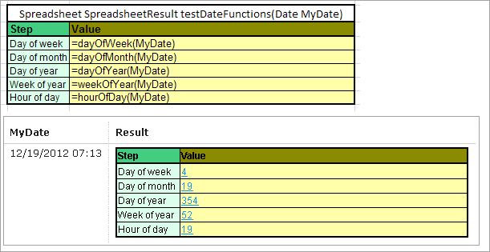
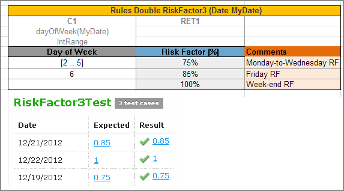
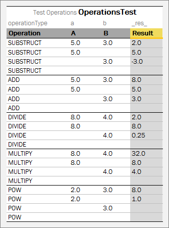

## Working with Functions

Data types are used to represent user data in the system. Business logic in rules is implemented using **functions**. Examples of functions are the **Sum** function used to calculate a sum of values and **Min/Max** functions used to find the minimum or maximum values in a set of values.

This section describes OpenL Tablets functions and provides simple usage examples. All functions can be divided into the following groups:

-   math functions
-   array processing functions
-   date functions
-   String functions
-   error handling functions

The following topics are included in this section:

-   [Understanding OpenL Tablets Function Syntax](#understanding-openl-tablets-function-syntax)
-   [Understanding Math Functions](#understanding-math-functions)
-   [Understanding Date Functions](#understanding-date-functions)
-   [Understanding Special Functions and Operators](#understanding-special-functions-and-operators)
-   [Null Elements Usage in Calculations](#null-elements-usage-in-calculations)

### Understanding OpenL Tablets Function Syntax

This section briefly describes how functions work in OpenL Tablets.

Any function is represented by the following elements:

-   function name or identifier, such as **sum**, **sort**, **median**
-   function parameters
-   value or values that the function returns

For example, in the `max(value1, value2)` expression, **max** is the rule or function name, **(value1, value2)** are function parameters, that is, values that take part in the action. When determining **value1** and **value2** as 50 and 41, the given function looks as `max(50, 41)` and returns **50** in result as the biggest number in the couple.

If an action is performed in a rule, use the corresponding function in the rules table. For example, to calculate the best result for a gamer in the following example, use the **max** function and enter *max(score1, score2, score3)* in the **C1** column. This expression instructs OpenL Tablets to select the maximum value in the set. The **contains** function can be used to determine the gamer level.

Subsequent sections provide description for mostly often used OpenL Tablets functions. For a full list of functions, see [Math Functions](../../05-appendices/04-math-functions.md), [Array Functions](../../05-appendices/02-array-functions.md), [Date Functions](../../05-appendices/03-date-functions.md), [String Functions](../../05-appendices/05-string-functions.md), and [Special Functions](../../05-appendices/06-special-functions.md).

### Understanding Math Functions

Math functions serve for performing math operations on numeric data. These functions support all numeric data types described in [Working with Data Types](working-with-data-types.md#working-with-data-types).

The following example illustrates how to use functions in OpenL Tablets. The rule in the diagram defines a gamer level depending on the best result in three attempts.


*An example of using the 'max' function*

The following topics are included in this section:

-   [Math Functions Used in OpenL Tablets](#math-functions-used-in-openl-tablets)
-   [Round Function](#round-function)

#### Math Functions Used in OpenL Tablets

The following table lists math functions used in OpenL Tablets:

| Function    | Description                                                                                                                                                                                                                                                                                                                                   |
|-------------|-----------------------------------------------------------------------------------------------------------------------------------------------------------------------------------------------------------------------------------------------------------------------------------------------------------------------------------------------|
| **min/max** | Returns the smallest or biggest element in a set of elements of comparable type for an array or multiple values. <br/>The result type depends on the entry type. min/max(element1, element2, …) `min/max(array[])` <br/>For example, if Date1= 01/02/2009 and Date2= 03/06/2008 are variables of the Date type, `max(Date1, Date2)` returns 01/02/2009. |
| **sum**     | Adds all numbers in the provided array and returns the result as a number. `sum(number1, number2, …)` `sum(array[])`                                                                                                                                                                                                                          |
| **avg**     | Returns the arithmetic average of array elements. The function result is a floating value. avg(number1, number2, …) avg(array[])                                                                                                                                                                                                              |
| **product** | Multiplies numbers from the provided array and returns the product as a number. product(number1, number2, …) product(array[])                                                                                                                                                                                                                 |
| **mod**     | Returns the remainder after a number is divided by a divisor. The result is a numeric value and has the same sign as the devisor. <br/>`mod(number, divisor)` <br/>- `number `is a numeric value which's remainder must be found. <br/>- `divisor` is the number used to divide the `number`. <br/>If the divisor is **0**, the **mod** function returns an error.      |
| **sort**    | Returns values from the provided array in ascending sort. The result is an array. sort(array[])                                                                                                                                                                                                                                               |
| **round**   | Rounds a value to a specified number of digits. For more information on the ROUND function, see [Round Function](#round-function).                                                                                                                                                                                                            |

#### Round Function

*The* **ROUND function** *is* used to round a value to a specified number of digits. For example, in financial operations, users may want to calculate insurance premium with accuracy up to two decimals. Usually, a number of digits in long data types, such as Double, must be limited. The ROUND function allows rounding a value to a whole number or to a fractional number with limited number of signs after decimal point. In case of rounding to a whole number, for the round(number) and round (number, String) functions, the type of the returned value is always Integer, except for BigDecimal input value which is returned as BigInteger.

The ROUND function syntax is as follows:

| Syntax                     | Description                                                                                                                                                                                                                                                                                                                                                                              |
|----------------------------|------------------------------------------------------------------------------------------------------------------------------------------------------------------------------------------------------------------------------------------------------------------------------------------------------------------------------------------------------------------------------------------|
| `round(number)`            | Rounds to the whole number and returns Integer or BigInteger.                                                                                                                                                                                                                                                                                                                            |
| `round(number,int)`        | Rounds to the fractional number. `int` is a number of digits after decimal point.                                                                                                                                                                                                                                                                                                        |
| `round(number,String)`     | Rounds to the whole number considering the specified rounding mode. The result is Integer or BigInteger. <br/>An example of a string value is `round_DOWN, ROUND_HALF_UP`.                                                                                                                                                                                                                    |
| `round(number,int,int)`    | Rounds to the fractional number and enables to get results different from usual mathematical rules: <br/>- The first `int` stands for a number of digits after decimal point. <br/>- The second `int` stands for a rounding mode represented by a constant, for example, `1- round_DOWN, 4-` `ROUND_HALF_UP`. <br/>The corresponding string value, such as `DOWN`, can be used instead of the second `int`. |
| `round(number,int,String)` | Rounds to the fractional number considering the specified rounding mode.                                                                                                                                                                                                                                                                                                                 |

The following topics are included in this section:

-   [round(number)](#roundnumber)
-   [round(number,int)](#roundnumberint)
-   [round(number,String)](#roundnumberstring)
-   [round(number,int,int)](#roundnumberintint)
-   [round(number,int,String)](#roundnumberintstring)

##### round(number)

This syntax is used to round to a whole number. The following example demonstrates function usage:


*Rounding to integer*


*Test table for rounding to integer*

##### round(number,int)

This function is used to round to a fractional number. The second parameter defines a number of digits after decimal point.


*Rounding to a fractional number*


*Test table for rounding to a fractional number*

##### round(number,String)

This syntax is used to round to a whole number, where the String value denotes the rounding mode as described in the following table:

| Mode name   | Description                                                                                                                                |
|-------------|--------------------------------------------------------------------------------------------------------------------------------------------|
| UP          | Rounding mode to round away from zero.                                                                                                     |
| DOWN        | Rounding mode to round towards zero.                                                                                                       |
| CEILING     | Rounding mode to round towards positive infinity.                                                                                          |
| FLOOR       | Rounding mode to round towards negative infinity.                                                                                          |
| HALF_UP     | Rounding mode to round towards the nearest neighbor unless both neighbors are equidistant, in which case round up.                         |
| HALF_DOWN   | Rounding mode to round towards the nearest neighbor unless both neighbors are equidistant, in which case round down.                       |
| HALF_EVEN   | Rounding mode to round towards the nearest neighbor unless both neighbors are equidistant, in which case, <br/>round towards the even neighbor. |
| UNNECESSARY | Rounding mode to assert that the requested operation has an exact result, hence no rounding is necessary.                                  |

An example is as follows:

```
round(32.285,DOWN)=32
```

**Note:** In the code, both CEILING and RoundingMode.CEILING formats are acceptable.


*Usage of the round(number,String) format with the DOWN rounding mode*

##### round(number,int,int)

This function allows rounding to a fractional number and get results by applying different mathematical rules. The following parameters are expected:

-   Number to round
-   The first `int` stands for a number of digits after decimal point.
-   The second `int` stands for a rounding mode represented by a constant, for example, `1`- round\_`DOWN`, `4`- `ROUND_HALF_UP`.

The following table contains a list of the constants and their descriptions:

| Constant | Name        | Description                                                                                                                                |
|----------|-------------|--------------------------------------------------------------------------------------------------------------------------------------------|
| 0        | UP          | Rounding mode to round away from zero.                                                                                                     |
| 1        | DOWN        | Rounding mode to round towards zero.                                                                                                       |
| 2        | CEILING     | Rounding mode to round towards positive infinity.                                                                                          |
| 3        | FLOOR       | Rounding mode to round towards negative infinity.                                                                                          |
| 4        | HALF_UP     | Rounding mode to round towards the nearest neighbor unless both neighbors are equidistant, in which case round up.                         |
| 5        | HALF_DOWN   | Rounding mode to round towards the nearest neighbor unless both neighbors are equidistant, in which case round down.                       |
| 6        | HALF_EVEN   | Rounding mode to round towards the nearest neighbor unless both neighbors are equidistant, in which case, <br/>round towards the even neighbor. |
| 7        | UNNECESSARY | Rounding mode to assert that the requested operation has an exact result, hence no rounding is necessary.                                  |

For more information on the constants representing rounding modes, see [https://docs.oracle.com/en/java/javase/11/docs/api/constant-values.html\#java.math.BigDecimal.ROUND_HALF_DOWN](https://docs.oracle.com/en/java/javase/11/docs/api/constant-values.html#java.math.BigDecimal.ROUND_HALF_DOWN).

For more information on the constants with examples, see <https://docs.oracle.com/en/java/javase/11/docs/api/java.base/java/math/class-use/RoundingMode.html>, *Enum Constant Details* section.

The following example demonstrates how the rounding works with the DOWN constant.


*Usage of the round(number,int,int/String) format with the DOWN rounding mode*


##### round(number,int,String)

This function allows rounding to a fractional number and get results by applying different mathematical rules. The following parameters are expected:

-   Number to round
-   `int` stands for a number of digits after decimal point.
-   `String` stands for a rounding mode as described in [round(number,String)](#roundnumberstring).

An example is as follows:

```
round(32.285, 2, DOWN)=32.28
```


*Usage of the round(number,int,int/String) format with the DOWN rounding mode*

### Understanding Date Functions

OpenL Tablets supports a wide range of date functions that can be applied in the rule tables. The following date functions return an Integer data type:

| Function        | Description                                                                                                                                                                         |
|-----------------|-------------------------------------------------------------------------------------------------------------------------------------------------------------------------------------|
| **absMonth**    | Returns the number of months since AD. <br/>`absMonth(Date)`                                                                                                                             |
| **absQuarter**  | Returns the number of quarters since AD as an integer value. <br/>`absQuarter(Date)`                                                                                                     |
| **Date**  | Returns the date. The following options are available:<br/> - Date(year, month, day, hours, minutes)<br/> - Date(year, month, day, hours, minutes, seconds)<br/> - Date(year, month, day, hours, minutes, seconds, milliseconds)                                                                                                                      |
| **dayOfWeek**   | Takes a date as input and returns the day of the week on which that date falls. <br/>Days in a week are numbered from 1 to 7 as follows: 1=Sunday, 2=Monday, 3 = Tuesday, and so on. <br/>`dayOfWeek(Date d)` |
| **dayOfMonth**  | Takes a date as input and returns the day of the month on which that date falls. Days in a month are numbered from 1 to 31. <br/>`dayOfMonth(Date d)`                                    |
| **dayOfYear**   | Takes a date as input and returns the day of the year on which that date falls. Days in a year are numbered from 1 to 365. <br/>`dayOfYear(Date d)`                                      |
| **hour**        | Returns the hour of the day in 12 hour format for an input date. <br/>`hour(Date d)`                                                                                                     |
| **hourOfDay**   | Returns the hour of the day in 24 hour format for an input date. <br/>`hourOfDay(Date d)`                                                                                                |
| **isLeap**   | Identifies whether the year is a leap year. The following options are available: <br/> - isLeap(Date) - checks whether the provided date is in the leap year.<br/> - isLeap(Integer) - checks whether the provided year is a leap year.                                                                                                              |
| **minute**      | Returns a minute (0 to 59) for an input date. <br/>`minute(Date d)`                                                                                                                      |
| **second**      | Returns a second (0 to 59) for an input date. <br/>`second(Date d)`                                                                                                                      |
| **setTime**      | Sets time or date. The following options are available:<br/> - setTime(Date, hours, minutes) - sets time in **hh:mm:xx.xxx** without changing the date.<br/> - setTime(Date, hours, minutes, seconds) - sets time in **hh:mm:ss.xxx** without changing the date.<br/> - setTime(Date, hours, minutes, seconds, milliseconds)- sets time in **hh:mm:ss.ccc** without changing the date.<br/> - setDate(Date, year, month, day)- sets the date in **yyyy-mm-dd** without changing the time.                                                                                                                                     |
| **weekOfMonth** | Takes a date as input and returns the week of the month within which that date is. Weeks in a month are numbered from 1 to 5. <br/>`weekOfMonth(Date d)`                                 |
| **weekOfYear**  | Takes a date as input and returns the week of the year on which that date falls. Weeks in a year are numbered from 1 to 54. <br/>`weekOfYear(Date d)`                                    |

The following date function returns a String data type:

| Function         | Description                                                  |
|------------------|--------------------------------------------------------------|
| **amPm(Date d)** | Returns `Am` or `Pm` value for an input date. `amPm(Date d)` |

The following figure displays values returned by date functions for a particular input date specified in the **MyDate** field.



*Date functions in OpenL Tablets*

The following decision table provides a very simple example of how the `dayOfWeek` function can be used when the returned value, **Risk Factor**, depends on the day of the week.



*A risk factor depending on a day of the week*

### Understanding Special Functions and Operators

OpenL Tablets supports a variety of different special functions and syntax to make rules creation easier and more convenient for business users.

The following topics are included in this section:

-   [Error Function](#error-function)
-   [Ternary Operator](#ternary-operator)
-   [Performing Operations via Formula](#performing-operations-via-formula)
-   [Pattern-Matching Function](#pattern-matching-function)

#### Error Function

The **ERROR** function is used to handle exceptional cases in a rule when an appropriate valid returned result cannot be defined. The function returns a message containing problem description instead and stops processing. The message text is specified as the error function parameter.

In the following example, if the value for a coverage limit of an insurance policy exceeds 1000\$, a rule notifies a user about wrong limit value and stops further processing.


*Usage of the ERROR function*

Alternatively, a custom error with custom error message can be defined as arguments using the `error(String code, String message)` function. The expected REST response is as follows:

```
{
    "code": "cd01",
    "message": "User message"
}
```


#### Ternary Operator

**?:** is a ternary operator that is a part of the syntax for simple conditional expressions. It is commonly referred to as the conditional operator, inline if (iif), or ternary if.

Formula `(expression) ? (value1) : (value2) `returns value1 if condition expression is true, otherwise, value2.

:(value2) part is optional. If it is not defined, null is returned if the condition is false.

An example of a ternary operator is as follows:


*Ternary operator example*

In if-then expression, this example stands for the following:

If (useCensus == true) then { Amount step value = percentAmount} else { Amount step value = flatAmount}.

For more information on ternary operators, see <https://en.wikipedia.org/wiki/Ternary_operation>.

To create more complex conditional expressions, use decision tables.

#### Performing Operations via Formula

A user can write several operations in a cell's formula or in expression statement of the Decision table by separating each operation with the ';' sign. The result of the last operation is defined as a returned value of the cell as follows:

`'= Expression1; Expression2; …; ResultedExpression`

In practice, it is widely used when a user needs to store calculated values in the input object fields by using the following syntax:

`'= field = value`

or

`'= field1 = value1; field2 = value2 …; ResultedExpression`

In the following example, the **Age** step calculates the age and stores the result in the **vehicleAge** field of the input object **vehicle**, the **Scoring** step calculates several scoring parameters, stores them in the **scoring** object, and returns the object with updated fields as a result of the step:


*Example of performing operations via formula*

#### Pattern-Matching Function

A **pattern-matching function** allows verifying whether a string value matches the predefined pattern. For example, for emails, phone numbers, and zip codes the following function can be used:

`like (String str, String pattern)`

The result is a Boolean value indicating whether the string equals the pattern.

The `like` function provides a versatile tool for string comparison. The pattern-matching feature allows a user to match each character in a string against a specific character, a wildcard character, a character list, or a character range. The following table lists the characters allowed in a pattern and describes what they match:

| **Characters in pattern** | **Meaning**                     |
|---------------------------|---------------------------------|
| ?                         | One character.                  |
| \*                        | Zero or multiple characters.    |
| \#                        | One digit.                      |
| @                         | One letter.                     |
| [a-k]                     | One character from the set.     |
| [!v-z]                    | One character not from the set. |
| Pattern+                  | Pattern applied at least once.  |
| [?]                       | Match to '?'.                   |
| [\*]                      | Match to '\*'.                  |
| [\#]                      | Match to '\#'.                  |
| [@]                       | Match to '@'.                   |
| [+]                       | Match to '+'.                   |
| [!]                       | Match to '!'.                   |
| [!!]                      | NOT match to '!'.               |
| [1!]                      | Match to '!' or '1'.            |
| [!1]                      | NOT match to '1'.               |
| [-1-3]                    | Match to '-', '1', '2', '3'.    |

Examples are as follows:

`like("(29)687-11-53", "(##)###-##-##")` -\> **TRUE**

`like ("(29)87-11-53", "(##)###-##-##")` -\> **FALSE**

`like ("D1010", "[A-D]####")` -\> **TRUE**

`like ("F1010", "[A-D]####")` -\> **FALSE**

### Null Elements Usage in Calculations

This section describes how null elements (an element with an empty value) are processed in calculations.

For adding and subtracting, `null` is interpreted as `0.`

For multiplying and dividing, it is interpreted as `null`. That is, if `a=3` and `b=null`, `a*b=null`. If `null` must be interpreted as `1`, that is, `a*b=3`, `import org.openl.rules.binding.MulDivNullToOneOperators.*` must be added to the Environment table.

The following diagrams demonstrate this rule.


*Rules for null elements usage in calculations*

The next test table provides examples of calculations with null values.



*Test table for null elements usage in calculations*

If all values are **null**, the result is also **null**.
